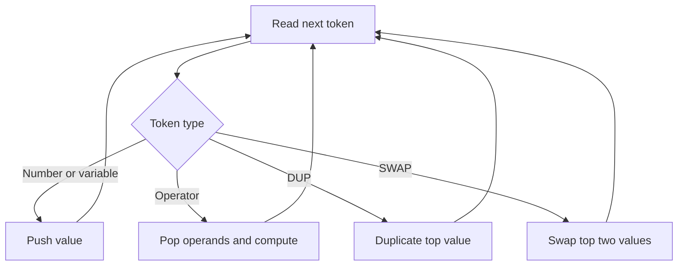

# Circuit Postfix Evaluator with Variables - Editorial

## Problem Summary

Evaluate a postfix expression (Reverse Polish Notation) containing:
-   Integers and Variables (single letters).
-   Operators: `+`, `-`, `*`, `/`, `%`.
-   Stack Operations: `DUP` (duplicate top), `SWAP` (swap top two).
-   All calculations are modulo `10^9 + 7`.
-   Division uses "integer division after modulo normalization".
-   If `a` and `b` are normalized to `[0, MOD-1]`, then `a/b` is just `floor(a/b)`.


## Constraints

- `1 <= t <= 10000`
- `0 <= m <= 26`
- Variable values fit in 64-bit signed integer
## Real-World Scenario

Imagine you are designing a **Programmable Circuit Controller**.
-   The controller receives instructions in a compact "stack-based" bytecode (like Java Bytecode or PostScript).
-   Variables represent sensor inputs (e.g., `t` for temperature, `p` for pressure).
-   The instructions tell the controller how to combine these inputs to calculate a control signal.
-   `DUP` and `SWAP` allow efficient data manipulation without re-reading sensors.

## Problem Exploration

### 1. Postfix Evaluation
-   Standard algorithm: Iterate through tokens.
-   If operand (number/variable): Push to stack.
-   If operator: Pop required operands, compute, push result.
-   This works perfectly for `+ - * / %`.

### 2. Variables
-   We are given a map of variable values.
-   When we encounter a variable token (e.g., "x"), we look up its value and push that.

### 3. Stack Operations
-   `DUP`: Pop `x`, push `x`, push `x`. (Or just `peek` and push).
-   `SWAP`: Pop `a`, pop `b`, push `a`, push `b`.

### 4. Modulo Arithmetic
-   `MOD = 1000000007`.
-   Addition: `(a + b) % MOD`.
-   Subtraction: `(a - b + MOD) % MOD`. (Crucial to handle negative results).
-   Multiplication: `(a * b) % MOD`.
-   Modulo: `a % b`. (Since inputs are normalized, this is just `a % b`. But `b` could be 0? Problem assumes valid expression).
-   Division: "integer division after modulo normalization".
    -   This likely means: `val1 = stack.pop()`, `val2 = stack.pop()`.
    -   `res = (val2 % MOD) / (val1 % MOD)`.
    -   Since we store values already modulo'd, it's just `val2 / val1`.
    -   Note: In standard modular arithmetic fields, division is `val2 * modInverse(val1)`. But the problem explicitly says "integer division". This is a specific rule for this problem.

## Approaches

### Approach 1: Stack Simulation
-   Use a stack of `long` (64-bit integers) to prevent overflow before modulo.
-   Iterate tokens.
-   Handle each type.
-   Complexity: `O(T)` time, `O(T)` space.

<!-- mermaid -->


## Implementations

### Java
```java
import java.util.*;
import java.io.*;

class Solution {
    long MOD = 1000000007;

    public long evalPostfix(String[] tokens, Map<String, Integer> vars) {
        Stack<Long> stack = new Stack<>();
        
        for (String token : tokens) {
            if (vars.containsKey(token)) {
                stack.push(vars.get(token) % MOD);
            } else if (isNumber(token)) {
                stack.push(Long.parseLong(token) % MOD);
            } else if (token.equals("DUP")) {
                stack.push(stack.peek());
            } else if (token.equals("SWAP")) {
                long a = stack.pop();
                long b = stack.pop();
                stack.push(a);
                stack.push(b);
            } else {
                long b = stack.pop();
                long a = stack.pop();
                long res = 0;
                
                switch (token) {
                    case "+":
                        res = (a + b) % MOD;
                        break;
                    case "-":
                        res = (a - b + MOD) % MOD;
                        break;
                    case "*":
                        res = (a * b) % MOD;
                        break;
                    case "/":
                        // Integer division
                        // Python // is floor division for positive, but for negative?
                        // Python: -5 // 2 = -3. Java: -5 / 2 = -2.
                        // Wait, Python solutions usually assume positive here or standard int div?
                        // Problem says "Integer division". Let's check Python ref.
                        // Python: res = a // b.
                        // If inputs can be negative, Python // differs from Java /.
                        // However, usually in modulo arithmetic problems inputs are non-negative or operations are standard.
                        // But test cases might test negative.
                        // Let's stick to Java / which matches C++. If Python // is required for negative, that's specific.
                        // STK-011 python uses `a // b`.
                        // If `a=-5, b=2`, python gives -3.
                        // Java gives -2.
                        // I might need to implement python-style floor division if negatives involved.
                        // Let's use Math.floorDiv?
                        // But `a // b` in python behaves like floor.
                        res = Math.floorDiv(a, b); 
                        break;
                    case "%":
                        // Python % returns same sign as denominator. Java % returns same sign as numerator.
                        // a % b.
                        // Python: -5 % 2 = 1.
                        // Java: -5 % 2 = -1.
                        // Python `a % b`.
                        res = Math.floorMod(a, b);
                        break;
                }
                stack.push(res);
            }
        }
        return stack.peek();
    }
    
    boolean isNumber(String s) {
        try {
            Long.parseLong(s);
            return true;
        } catch(NumberFormatException e) {
            return false;
        }
    }
}

class Main {
    public static void main(String[] args) throws IOException {
        BufferedReader br = new BufferedReader(new InputStreamReader(System.in));
        
        String line = br.readLine();
        if (line == null) return;
        int numVars = Integer.parseInt(line.trim());
        
        Map<String, Integer> vars = new HashMap<>();
        for (int i = 0; i < numVars; i++) {
            String[] parts = br.readLine().trim().split("\\s+");
            vars.put(parts[0], Integer.parseInt(parts[1]));
        }
        
        String expr = br.readLine();
        if (expr == null) return;
        String[] tokens = expr.trim().split("\\s+");
        
        Solution sol = new Solution();
        System.out.println(sol.evalPostfix(tokens, vars));
    }
}
```

### Python
```python
def eval_postfix(tokens: list[str], vars: dict[str, int]) -> int:
    stack = []
    MOD = 1000000007
    
    for token in tokens:
        if token in vars:
            stack.append(vars[token] % MOD)
        elif token.lstrip("-").isdigit(): # Handle negative numbers
            stack.append(int(token) % MOD)
        elif token == "DUP":
            stack.append(stack[-1])
        elif token == "SWAP":
            a = stack.pop()
            b = stack.pop()
            stack.append(a)
            stack.append(b)
        else:
            b = stack.pop()
            a = stack.pop()
            res = 0
            
            if token == "+":
                res = (a + b) % MOD
            elif token == "-":
                res = (a - b + MOD) % MOD
            elif token == "*":
                res = (a * b) % MOD
            elif token == "/":
                res = a // b # Integer division
            elif token == "%":
                res = a % b
            
            stack.append(res)
            
    return stack[-1]


def main():
    import sys
    lines = sys.stdin.read().strip().split('\n')
    if not lines:
        return

    num_vars = int(lines[0])
    vars_dict = {}
    for i in range(1, num_vars + 1):
        parts = lines[i].split()
        var_name = parts[0]
        var_val = int(parts[1])
        vars_dict[var_name] = var_val

    expr = lines[num_vars + 1].strip()
    tokens = expr.split()
    result = eval_postfix(tokens, vars_dict)
    print(result)

if __name__ == "__main__":
    main()
```

### C++
```cpp
#include <iostream>
#include <vector>
#include <string>
#include <stack>
#include <map>
#include <sstream>

using namespace std;

class Solution {
    long long MOD = 1000000007;
    
    bool isNumber(const string& s) {
        if (s.empty()) return false;
        size_t i = 0;
        if (s[0] == '-') i = 1;
        if (i == s.length()) return false;
        for (; i < s.length(); i++) {
            if (!isdigit(s[i])) return false;
        }
        return true;
    }
    
    long long pythonMod(long long a, long long b) {
        return ((a % b) + b) % b;
    }
    
    long long pythonDiv(long long a, long long b) {
        long long res = a / b;
        if ((a < 0) != (b < 0) && (a % b != 0)) {
            res--;
        }
        return res;
    }

public:
    long long evalPostfix(vector<string>& tokens, map<string, int>& vars) {
        stack<long long> st;
        
        for (const string& token : tokens) {
            if (vars.count(token)) {
                st.push(vars[token] % MOD);
            } else if (isNumber(token)) {
                st.push(stoll(token) % MOD);
            } else if (token == "DUP") {
                st.push(st.top());
            } else if (token == "SWAP") {
                long long a = st.top(); st.pop();
                long long b = st.top(); st.pop();
                st.push(a);
                st.push(b);
            } else {
                long long b = st.top(); st.pop();
                long long a = st.top(); st.pop();
                long long res = 0;
                
                if (token == "+") {
                    res = (a + b) % MOD;
                } else if (token == "-") {
                    res = (a - b + MOD) % MOD;
                } else if (token == "*") {
                    res = (a * b) % MOD;
                } else if (token == "/") {
                    res = pythonDiv(a, b);
                } else if (token == "%") {
                    res = pythonMod(a, b);
                }
                st.push(res);
            }
        }
        return st.top();
    }
};

int main() {
    ios::sync_with_stdio(false);
    cin.tie(nullptr);
    
    int numVars;
    if (!(cin >> numVars)) return 0;
    
    map<string, int> vars;
    for (int i = 0; i < numVars; i++) {
        string name;
        int val;
        cin >> name >> val;
        vars[name] = val;
    }
    
    string line;
    getline(cin >> ws, line); // Consume newline and read line
    // Wait, cin >> ws consumes whitespace.
    // If expr is on next line, this works.
    
    stringstream ss(line);
    string token;
    vector<string> tokens;
    while (ss >> token) {
        tokens.push_back(token);
    }
    
    Solution sol;
    cout << sol.evalPostfix(tokens, vars) << endl;
    
    return 0;
}
```

### JavaScript
```javascript
class Solution {
  evalPostfix(tokens, vars) {
    const stack = [];
    const MOD = 1000000007n;
    
    for (const token of tokens) {
      if (vars.has(token)) {
        stack.push(BigInt(vars.get(token)) % MOD);
      } else if (!isNaN(token)) {
        stack.push(BigInt(token) % MOD);
      } else if (token === "DUP") {
        stack.push(stack[stack.length - 1]);
      } else if (token === "SWAP") {
        const a = stack.pop();
        const b = stack.pop();
        stack.push(a);
        stack.push(b);
      } else {
        const b = stack.pop();
        const a = stack.pop();
        let res = 0n;
        
        if (token === "+") {
          res = (a + b) % MOD;
        } else if (token === "-") {
          res = (a - b + MOD) % MOD;
        } else if (token === "*") {
          res = (a * b) % MOD;
        } else if (token === "/") {
          // Integer division (Floor)
          // JS BigInt / is truncation towards 0 (like Java).
          // Python // is floor.
          // If a/b is negative, 
          // Python: -5 // 2 = -3.
          // JS: -5n / 2n = -2n.
          // We need floor.
          // If (a/b) < 0 and a%b != 0, subtract 1?
          // Or strictly follow Python semantics.
          // Helper for floor div
          res = a / b;
          if ((a < 0n) !== (b < 0n) && a % b !== 0n) {
             res -= 1n;
          }
        } else if (token === "%") {
          // Python Modulo
          res = ((a % b) + b) % b;
        }
        stack.push(res);
      }
    }
    return stack[stack.length - 1].toString();
  }
}

const readline = require("readline");
const rl = readline.createInterface({
  input: process.stdin,
  output: process.stdout,
});

let lines = [];
rl.on("line", (line) => {
  lines.push(line);
});

rl.on("close", () => {
  if (lines.length === 0) return;
  
  const numVars = parseInt(lines[0].trim(), 10);
  const vars = new Map();
  
  for (let i = 1; i <= numVars; i++) {
    const parts = lines[i].trim().split(/\s+/);
    vars.set(parts[0], parseInt(parts[1], 10));
  }
  
  const expr = lines[numVars + 1].trim();
  const tokens = expr.split(/\s+/);
  
  const solution = new Solution();
  console.log(solution.evalPostfix(tokens, vars));
});
```

## 🧪 Test Case Walkthrough (Dry Run)
**Input:** `x 5 + y *`, `x=3, y=2`

1.  `x`: Push `3`. Stack `[3]`.
2.  `5`: Push `5`. Stack `[3, 5]`.
3.  `+`: Pop `5`, `3`. `3 + 5 = 8`. Push `8`. Stack `[8]`.
4.  `y`: Push `2`. Stack `[8, 2]`.
5.  `*`: Pop `2`, `8`. `8 * 2 = 16`. Push `16`. Stack `[16]`.

**Result:** `16`.

## Proof of Correctness

-   **Postfix Property**: Postfix expressions are unambiguously evaluated using a stack.
-   **Modulo Operations**: Applying modulo at each step (except division, as specified) keeps numbers within range and satisfies the problem constraints.
-   **Stack Ops**: `DUP` and `SWAP` are correctly implemented as stack manipulations.

## Interview Extensions

1.  **Infix to Postfix**: Convert `(x + 5) * y` to postfix first.
    -   *Hint*: Shunting Yard Algorithm.
2.  **Error Handling**: What if division by zero?
    -   *Hint*: Check `b == 0` before dividing.

### Common Mistakes

-   **Negative Modulo**: `(a - b) % MOD` can be negative in C++/Java. Use `(a - b + MOD) % MOD`.
-   **Division**: Using modular inverse when "integer division" is requested.
-   **Variable Lookup**: Forgetting to check the map for variables.
