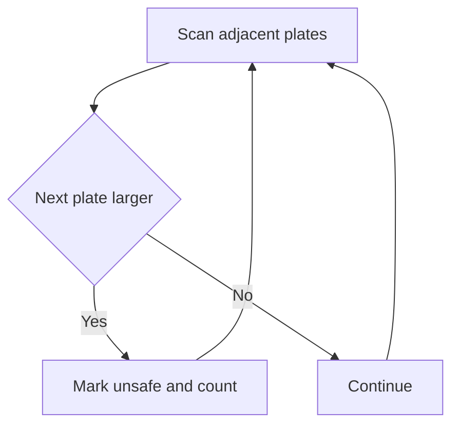

# Bike Repair Plates - Editorial

## Problem Summary

You have a stack of plates with given diameters. You remove them one by one from the top.
-   When a plate is removed, the plate immediately below it is "revealed".
-   If the revealed plate is **larger** than the plate just removed, the revealed plate is marked **unsafe**.
-   Condition: If `removed_plate < revealed_plate`, then `revealed_plate` is unsafe.
-   Example: `5 2 4` (Top is 5, then 2, then 4).
    -   Remove 5. Reveal 2. `5 < 2`? No. 2 is safe.
    -   Remove 2. Reveal 4. `2 < 4`? Yes. 4 is marked unsafe.


## Constraints

- `1 <= n <= 200000`
- `1 <= d[i] <= 10^9`
## Real-World Scenario

Imagine a **Bike Repair Shop**.
-   You have a stack of metal plates (shims or washers).
-   You take the top one off to use it.
-   If the one you just took off is **smaller** than the one underneath, the one underneath might have been "crushed" or "exposed" improperly by the smaller pressure point.
-   You need to flag these potentially damaged plates for inspection.

## Problem Exploration

### Key Observations

The input gives plates from "top to bottom" where `d[0]` is the top plate.
-   Remove `d[0]`. Reveal `d[1]`. Check if `d[0] < d[1]`. If true, `d[1]` is unsafe.
-   Remove `d[1]`. Reveal `d[2]`. Check if `d[1] < d[2]`. If true, `d[2]` is unsafe.
-   Continue this process for all plates.

This is a linear scan comparing adjacent elements `d[i]` and `d[i+1]`. The problem reduces to counting indices `i` where `d[i] < d[i+1]`.

### Edge Cases
-   `N=1`: No comparisons possible. Count 0.
-   Equal values: `5 5`. `5 < 5` is False. Safe.
-   Increasing sequence: `1 2 3`. Both `2` and `3` are unsafe. Count 2.
-   Decreasing sequence: `3 2 1`. All safe. Count 0.

## Approaches

### Approach 1: Linear Scan
-   Iterate `i` from `0` to `n-2`.
-   If `d[i] < d[i+1]`, count++.
-   Complexity: `O(N)` time, `O(1)` space.

<!-- mermaid -->


## Implementations

### Java
```java
import java.util.*;
import java.io.*;

class Solution {
    public int countUnsafe(int[] d) {
        int count = 0;
        for (int i = 0; i < d.length - 1; i++) {
            if (d[i+1] > d[i]) {
                count++;
            }
        }
        return count;
    }
}

class Main {
    public static void main(String[] args) throws IOException {
        BufferedReader br = new BufferedReader(new InputStreamReader(System.in));
        String line = "";
        while ((line = br.readLine()) != null && line.trim().isEmpty()) {}
        if (line == null) return;
        
        int n = Integer.parseInt(line.trim());
        
        // Read Array (robust)
        List<Integer> list = new ArrayList<>();
        StringTokenizer st = new StringTokenizer(br.readLine());
        
        while (list.size() < n) {
            while (!st.hasMoreTokens()) {
                String l = br.readLine();
                if (l == null) break;
                st = new StringTokenizer(l);
            }
            if (!st.hasMoreTokens()) break;
            list.add(Integer.parseInt(st.nextToken()));
        }
        
        int[] d = new int[list.size()];
        for(int i=0; i<list.size(); i++) d[i] = list.get(i);
        
        Solution sol = new Solution();
        System.out.println(sol.countUnsafe(d));
    }
}
```

### Python
```python
def count_unsafe(d: list[int]) -> int:
    """
    Count plates marked unsafe during removal.
    A plate is unsafe if it's larger than the plate removed just above it.
    Scanning from top to bottom: as we remove d[i], we check if d[i+1] > d[i].
    """
    unsafe_count = 0
    for i in range(len(d) - 1):
        # When d[i] is removed, d[i+1] is revealed
        # It's unsafe if d[i+1] > d[i]
        if d[i+1] > d[i]:
            unsafe_count += 1
    return unsafe_count


def main():
    import sys
    lines = sys.stdin.read().strip().split('\n')
    n = int(lines[0])
    d = list(map(int, lines[1].split()))
    result = count_unsafe(d)
    print(result)

if __name__ == "__main__":
    main()
```

### C++
```cpp
#include <iostream>
#include <vector>

using namespace std;

class Solution {
public:
    int countUnsafe(vector<int>& d) {
        int count = 0;
        int n = d.size();
        for (int i = 0; i < n - 1; i++) {
            if (d[i+1] > d[i]) {
                count++;
            }
        }
        return count;
    }
};

int main() {
    ios::sync_with_stdio(false);
    cin.tie(nullptr);
    
    int n;
    if (!(cin >> n)) return 0;
    
    vector<int> d(n);
    for (int i = 0; i < n; i++) {
        cin >> d[i];
    }
    
    Solution sol;
    cout << sol.countUnsafe(d) << endl;
    
    return 0;
}
```

### JavaScript
```javascript
class Solution {
  countUnsafe(d) {
    let count = 0;
    for (let i = 0; i < d.length - 1; i++) {
        if (d[i+1] > d[i]) {
            count++;
        }
    }
    return count;
  }
}

const readline = require("readline");
const rl = readline.createInterface({
  input: process.stdin,
  output: process.stdout,
});

let data = [];
rl.on("line", (line) => {
  const parts = line.trim().split(/\s+/).filter(x => x !== "");
  for (const p of parts) data.push(p);
});

rl.on("close", () => {
  if (data.length === 0) return;
  
  let idx = 0;
  const n = parseInt(data[idx++], 10);
  const d = [];
  for (let i = 0; i < n; i++) {
    d.push(parseInt(data[idx++], 10));
  }
  
  const solution = new Solution();
  console.log(solution.countUnsafe(d));
});
```

## 🧪 Test Case Walkthrough (Dry Run)
**Input:** `5 2 4`

1.  `i=0`: `d[0]=5`, `d[1]=2`. `5 < 2` is False.
2.  `i=1`: `d[1]=2`, `d[2]=4`. `2 < 4` is True. Count = 1.
3.  End. Result 1.

## Proof of Correctness

-   **Simulation**: The code directly simulates the condition described: comparing the currently removed plate `d[i]` with the newly revealed plate `d[i+1]`.
-   **Completeness**: It checks every transition in the stack removal process.

## Interview Extensions

1.  **Recursive Removal**: What if unsafe plates are immediately discarded (shattered) and reveal the next one?
    -   *Hint*: This changes the problem significantly. Use a while loop or stack to handle cascading removals. Time complexity remains `O(N)`.
2.  **Previous Greater**: Find the first plate above that is larger.
    -   *Hint*: Use a Monotonic Stack.

### Common Mistakes

-   **Direction**: Confusing top-to-bottom with bottom-to-top.
-   **Strictness**: Using `<=` instead of `<`.
