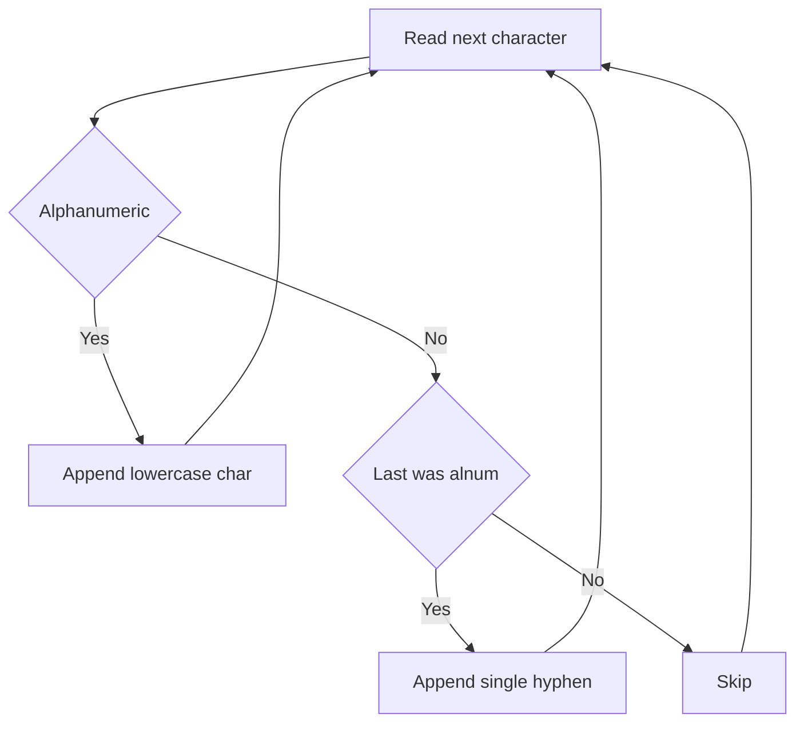

# STR-001: Campus Badge Normalize

## 📋 Problem Summary

**Input**: A string `s` containing mixed-case letters, digits, and special characters  
**Output**: Normalized string with lowercase letters, collapsed non-alphanumeric to single hyphens, trimmed leading/trailing hyphens  
**Constraints**: `1 <= |s| <= 10^5`

## 🌍 Real-World Scenario

Campus badge systems need to normalize employee/student names for URL slugs, file naming, and database keys. Raw input like "O'Brien, Mary-Kate!!" must become clean identifiers like "obrien-mary-kate".

## Detailed Explanation

The normalization process involves three transformations:

1. **Lowercase conversion**: All alphabetic characters → lowercase
2. **Collapse non-alphanumeric**: Any sequence of non-alphanumeric chars → single hyphen
3. **Trim edges**: Remove leading/trailing hyphens

**Key Insight**: Single-pass iteration with state tracking (inside alphanumeric run vs separator run) minimizes overhead.

## Naive Approach

```
1. Convert entire string to lowercase
2. Use regex replace: non-alphanumeric sequences → single hyphen
3. Strip leading/trailing hyphens
```

**Time Complexity**: O(n) for lowercase + O(n) for regex + O(n) for strip = O(n)  
**Space Complexity**: O(n) for intermediate strings  
**Why This Complexity?**: Multiple passes over the string create intermediate allocations.

**Limitations**: Regex overhead, multiple string copies for immutable strings.

## Optimal Approach

**Single-Pass State Machine**:

- Track if previous character was alphanumeric
- If current char is alphanumeric: append (lowercased) to result
- If current char is NOT alphanumeric AND result ends with alphanumeric: append single hyphen
- Final: strip trailing hyphen if present

**Algorithm**:

```
1. Initialize result = empty, lastWasAlnum = false
2. For each char c in s:
   a. If c is alphanumeric:
      - Append lowercase(c) to result
      - lastWasAlnum = true
   b. Else (c is separator):
      - If lastWasAlnum AND result non-empty:
         * Append '-'
         * lastWasAlnum = false
3. If result ends with '-': remove it
4. Return result
```

<!-- mermaid -->


###

Time Complexity

| Phase             | Operations                  | Cost      |
| ----------------- | --------------------------- | --------- |
| Iterate string    | n chars                     | O(n)      |
| Character checks  | isalnum, tolower per char   | O(1) each |
| Append operations | Amortized for StringBuilder | O(1) each |
| **Total**         |                             | **O(n)**  |

**Why This Complexity?**: Single pass, constant-time character operations.

### Space Complexity

| Component     | Space | Justification                      |
| ------------- | ----- | ---------------------------------- |
| Result buffer | O(n)  | Worst case: all chars alphanumeric |
| Variables     | O(1)  | lastWasAlnum, indices              |
| **Total**     |       | **O(n)**                           |

## 💻 Implementation

### Java


### Python


### C++


### JavaScript


## 🧪 Test Case Walkthrough (Dry Run)

**Input**: `"Hello__World!!"`

**Execution Trace**:

```
Char  | isAlnum | Action              | Result         | lastWasAlnum
------|---------|---------------------|----------------|-------------
'H'   | Yes     | Append 'h'          | "h"            | true
'e'   | Yes     | Append 'e'          | "he"           | true
'l'   | Yes     | Append 'l'          | "hel"          | true
'l'   | Yes     | Append 'l'          | "hell"         | true
'o'   | Yes     | Append 'o'          | "hello"        | true
'_'   | No      | Append '-'          | "hello-"       | false
'_'   | No      | Skip (not alnum)    | "hello-"       | false
'W'   | Yes     | Append 'w'          | "hello-w"      | true
'o'   | Yes     | Append 'o'          | "hello-wo"     | true
'r'   | Yes     | Append 'r'          | "hello-wor"    | true
'l'   | Yes     | Append 'l'          | "hello-worl"   | true
'd'   | Yes     | Append 'd'          | "hello-world"  | true
'!'   | No      | Append '-'          | "hello-world-" | false
'!'   | No      | Skip                | "hello-world-" | false

Final: Remove trailing '-' → "hello-world"
```

**Output**: `"hello-world"`

## ⚠️ Common Mistakes to Avoid

1. **Not Handling Leading Non-Alphanumeric**: Check `result.length() > 0` before appending hyphen
2. **Multiple Consecutive Hyphens**: Use `lastWasAlnum` flag to prevent
3. **Forgetting Trailing Hyphen Removal**: Always check and remove at the end
4. **Case Sensitivity**: Ensure lowercase conversion happens during iteration
5. **Empty String Edge Case**: Handle null/empty input gracefully

## ⏱️ Complexity Analysis

### Time Complexity: **O(n)**

| Operation             | Count | Per Operation  | Total    |
| --------------------- | ----- | -------------- | -------- |
| Iterate characters    | n     | O(1)           | O(n)     |
| isalnum check         | n     | O(1)           | O(n)     |
| Character append      | ≤ n   | O(1) amortized | O(n)     |
| Trailing hyphen check | 1     | O(1)           | O(1)     |
| **Overall**           |       |                | **O(n)** |

### Space Complexity: **O(n)**

- Result string/buffer stores up to n characters
- All other variables are O(1)

## 💡 Key Takeaways

1. **Single-Pass Efficiency**: State machine avoids multiple iterations
2. **StringBuilder/List Usage**: Mutable buffer prevents string concatenation overhead
3. **Edge Case Handling**: Leading/trailing separators require special logic
4. **Character Classification**: Built-in `isalnum()` functions are efficient and clear
5. **Flag-Based State**: `lastWasAlnum` elegantly collapses consecutive separators


## Constraints

- `1 ≤ |s| ≤ 2 × 10^5`
- Input may contain uppercase letters, lowercase letters, digits, spaces, and special characters
