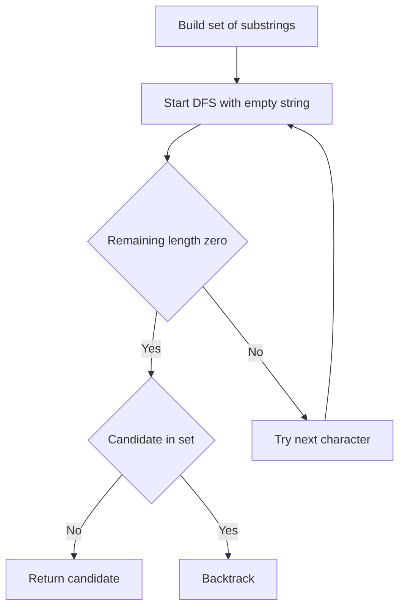

# STR-003: Smallest Missing Substring

## 📋 Problem Summary

**Input**: String `s` (lowercase letters), integer `k`  
**Output**: Lexicographically smallest lowercase string of length `k` not appearing in `s`, or empty if all exist  
**Constraints**: `1 <= |s| <= 10^5`, `1 <= k <= 5`

## 🌍 Real-World Scenario

Password validation systems need to generate secure codes of length k that don't match any substring in a blacklist database. Finding the smallest missing pattern efficiently helps in sequential code generation.

## Detailed Explanation

**Goal**: Find the smallest string (lexicographically) of exactly length k that does NOT appear as a substring in s.

**Key Insight**:

- Total possible strings of length k: 26^k
- For k ≤ 5: max 26^5 = 11,881,376 possibilities
- Extract all length-k substrings from s: O(n)
- Generate candidates in lexicographic order until one is missing

**Why Feasible**: Small k bounds make exhaustive generation practical.

## Naive Approach

```
1. Generate ALL 26^k possible strings of length k
2. Store in sorted list
3. Extract all substrings of length k from s into a set
4. Linear scan sorted list to find first missing
```

### Time Complexity

| Phase                   | Operations           | Cost                    |
| ----------------------- | -------------------- | ----------------------- |
| Generate all candidates | 26^k strings         | O(26^k × k)             |
| Extract substrings      | n - k + 1 substrings | O(n × k)                |
| Find first missing      | Scan candidates      | O(26^k)                 |
| **Total**               |                      | **O(26^k × k + n × k)** |

### Space Complexity: O(26^k × k + n × k)

**Drawback**: Pre-generates all possibilities even when answer is early (like "aa").

## Optimal Approach

**Lazy Generation with Early Termination**:

1. Extract all length-k substrings from s into a HashSet
2. Use DFS/BFS to generate candidates in lexicographic order
3. For each generated candidate:
   - Check if it's in the set
   - If not → return immediately
4. If all 26^k possibilities exhausted → return empty

**Algorithm (DFS Approach)**:

```
function findSmallest(s, k):
    substrings = set()
    for i in 0 to len(s) - k:
        substrings.add(s[i:i+k])

    return dfs("", k, substrings)

function dfs(current, remaining, substrings):
    if remaining == 0:
        if current not in substrings:
            return current
        return null

    for char in 'a' to 'z':
        result = dfs(current + char, remaining - 1, substrings)
        if result != null:
            return result

    return null
```

<!-- mermaid -->


### Time Complexity

| Phase              | Operations           | Cost                    |
| ------------------ | -------------------- | ----------------------- |
| Extract substrings | n - k + 1            | O(n × k)                |
| DFS generation     | Best: 1, Worst: 26^k | O(26^k × k)             |
| Set lookups        | Per candidate        | O(k) per lookup         |
| **Total**          |                      | **O(n × k + 26^k × k)** |

**Why This Complexity?**: Best case finds answer immediately; worst case generates all.

### Space Complexity

| Component           | Space    | Justification        |
| ------------------- | -------- | -------------------- |
| Substring set       | O(n × k) | At most n substrings |
| DFS recursion stack | O(k)     | Max depth k          |
| **Total**           |          | **O(n × k)**         |

## 💻 Implementation

### Java


### Python


### C++


### JavaScript


## 🧪 Test Case Walkthrough (Dry Run)

**Input**: `s = "ababa"`, `k = 2`

**Step 1: Extract Substrings**

```
i=0: "ab"
i=1: "ba"
i=2: "ab" (duplicate)
i=3: "ba" (duplicate)

Set: {"ab", "ba"}
```

**Step 2: DFS Generation**

```
Try "aa":
  dfs("", 2)
    Try 'a': dfs("a", 1)
      Try 'a': dfs("aa", 0)
        Check: "aa" in set? NO
        Return "aa" ✓
```

**Output**: `"aa"`

**Why**: "aa" is the lexicographically smallest 2-length string not in {"ab", "ba"}.

## ⚠️ Common Mistakes to Avoid

1. **Off-By-One in Substring Extraction**: Ensure loop runs while `i <= len(s) - k`
2. **Not Handling Empty Result**: When all 26^k possibilities exist, return empty string
3. **Inefficient String Building**: Use StringBuilder/list for DFS
4. **Forgetting Backtracking**: Must remove last character when backtracking in DFS
5. **Hash Collision**: Ensure proper string hashing or use rolling hash correctly

## ⏱️ Complexity Analysis

### Time Complexity: **O(n × k + 26^k × k)**

- Extracting substrings: O(n × k)
- DFS worst case: O(26^k × k)
- Best case (early termination): O(k)

### Space Complexity: **O(n × k)**

- HashSet stores at most n substrings of length k

## 💡 Key Takeaways

1. **Lazy Generation**: Generate candidates on-demand rather than pre-computing all
2. **Lexicographic DFS**: Natural ordering from 'a' to 'z' ensures smallest first
3. **Early Termination**: Return immediately upon finding first missing
4. **Small k Constraint**: Makes exhaustive generation feasible
5. **Hash Set Efficiency**: O(1) average lookup for substring existence


## Constraints

- `1 ≤ |s| ≤ 2 × 10^5`
- `1 ≤ k ≤ 20`
- `s` contains only lowercase English letters
