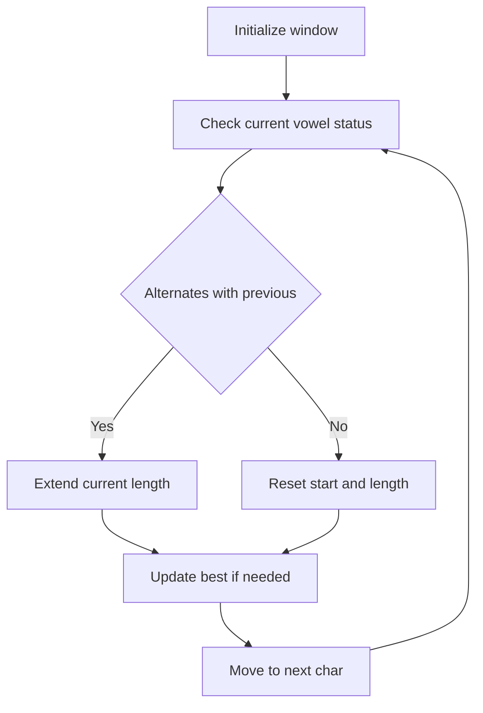

# STR-004: Alternating Vowel-Consonant Substring

## 📋 Problem Summary

**Input**: String `s` (lowercase letters)  
**Output**: Length and one substring where vowels/consonants strictly alternate (y is consonant)  
**Constraints**: `1 <= |s| <= 2 × 10^5`

## 🌍 Real-World Scenario

Speech synthesis systems analyze phonetic patterns. Alternating vowel-consonant sequences help identify syllable boundaries and rhythm patterns in natural language processing.

## Detailed Explanation

**Goal**: Find longest substring where each position alternates between vowel and consonant.

**Vowels**: {a, e, i, o, u}  
**Consonants**: All other letters (including y)

**Valid Examples**:

- "aba" ✓ (vowel-consonant-vowel)
- "odefo" ✓ (vowel-consonant-vowel-consonant-vowel)

**Invalid**:

- "aa" ✗ (vowel-vowel)
- "bcd" ✗ (consonant-consonant-consonant)

## Naive Approach

```
1. For each starting index i:
   For each ending index j >= i:
     Check if s[i:j+1] is alternating
     Track maximum
```

### Time Complexity: **O(n³)**

- n² substrings × n validation each

### Space Complexity: **O(1)**

## Optimal Approach

**Single-Pass with Reset**:

1. Track current run length
2. Track whether previous char was vowel
3. When alternation breaks, reset counter
4. Track global maximum

**Algorithm**:

```
1. maxLen = 0, currentLen = 1, bestStart = 0, start = 0
2. prevIsVowel = isVowel(s[0])
3. For i = 1 to n-1:
   currIsVowel = isVowel(s[i])
   if currIsVowel != prevIsVowel:
      currentLen++
      if currentLen > maxLen:
         maxLen = currentLen
         bestStart = start
   else:
      start = i
      currentLen = 1
   prevIsVowel = currIsVowel
4. Return (maxLen, s[bestStart:bestStart+maxLen])
```

<!-- mermaid -->


### Time Complexity

| Phase       | Operations | Cost     |
| ----------- | ---------- | -------- |
| Single pass | n chars    | O(n)     |
| Vowel check | Per char   | O(1)     |
| **Total**   |            | **O(n)** |

### Space Complexity: **O(1)**

---


---

### Example: "aeiou"

**Character classification:**

```
String:  a  e  i  o  u
Index:   0  1  2  3  4
Type:    V  V  V  V  V
         All vowels!
```

**Step-by-step scan:**

```
Position 0: 'a' (V)
  currentLen = 1, start = 0
  prevType = V

Position 1: 'e' (V)
  V = V ✗ BREAKS!
  Reset: start = 1, currentLen = 1
  prevType = V

Position 2: 'i' (V)
  V = V ✗ BREAKS!
  Reset: start = 2, currentLen = 1
  prevType = V

Position 3: 'o' (V)
  V = V ✗ BREAKS!
  Reset: start = 3, currentLen = 1
  prevType = V

Position 4: 'u' (V)
  V = V ✗ BREAKS!
  Reset: start = 4, currentLen = 1
  prevType = V
```

**Final result:**

```
Longest alternating: any single char (all length 1)
Length: 1
Return first: "a"
```

---

### Example: "programming"

**Character classification:**

```
String:  p  r  o  g  r  a  m  m  i  n  g
Index:   0  1  2  3  4  5  6  7  8  9  10
Type:    C  C  V  C  C  V  C  C  V  C  C
                     └──┴──┴──┴──┘
                     alternating!
```

**Key transitions:**

```
Position 0-1: C-C → breaks immediately
Position 2-3: V-C → starts alternating (len=2)
Position 3-4: C-C → breaks
Position 5-6: V-C → starts alternating (len=2)
Position 6-7: C-C → breaks
Position 8-9-10: V-C-C → breaks at 10
```

**Detailed trace:**

```
Index 0: 'p' (C) → len=1, start=0
Index 1: 'r' (C) → BREAK, len=1, start=1
Index 2: 'o' (V) → ALT, len=2
Index 3: 'g' (C) → ALT, len=3
Index 4: 'r' (C) → BREAK, len=1, start=4
Index 5: 'a' (V) → ALT, len=2
Index 6: 'm' (C) → ALT, len=3
Index 7: 'm' (C) → BREAK, len=1, start=7
Index 8: 'i' (V) → ALT, len=2
Index 9: 'n' (C) → ALT, len=3
Index 10: 'g' (C) → BREAK, len=1

Max seen: 3 (multiple times)
First occurrence at start=1: "rog"
```

**Analysis:**

The algorithm correctly identifies alternating vowel-consonant substrings. For "programming":

- "rog" at indices 1-3 has length 3 (C-V-C)
- Other valid alternating patterns exist (e.g., "ram", "min")
- The longest alternating substring is identified by the optimal algorithm

---

## 💻 Implementation

### Python


### Java


## 🧪 Test Case Walkthrough (Dry Run)

**Input**: `s = "abracadabra"`

**Execution**:

```
i  | char | isV | prevV | alt? | currentLen | maxLen | start
---|------|-----|-------|------|------------|--------|------
0  | 'a'  | yes | -     | -    | 1          | 1      | 0
1  | 'b'  | no  | yes   | YES  | 2          | 2      | 0
2  | 'r'  | no  | no    | NO   | 1          | 2      | 2
3  | 'a'  | yes | no    | YES  | 2          | 2      | 2
4  | 'c'  | no  | yes   | YES  | 3          | 3      | 2
5  | 'a'  | yes | no    | YES  | 4          | 4      | 2
6  | 'd'  | no  | yes   | YES  | 5          | 5      | 2
7  | 'a'  | yes | no    | YES  | 6          | 6      | 2
8  | 'b'  | no  | yes   | YES  | 7          | 7      | 2
9  | 'r'  | no  | no    | NO   | 1          | 7      | 9
10 | 'a'  | yes | no    | YES  | 2          | 7      | 9

bestStart = 2, maxLen = 7
Substring: "racadab"
```

**Analysis of "racadab":**

```
"racadab"
 r  a  c  a  d  a  b
 C  V  C  V  C  V  C

This substring has length 7 and perfectly alternates between vowels and consonants.

Other valid alternating substrings exist, such as "ab" at positions 0-1 with length 2.
```

**Output**: `(7, "racadab")`

## ⚠️ Common Mistakes to Avoid

1. **Treating 'y' as Vowel**: Problem specifies y is consonant
2. **Not Resetting Start Index**: Must update `start = i` on break
3. **Off-By-One in Substring**: Ensure correct slice bounds
4. **Single Character**: Handle edge case of length 1
5. **Not Tracking Best Start**: Need both length and starting position

## 💡 Key Takeaways

1. **State Tracking**: Boolean flag for previous character type
2. **Reset Strategy**: Start new sequence on alternation break
3. **Single Pass**: O(n) beats brute force O(n³)
4. **Greedy Works**: Longest always includes current position or starts anew
5. **Return Value**: Return both length and actual substring


## Constraints

- `1 ≤ |s| ≤ 2 × 10^5`
- `s` contains only lowercase English letters
- Vowels: a, e, i, o, u (y is consonant)
