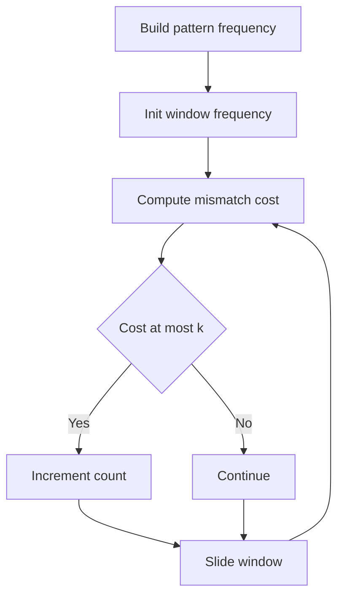

# STR-008: K-Mismatch Anagram Substrings

## 📋 Problem Summary

**Input**: String `s`, pattern `p`, integers `m` (length), `k` (allowed mismatches)  
**Output**: Count of substrings of length `m` that become anagrams of `p` after ≤ `k` substitutions  
**Constraints**: `1 <= |s| <= 10^5`, `1 <= m <= |s|`, `m = |p|`, `0 <= k <= m`

## 🌍 Real-World Scenario

Fuzzy string matching for DNA sequences tolerates small mutations. Finding near-anagrams with limited mismatches helps identify similar genetic patterns despite minor variations.

## Detailed Explanation

**Anagram**: Characters can be rearranged to match

**K-Mismatch**: Need at most `k` character substitutions to make substring an anagram of pattern

**Mismatch Cost**: For frequency difference:

- If freq_s[c] > freq_p[c]: excess characters
- If freq_s[c] < freq_p[c]: missing characters
- Cost = Σ max(0, freq_p[c] - freq_s[c])

**Example**: `s="abxcab"`, `p="aabc"`, `k=1`

- Substring "abxc": freq_s={a:1,b:1,x:1,c:1}, freq_p={a:2,b:1,c:1}
  - Need 1 more 'a', have 1 extra 'x'
  - Cost = 1 (replace 'x' with 'a')
  - 1 <= 1 ✓

## Naive Approach

```
1. For each window of length m in s:
   a. Count frequencies of window
   b. Count frequencies of p
   c. Calculate mismatch cost
   d. If cost <= k, increment counter
```

### Time Complexity: **O(n × m)**

- n-m+1 windows
- O(m) to count frequencies each time

### Space Complexity: **O(1)**

- Fixed 26-character frequency arrays

## Optimal Approach

**Sliding Window with Incremental Frequency Updates**:

1. Build pattern frequency map once
2. Slide window across `s`, updating frequencies incrementally
3. Calculate mismatch cost from frequency differences

**Mismatch Cost Calculation**:

```
For each character c in alphabet:
   If freq_pattern[c] > freq_window[c]:
      cost += freq_pattern[c] - freq_window[c]
```

**Algorithm**:

```
1. Build freq_p from pattern
2. freq_window = first m characters of s
3. count = 0
4. For each window starting at i (0 to n-m):
   a. If i > 0:
      - Remove s[i-1] from freq_window
      - Add s[i+m-1] to freq_window
   b. Calculate mismatch cost
   c. If cost <= k:
      count++
5. Return count
```

<!-- mermaid -->


### Time Complexity

| Phase              | Operations          | Cost         |
| ------------------ | ------------------- | ------------ |
| Build pattern freq | Iterate pattern     | O(m)         |
| Initial window     | First m chars       | O(m)         |
| Slide window       | n-m+1 iterations    | O(n)         |
| Cost calculation   | 26 chars per window | O(26) = O(1) |
| **Total**          |                     | **O(n + m)** |

### Space Complexity

| Component   | Space        | Justification       |
| ----------- | ------------ | ------------------- |
| freq_p      | O(26) = O(1) | Pattern frequencies |
| freq_window | O(26) = O(1) | Window frequencies  |
| **Total**   |              | **O(1)**            |

## 💻 Implementation

### Python


### Java


### C++


### JavaScript


## 🧪 Test Case Walkthrough (Dry Run)

**Input**: `s="abxcab"`, `p="aabc"`, `k=1`

**Step 1: Build Pattern Frequency**

```
p = "aabc"
freqP = [2, 1, 1, 0, ..., 0]  (a:2, b:1, c:1)
```

**Step 2: Initialize First Window**

```
window = "abxc" (s[0:4])
freqWindow = [1, 1, 1, 0, ..., 1, ...]  (a:1, b:1, c:1, x:1)
```

**Step 3: Calculate Mismatch Cost for First Window**

```
For each char:
  a: freqP=2, freqWindow=1 → cost += 1
  b: freqP=1, freqWindow=1 → cost += 0
  c: freqP=1, freqWindow=1 → cost += 0
  x: freqP=0, freqWindow=1 → cost += 0 (excess ignored)

Total cost = 1 <= k=1 ✓ (count=1)
```

**Step 4: Slide to Window 2**

```
Remove s[0]='a': freqWindow[a]-- → [0, 1, 1, ..., 1, ...]
Add s[4]='a': freqWindow[a]++ → [1, 1, 1, ..., 1, ...]

window = "bxca"
Mismatch cost:
  a: 2 - 1 = 1
Total = 1 <= 1 ✓ (count=2)
```

**Step 5: Slide to Window 3**

```
Remove s[1]='b': freqWindow[b]-- → [1, 0, 1, ..., 1, ...]
Add s[5]='b': freqWindow[b]++ → [1, 1, 1, ..., 1, ...]

window = "xcab"
Mismatch cost:
  a: 2 - 1 = 1
Total = 1 <= 1 ✓ (count=3)
```

**Output**: `3`

## ⚠️ Common Mistakes to Avoid

1. **Wrong Mismatch Cost**: Only count deficits, not excesses
2. **Recomputing Frequencies**: Should update incrementally, not rebuild
3. **Off-By-One in Sliding**: Ensure correct indices for add/remove
4. **Not Checking First Window**: Don't skip initial window
5. **Frequency Array Size**: Use 26 for lowercase letters

## 💡 Key Takeaways

1. **Sliding Window**: Efficient for fixed-size substring problems
2. **Incremental Updates**: Update frequencies in O(1) per slide
3. **Mismatch Calculation**: Count only missing characters (deficits)
4. **Frequency Arrays**: Fixed-size (26) enables O(1) space
5. **Edge Cases**: Handle k=0 (exact anagrams), k=m (always match)


## Constraints

- `1 ≤ |s| ≤ 10^5`
- `1 ≤ m ≤ |s|`
- `m = |p|`
- `0 ≤ k ≤ m`
