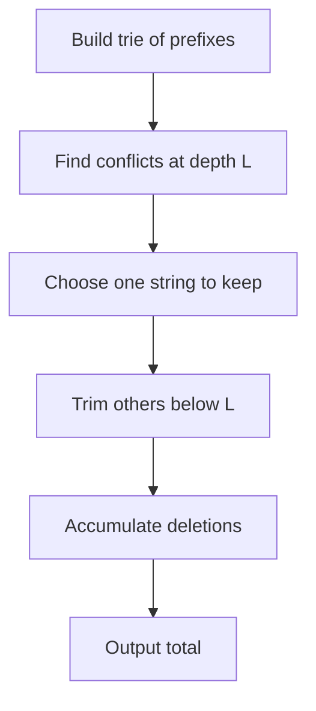

# STR-009: Minimal Removal for Unique Prefixes

## 📋 Problem Summary

**Input**: Integer `L` (prefix length), list of `n` strings  
**Output**: Minimum total character deletions (from ends) to make all length-L prefixes distinct  
**Constraints**: `1 <= n <= 2 × 10^5`, `1 <= L <= 20`, total length ≤ `2 × 10^5`

## 🌍 Real-World Scenario

Database indexing requires unique prefix keys for efficient lookups. When identifiers collide on prefixes, trimming suffixes minimally preserves data while ensuring uniqueness.

## Detailed Explanation

**Operation**: Delete characters from the end of any string

**Goal**: Make all strings have distinct prefixes of length L

**Constraint**: Can only shorten strings, not extend them

**Example**: `L=2`, strings `["abc", "abd", "acc"]`

- Prefixes: "ab", "ab", "ac"
- Collision: First two have "ab"
- Solution: Keep one as "ab...", shorten other to length < 2 or change prefix
- Minimal: Delete 2 from "abd" → "a" (cost 2)
- Result prefixes: "ab", "a", "ac" (all distinct)

## Naive Approach

```
1. Try all combinations of deletions
2. For each combination:
   a. Check if prefixes are distinct
   b. Track minimal cost
```

### Time Complexity: **Exponential**

- Too many deletion combinations

### Space Complexity: **O(n × L)**

- Store strings and prefixes

## Optimal Approach

**Trie-Based Conflict Detection + Greedy Resolution**:

1. Build trie of all length-L prefixes
2. Identify conflicting strings (same prefix at depth L)
3. For each conflict group:
   - Keep longest string (or arbitrary choice)
   - Delete others to length < L

**Algorithm**:

```
1. Build trie with strings as values at nodes
2. Traverse to depth L and collect conflicts
3. For each conflict group at depth L:
   a. Find string with max length (or arbitrary)
   b. For other strings:
      - Calculate deletions: len(s) - (L-1)
      - Add to total cost
4. Return total cost
```

<!-- mermaid -->


**Greedy Choice**: Keep longest string in each conflict group minimizes deletions

---

## 🧪 Test Case Walkthrough (Dry Run)

### Example: L=2, strings=["abc", "abd", "acc"]

**Step 1: Build Trie to depth L=2**

```
       root
        │
        a
       ╱ ╲
      b   c
     ╱ ╲   │
   abc abd acc
   (c) (d) (c)
```

**Step 2: Identify conflicts at depth 2**

```
At node 'a' → 'b' (depth 2):
  ├─ "abc" (length 3)
  └─ "abd" (length 3)  ← CONFLICT! Same prefix "ab"

At node 'a' → 'c' (depth 2):
  └─ "acc" (length 3)  ← No conflict, unique prefix "ac"
```

**Step 3: Resolve conflicts**

```
Conflict group at "ab": ["abc", "abd"]
  • Keep one: "abc" (arbitrary choice)
  • Delete other to length < L:
    - "abd" must become length < 2
    - Delete to length 1: "a"
    - Deletions needed: len("abd") - (L-1) = 3 - 1 = 2 ✓
```

**Step 4: Final state**

```
Before:                After:
"abc" → prefix "ab"    "abc" → prefix "ab"
"abd" → prefix "ab"    "a"   → (too short, no L-prefix)
"acc" → prefix "ac"    "acc" → prefix "ac"

Prefixes of length L=2: {"ab", "ac"} ← All distinct! ✓
Total deletions: 2
```

---

### Example: L=2, strings=["aa", "aa", "aa", "aa", "aa"]

**Step 1: Build Trie**

```
       root
        │
        a
        │
        a (depth 2)
      ╱ │ │ │ ╲
    aa aa aa aa aa  ← All 5 strings!
```

**Step 2: Massive conflict at "aa"**

```
All 5 strings have prefix "aa" → CONFLICT!
```

**Step 3: Resolution strategy**

```
Conflict group: ["aa", "aa", "aa", "aa", "aa"]
  • Keep 1 string: "aa"
  • Delete other 4 to length < L=2:
    - Each: len("aa") - (L-1) = 2 - 1 = 1
    - Each becomes: "a"
```

**Step 4: Calculate total**

```
Deletions per string: 1 character
Number of strings to shorten: 4
Total deletions: 4 × 1 = 4 ✓
```

**Visual representation:**

```
Before:              After:
[aa] [aa] [aa] [aa] [aa]    [aa] [a] [a] [a] [a]
 ↓    ↓    ↓    ↓    ↓        ↓   ↓   ↓   ↓   ↓
All have prefix "aa"       Only 1 has length≥2
```

---

### Time Complexity

| Phase               | Operations         | Cost         |
| ------------------- | ------------------ | ------------ |
| Build trie          | Insert n strings   | O(n × L)     |
| Traverse conflicts  | Visit trie nodes   | O(n × L)     |
| Calculate deletions | Count per conflict | O(n)         |
| **Total**           |                    | **O(n × L)** |

### Space Complexity

| Component      | Space    | Justification     |
| -------------- | -------- | ----------------- |
| Trie nodes     | O(n × L) | At most n×L nodes |
| Conflict lists | O(n)     | All strings       |
| **Total**      |          | **O(n × L)**      |

## 💻 Implementation

### Python


### Java


### C++


### JavaScript


## 🧪 Test Case Walkthrough (Dry Run)

**Input**: `L=2`, strings `["abc", "abd", "acc"]`

**Step 1: Build Trie**

```
Root
 └─ a
     └─ b (depth 2, strings=["abc", "abd"])
     └─ c (depth 2, strings=["acc"])
```

**Step 2: Find Conflicts at Depth L=2**

```
Node "ab" (depth 2):
  strings = ["abc", "abd"]  (conflict!)
  Keep longest: "abc" (length 3)
  Delete from "abd": 3 - (2-1) = 3 - 1 = 2 deletions

Node "ac" (depth 2):
  strings = ["acc"]  (no conflict)
```

**Step 3: Calculate Total**

```
totalDeletions = 2
```

**Output**: `2`

**Verification**:

- "abc" → prefix "ab"
- "abd" → delete 2 chars → "a" → prefix "a" (length < 2)
- "acc" → prefix "ac"
- All distinct: "ab", "a" (length 1 < L), "ac" ✓

## 🧪 Walkthrough: No Conflicts

**Input**: `L=2`, strings `["ab", "cd", "ef"]`

```
Trie:
Root
 └─ a
     └─ b (strings=["ab"])
 └─ c
     └─ d (strings=["cd"])
 └─ e
     └─ f (strings=["ef"])

All nodes at depth 2 have single string
No conflicts → totalDeletions = 0
```

**Output**: `0`

## ⚠️ Common Mistakes to Avoid

1. **Not Using Trie**: Brute-force comparison is O(n² × L)
2. **Wrong Deletion Count**: Use `len(s) - (L-1)`, not `len(s) - L`
3. **Forgetting Short Strings**: Strings with length < L already have unique "prefix"
4. **Greedy Choice**: Keeping longest minimizes deletions
5. **Trie Depth**: Only build to depth L, no need to go deeper

## 💡 Key Takeaways

1. **Trie for Prefix Conflicts**: Natural structure for grouping by prefix
2. **Greedy Strategy**: Keep longest string in each conflict group
3. **Deletion Formula**: `len(s) - (L-1)` to reduce prefix length below L
4. **Efficient Traversal**: Only traverse trie to depth L
5. **Conflict Detection**: Multiple strings at same trie node at depth L


## Constraints

- `1 ≤ n ≤ 2 × 10^5`
- `1 ≤ L ≤ 20`
- Total string length ≤ `2 × 10^5`
