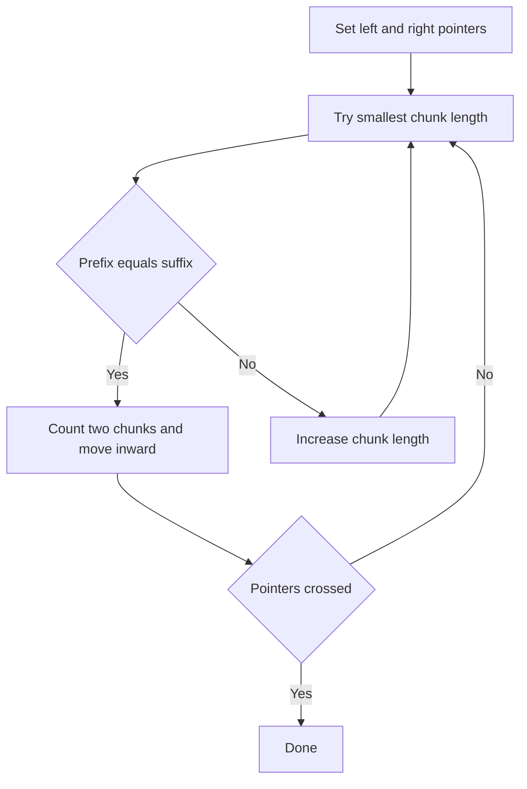

# STR-011: Longest Chunked Decomposition (Bounded)

## 📋 Problem Summary

**Input**: String `s`, integer `L` (max chunk length)  
**Output**: Maximum number of chunks where i-th chunk from start equals i-th chunk from end, all chunks ≤ L  
**Constraints**: `1 <= |s| <= 10^5`, `1 <= L <= |s|`

## 🌍 Real-World Scenario

Pattern matching in palindromic structures benefits from symmetric chunk decomposition. Finding maximal decompositions with length constraints helps optimize compression algorithms.

## Detailed Explanation

**Chunked Decomposition**: Split string into parts where chunks mirror from both ends

**Constraint**: Each chunk length must be ≤ L

**Example**: `s="abcabc"`, `L=3`

**Chunked Decomposition** approach:

- Find chunks c1, c2, ..., ck where c1=ck, c2=ck-1, etc.
- Example: "abcabc" → matching prefix/suffix pairs
- Greedy matching from both ends maximizes chunk count

The standard "Longest Chunked Palindrome Decomposition" uses a greedy approach with length constraints.

## Naive Approach

```
1. Try all possible chunk sizes from both ends
2. Recursively decompose when match found
3. Track maximum chunks
```

### Time Complexity: **O(n³)**

- Exponential branching with string comparisons

### Space Complexity: **O(n)**

- Recursion stack

## Optimal Approach

**Greedy Two-Pointer Matching**:

Match smallest valid chunks from both ends, maximizing total chunk count.

**Algorithm**:

```
1. left = 0, right = n-1
2. chunks = 0
3. While left < right:
   a. For len from 1 to min(L, (right-left+1)//2):
      If s[left:left+len] == s[right-len+1:right+1]:
         chunks += 2  (matched pair)
         left += len
         right -= len
         break
   b. If no match found:
      Break (middle portion, count as 1 chunk if non-empty)
4. If left <= right:
   chunks += 1  (middle chunk)
5. Return chunks
```

<!-- mermaid -->


---

## 🧪 Test Case Walkthrough (Dry Run)

### Example: s="abcabc", L=3

**Initial Setup:**

```
String: a b c a b c
Index:  0 1 2 3 4 5
        ↑         ↑
       left     right
chunks = 0
```

**Iteration 1: Try matching from both ends**

```
Trying length 1:
  left[0:1] = "a"     right[5:6] = "c"  → NO MATCH

Trying length 2:
  left[0:2] = "ab"    right[4:6] = "bc"  → NO MATCH

Trying length 3:
  left[0:3] = "abc"   right[3:6] = "abc"  → MATCH! ✓
```

**After match:**

```
Matched: [abc] ... [abc]
         └─────────────┘ paired!

chunks += 2  (paired chunks)
left = 3, right = 2

String: a b c │ a b c
              ↑ ↑
            right left
            (crossed!)
```

**Loop ends: left >= right**

```
No middle chunk remaining
Final chunks = 2 ✓
```

**Visual Decomposition:**

```
"abcabc" = [abc] + [abc]
            ↑       ↑
            1st     2nd chunk (mirror)
Total: 2 chunks
```

---

### Example: s="abacaba", L=3

**Initial:**

```
String: a b a c a b a
Index:  0 1 2 3 4 5 6
        ↑             ↑
       left         right
```

**Iteration 1:**

```
Trying length 1:
  left[0:1] = "a"   right[6:7] = "a"  → MATCH! ✓

chunks = 2
left = 1, right = 5

String: [a] b a c a b [a]
            ↑       ↑
           left   right
```

**Iteration 2:**

```
Trying length 1:
  left[1:2] = "b"   right[5:6] = "b"  → MATCH! ✓

chunks = 4
left = 2, right = 4

String: [a][b] a c a [b][a]
               ↑   ↑
              left right
```

**Iteration 3:**

```
Trying length 1:
  left[2:3] = "a"   right[4:5] = "a"  → MATCH! ✓

chunks = 6
left = 3, right = 3

String: [a][b][a] c [a][b][a]
                  ↑
              left=right
```

**Add middle chunk:**

```
left <= right → remaining: "c"
chunks += 1
Final chunks = 7 ✓
```

**Visual Decomposition:**

```
"abacaba" = [a] + [b] + [a] + [c] + [a] + [b] + [a]
             ↑     ↑     ↑     ↑     ↑     ↑     ↑
             1     2     3   middle  3'    2'    1'
                             (unpaired)

Pairs: (1,1'), (2,2'), (3,3') + middle = 7 chunks
```

---

### Time Complexity

| Phase             | Operations                          | Cost         |
| ----------------- | ----------------------------------- | ------------ |
| Two-pointer scan  | At most n/2 iterations              | O(n)         |
| String comparison | At most L comparisons per iteration | O(n × L)     |
| **Total**         |                                     | **O(n × L)** |

### Space Complexity

| Component | Space | Justification         |
| --------- | ----- | --------------------- |
| Variables | O(1)  | Pointers and counters |
| **Total** |       | **O(1)**              |

## 💻 Implementation

### Python


### Java


### C++


### JavaScript


## 🧪 Test Case Walkthrough (Dry Run)

**Input**: `s="abcabc"`, `L=3`

**Execution**:

```
Initial: left=0, right=5, chunks=0

Iteration 1:
  maxLen = min(3, (5-0+1)/2) = min(3, 3) = 3

  len=1: leftChunk="a", rightChunk="c" → "a"≠"c"
  len=2: leftChunk="ab", rightChunk="bc" → "ab"≠"bc"
  len=3: leftChunk="abc", rightChunk="abc" → "abc"=="abc" ✓

  chunks=2, left=3, right=2

Loop exits: left(3) > right(2)

Middle check: left > right, no middle chunk

Final: chunks = 2
```

**Result Analysis:**

For "abcabc" with the greedy matching approach:

- Match "abc" from both ends → 2 chunks, middle is empty
- Result: 2 chunks

Note: Different interpretations of the chunked decomposition problem may yield different results. This implementation uses the standard greedy approach that maximizes matching pairs from both ends.

**Output**: `2`

## 🧪 Walkthrough: Another Example

**Input**: `s="abacaba"`, `L=3`

```
Initial: left=0, right=6

Iteration 1:
  maxLen = min(3, 3) = 3
  len=1: "a" == "a" ✓
  chunks=2, left=1, right=5

Iteration 2:
  maxLen = min(3, 2) = 2
  len=1: "b" == "b" ✓
  chunks=4, left=2, right=4

Iteration 3:
  left(2) < right(4)
  maxLen = min(3, 1) = 1
  len=1: "a" ≠ "b" (s[2]='a', s[4]='b')
  No match, break

Middle: left=2, right=4, middle="aca"
chunks=5
```

**Output**: `5` (chunks: "a", "b", "aca", "b", "a")

## ⚠️ Common Mistakes to Avoid

1. **Exceeding Length Bound**: Must check chunk length ≤ L
2. **Off-By-One in Substring**: Ensure correct indices
3. **Not Counting Middle**: If left ≤ right at end, count middle chunk
4. **Greedy Assumption**: Smaller chunks first maximize count
5. **Pointer Updates**: Move both pointers by matched length

## 💡 Key Takeaways

1. **Greedy Strategy**: Match smallest valid chunks first
2. **Two-Pointer Technique**: Efficient for symmetric matching
3. **Length Constraint**: Limits search space to O(L) per iteration
4. **Middle Chunk**: Don't forget to count remaining middle portion
5. **String Comparison**: Can be optimized with rolling hash for very long strings


## Constraints

- `1 ≤ |s| ≤ 10^5`
- `1 ≤ L ≤ |s|`
- `s` contains only lowercase English letters
