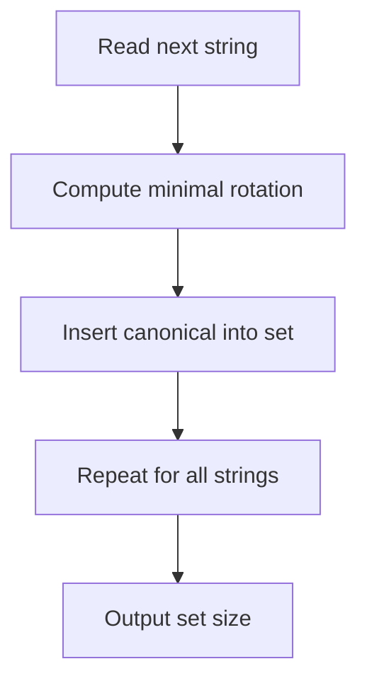

# STR-015: Cyclic Shift Equality Classes

## 📋 Problem Summary

**Input**: `n` strings  
**Output**: Number of equivalence classes where strings are equivalent if one is a cyclic shift of another  
**Constraints**: `1 <= n <= 2 × 10^5`, each string length ≤ 20

## 🌍 Real-World Scenario

DNA sequence analysis groups circular genomes by rotation equivalence. Counting distinct classes helps identify unique genetic patterns despite different reading frame starts.

## Detailed Explanation

**Cyclic Shift**: Rotation of string. "abc" shifts: "abc", "bca", "cab"

**Equivalence Class**: All strings that are rotations of each other

**Example**: `["ab","ba","abc","bca","cab"]`

- Class 1: {"ab", "ba"} (rotations of each other)
- Class 2: {"abc", "bca", "cab"} (rotations of each other)
- Total: 2 classes

**Verification:**

"ab" rotations: "ab", "ba" ✓

"abc" rotations: "abc", "bca", "cab" ✓

## Naive Approach

```
1. For each string:
   a. Generate all rotations
   b. Check if any existing class contains a rotation
   c. If yes, add to that class
   d. If no, create new class
```

### Time Complexity: **O(n² × m²)**

- n strings
- For each, compare with all others: O(n × m²)

### Space Complexity: **O(n × m)**

- Store all strings

## Optimal Approach

**Canonical Form using Minimal Rotation**:

1. For each string, compute its minimal rotation (canonical form)
2. Use hash map to count unique canonical forms
3. Number of unique canonicals = number of equivalence classes

**Use Booth's Algorithm** for O(m) minimal rotation finding

**Algorithm**:

```
1. canonical_map = {}
2. For each string s:
   a. canonical = minimal_rotation(s)  # Using Booth's
   b. canonical_map[canonical]++
3. Return len(canonical_map)
```

<!-- mermaid -->


---

## 🧪 Test Case Walkthrough (Dry Run)

### Example: strings=["ab", "ba", "abc", "bca", "cab"]

**Step 1: Process each string to find minimal rotation**

**String 1: "ab"**

```
Rotations of "ab":
  "ab" ← minimal (lexicographically smallest)
  "ba"

Canonical form: "ab"
```

**String 2: "ba"**

```
Rotations of "ba":
  "ab" ← minimal
  "ba"

Canonical form: "ab" (same as string 1!)
```

**String 3: "abc"**

```
Rotations of "abc":
  "abc" ← minimal
  "bca"
  "cab"

Canonical form: "abc"
```

**String 4: "bca"**

```
Rotations of "bca":
  "abc" ← minimal
  "bca"
  "cab"

Canonical form: "abc" (same as string 3!)
```

**String 5: "cab"**

```
Rotations of "cab":
  "abc" ← minimal
  "bca"
  "cab"

Canonical form: "abc" (same as strings 3 & 4!)
```

**Step 2: Count unique canonical forms**

```
Canonical Map:
  "ab"  → count: 2 (strings: "ab", "ba")
  "abc" → count: 3 (strings: "abc", "bca", "cab")

Unique canonical forms: 2
```

**Visual Grouping:**

```
Class 1: {"ab", "ba"}
         Rotation cycle: ab → ba → ab
         Representative: "ab"

Class 2: {"abc", "bca", "cab"}
         Rotation cycle: abc → bca → cab → abc
         Representative: "abc"

Total Classes: 2 ✓
```

---

### Example: strings=["aaa", "test", "test", "ttse"]

**String 1: "aaa"**

```
All rotations identical:
  "aaa" = "aaa" = "aaa"

Canonical: "aaa"
```

**String 2: "test"**

```
Rotations:
  "estt" ← minimal
  "stte"
  "ttes"
  "test"

Canonical: "estt"
```

**String 3: "test"** (duplicate)

```
Canonical: "estt" (same as string 2)
```

**String 4: "ttse"**

```
Rotations:
  "estt" ← minimal
  "sett"
  "ttes"
  "ttse"

Canonical: "estt" (same as strings 2 & 3!)
```

**String 4: "test"**

```
"test" rotations:
  Position 0: "test"
  Position 1: "estt"
  Position 2: "stte"
  Position 3: "ttes"

Minimal: "estt"
```

**String 5: "ttse"**

```
"ttse" rotations:
  "ttse"
  "tset"
  "sett"
  "etts"

Minimal: "etts"
```

**Final canonical map:**

```
"aaa"  → count: 1
"estt" → count: 2 ("test", "test")
"etts" → count: 1 ("ttse")

Total classes: 3
```

---

### Booth's Algorithm Visualization

**For string "bca" (finding minimal rotation):**

```
Step 1: Create doubled string
  s = "bca"
  doubled = "bcabca"
           012345

Step 2: Find lexicographically smallest starting position
  Position 0: "bcabca" → starts "bca"
  Position 1: "cabca"  → starts "cab"
  Position 2: "abca"   → starts "abc" ← SMALLEST!

Step 3: Extract rotation
  Start at position 2, take 3 chars: "abc"

Minimal rotation: "abc" ✓
```

---

### Time Complexity

| Phase               | Operations             | Cost         |
| ------------------- | ---------------------- | ------------ |
| Process each string | n iterations           | O(n)         |
| Booth's algorithm   | Per string of length m | O(m)         |
| Hash map insert     | O(1) average           | O(1)         |
| **Total**           |                        | **O(n × m)** |

### Space Complexity

| Component     | Space    | Justification            |
| ------------- | -------- | ------------------------ |
| canonical_map | O(n × m) | At most n unique strings |
| **Total**     |          | **O(n × m)**             |

## 💻 Implementation

### Python


### Java


### C++


### JavaScript


## 🧪 Test Case Walkthrough (Dry Run)

**Input**: `["ab","ba","abc","bca","cab"]`

**Step 1: Compute Canonical Forms**

```
String "ab":
  Booth's algorithm finds minimal rotation
  Rotations: "ab", "ba"
  Minimal: "ab"
  canonical = "ab"

String "ba":
  Rotations: "ba", "ab"
  Minimal: "ab"
  canonical = "ab"

String "abc":
  Rotations: "abc", "bca", "cab"
  Minimal: "abc"
  canonical = "abc"

String "bca":
  Rotations: "bca", "cab", "abc"
  Minimal: "abc"
  canonical = "abc"

String "cab":
  Rotations: "cab", "abc", "bca"
  Minimal: "abc"
  canonical = "abc"
```

**Step 2: Count Unique Canonicals**

```
canonicalSet = {"ab", "abc"}
```

**Output**: `2`

**Note:** For the input `["ab","ba","abc","bca","cab"]`:

- "ab" and "ba" are rotations of each other → canonical form: "ab"
- "abc", "bca", and "cab" are rotations of each other → canonical form: "abc"
- Unique canonical forms: {"ab", "abc"} → 2 classes

**Output**: `2`

## ⚠️ Common Mistakes to Avoid

1. **Comparing All Rotations**: Use canonical form instead
2. **O(n²) Comparison**: Hash canonical forms for O(1) lookup
3. **Wrong Booth Implementation**: Subtle algorithm, easy to mess up
4. **Not Handling Identical Strings**: Already in same class
5. **Space Overhead**: Use set, not list of classes

## 💡 Key Takeaways

1. **Canonical Forms**: Minimal rotation provides unique representative
2. **Booth's Algorithm**: O(m) solution for minimal rotation
3. **Hash Set**: Efficient counting of unique canonicals
4. **Equivalence Relations**: Canonical form for transitive closure
5. **Complexity**: O(n × m) time and space optimal


## Constraints

- `1 ≤ n ≤ 2 × 10^5`
- Each string length ≤ 20
