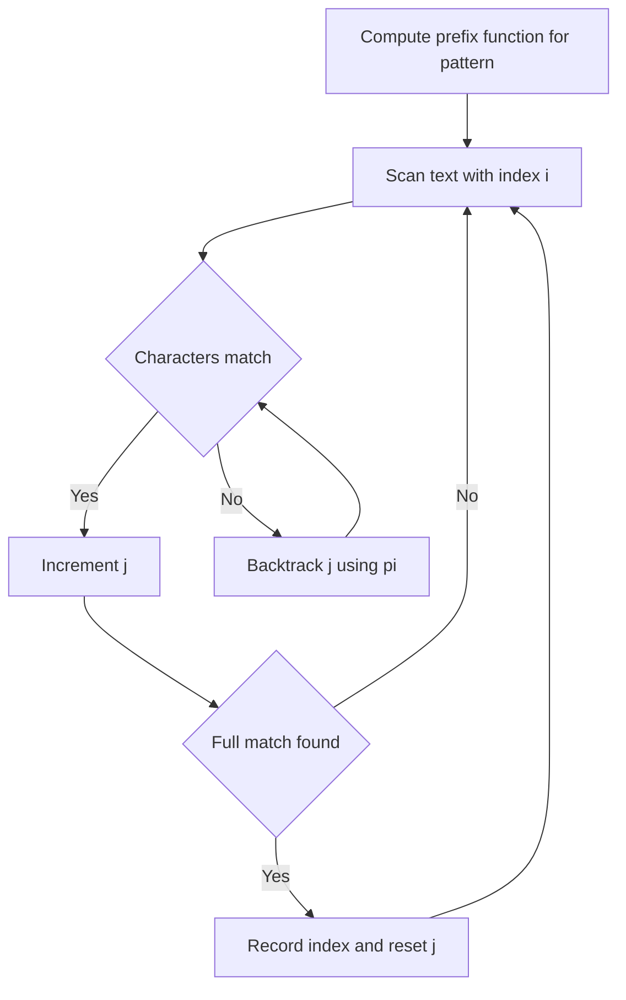

# STC-002: Pattern Search With KMP

## 📋 Problem Summary

Given a pattern string `p` and a text string `t`, you need to find all the starting indices in `t` where `p` appears as a substring. The indices must be 0-based and sorted in increasing order. You are expected to use the Knuth-Morris-Pratt (KMP) algorithm to achieve linear time complexity.

## 🌍 Real-World Scenario

**Scenario Title:** Virus Signature Detection

Antivirus software scans files for known malicious code patterns (signatures). A file can be very large (gigabytes), and the virus signature is typically a small string of bytes. The antivirus needs to scan the file extremely fast without re-reading parts of the file it has already processed. If it finds a partial match that fails, it shouldn't restart the scan from the next byte; instead, it should intelligently shift the pattern to the next possible matching position. This is exactly what KMP does—it ensures that every byte of the file is examined at most a constant number of times.

**Why This Problem Matters:**

- **Performance:** Naive string matching is too slow for large texts (e.g., searching in a DNA genome or a large log file).
- **Streaming Data:** KMP can process text as a stream (character by character) without needing to store the entire text in memory, which is crucial for network packet inspection.


## Detailed Explanation

### ASCII Diagram: Concept Visualization

Let `p = "aba"` and `t = "ababa"`.

```
Text:    a b a b a
Indices: 0 1 2 3 4

Attempt 1 at index 0:
Text:    a b a b a
Pattern: a b a
Match! Record index 0.

Attempt 2 at index 1:
Text:    a b a b a
Pattern:   a b a
Mismatch at first char ('b' != 'a').

Attempt 3 at index 2:
Text:    a b a b a
Pattern:     a b a
Match! Record index 2.
```

## ✅ Input/Output Clarifications (Read This Before Coding)

- **Overlapping Matches:** Matches can overlap. For `p="aa"` and `t="aaa"`, the answer is `0 1`.
- **Empty Output:** If `p` is not found, output nothing (or an empty line).
- **Constraints:** Both `p` and `t` can be up to 200,000 characters. An O(|p| * |t|) solution will TLE.

## Naive Approach

### Intuition

Slide the pattern `p` over text `t` one position at a time. At each position, compare `p` with the substring of `t`.

### Algorithm

1. Iterate `i` from `0` to `|t| - |p|`.
2. For each `i`, compare `t[i...i+|p|-1]` with `p`.
3. If they match, add `i` to the result list.

### Time Complexity

- **O(|t| * |p|)**: In the worst case (e.g., `t="aaaaa..."`, `p="aaa...b"`), we do `|p|` comparisons for each of the `|t|` positions.
- With `|t|=200,000` and `|p|=100,000`, this is `2 * 10^10` operations, which is too slow.

### Space Complexity

- **O(1)**: Ignoring result storage.

## Optimal Approach (KMP Algorithm)

### Key Insight

The KMP algorithm uses the **prefix function** (often called the `pi` array or failure function) of the pattern `p`. The value `pi[j]` tells us the length of the longest proper prefix of `p[0...j]` that is also a suffix of `p[0...j]`.

When a mismatch occurs after matching `j` characters of `p`, we know that the last `j` characters of `t` matched `p[0...j-1]`. Instead of shifting `p` by just 1, we can shift it such that the longest prefix of `p` that matches the suffix of the matched part aligns with the text. The new length of the match becomes `pi[j-1]`.

### Algorithm

1. **Preprocess `p`**: Compute the prefix function `pi` for the pattern `p`.
2. **Search**:
   - Initialize `j = 0` (number of characters of `p` currently matched).
   - Iterate `i` through text `t` from `0` to `|t|-1`:
     - While `j > 0` and `t[i] != p[j]`, backtrack `j = pi[j-1]`.
     - If `t[i] == p[j]`, increment `j`.
     - If `j == |p|` (full pattern matched):
       - Record match index: `i - |p| + 1`.
       - Prepare for next match: `j = pi[j-1]` (treat as if a mismatch occurred at the next character to find overlapping matches).

<!-- mermaid -->


### Time Complexity

- **O(|p| + |t|)**: Computing `pi` takes O(|p|). The search phase takes O(|t|) because `j` increases at most `|t|` times and cannot decrease more times than it increases.

### Space Complexity

- **O(|p|)**: To store the `pi` array.

### Alternative Implementation (Concatenation)

A simpler way to implement this is to construct a string `S = p + '#' + t` (where `#` is a character not in `p` or `t`). Then compute the prefix function for `S`. Any position `i` where `pi[i] == |p|` corresponds to a match ending at `i`. The starting index in `t` would be `i - 2*|p|`. This uses O(|p| + |t|) space.


## Implementations

### Java
```java
import java.util.*;

class Solution {
    public int[] findOccurrences(String p, String t) {
        int m = p.length();
        int n = t.length();
        if (m == 0) return new int[0];
        
        // Step 1: Compute prefix function for p
        int[] pi = computePrefixFunction(p);
        
        List<Integer> matches = new ArrayList<>();
        int j = 0; // index for p
        
        // Step 2: Search p in t
        for (int i = 0; i < n; i++) {
            while (j > 0 && t.charAt(i) != p.charAt(j)) {
                j = pi[j - 1];
            }
            if (t.charAt(i) == p.charAt(j)) {
                j++;
            }
            if (j == m) {
                matches.add(i - m + 1);
                j = pi[j - 1]; // Prepare for next potential match
            }
        }
        
        return matches.stream().mapToInt(i -> i).toArray();
    }
    
    private int[] computePrefixFunction(String p) {
        int m = p.length();
        int[] pi = new int[m];
        int j = 0;
        for (int i = 1; i < m; i++) {
            while (j > 0 && p.charAt(i) != p.charAt(j)) {
                j = pi[j - 1];
            }
            if (p.charAt(i) == p.charAt(j)) {
                j++;
            }
            pi[i] = j;
        }
        return pi;
    }
}

class Main {
    public static void main(String[] args) {
        Scanner sc = new Scanner(System.in);
        if (sc.hasNext()) {
            String t = sc.next();
            String p = sc.next();

            Solution solution = new Solution();
            int[] result = solution.findOccurrences(p, t);

            if (result.length == 0) {
                System.out.println("-1");
            } else {
                StringBuilder sb = new StringBuilder();
                for (int i = 0; i < result.length; i++) {
                    if (i > 0) sb.append(' ');
                    sb.append(result[i]);
                }
                System.out.println(sb.toString());
            }
        }
        sc.close();
    }
}
```

### Python
```python
def compute_prefix_function(p: str) -> list[int]:
    m = len(p)
    pi = [0] * m
    j = 0
    for i in range(1, m):
        while j > 0 and p[i] != p[j]:
            j = pi[j - 1]
        if p[i] == p[j]:
            j += 1
        pi[i] = j
    return pi

def find_occurrences(p: str, t: str) -> list[int]:
    if not p:
        return []
        
    pi = compute_prefix_function(p)
    m = len(p)
    n = len(t)
    matches = []
    j = 0
    
    for i in range(n):
        while j > 0 and t[i] != p[j]:
            j = pi[j - 1]
        if t[i] == p[j]:
            j += 1
        if j == m:
            matches.append(i - m + 1)
            j = pi[j - 1]
            
    return matches

def main():
    import sys
    sys.setrecursionlimit(200000)
    input_data = sys.stdin.read().split()
    if len(input_data) < 2:
        return
    t = input_data[0]
    p = input_data[1]
    result = find_occurrences(p, t)
    if not result:
        print("-1")
    else:
        print(*(result))

if __name__ == "__main__":
    main()
```

### C++
```cpp
#include <iostream>
#include <vector>
#include <string>

using namespace std;

class Solution {
public:
    vector<int> findOccurrences(const string& p, const string& t) {
        int m = p.length();
        int n = t.length();
        if (m == 0) return {};
        
        // Compute prefix function
        vector<int> pi(m, 0);
        int j = 0;
        for (int i = 1; i < m; i++) {
            while (j > 0 && p[i] != p[j]) {
                j = pi[j - 1];
            }
            if (p[i] == p[j]) {
                j++;
            }
            pi[i] = j;
        }
        
        // Search
        vector<int> matches;
        j = 0;
        for (int i = 0; i < n; i++) {
            while (j > 0 && t[i] != p[j]) {
                j = pi[j - 1];
            }
            if (t[i] == p[j]) {
                j++;
            }
            if (j == m) {
                matches.push_back(i - m + 1);
                j = pi[j - 1];
            }
        }
        return matches;
    }
};

int main() {
    ios::sync_with_stdio(false);
    cin.tie(nullptr);

    string t, p;
    if (cin >> t >> p) {
        Solution solution;
        vector<int> result = solution.findOccurrences(p, t);
        if (result.empty()) {
            cout << "-1\n";
        } else {
            for (int i = 0; i < (int)result.size(); i++) {
                if (i > 0) cout << " ";
                cout << result[i];
            }
            cout << "\n";
        }
    }
    return 0;
}
```

### JavaScript
```javascript
const readline = require("readline");

class Solution {
  findOccurrences(p, t) {
    const m = p.length;
    const n = t.length;
    if (m === 0) return [];
    
    // Compute prefix function
    const pi = new Array(m).fill(0);
    let j = 0;
    for (let i = 1; i < m; i++) {
      while (j > 0 && p[i] !== p[j]) {
        j = pi[j - 1];
      }
      if (p[i] === p[j]) {
        j++;
      }
      pi[i] = j;
    }
    
    // Search
    const matches = [];
    j = 0;
    for (let i = 0; i < n; i++) {
      while (j > 0 && t[i] !== p[j]) {
        j = pi[j - 1];
      }
      if (t[i] === p[j]) {
        j++;
      }
      if (j === m) {
        matches.push(i - m + 1);
        j = pi[j - 1];
      }
    }
    return matches;
  }
}

const rl = readline.createInterface({
  input: process.stdin,
  output: process.stdout,
});

let data = [];
rl.on("line", (line) => {
  const parts = line.trim().split(/\s+/);
  for (const part of parts) {
    if (part) data.push(part);
  }
});

rl.on("close", () => {
  if (data.length < 2) return;
  const t = data[0];
  const p = data[1];
  const solution = new Solution();
  const result = solution.findOccurrences(p, t);
  if (result.length === 0) {
    console.log("-1");
  } else {
    console.log(result.join(" "));
  }
});
```

## 🧪 Test Case Walkthrough (Dry Run)

`p = "aba"`, `t = "ababa"`

1. **Preprocessing `p`**:
   - `pi` for "aba": `[0, 0, 1]`

2. **Searching**:
   - `i=0, t[0]='a'`: Match `p[0]`. `j` becomes 1.
   - `i=1, t[1]='b'`: Match `p[1]`. `j` becomes 2.
   - `i=2, t[2]='a'`: Match `p[2]`. `j` becomes 3.
   - **Full Match!** Record `2 - 3 + 1 = 0`.
   - Reset `j = pi[2] = 1`. (We effectively matched prefix "a" of the next potential match).
   - `i=3, t[3]='b'`: Match `p[1]` (since `j=1`). `j` becomes 2.
   - `i=4, t[4]='a'`: Match `p[2]`. `j` becomes 3.
   - **Full Match!** Record `4 - 3 + 1 = 2`.
   - Reset `j = pi[2] = 1`.

Result: `0 2`.


## ✅ Proof of Correctness

### Invariant

At index `i` of text `t`, `j` is the length of the longest prefix of `p` that is a suffix of `t[0...i]`.

### Why the approach is correct

- If `t[i] == p[j]`, we extend the match length to `j+1`.
- If `t[i] != p[j]`, we use `pi` to find the next longest prefix of `p` that matches a suffix of `t[0...i-1]`. This is safe because `pi` encodes exactly this information (self-similarity of `p`).
- We never miss a match because we only skip comparisons that are guaranteed to fail or are redundant.

## 💡 Interview Extensions (High-Value Add-ons)

- **Extension 1: Count Occurrences**
  - Just return `matches.size()` instead of the list.

- **Extension 2: First Occurrence Only**
  - Return immediately after finding the first match. This is equivalent to `strstr` in C or `indexOf` in Java.

- **Extension 3: Longest Prefix Match**
  - Find the longest prefix of `p` that appears in `t`. This is just `max(j)` encountered during the loop.

### Common Mistakes to Avoid

1. **Forgetting to reset `j` after a match**
   - ❌ `if (j == m) { matches.add(...); j = 0; }`
   - ✅ `j = pi[j-1]` allows finding overlapping matches (e.g., "ana" in "banana").

2. **Using the concatenation method without a separator**
   - ❌ `S = p + t`. If `p="a"`, `t="b"`, `S="ab"`. `pi` might be wrong.
   - ✅ `S = p + '#' + t`. The `#` ensures that the prefix match never exceeds `|p|`.

3. **Infinite Loop**
   - ❌ Not updating `j` correctly in the `while` loop.
   - ✅ `j` must strictly decrease in the `while` loop.

## Related Concepts

- **Boyer-Moore Algorithm**: Often faster in practice for large alphabets.
- **Rabin-Karp**: Good for multiple pattern matching.
- **Aho-Corasick**: Generalization of KMP for multiple patterns.
