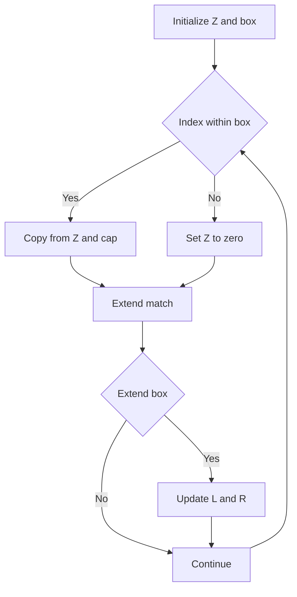

# STC-003: Z-Function Construction

## 📋 Problem Summary

Given a string `s`, you need to compute its **Z-array**. For each index `i`, `Z[i]` is the length of the longest common prefix between the string `s` and its suffix starting at `i` (i.e., `s[i...]`). By definition, `Z[0]` is equal to the length of the string.

## 🌍 Real-World Scenario

**Scenario Title:** Data Compression (Lempel-Ziv)

Many compression algorithms (like LZ77 used in ZIP files) work by replacing repeated occurrences of data with references to a single copy of that data existing earlier in the uncompressed data stream. The Z-algorithm helps in identifying these repetitions efficiently. Specifically, finding the longest match between the current position and the beginning of the buffer is a core component of finding the "best match" for compression.

**Why This Problem Matters:**

- **Pattern Matching:** The Z-algorithm provides an alternative to KMP for linear-time pattern matching.
- **String Analysis:** It helps in finding periods, borders, and other structural properties of strings.
- **Efficiency:** It processes the string in linear time O(N), which is crucial for processing large texts or genomic data.


## Detailed Explanation

### ASCII Diagram: Concept Visualization

Let `s = "aabxaabx"`. We want to find `Z[4]`, which corresponds to the suffix starting at index 4: `"aabx"`.

```
Index: 0 1 2 3 4 5 6 7
Char:  a a b x a a b x

Compare s[0...] with s[4...]:
s[0] ('a') == s[4] ('a') -> Match
s[1] ('a') == s[5] ('a') -> Match
s[2] ('b') == s[6] ('b') -> Match
s[3] ('x') == s[7] ('x') -> Match
s[4] ('a') != (end of string)

Length of match = 4.
So, Z[4] = 4.
```

## ✅ Input/Output Clarifications (Read This Before Coding)

- **Z[0]:** The problem statement fixes `Z[0] = |s|`. Some definitions set `Z[0] = 0`, but here we strictly follow the problem requirement.
- **Overlap:** The substring starting at `i` can overlap with the prefix it matches. For `aaaaa`, `Z[1] = 4`.
- **Constraints:** `|s| <= 200,000`. An O(N^2) solution will fail.

## Naive Approach

### Intuition

For every position `i` from `1` to `n-1`, simply compare `s[i+k]` with `s[k]` for `k=0, 1, 2...` until a mismatch is found.

### Algorithm

1. Initialize `Z` array of size `n`. Set `Z[0] = n`.
2. Iterate `i` from `1` to `n-1`.
3. Initialize `length = 0`.
4. While `i + length < n` and `s[length] == s[i + length]`, increment `length`.
5. Set `Z[i] = length`.

### Time Complexity

- **O(N^2)**: In the worst case (e.g., `s = "aaaaa"`), the inner loop runs `O(N)` times for each `i`. Total operations ~ `N^2 / 2`.
- With `N=200,000`, this is `2 * 10^10` operations, leading to Time Limit Exceeded.

### Space Complexity

- **O(N)**: To store the result.

## Optimal Approach (Z-Algorithm)

### Key Insight

We can maintain a **Z-box** `[L, R]`, which represents the segment `s[L...R]` that matches the prefix `s[0...R-L]`. This segment is the rightmost matching segment found so far.
When computing `Z[i]`:
- If `i > R`: We have no previous information. Compute `Z[i]` naively and update the Z-box `[L, R]` if `Z[i] > 0`.
- If `i <= R`: We are inside a previous match. The character `s[i]` corresponds to `s[i-L]` in the prefix. Let `k = i - L`.
    - If `Z[k] < R - i + 1`: The match at `k` is fully contained within the current Z-box. We can safely say `Z[i] = Z[k]`.
    - If `Z[k] >= R - i + 1`: The match at `k` extends to or beyond the boundary `R`. We know `Z[i]` is at least `R - i + 1`. We need to check characters starting from `R + 1` to see if the match extends further. Then update `[L, R]`.

### Algorithm

1. Initialize `Z` array. `Z[0] = n`.
2. Initialize `L = 0, R = 0`.
3. Iterate `i` from `1` to `n-1`:
    - If `i <= R`, initialize `Z[i] = min(R - i + 1, Z[i - L])`.
    - Else, `Z[i] = 0`.
    - While `i + Z[i] < n` and `s[Z[i]] == s[i + Z[i]]`, increment `Z[i]`.
    - If `i + Z[i] - 1 > R`, update `L = i`, `R = i + Z[i] - 1`.
4. Return `Z`.

<!-- mermaid -->


### Time Complexity

- **O(N)**: The variable `R` only increases. It starts at 0 and goes up to `N-1`. Each character comparison that results in a match increments `R` (or is part of the initial check inside the box which is constant time). A mismatch happens at most once per `i`. Thus, linear time.

### Space Complexity

- **O(N)**: To store the `Z` array.


## Implementations

### Java
```java
import java.util.*;

class Solution {
    public int[] zFunction(String s) {
        int n = s.length();
        int[] z = new int[n];
        if (n == 0) return z;
        z[0] = n;
        
        int l = 0, r = 0;
        for (int i = 1; i < n; i++) {
            if (i <= r) {
                z[i] = Math.min(r - i + 1, z[i - l]);
            }
            while (i + z[i] < n && s.charAt(z[i]) == s.charAt(i + z[i])) {
                z[i]++;
            }
            if (i + z[i] - 1 > r) {
                l = i;
                r = i + z[i] - 1;
            }
        }
        return z;
    }
}

class Main {
    public static void main(String[] args) {
        Scanner sc = new Scanner(System.in);
        if (sc.hasNext()) {
            String s = sc.next();
            Solution solution = new Solution();
            int[] z = solution.zFunction(s);
            
            StringBuilder sb = new StringBuilder();
            for (int i = 0; i < z.length; i++) {
                if (i > 0) sb.append(' ');
                sb.append(z[i]);
            }
            System.out.println(sb.toString());
        }
        sc.close();
    }
}
```

### Python
```python
def z_function(s: str) -> list[int]:
    n = len(s)
    if n == 0:
        return []
    z = [0] * n
    z[0] = n
    l, r = 0, 0
    
    for i in range(1, n):
        if i <= r:
            z[i] = min(r - i + 1, z[i - l])
        
        while i + z[i] < n and s[z[i]] == s[i + z[i]]:
            z[i] += 1
            
        if i + z[i] - 1 > r:
            l = i
            r = i + z[i] - 1
            
    return z

def main():
    import sys
    sys.setrecursionlimit(200000)
    input_data = sys.stdin.read().split()
    if not input_data:
        return
    s = input_data[0]
    z = z_function(s)
    print(*(z))

if __name__ == "__main__":
    main()
```

### C++
```cpp
#include <iostream>
#include <vector>
#include <string>
#include <algorithm>

using namespace std;

class Solution {
public:
    vector<int> zFunction(const string& s) {
        int n = s.length();
        if (n == 0) return {};
        vector<int> z(n);
        z[0] = n;
        
        int l = 0, r = 0;
        for (int i = 1; i < n; i++) {
            if (i <= r) {
                z[i] = min(r - i + 1, z[i - l]);
            }
            while (i + z[i] < n && s[z[i]] == s[i + z[i]]) {
                z[i]++;
            }
            if (i + z[i] - 1 > r) {
                l = i;
                r = i + z[i] - 1;
            }
        }
        return z;
    }
};

int main() {
    ios::sync_with_stdio(false);
    cin.tie(nullptr);

    string s;
    if (cin >> s) {
        Solution solution;
        vector<int> z = solution.zFunction(s);
        for (int i = 0; i < (int)z.size(); i++) {
            if (i > 0) cout << " ";
            cout << z[i];
        }
        cout << "\n";
    }
    return 0;
}
```

### JavaScript
```javascript
const readline = require("readline");

class Solution {
  zFunction(s) {
    const n = s.length;
    if (n === 0) return [];
    const z = new Array(n).fill(0);
    z[0] = n;
    
    let l = 0, r = 0;
    for (let i = 1; i < n; i++) {
      if (i <= r) {
        z[i] = Math.min(r - i + 1, z[i - l]);
      }
      while (i + z[i] < n && s[z[i]] === s[i + z[i]]) {
        z[i]++;
      }
      if (i + z[i] - 1 > r) {
        l = i;
        r = i + z[i] - 1;
      }
    }
    return z;
  }
}

const rl = readline.createInterface({
  input: process.stdin,
  output: process.stdout,
});

let data = [];
rl.on("line", (line) => {
  const parts = line.trim().split(/\s+/);
  for (const part of parts) {
    if (part) data.push(part);
  }
});

rl.on("close", () => {
  if (data.length === 0) return;
  const s = data[0];
  const solution = new Solution();
  const z = solution.zFunction(s);
  console.log(z.join(" "));
});
```

## 🧪 Test Case Walkthrough (Dry Run)

`s = "aabxaabx"`

1.  `i=0`: `Z[0]=8`. `L=0, R=0`.
2.  `i=1`: `i > R`. Naive check. `s[1]` vs `s[0]` ('a' vs 'a') -> Match. `s[2]` vs `s[1]` ('b' vs 'a') -> Mismatch. `Z[1]=1`. Update `L=1, R=1`.
3.  `i=2`: `i > R`. Naive check. `s[2]` vs `s[0]` ('b' vs 'a') -> Mismatch. `Z[2]=0`. No update.
4.  `i=3`: `i > R`. Mismatch. `Z[3]=0`.
5.  `i=4`: `i > R`. Match `s[4..7]` with `s[0..3]`. `Z[4]=4`. Update `L=4, R=7`.
6.  `i=5`: `i <= R`. `k = i - L = 1`. `Z[1]=1`. `R - i + 1 = 7 - 5 + 1 = 3`. `Z[1] < 3`, so `Z[5] = Z[1] = 1`. No naive check needed.
7.  `i=6`: `i <= R`. `k = 2`. `Z[2]=0`. `Z[6]=0`.
8.  `i=7`: `i <= R`. `k = 3`. `Z[3]=0`. `Z[7]=0`.

Final Z: `8 1 0 0 4 1 0 0`.


## ✅ Proof of Correctness

### Invariant

`[L, R]` is the interval with the largest `R` such that `1 <= L <= i-1` and `s[L...R]` matches `s[0...R-L]`.

### Why the approach is correct

- **Case 1 (`i > R`)**: We haven't explored this far yet. We must compute `Z[i]` naively.
- **Case 2 (`i <= R`)**: We are inside a known matching segment. `s[i...R]` matches `s[i-L...R-L]`.
    - If `Z[i-L] < R - i + 1`, the match at `i-L` ends *before* the boundary `R-L`. Since the segments are identical, the match at `i` must also end before `R`. Thus `Z[i] = Z[i-L]`.
    - If `Z[i-L] >= R - i + 1`, the match at `i-L` extends *at least* to the boundary. The match at `i` is guaranteed to extend at least to `R`. We start naive comparison from `R+1`.

This logic ensures we never re-scan characters inside the Z-box that are known to match, guaranteeing linearity.

## 💡 Interview Extensions (High-Value Add-ons)

- **Extension 1: Pattern Matching**
  - Find `p` in `t` using Z-algo.
  - *Answer:* Construct `S = p + '#' + t`. Compute Z-array. If `Z[i] == |p|`, match found.

- **Extension 2: String Periodicity**
  - Find the smallest period of `s`.
  - *Answer:* Iterate `i` from `1` to `n`. If `i + Z[i] == n` and `n % i == 0`, then `i` is the period length.

- **Extension 3: Number of distinct substrings**
  - Can Z-algo help?
  - *Answer:* Not directly (Suffix Array/Automaton is better), but Z-algo is used in some constructions.

### Common Mistakes to Avoid

1. **Incorrect Initialization of `Z[0]`**
   - ❌ `Z[0] = 0`.
   - ✅ Problem usually specifies `Z[0] = n`.

2. **Off-by-one in `R` update**
   - ❌ `R = i + Z[i]`.
   - ✅ `R = i + Z[i] - 1` (since `Z[i]` is length, index is `start + len - 1`).

3. **Not checking `i + Z[i] < n`**
   - ❌ Accessing `s[i + Z[i]]` out of bounds.
   - ✅ Always check bounds in `while` loop.

## Related Concepts

- **KMP Algorithm**: Computes prefix function (longest proper prefix which is also a suffix).
- **Manacher's Algorithm**: Similar "box" concept but for palindromes.
- **Suffix Array**: More powerful structure for substring queries.
