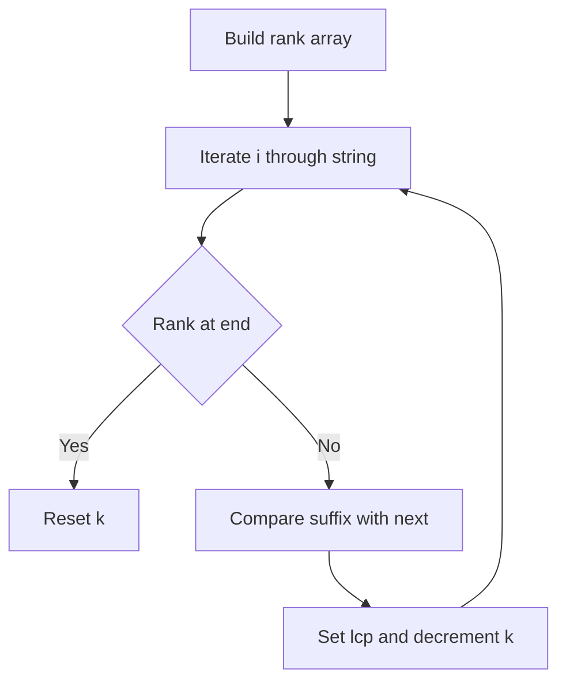

# STC-006: LCP Array (Kasai)

## 📋 Problem Summary

Given a string `s` and its Suffix Array `sa`, you need to compute the **Longest Common Prefix (LCP) Array**. The LCP array is an auxiliary data structure where `lcp[i]` stores the length of the longest common prefix between the suffix at `sa[i]` and the suffix at `sa[i+1]`.

## 🌍 Real-World Scenario

**Scenario Title:** Genome Assembly

In bioinformatics, sequencing machines produce millions of short DNA reads. To reconstruct the original genome, we need to find overlaps between these reads. The Suffix Array combined with the LCP Array allows us to find the longest common substrings between any two parts of the genome efficiently. This is crucial for detecting repetitive elements and assembling the full sequence.

**Why This Problem Matters:**

- **Efficiency:** The LCP array, together with the Suffix Array, replaces the Suffix Tree in most applications because it is more space-efficient and easier to implement.
- **Pattern Mining:** It helps in finding the longest repeated substring, the number of distinct substrings, and other statistical properties of the text.


## Detailed Explanation

### ASCII Diagram: Concept Visualization

Let `s = "cababa"`.
Suffix Array `sa`: `[5, 3, 1, 4, 2, 0]`

Sorted Suffixes:
Index 0: `sa[0]=5` -> "a"
Index 1: `sa[1]=3` -> "aba"
Index 2: `sa[2]=1` -> "ababa"
Index 3: `sa[3]=4` -> "ba"
Index 4: `sa[4]=2` -> "baba"
Index 5: `sa[5]=0` -> "cababa"

LCP Array Calculation:
`lcp[0]`: LCP("a", "aba") = "a" (len 1)
`lcp[1]`: LCP("aba", "ababa") = "aba" (len 3)
`lcp[2]`: LCP("ababa", "ba") = "" (len 0)
`lcp[3]`: LCP("ba", "baba") = "ba" (len 2)
`lcp[4]`: LCP("baba", "cababa") = "" (len 0)

Result: `1 3 0 2 0`

## ✅ Input/Output Clarifications (Read This Before Coding)

- **Input:** You are given `s` and `sa`. You don't need to compute `sa`.
- **Output:** `n-1` integers. `lcp[i]` corresponds to comparison between `sa[i]` and `sa[i+1]`.
- **Constraints:** `N <= 100,000`. O(N^2) is too slow.

## Naive Approach

### Intuition

Iterate through the suffix array from `i = 0` to `n-2`. For each pair `sa[i]` and `sa[i+1]`, compute the LCP by character comparison.

### Algorithm

1. Loop `i` from `0` to `n-2`.
2. Compare `s[sa[i]...]` and `s[sa[i+1]...]` character by character.
3. Store the length.

### Time Complexity

- **O(N^2)**: In the worst case (e.g., `s = "aaaaa"`), comparing adjacent suffixes takes O(N). Doing this N times takes O(N^2).
- Too slow.

### Space Complexity

- **O(1)** (excluding output storage).

## Optimal Approach (Kasai's Algorithm)

### Key Insight

We can compute the LCP values in O(N) time by iterating through the suffixes in their **original string order** (not sorted order).
Let `rank[i]` be the position of suffix `i` in the suffix array.
Let `k` be the LCP length for suffix `i` and its predecessor in the sorted order.
When we move to suffix `i+1`, its LCP length with its predecessor will be at least `k-1`.
Why? If suffix `i` has a common prefix of length `k` with suffix `j`, then suffix `i+1` has a common prefix of length `k-1` with suffix `j+1`. Suffix `j+1` is likely close to suffix `i+1` in the sorted order.

### Algorithm

1. Compute `rank` array: `rank[sa[i]] = i`.
2. Initialize `k = 0`.
3. Iterate `i` from `0` to `n-1` (original string indices):
    - Let `j = sa[rank[i] + 1]`. This is the suffix immediately *after* suffix `i` in the sorted order. (Note: Standard Kasai compares with the *predecessor*, but LCP array is usually defined between `i` and `i+1`. Let's stick to comparing `sa[rank[i]]` and `sa[rank[i]+1]`).
    - While characters match, increment `k`.
    - Store `lcp[rank[i]] = k`.
    - Decrement `k` (but not below 0): `k = max(0, k - 1)`.

<!-- mermaid -->


### Time Complexity

- **O(N)**: The variable `k` is incremented at most `N` times (since max LCP is N) and decremented at most `N` times. Total operations are linear.

### Space Complexity

- **O(N)**: To store `rank` and `lcp` arrays.


## Implementations

### Java
```java
import java.util.*;

class Solution {
    public int[] lcpArray(String s, int[] sa) {
        int n = s.length();
        int[] rank = new int[n];
        for (int i = 0; i < n; i++) {
            rank[sa[i]] = i;
        }
        
        int[] lcp = new int[n - 1];
        int k = 0;
        
        for (int i = 0; i < n; i++) {
            if (rank[i] == n - 1) {
                k = 0;
                continue;
            }
            
            int j = sa[rank[i] + 1];
            while (i + k < n && j + k < n && s.charAt(i + k) == s.charAt(j + k)) {
                k++;
            }
            
            lcp[rank[i]] = k;
            if (k > 0) k--;
        }
        
        return lcp;
    }
}

class Main {
    public static void main(String[] args) {
        Scanner sc = new Scanner(System.in);
        if (sc.hasNext()) {
            String s = sc.next();
            if (sc.hasNextInt()) {
                int n = sc.nextInt();
                int[] sa = new int[n];
                for (int i = 0; i < n; i++) sa[i] = sc.nextInt();
                
                Solution solution = new Solution();
                int[] lcp = solution.lcpArray(s, sa);
                
                StringBuilder sb = new StringBuilder();
                for (int i = 0; i < lcp.length; i++) {
                    if (i > 0) sb.append(' ');
                    sb.append(lcp[i]);
                }
                System.out.println(sb.toString());
            }
        }
        sc.close();
    }
}
```

### Python
```python
def lcp_array(s: str, sa: list[int]) -> list[int]:
    n = len(s)
    rank = [0] * n
    for i in range(n):
        rank[sa[i]] = i
        
    lcp = [0] * (n - 1)
    k = 0
    
    for i in range(n):
        if rank[i] == n - 1:
            k = 0
            continue
            
        j = sa[rank[i] + 1]
        while i + k < n and j + k < n and s[i + k] == s[j + k]:
            k += 1
            
        lcp[rank[i]] = k
        if k > 0:
            k -= 1
            
    return lcp

def main():
    import sys
    sys.setrecursionlimit(200000)
    input_data = sys.stdin.read().split()
    if not input_data:
        return
    
    it = iter(input_data)
    try:
        s = next(it)
        n = int(next(it))
        sa = [int(next(it)) for _ in range(n)]
        
        lcp = lcp_array(s, sa)
        print(0, *(lcp))
    except StopIteration:
        pass

if __name__ == "__main__":
    main()
```

### C++
```cpp
#include <iostream>
#include <vector>
#include <string>
#include <algorithm>

using namespace std;

class Solution {
public:
    vector<int> lcpArray(const string& s, const vector<int>& sa) {
        int n = s.length();
        vector<int> rank(n);
        for (int i = 0; i < n; i++) {
            rank[sa[i]] = i;
        }
        
        vector<int> lcp(n - 1);
        int k = 0;
        
        for (int i = 0; i < n; i++) {
            if (rank[i] == n - 1) {
                k = 0;
                continue;
            }
            
            int j = sa[rank[i] + 1];
            while (i + k < n && j + k < n && s[i + k] == s[j + k]) {
                k++;
            }
            
            lcp[rank[i]] = k;
            if (k > 0) k--;
        }
        return lcp;
    }
};

int main() {
    ios::sync_with_stdio(false);
    cin.tie(nullptr);

    string s;
    if (cin >> s) {
        int n;
        if (cin >> n) {
            vector<int> sa(n);
            for (int i = 0; i < n; i++) cin >> sa[i];

            Solution solution;
            vector<int> lcp = solution.lcpArray(s, sa);
            for (int i = 0; i < (int)lcp.size(); i++) {
                if (i > 0) cout << " ";
                cout << lcp[i];
            }
            cout << "\n";
        }
    }
    return 0;
}
```

### JavaScript
```javascript
const readline = require("readline");

class Solution {
  lcpArray(s, sa) {
    const n = s.length;
    const rank = new Array(n).fill(0);
    for (let i = 0; i < n; i++) {
      rank[sa[i]] = i;
    }
    
    const lcp = new Array(n - 1).fill(0);
    let k = 0;
    
    for (let i = 0; i < n; i++) {
      if (rank[i] === n - 1) {
        k = 0;
        continue;
      }
      
      const j = sa[rank[i] + 1];
      while (i + k < n && j + k < n && s[i + k] === s[j + k]) {
        k++;
      }
      
      lcp[rank[i]] = k;
      if (k > 0) k--;
    }
    return lcp;
  }
}

const rl = readline.createInterface({
  input: process.stdin,
  output: process.stdout,
});

let data = [];
rl.on("line", (line) => {
  const parts = line.trim().split(/\s+/);
  for (const part of parts) {
    if (part) data.push(part);
  }
});

rl.on("close", () => {
  if (data.length < 2) return;
  let idx = 0;
  const s = data[idx++];
  const n = parseInt(data[idx++], 10);
  if (isNaN(n) || idx + n > data.length) return;
  const sa = [];
  for (let i = 0; i < n; i++) sa.push(parseInt(data[idx++], 10));

  const solution = new Solution();
  const lcp = solution.lcpArray(s, sa);
  console.log(lcp.join(" "));
});
```

## 🧪 Test Case Walkthrough (Dry Run)

`s = "cababa"`, `sa = [5, 3, 1, 4, 2, 0]`

1.  **Rank Array**:
    `rank[5]=0`, `rank[3]=1`, `rank[1]=2`, `rank[4]=3`, `rank[2]=4`, `rank[0]=5`.
    `rank = [5, 2, 4, 1, 3, 0]`

2.  **Iteration (in order of `i` from 0 to 5)**:
    - `i=0` ("cababa"): `rank[0]=5`. Last in SA. `k=0`.
    - `i=1` ("ababa"): `rank[1]=2`. Next in SA is `sa[3]=4` ("ba").
      - Compare "ababa" and "ba". No match. `k=0`. `lcp[2]=0`.
    - `i=2` ("baba"): `rank[2]=4`. Next in SA is `sa[5]=0` ("cababa").
      - Compare "baba" and "cababa". No match. `k=0`. `lcp[4]=0`.
    - `i=3` ("aba"): `rank[3]=1`. Next in SA is `sa[2]=1` ("ababa").
      - Compare "aba" and "ababa". Match "aba". `k=3`. `lcp[1]=3`.
      - Decrement `k` to 2.
    - `i=4` ("ba"): `rank[4]=3`. Next in SA is `sa[4]=2` ("baba").
      - `k=2`. Compare "ba"[2...] and "baba"[2...].
      - "ba" has len 2. "baba" has len 4.
      - Compare `s[4+2]` and `s[2+2]` -> `s[6]` (out) vs `s[4]`. Loop terminates.
      - `lcp[3]=2`. Decrement `k` to 1.
    - `i=5` ("a"): `rank[5]=0`. Next in SA is `sa[1]=3` ("aba").
      - `k=1`. Compare `s[5+1]` and `s[3+1]` -> `s[6]` vs `s[4]`. Terminate.
      - `lcp[0]=1`. Decrement `k` to 0.

Result LCP: `1 3 0 2 0`. Matches example.


## ✅ Proof of Correctness

### Invariant

Let `h[i]` be the LCP of suffix `i` and its predecessor in the suffix array. Then `h[i+1] >= h[i] - 1`.

### Why the approach is correct

If suffix `i` and suffix `j` (where `j` is immediately before `i` in SA) have a common prefix of length `k > 0`, then:
- Suffix `i` starts with `c` followed by suffix `i+1`.
- Suffix `j` starts with `c` followed by suffix `j+1`.
- Therefore, suffix `i+1` and suffix `j+1` share a common prefix of length `k-1`.
- Since `j` comes before `i` in SA, `j+1` comes before `i+1` in SA (mostly true, or there is another suffix between them that shares even more).
- Thus, the LCP of `i+1` with its immediate predecessor is at least `k-1`.

## 💡 Interview Extensions (High-Value Add-ons)

- **Extension 1: Longest Repeated Substring**
  - The maximum value in the LCP array corresponds to the longest substring that appears at least twice.

- **Extension 2: Number of Distinct Substrings**
  - Total substrings = `N*(N+1)/2`.
  - Duplicate substrings = Sum of LCP values.
  - Distinct = Total - Sum(LCP).

### Common Mistakes to Avoid

1. **Comparing with Predecessor vs Successor**
   - ❌ Mixing up which neighbor to compare with.
   - ✅ Be consistent. If `lcp[i]` is `LCP(sa[i], sa[i+1])`, then for suffix `i`, find its rank `r`, and compare with `sa[r+1]`.

2. **Index Out of Bounds**
   - ❌ `rank[i] + 1` when `rank[i]` is the last element.
   - ✅ Handle `rank[i] == n-1` separately.

3. **String Indices**
   - ❌ Using `sa` indices directly in string access.
   - ✅ `sa` contains indices. `s[sa[i]]` is the character.

## Related Concepts

- **Suffix Tree**: Can be built from SA + LCP in linear time.
- **Rabin-Karp**: Can be used for LCP with binary search (O(N log N)).
