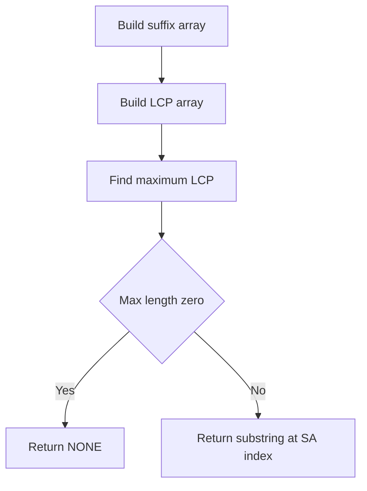

# STC-007: Longest Repeated Substring via SA/LCP

## 📋 Problem Summary

Given a string `s`, find the longest substring that appears at least twice in `s`. If there are multiple substrings with the same maximum length, return the one that is lexicographically smallest. If no repeated substring exists, output `NONE`.

## 🌍 Real-World Scenario

**Scenario Title:** Data Deduplication

In storage systems, "deduplication" is a technique to eliminate duplicate copies of repeating data. By identifying large chunks of data that appear multiple times (repeated substrings), the system can store just one copy and replace others with references. This significantly saves storage space. Finding the longest repeated substring is a simplified version of identifying the most redundant parts of a file.

**Why This Problem Matters:**

- **Compression:** Core concept in dictionary-based compression algorithms (like LZ77).
- **Music Analysis:** Identifying recurring themes or motifs in a musical score (represented as a string of notes).
- **Plagiarism:** Detecting copied sections within a single large document.


## Detailed Explanation

### ASCII Diagram: Concept Visualization

Let `s = "banana"`.
Suffixes sorted (SA):
0. `a` (5)
1. `ana` (3)
2. `anana` (1)
3. `banana` (0)
4. `na` (4)
5. `nana` (2)

LCP Array (adjacent common prefixes):
- `a` vs `ana`: "a" (len 1)
- `ana` vs `anana`: "ana" (len 3)
- `anana` vs `banana`: "" (len 0)
- `banana` vs `na`: "" (len 0)
- `na` vs `nana`: "na" (len 2)

LCP Values: `[1, 3, 0, 0, 2]`
Max LCP is 3.
Corresponding substring: "ana".

## ✅ Input/Output Clarifications (Read This Before Coding)

- **Overlapping:** Repeated substrings can overlap. In "aaaa", "aaa" appears twice (indices 0 and 1).
- **Lexicographically Smallest:** If "abc" and "xyz" both appear twice and are the longest, return "abc".
- **NONE:** If max LCP is 0, output `NONE`.

## Naive Approach

### Intuition

Generate all substrings, count their occurrences using a hash map, and track the max length.

### Algorithm

1. Iterate length `L` from `N-1` down to 1.
2. For each `L`, extract all substrings of length `L`.
3. Use a HashSet to check for duplicates.
4. If a duplicate is found, return it (since we started from max length).

### Time Complexity

- **O(N^2)**: With hashing.
- **O(N^3)**: Without hashing.
- Too slow for N=100,000.

## Optimal Approach (SA + LCP)

### Key Insight

Any repeated substring must be a prefix of two different suffixes.
If we sort all suffixes (Suffix Array), suffixes starting with the same prefix will be adjacent.
The longest common prefix between any two suffixes `i` and `j` is the minimum LCP value in the interval between their ranks in the Suffix Array.
Therefore, the longest common prefix between *any* pair of suffixes is the maximum value in the LCP array (which stores LCP of adjacent sorted suffixes).

### Algorithm

1. Construct the **Suffix Array (SA)** for `s`.
2. Construct the **LCP Array** using Kasai's algorithm.
3. Iterate through the LCP array to find the maximum value `max_len`.
4. Since we want the lexicographically smallest result among ties, and the SA is already sorted lexicographically, we should pick the *first* occurrence of `max_len` in the LCP array.
   - `lcp[i]` is the common prefix of `sa[i]` and `sa[i+1]`.
   - Since `sa[i]` comes before `sa[i+1]`, they both start with the same prefix.
   - We can extract the substring from `s` starting at `sa[i]` with length `max_len`.
5. If `max_len == 0`, return `NONE`.

<!-- mermaid -->


### Time Complexity

- **O(N log N)**: Dominated by Suffix Array construction. LCP construction is O(N).

### Space Complexity

- **O(N)**: To store SA and LCP arrays.


## Implementations

### Java
```java
import java.util.*;

class Solution {
    public String longestRepeated(String s) {
        int n = s.length();
        if (n == 0) return "NONE";
        
        // 1. Build Suffix Array
        Integer[] sa = new Integer[n];
        int[] rank = new int[n];
        int[] newRank = new int[n];
        
        for (int i = 0; i < n; i++) {
            sa[i] = i;
            rank[i] = s.charAt(i);
        }
        
        for (int k = 1; k < n; k *= 2) {
            int len = k;
            Arrays.sort(sa, (i, j) -> {
                if (rank[i] != rank[j]) return rank[i] - rank[j];
                int ri = (i + len < n) ? rank[i + len] : -1;
                int rj = (j + len < n) ? rank[j + len] : -1;
                return ri - rj;
            });
            
            newRank[sa[0]] = 0;
            for (int i = 1; i < n; i++) {
                int prev = sa[i - 1];
                int curr = sa[i];
                int r1 = rank[prev];
                int r2 = (prev + len < n) ? rank[prev + len] : -1;
                int r3 = rank[curr];
                int r4 = (curr + len < n) ? rank[curr + len] : -1;
                
                if (r1 == r3 && r2 == r4) newRank[curr] = newRank[prev];
                else newRank[curr] = newRank[prev] + 1;
            }
            System.arraycopy(newRank, 0, rank, 0, n);
            if (rank[sa[n - 1]] == n - 1) break;
        }
        
        // 2. Build LCP Array (Kasai)
        int[] lcp = new int[n - 1];
        int k = 0;
        for (int i = 0; i < n; i++) {
            if (rank[i] == n - 1) {
                k = 0;
                continue;
            }
            int j = sa[rank[i] + 1];
            while (i + k < n && j + k < n && s.charAt(i + k) == s.charAt(j + k)) {
                k++;
            }
            lcp[rank[i]] = k;
            if (k > 0) k--;
        }
        
        // 3. Find Max LCP
        int maxLen = 0;
        int startIdx = -1;
        
        for (int i = 0; i < n - 1; i++) {
            if (lcp[i] > maxLen) {
                maxLen = lcp[i];
                startIdx = sa[i];
            }
        }
        
        if (maxLen == 0) return "NONE";
        return s.substring(startIdx, startIdx + maxLen);
    }
}

class Main {
    public static void main(String[] args) {
        Scanner sc = new Scanner(System.in);
        if (sc.hasNext()) {
            String s = sc.next();
            Solution solution = new Solution();
            System.out.println(solution.longestRepeated(s));
        }
        sc.close();
    }
}
```

### Python
```python
def longest_repeated(s: str) -> str:
    n = len(s)
    if n == 0:
        return "NONE"
        
    # 1. Build Suffix Array
    sa = list(range(n))
    rank = [ord(c) for c in s]
    new_rank = [0] * n
    
    k = 1
    while k < n:
        key_func = lambda i: (rank[i], rank[i + k] if i + k < n else -1)
        sa.sort(key=key_func)
        
        new_rank[sa[0]] = 0
        for i in range(1, n):
            prev = sa[i-1]
            curr = sa[i]
            if key_func(prev) == key_func(curr):
                new_rank[curr] = new_rank[prev]
            else:
                new_rank[curr] = new_rank[prev] + 1
        
        rank = list(new_rank)
        if rank[sa[n-1]] == n - 1:
            break
        k *= 2
        
    # 2. Build LCP Array
    lcp = [0] * (n - 1)
    k = 0
    for i in range(n):
        if rank[i] == n - 1:
            k = 0
            continue
        j = sa[rank[i] + 1]
        while i + k < n and j + k < n and s[i + k] == s[j + k]:
            k += 1
        lcp[rank[i]] = k
        if k > 0:
            k -= 1
            
    # 3. Find Max LCP
    max_len = 0
    start_idx = -1
    
    for i in range(n - 1):
        if lcp[i] > max_len:
            max_len = lcp[i]
            start_idx = sa[i]
            
    if max_len == 0:
        return "NONE"
    return s[start_idx : start_idx + max_len]

def main():
    import sys
    sys.setrecursionlimit(200000)
    input_data = sys.stdin.read().split()
    if not input_data:
        return
    s = input_data[0]
    print(longest_repeated(s))

if __name__ == "__main__":
    main()
```

### C++
```cpp
#include <iostream>
#include <string>
#include <vector>
#include <algorithm>

using namespace std;

class Solution {
public:
    string longestRepeated(const string& s) {
        int n = s.length();
        if (n == 0) return "NONE";
        
        // 1. Build SA
        vector<int> sa(n), rank(n), newRank(n);
        for (int i = 0; i < n; i++) {
            sa[i] = i;
            rank[i] = s[i];
        }
        
        for (int k = 1; k < n; k *= 2) {
            auto cmp = [&](int i, int j) {
                if (rank[i] != rank[j]) return rank[i] < rank[j];
                int ri = (i + k < n) ? rank[i + k] : -1;
                int rj = (j + k < n) ? rank[j + k] : -1;
                return ri < rj;
            };
            sort(sa.begin(), sa.end(), cmp);
            
            newRank[sa[0]] = 0;
            for (int i = 1; i < n; i++) {
                if (cmp(sa[i - 1], sa[i])) newRank[sa[i]] = newRank[sa[i - 1]] + 1;
                else newRank[sa[i]] = newRank[sa[i - 1]];
            }
            rank = newRank;
            if (rank[sa[n - 1]] == n - 1) break;
        }
        
        // 2. Build LCP
        vector<int> lcp(n - 1);
        int k = 0;
        for (int i = 0; i < n; i++) {
            if (rank[i] == n - 1) {
                k = 0;
                continue;
            }
            int j = sa[rank[i] + 1];
            while (i + k < n && j + k < n && s[i + k] == s[j + k]) {
                k++;
            }
            lcp[rank[i]] = k;
            if (k > 0) k--;
        }
        
        // 3. Find Max
        int maxLen = 0;
        int startIdx = -1;
        for (int i = 0; i < n - 1; i++) {
            if (lcp[i] > maxLen) {
                maxLen = lcp[i];
                startIdx = sa[i];
            }
        }
        
        if (maxLen == 0) return "NONE";
        return s.substr(startIdx, maxLen);
    }
};

int main() {
    ios::sync_with_stdio(false);
    cin.tie(nullptr);

    string s;
    if (cin >> s) {
        Solution solution;
        cout << solution.longestRepeated(s) << "\n";
    }
    return 0;
}
```

### JavaScript
```javascript
const readline = require("readline");

class Solution {
  longestRepeated(s) {
    const n = s.length;
    if (n === 0) return "NONE";
    
    // 1. Build SA
    let sa = new Array(n).fill(0).map((_, i) => i);
    let rank = new Array(n).fill(0).map((_, i) => s.charCodeAt(i));
    let newRank = new Array(n).fill(0);
    
    for (let k = 1; k < n; k *= 2) {
      sa.sort((i, j) => {
        if (rank[i] !== rank[j]) return rank[i] - rank[j];
        const ri = (i + k < n) ? rank[i + k] : -1;
        const rj = (j + k < n) ? rank[j + k] : -1;
        return ri - rj;
      });
      
      newRank[sa[0]] = 0;
      for (let i = 1; i < n; i++) {
        const prev = sa[i - 1];
        const curr = sa[i];
        const r1 = rank[prev];
        const r2 = (prev + k < n) ? rank[prev + k] : -1;
        const r3 = rank[curr];
        const r4 = (curr + k < n) ? rank[curr + k] : -1;
        
        if (r1 === r3 && r2 === r4) newRank[curr] = newRank[prev];
        else newRank[curr] = newRank[prev] + 1;
      }
      for (let i = 0; i < n; i++) rank[i] = newRank[i];
      if (rank[sa[n - 1]] === n - 1) break;
    }
    
    // 2. Build LCP
    const lcp = new Array(n - 1).fill(0);
    let kVal = 0;
    for (let i = 0; i < n; i++) {
      if (rank[i] === n - 1) {
        kVal = 0;
        continue;
      }
      const j = sa[rank[i] + 1];
      while (i + kVal < n && j + kVal < n && s[i + kVal] === s[j + kVal]) {
        kVal++;
      }
      lcp[rank[i]] = kVal;
      if (kVal > 0) kVal--;
    }
    
    // 3. Find Max
    let maxLen = 0;
    let startIdx = -1;
    for (let i = 0; i < n - 1; i++) {
      if (lcp[i] > maxLen) {
        maxLen = lcp[i];
        startIdx = sa[i];
      }
    }
    
    if (maxLen === 0) return "NONE";
    return s.substring(startIdx, startIdx + maxLen);
  }
}

const rl = readline.createInterface({
  input: process.stdin,
  output: process.stdout,
});

let data = [];
rl.on("line", (line) => {
  const parts = line.trim().split(/\s+/);
  for (const part of parts) {
    if (part) data.push(part);
  }
});

rl.on("close", () => {
  if (data.length === 0) return;
  const s = data[0];
  const solution = new Solution();
  console.log(solution.longestRepeated(s));
});
```

## 🧪 Test Case Walkthrough (Dry Run)

`s = "cababa"`
SA: `[5, 3, 1, 4, 2, 0]` ("a", "aba", "ababa", "ba", "baba", "cababa")
LCP: `[1, 3, 0, 2, 0]`

Scan LCP:
- `i=0`: `lcp[0]=1`. `maxLen=1`, `startIdx=sa[0]=5` ("a").
- `i=1`: `lcp[1]=3`. `maxLen=3`, `startIdx=sa[1]=3` ("aba").
- `i=2`: `lcp[2]=0`.
- `i=3`: `lcp[3]=2`. `2 < 3`, no update.
- `i=4`: `lcp[4]=0`.

Result: `s.substring(3, 3+3)` = "aba".


## ✅ Proof of Correctness

### Invariant

The longest common prefix of any set of suffixes is the minimum LCP value in the range covering those suffixes in the Suffix Array.
The longest repeated substring corresponds to the longest common prefix of *some* pair of suffixes.
The LCP of any pair `(i, j)` is `min(lcp[rank[i]...rank[j]-1])`.
This minimum is maximized when `rank[i]` and `rank[j]` are adjacent (i.e., `rank[j] = rank[i] + 1`).
Thus, the maximum value in the adjacent LCP array is the length of the longest repeated substring.

## 💡 Interview Extensions (High-Value Add-ons)

- **Extension 1: Longest Substring Repeated K Times**
  - Use a sliding window of size `K-1` over the LCP array. Find `max(min(window))`.

- **Extension 2: Longest Common Substring of Two Strings**
  - Concatenate `s1 + '#' + s2`. Build SA/LCP. Find max LCP where one suffix is from `s1` and other from `s2`.

### Common Mistakes to Avoid

1. **Not handling ties correctly**
   - ❌ Updating `maxLen` even if `lcp[i] == maxLen`.
   - ✅ Only update if `lcp[i] > maxLen`. Since we scan left-to-right (lexicographically increasing), the first one we see is the smallest.

2. **Edge case: No repetition**
   - ❌ Returning empty string or crashing.
   - ✅ Check `maxLen == 0` and return "NONE".

## Related Concepts

- **Suffix Tree**: Can solve this in linear time (O(N)).
- **Rabin-Karp + Binary Search**: O(N log N) alternative.
