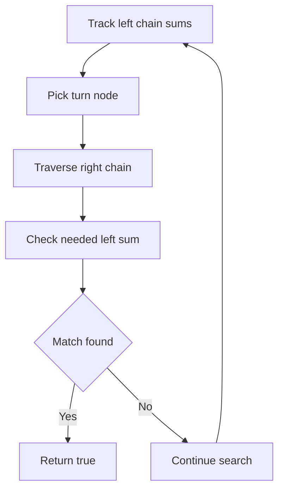

# TRE-006: Lab Path Sum with Exactly One Turn

## 📋 Problem Summary

Given a binary tree and a target sum `T`, determine if there exists a **downward path** that moves **only left** for some steps and then **only right** for some steps (exactly one direction change). The path must contain at least one left edge and at least one right edge. The sum of node values on this path must equal `T`.

## 🌍 Real-World Scenario

**Scenario Title:** Pipeline Routing

Imagine designing a pipeline system where gravity feeds fluid downwards. Due to structural constraints, a specific pipe segment must first angle **Left** to avoid a pillar, and then angle **Right** to reach a tank. The total pressure drop (sum of values) along this specific "Left-then-Right" configuration must match a target safety rating `T`. You need to verify if such a configuration exists in the blueprint.


## Detailed Explanation

### ASCII Diagram: Concept Visualization

**Tree:**
```
      5
     / \
    3   8
   / \
  2   1
```
**Target T = 9**

**Path:** `5 -> 3 -> 1`
-   `5 -> 3`: Left edge.
-   `3 -> 1`: Right edge.
-   Direction change: Left to Right (One Turn).
-   Sum: `5 + 3 + 1 = 9`.
-   **Result:** True.

### Algorithm Steps

The path consists of two segments connected at a "Turn Node" `u`:
1.  **Incoming Left Chain:** A path ending at `u` consisting only of Left edges (coming from an ancestor).
2.  **Outgoing Right Chain:** A path starting at `u` consisting only of Right edges (going to a descendant).

We iterate through the tree. For every node `u`, we treat it as a potential "Turn Node".
-   We need `Sum(Incoming Left) + Sum(Outgoing Right) - val(u) = T`.
-   This can be rewritten as: `Sum(Incoming Left) = T - Sum(Outgoing Right) + val(u)`.

We can use **DFS** with a **Prefix Sum Map** to solve this efficiently.
-   As we traverse **Left**, we maintain a set of available prefix sums for the current Left-chain.
-   When we are at a node `u` (reached via Left), we trigger a check down its **Right** child.
-   For each node `v` in the Right-chain, we calculate the required Left-chain sum and check if it exists in our map.

<!-- mermaid -->


## ✅ Input/Output Clarifications (Read This Before Coding)

-   **One Turn:** Must have at least one `L` edge and one `R` edge. `L...L` or `R...R` is invalid.
-   **Downward:** Path always goes from parent to child.
-   **Values:** Can be negative. Use `long` for sums.
-   **Start/End:** Can start at any node and end at any node.

## Naive Approach

### Intuition

For every node `u` in the tree, treat it as the "Turn Node".
1.  Traverse upwards (or check ancestors) to find all valid Left-chains ending at `u`.
2.  Traverse downwards (Right children) to find all valid Right-chains starting at `u`.
3.  Check all combinations.

### Time Complexity

-   **O(N^2)**: In the worst case (skewed tree), traversing chains for every node takes quadratic time.

## Optimal Approach (DFS with Prefix Map)

### Key Insight

We can perform a single DFS traversal.
1.  **Main DFS (Left-Chain Tracking):**
    -   Traverse the tree. Maintain `current_left_sum` and a frequency map (or set) `left_prefixes` containing prefix sums of the current continuous Left-chain.
    -   When moving `node -> left`, add `current_left_sum` to map.
    -   When moving `node -> right`, we identify `node` as a potential **Turn**. We start a "Right Phase".

2.  **Right Phase (Validation):**
    -   From the Turn node, traverse only `right` children.
    -   Accumulate `current_right_sum`.
    -   Calculate `needed_left_suffix = T - (current_right_sum - val(Turn))`.
    -   We need a suffix of the Left-chain with sum `needed_left_suffix`.
    -   `Suffix = CurrentLeftPrefix - AncestorLeftPrefix`.
    -   So we check if `(CurrentLeftPrefix - needed_left_suffix)` exists in `left_prefixes`.

### Algorithm

1.  `DFS(node, current_left_sum, left_prefixes)`:
    -   Add `current_left_sum` to `left_prefixes`.
    -   **Try Turning:** Call `CheckRight(node.right, val(node), current_left_sum, left_prefixes)`.
    -   **Continue Left:** `DFS(node.left, current_left_sum + val(node), left_prefixes)`.
    -   **Reset/Backtrack:** Remove `current_left_sum` from map.

    *Refined Logic:*
    -   `DFS(node)`:
        -   If `node` is left child: extend Left-chain.
        -   If `node` is right child: start new Left-chain (map empty).
        -   At `node`, if we have ancestors in Left-chain, traverse `node.right` chain to check for solution.

### Time Complexity

-   **O(N)**: Each node is visited by Main DFS once. Each node is visited by "Right Phase" check at most once (because each node has a unique parent, so it belongs to a unique Right-chain started by a unique Turn ancestor).

### Space Complexity

-   **O(H)**: Recursion stack and map size.

## Implementations

### Java
```java
import java.util.*;

class Solution {
    boolean found = false;

    public boolean hasOneTurnPath(int n, long[] values, int[] left, int[] right, long target) {
        if (n == 0) return false;
        found = false;
        // Start DFS from root. Root starts a Left-chain.
        dfs(0, 0, new HashSet<>(), values, left, right, target, true);
        return found;
    }

    // isStart: true if 'u' is the start of a new Left-chain (root or right child)
    private void dfs(int u, long currentLeftSum, Set<Long> prefixes, 
                     long[] values, int[] left, int[] right, long target, boolean isStart) {
        if (u == -1 || found) return;

        long val = values[u];
        long nextSum = currentLeftSum + val;

        // If we are not the start, we have incoming Left edges. We can Turn Right.
        if (!isStart) {
            checkRightChain(right[u], val, nextSum, prefixes, values, left, right, target);
        }

        // Add current prefix to set for children
        prefixes.add(currentLeftSum);

        // 1. Continue Left
        dfs(left[u], nextSum, prefixes, values, left, right, target, false);

        // Backtrack for this chain
        prefixes.remove(currentLeftSum);

        // 2. Go Right (Starts a NEW Left-chain logic for the subtree)
        // We pass a NEW empty set because the Left-chain breaks here.
        dfs(right[u], 0, new HashSet<>(), values, left, right, target, true);
    }

    private void checkRightChain(int u, long turnVal, long turnLeftSum, Set<Long> prefixes,
                                 long[] values, int[] left, int[] right, long target) {
        long currentRightSum = 0;
        int curr = u;
        while (curr != -1 && !found) {
            currentRightSum += values[curr];
            // Total = SuffixLeft + RightChainSum
            // SuffixLeft = turnLeftSum - somePrefix
            // Total = (turnLeftSum - somePrefix) + currentRightSum = T
            // somePrefix = turnLeftSum + currentRightSum - T
            long neededPrefix = turnLeftSum + currentRightSum - target;
            if (prefixes.contains(neededPrefix)) {
                found = true;
                return;
            }
            curr = right[curr];
        }
    }
}

class Main {
    public static void main(String[] args) {
        Scanner sc = new Scanner(System.in);
        if (!sc.hasNextInt()) return;
        int n = sc.nextInt();
        long[] values = new long[n];
        int[] left = new int[n];
        int[] right = new int[n];
        for (int i = 0; i < n; i++) {
            values[i] = sc.nextLong();
            left[i] = sc.nextInt();
            right[i] = sc.nextInt();
        }
        long target = 0;
        if (sc.hasNextLong()) target = sc.nextLong();

        Solution solution = new Solution();
        System.out.println(solution.hasOneTurnPath(n, values, left, right, target) ? "true" : "false");
        sc.close();
    }
}
```

### Python
```python
import sys

# Increase recursion depth
sys.setrecursionlimit(200000)

def has_one_turn_path(n: int, values: list[int], left: list[int], right: list[int], target: int) -> bool:
    if n == 0:
        return False
        
    found = False
    
    def check_right_chain(u, turn_left_sum, prefixes):
        nonlocal found
        curr = u
        current_right_sum = 0
        while curr != -1 and not found:
            current_right_sum += values[curr]
            # needed_prefix = turn_left_sum + current_right_sum - target
            needed = turn_left_sum + current_right_sum - target
            if needed in prefixes:
                found = True
                return
            curr = right[curr]

    def dfs(u, current_left_sum, prefixes, is_start):
        nonlocal found
        if u == -1 or found:
            return
            
        val = values[u]
        next_sum = current_left_sum + val
        
        # If not start, we can turn
        if not is_start:
            check_right_chain(right[u], next_sum, prefixes)
            
        if found: return
        
        # Continue Left
        prefixes.add(current_left_sum)
        dfs(left[u], next_sum, prefixes, False)
        prefixes.remove(current_left_sum)
        
        if found: return
        
        # Go Right (Start new Left chain)
        dfs(right[u], 0, set(), True)

    dfs(0, 0, set(), True)
    return found

def main():
    data = sys.stdin.read().strip().split()
    if not data:
        return
    idx = 0
    n = int(data[idx]); idx += 1
    values = [0] * n
    left = [0] * n
    right = [0] * n
    for i in range(n):
        values[i] = int(data[idx]); idx += 1
        left[i] = int(data[idx]); idx += 1
        right[i] = int(data[idx]); idx += 1
    target = int(data[idx]) if idx < len(data) else 0
    
    print("true" if has_one_turn_path(n, values, left, right, target) else "false")

if __name__ == "__main__":
    main()
```

### C++
```cpp
#include <iostream>
#include <vector>
#include <unordered_set>

using namespace std;

class Solution {
    bool found = false;

    void checkRightChain(int u, long long turnLeftSum, const unordered_set<long long>& prefixes,
                         const vector<long long>& values, const vector<int>& right, long long target) {
        long long currentRightSum = 0;
        int curr = u;
        while (curr != -1 && !found) {
            currentRightSum += values[curr];
            long long needed = turnLeftSum + currentRightSum - target;
            if (prefixes.count(needed)) {
                found = true;
                return;
            }
            curr = right[curr];
        }
    }

    void dfs(int u, long long currentLeftSum, unordered_set<long long>& prefixes,
             const vector<long long>& values, const vector<int>& left, const vector<int>& right,
             long long target, bool isStart) {
        if (u == -1 || found) return;

        long long val = values[u];
        long long nextSum = currentLeftSum + val;

        if (!isStart) {
            checkRightChain(right[u], nextSum, prefixes, values, right, target);
        }
        if (found) return;

        prefixes.insert(currentLeftSum);
        dfs(left[u], nextSum, prefixes, values, left, right, target, false);
        prefixes.erase(currentLeftSum);

        if (found) return;

        // Start new chain for right child
        unordered_set<long long> newPrefixes;
        dfs(right[u], 0, newPrefixes, values, left, right, target, true);
    }

public:
    bool hasOneTurnPath(int n, const vector<long long>& values,
                        const vector<int>& left, const vector<int>& right, long long target) {
        if (n == 0) return false;
        found = false;
        unordered_set<long long> prefixes;
        dfs(0, 0, prefixes, values, left, right, target, true);
        return found;
    }
};

int main() {
    ios::sync_with_stdio(false);
    cin.tie(nullptr);

    int n;
    if (!(cin >> n)) return 0;
    vector<long long> values(n);
    vector<int> left(n), right(n);
    for (int i = 0; i < n; i++) {
        cin >> values[i] >> left[i] >> right[i];
    }
    long long target;
    cin >> target;

    Solution solution;
    cout << (solution.hasOneTurnPath(n, values, left, right, target) ? "true" : "false") << "\n";
    return 0;
}
```

### JavaScript
```javascript
const readline = require("readline");

class Solution {
  constructor() {
    this.found = false;
  }

  hasOneTurnPath(n, values, left, right, target) {
    if (n === 0) return false;
    this.found = false;
    this.dfs(0, 0n, new Set(), values, left, right, BigInt(target), true);
    return this.found;
  }

  dfs(u, currentLeftSum, prefixes, values, left, right, target, isStart) {
    if (u === -1 || this.found) return;

    const val = BigInt(values[u]);
    const nextSum = currentLeftSum + val;

    if (!isStart) {
      this.checkRightChain(right[u], nextSum, prefixes, values, right, target);
    }
    if (this.found) return;

    prefixes.add(currentLeftSum);
    this.dfs(left[u], nextSum, prefixes, values, left, right, target, false);
    prefixes.delete(currentLeftSum);

    if (this.found) return;

    this.dfs(right[u], 0n, new Set(), values, left, right, target, true);
  }

  checkRightChain(u, turnLeftSum, prefixes, values, right, target) {
    let currentRightSum = 0n;
    let curr = u;
    while (curr !== -1 && !this.found) {
      currentRightSum += BigInt(values[curr]);
      const needed = turnLeftSum + currentRightSum - target;
      if (prefixes.has(needed)) {
        this.found = true;
        return;
      }
      curr = right[curr];
    }
  }
}

const rl = readline.createInterface({
  input: process.stdin,
  output: process.stdout,
});

let data = [];
rl.on("line", (line) => data.push(...line.trim().split(/\s+/)));
rl.on("close", () => {
  if (data.length === 0) return;
  let idx = 0;
  const n = parseInt(data[idx++], 10);
  const values = new Array(n);
  const left = new Array(n);
  const right = new Array(n);
  for (let i = 0; i < n; i++) {
    values[i] = parseInt(data[idx++], 10);
    left[i] = parseInt(data[idx++], 10);
    right[i] = parseInt(data[idx++], 10);
  }
  const target = idx < data.length ? parseInt(data[idx], 10) : 0;

  const solution = new Solution();
  console.log(solution.hasOneTurnPath(n, values, left, right, target) ? "true" : "false");
});
```

## 🧪 Test Case Walkthrough (Dry Run)

**Input:**
```
5
5 1 2
3 3 4
8 -1 -1
2 -1 -1
1 -1 -1
9
```
**Tree:**
- 0(5) -> L:1(3), R:2(8)
- 1(3) -> L:3(2), R:4(1)

**Execution:**
1.  `dfs(0, 0, {}, isStart=true)`
    -   `nextSum = 5`. `isStart` true, no check.
    -   `prefixes = {0}`.
    -   `dfs(1, 5, {0}, false)` (Left child)
        -   `nextSum = 5+3=8`. `isStart` false.
        -   `checkRightChain(4, 8, {0})`. (Node 4 is right child of 1)
            -   `curr=4`. `val=1`. `rightSum=1`.
            -   `needed = 8 + 1 - 9 = 0`.
            -   `prefixes` contains 0? Yes.
            -   **Found!** Return true.

**Explanation:**
-   Prefix `0` corresponds to path start (before 5).
-   `turnLeftSum` is `5+3=8` (Path `5->3`).
-   `rightSum` is `1` (Path `1`).
-   `SuffixLeft` = `8 - 0 = 8` (`5->3`).
-   `Total` = `8 + 1 = 9`.
-   Path: `5 -> 3 -> 1`. Correct.

## ✅ Proof of Correctness

The algorithm exhaustively checks every possible "Turn Node".
-   A Turn Node `u` is defined as the node where the path switches from Left edges to Right edges.
-   The path must arrive at `u` via a Left edge (ensured by `!isStart` check).
-   The path must leave `u` via a Right edge (ensured by `checkRightChain` iterating `right[u]`).
-   The prefix sum map correctly identifies if a valid prefix of the Left-chain exists such that the remaining suffix sums to the required amount.
-   Since every valid path has exactly one turn, it must have a unique Turn Node, which we will visit.

## 💡 Interview Extensions (High-Value Add-ons)

-   **Extension 1: Multiple Turns**
    -   What if k turns are allowed? (DP on trees).
-   **Extension 2: Max Sum Path**
    -   Find the max sum path with exactly one turn.
-   **Extension 3: Count Paths**
    -   Count total number of such paths.

### Common Mistakes to Avoid

1.  **Empty Map:**
    -   ❌ Forgetting to handle `0` prefix sum if path starts exactly at the beginning of the Left-chain.
    -   ✅ `dfs` logic adds `currentLeftSum` (which starts at 0) to map, covering this.
2.  **Path Direction:**
    -   ❌ Checking `Right -> Left`.
    -   ✅ Problem specifies `Left -> Right`.
3.  **Data Types:**
    -   ❌ Using `int` for sums.
    -   ✅ Use `long` (Java/C++) or BigInt (JS) to avoid overflow.

## Related Concepts

-   **Prefix Sums**
-   **Tree DFS**
-   **Two Sum**
