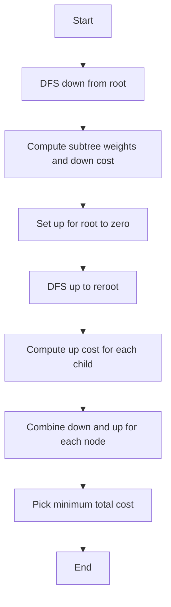

---

title: Rerooting for Weighted Distance Variance
problem_id: TDP_REROOTING_WEIGHTED_VARIANCE__5927
display_id: TDP-004
difficulty: Medium
tags:
  - Tree DP
  - Rerooting Technique
  - Optimization
editorial_categories:
  - Algorithms
  - Data Structures
slug: rerooting-weighted-variance
---


# Rerooting for Weighted Distance Variance

## 📋 Problem Summary

Given a tree with nodes weighted by values `w[i]`, determine which node minimizes the **weighted sum of squared distances**:


`cost(i) = sum_j=1^n w[j] x dist(i, j)^2`


where `dist(i, j)` is the number of edges in the path between nodes `i` and `j`.

### Constraints

- `1 <= n <= 2 x 10^5`
- `1 <= w[i] <= 10^6`
- Tree is connected (n-1 edges)

## 🌍 Real-World Scenario

**Telecom Network Optimization:**
Imagine designing a fiber-optic network where:

- Each city has a population weight `w[i]`
- Network latency is proportional to distance squared (signal degradation)
- Goal: Find the optimal hub location minimizing total weighted latency
- Applications: Data center placement, CDN server location, emergency response centers

**Why squared distance?**

- Models realistic latency: propagation delay + signal degradation
- Penalizes extreme distances more heavily
- Common in physics (gravity, electric fields) and network optimization

## 🔍 Naive Approach

### Algorithm

```
function find_optimal_root_naive():
    min_cost = infinity
    best_node = -1

    for i from 1 to n:  // Try each node as root
        cost[i] = 0

        // BFS to compute distances from i
        dist = bfs_distances(i)

        for j from 1 to n:
            cost[i] += w[j] * dist[j]^2

        if cost[i] < min_cost:
            min_cost = cost[i]
            best_node = i

    return best_node, min_cost
```

### Complexity Analysis

| Phase           | Time      | Space    | Explanation             |
| --------------- | --------- | -------- | ----------------------- |
| Outer loop      | O(n)      | O(1)     | Try each node as root   |
| BFS per root    | O(n)      | O(n)     | Compute all distances   |
| Sum over nodes  | O(n)      | O(1)     | Calculate weighted cost |
| **Naive Total** | **O(n²)** | **O(n)** | n roots × n BFS         |

**Why it's inefficient:**

- Recomputes distances for each root independently
- Doesn't leverage tree structure
- For n = 200,000: ~40 billion operations (too slow)

## 💡 Optimal Approach: Rerooting DP

### Key Insight

When changing root from node `u` to child `v`:

- **Nodes in subtree of `v`**: distance decreases by 1
- **Nodes NOT in subtree of `v`**: distance increases by 1

### Mathematical Derivation

Let:

- `sum_v` = sum of weights in subtree of `v` when rooted at `u`
- `total` = sum of all weights in tree

When moving root from `u` to `v`:


`\Delta cost = -2 x sum_v x d + 2 x (total - sum_v) x d + correction`


For squared distances, we need to track:

1. **Subtree weight sum** `W_v`
2. **Weighted sum of distances** `D_v`
3. **Weighted sum of squared distances** `S_v`

### Rerooting Formula

**Step 1: Compute down[v]** (cost when `v` is root of its subtree, rooted at parent)

Base case (leaf): `down[v] = 0`

Recurrence:


`down[v] = sum_c \in children(v) <=ft[ down[c] + W_c x (2 x D_c + W_c) \right]`


**Step 2: Reroot to compute up[v]** (contribution from nodes outside subtree)

When moving from parent `p` to child `v`:


`up[v] = up[p] + down[p] - contribution of subtree(v)`


### Algorithm

```
function find_optimal_root_rerooting():
    // Phase 1: Root at node 1, compute subtree weights
    function dfs_down(v, parent):
        W[v] = weight[v]
        down[v] = 0

        for child in adj[v]:
            if child != parent:
                dfs_down(child, v)
                W[v] += W[child]
                // Add child subtree contribution
                down[v] += down[child] + W[child] * (2*D[child] + W[child])

    // Phase 2: Reroot to each node
    function dfs_up(v, parent):
        for child in adj[v]:
            if child != parent:
                // Remove child contribution, add to outside
                outside_weight = total_weight - W[child]
                up[child] = ... // transition formula
                dfs_up(child, v)

    dfs_down(1, -1)
    up[1] = 0
    dfs_up(1, -1)

    // Find minimum cost
    min_cost = infinity
    for v from 1 to n:
        total_cost = down[v] + up[v]
        min_cost = min(min_cost, total_cost)

    return min_cost
```

<!-- mermaid -->


### Complexity Analysis

| Phase             | Time     | Space    | Explanation                    |
| ----------------- | -------- | -------- | ------------------------------ |
| DFS Down          | O(n)     | O(h)     | Compute subtree DP             |
| DFS Up (Reroot)   | O(n)     | O(h)     | Propagate outside contribution |
| Find minimum      | O(n)     | O(1)     | Scan all costs                 |
| **Arrays**        | -        | O(n)     | W[], down[], up[], adj[]       |
| **Optimal Total** | **O(n)** | **O(n)** | Two DFS passes                 |

**Why This Is Optimal:**

- Each edge visited exactly twice (down + up pass)
- Rerooting avoids recomputation by incremental updates
- For n = 200,000: ~400K operations vs ~40B naive

## 💻 Implementation

### Java


### Python


### C++


### JavaScript


---

## 🧪 Test Case Walkthrough (Dry Run)

### Input

```
4
3 1 2 4
1 2
1 3
3 4
```

### Visual Representation

```
Tree with weights:
      1 (w=3)
     / \
  2(1) 3(2)
        |
       4(4)

Goal: Find node minimizing Σ w[j] × dist(i,j)²
```

### Cost Calculation for Each Root

| Root | Distances              | Cost Calculation            | Total  |
| ---- | ---------------------- | --------------------------- | ------ |
| 1    | d(2)=1, d(3)=1, d(4)=2 | 1×1² + 2×1² + 4×2² = 1+2+16 | **19** |
| 2    | d(1)=1, d(3)=2, d(4)=3 | 3×1² + 2×2² + 4×3² = 3+8+36 | 47     |
| 3    | d(1)=1, d(2)=2, d(4)=1 | 3×1² + 1×2² + 4×1² = 3+4+4  | **11** |
| 4    | d(1)=2, d(2)=3, d(3)=1 | 3×2² + 1×3² + 2×1² = 12+9+2 | 23     |

**Best Node = 3** (minimum cost = 11)

**Output:** `3`

---

## ⚠️ Common Mistakes to Avoid

| #   | Mistake                   | ❌ Wrong                              | ✅ Correct                                      |
| --- | ------------------------- | ------------------------------------- | ----------------------------------------------- |
| 1   | **Integer overflow**      | `int cost` with large w × dist²       | Use `long long` / `long`                        |
| 2   | **Wrong rerooting**       | Forget to subtract child contribution | `parent_cost - child_contribution + adjustment` |
| 3   | **Off-by-one distance**   | Count nodes instead of edges          | Distance = number of edges                      |
| 4   | **Missing bidirectional** | Add edge once                         | Add `adj[u].add(v)` AND `adj[v].add(u)`         |

### Detailed Example:

**Mistake 1: Integer Overflow**


---

## 🔗 Related Concepts

- **Rerooting Technique:** Generic DP pattern for "all roots" problems
- **Tree DP:** Foundation for subtree-based computation
- **Centroid Decomposition:** Alternative for path queries
- **Heavy-Light Decomposition:** For path updates/queries
