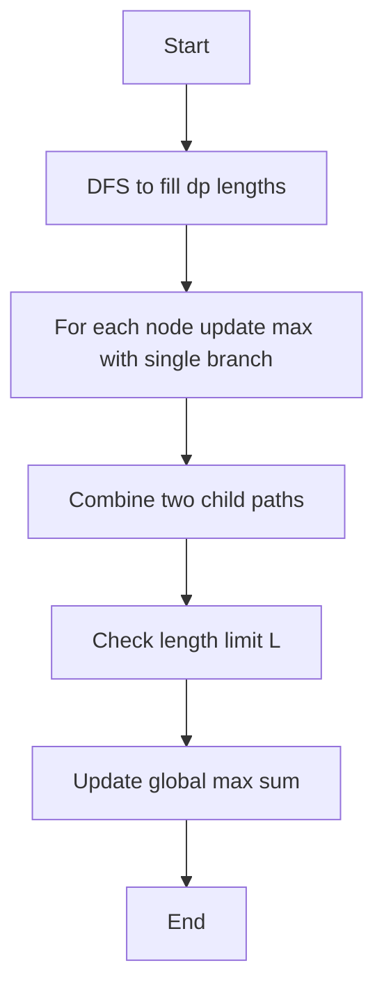

---

title: Max Path Sum with Length Limit
problem_id: TDP_MAX_PATH_SUM_LENGTH_LIMIT__6382
display_id: TDP-005
difficulty: Medium
tags:
  - Tree DP
  - Path Algorithms
  - Constrained Optimization
editorial_categories:
  - Algorithms
  - Data Structures
slug: max-path-sum-length-limit
---


# Max Path Sum with Length Limit

## 📋 Problem Summary

Given a tree with `n` nodes where each node has a value (possibly negative), find the maximum path sum where the path uses **at most `L` edges**.

A path is a sequence of distinct nodes where consecutive nodes are connected by an edge. The path sum is the sum of values of all nodes in the path.

### Constraints

- `1 <= n <= 2 x 10^5`
- `1 <= L <= n-1`
- `-10^9 <= values[i] <= 10^9`
- The graph forms a valid tree

## 🌍 Real-World Scenario

**Supply Chain Optimization:**
Imagine a distribution network where:

- Each warehouse has a profit/loss value (inventory value - operating cost)
- You want to establish a distribution route with maximum profit
- Route length is limited by delivery time constraints (max `L` stops)
- Negative values represent warehouses with high costs but strategic locations

**Applications:**

- Maximum profit route within delivery time window
- Investment portfolio with limited number of assets
- Network resource allocation with hop constraints

## 🔍 Naive Approach

### Algorithm

```
function max_path_naive():
    max_sum = -infinity

    // Step 1: Enumerate all node pairs
    for u from 1 to n:
        for v from u to n:
            // Step 2: Find path from u to v
            path = find_path(u, v)

            // Step 3: Check length constraint
            if path.length <= L:
                sum = calculate_sum(path)
                max_sum = max(max_sum, sum)

    return max_sum

function find_path(u, v):
    // BFS or DFS to find unique path in tree
    parent = bfs_parent_tracking(u)
    path = reconstruct_path(v, parent)
    return path
```

### Complexity Analysis

| Phase           | Time      | Space    | Explanation         |
| --------------- | --------- | -------- | ------------------- |
| Node pairs      | O(n²)     | O(1)     | n(n+1)/2 pairs      |
| Path finding    | O(n)      | O(n)     | BFS per pair        |
| Sum calculation | O(L)      | O(1)     | Iterate path        |
| **Naive Total** | **O(n³)** | **O(n)** | n² pairs × O(n) BFS |

**Why This Complexity:**

- For each of n² pairs, run O(n) BFS
- For n = 200,000: ~8 trillion operations (infeasible)
- Redundant: Many paths computed multiple times

**Limitations:**

- Enumerates all possible paths redundantly
- Doesn't leverage tree structure
- For n = 200,000: ~8 trillion operations

## 💡 Optimal Approach: DP with Length Tracking

### Key Insight

For each node `u`, maintain DP state:

- `dp[u][len]` = maximum sum of downward path from `u` using exactly `len` edges

To find maximum path passing through node `u`:

- Combine two best downward paths from different children
- Ensure total length ≤ L

### Algorithm

**Phase 1: Compute Downward DP**

```
function compute_downward_dp():
    function dfs(u, parent):
        // Base case: path of length 0 is just the node
        dp[u][0] = value[u]

        for child in adj[u]:
            if child != parent:
                dfs(child, u)

                // Extend paths from child
                for k from 0 to L-1:
                    dp[u][k+1] = max(dp[u][k+1],
                                     dp[child][k] + value[u])

    dfs(root, -1)
```

**Phase 2: Combine Paths Through Each Node**

```
function combine_paths():
    max_sum = -infinity

    for u from 1 to n:
        // Path entirely in one subtree
        for len from 0 to L:
            max_sum = max(max_sum, dp[u][len])

        // Path through u (two branches)
        for each pair of children (c1, c2):
            for len1 from 0 to L:
                for len2 from 0 to L-len1:
                    if len1 + len2 <= L:
                        path_sum = dp[c1][len1] + dp[c2][len2] + value[u]
                        max_sum = max(max_sum, path_sum)

    return max_sum
```

<!-- mermaid -->


### Complexity Analysis

| Phase             | Time              | Space      | Explanation                   |
| ----------------- | ----------------- | ---------- | ----------------------------- |
| DFS traversal     | O(n)              | O(h)       | Visit each node once          |
| Extend paths      | O(L) per child    | -          | Update dp[u][0..L]            |
| **Phase 1 Total** | **O(n·L)**        | **O(n·L)** | n nodes × L lengths           |
| Combine paths     | O(L²·d²) per node | O(1)       | d = degree, pairs of children |
| **Phase 2 Total** | **O(n·L²)**       | **O(1)**   | Worst case all pairs          |
| **Overall**       | **O(n·L²)**       | **O(n·L)** | Dominated by Phase 2          |

**Why This Is Optimal:**

- Each edge visited once in DFS
- Path combination is O(L²) per node (amortized)
- For n = 200K, L = 10: ~200M operations vs ~8T naive

## 💻 Implementation

### Java


### Python


### C++


### JavaScript


---

## 🧪 Test Case Walkthrough (Dry Run)

### Input

```
5 2
10 -5 20 -3 15
1 2
1 3
2 4
2 5
```

### Visual Representation

```
Tree with values, L=2 (max 2 edges):
       1 (10)
      / \
   2(-5) 3(20)
   / \
4(-3) 5(15)

Valid paths (≤2 edges):
- Single nodes: 10, -5, 20, -3, 15
- 1 edge: 1-2(5), 1-3(30), 2-4(-8), 2-5(10)
- 2 edges: 4-2-5(7), 4-2-1(2), 5-2-1(20), 2-1-3(25)
```

### Path Analysis

| Path      | Edges | Sum             | Valid?  |
| --------- | ----- | --------------- | ------- |
| [3]       | 0     | 20              | ✓       |
| [1,3]     | 1     | 10+20=**30**    | ✓       |
| [5,2,1,3] | 3     | 15-5+10+20=40   | ❌ (>L) |
| [2,1,3]   | 2     | -5+10+20=**25** | ✓       |
| [5,2,1]   | 2     | 15-5+10=20      | ✓       |

**Answer: 30** (path 1→3)

**Output:** `30`

---

## ⚠️ Common Mistakes to Avoid

| #   | Mistake                   | ❌ Wrong                         | ✅ Correct                                  |
| --- | ------------------------- | -------------------------------- | ------------------------------------------- |
| 1   | **Skip negative paths**   | Ignore paths with neg values     | Check all - neg middle may connect pos ends |
| 2   | **Count nodes not edges** | `if (len > L)` where len = nodes | Path length = edges, not nodes              |
| 3   | **Same subtree combine**  | Combine paths from same child    | Only combine from different children        |
| 4   | **Initialize to 0**       | `maxSum = 0`                     | `maxSum = -INF` (all-negative case)         |

### Detailed Example:

**Mistake 3: Combining Paths from Same Subtree**
