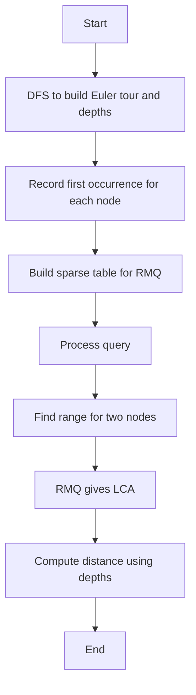

## 📝 Problem Summary

Given a weighted tree with N nodes, preprocess it to answer Q distance queries efficiently. Each query asks for the distance between two nodes u and v. The challenge is to answer queries in O(1) or O(log N) time after O(N log N) preprocessing using Euler Tour, LCA (Lowest Common Ancestor), and RMQ (Range Minimum Query).

---

## 🔍 Approach: Euler Tour + Sparse Table RMQ for LCA

### Key Insight

The distance between two nodes u and v can be computed as: dist(u, v) = dist(root, u) + dist(root, v) - 2 × dist(root, LCA(u, v))

We can:

1. Compute distances from root to all nodes using DFS
2. Build Euler tour to convert tree to array representation
3. Use Sparse Table for O(1) RMQ to find LCA
4. Answer distance queries using the formula above

### Algorithm Overview

1. **Euler Tour:** Do DFS and record [node, depth] each time we enter/exit a node
2. **First/Last occurrence:** Track first occurrence of each node in Euler tour
3. **Sparse Table:** Build RMQ data structure on depth array from Euler tour
4. **LCA Query:** Query RMQ between first occurrences of u and v
5. **Distance Calculation:** Use precomputed distances + LCA

---

## 🧠 Intuition Builder

### 💡 Visual Intuition

Imagine flattening a tree by walking through it and writing down each node as you encounter it (including backtracking). This creates a linear sequence where any two nodes' LCA corresponds to the minimum depth value between their first occurrences in the sequence.

### 🌍 Real-World Analogy

**File System Navigation:**
Consider a file system tree. To find the distance between two files, you navigate up from each file to find their closest common ancestor directory, then sum the path lengths. The Euler tour is like logging every directory entry/exit during a complete traversal.

### 🔗 Pattern Recognition

This problem combines:

- **Euler Tour**: Convert tree to array
- **RMQ**: Range queries on array
- **LCA**: Lowest common ancestor
- **Precomputation**: Trade space for query time

---

## ✅ Solution: Euler Tour + Sparse Table

### Detailed Solution Steps

1. **DFS to compute Euler tour and depths**
2. **Track first occurrence of each node in tour**
3. **Build Sparse Table on depths for O(1) RMQ**
4. **For each query (u, v):**
   - Find positions of first occurrences: pos[u], pos[v]
   - Query RMQ on range [min(pos[u], pos[v]), max(pos[u], pos[v])]
   - The node at minimum depth is LCA(u, v)
   - Calculate: dist(u, v) = depth[u] + depth[v] - 2 × depth[LCA]

<!-- mermaid -->


### Implementation Notes

- Sparse Table: st[i][j] = index of min depth in range [i, i + 2^j - 1]
- Euler tour size = 2N - 1 (enter each node once, exit N-1 times)
- Use 0-indexed or 1-indexed consistently

---

## 💻 Implementation

### Java


### Python


### C++


### JavaScript


---

## ⏱️ Complexity Analysis

### Detailed Breakdown

| Phase                   | Time           | Space          | Explanation                        |
| ----------------------- | -------------- | -------------- | ---------------------------------- |
| **Preprocessing**       |                |                |                                    |
| DFS for Euler tour      | O(N)           | O(N)           | Visit each node, record 2N times   |
| Depth recording         | O(N)           | O(N)           | Store depth at each tour position  |
| Build sparse table      | O(N log N)     | O(N log N)     | RMQ preprocessing                  |
| **Total Preprocessing** | **O(N log N)** | **O(N log N)** | Dominated by sparse table          |
| **Per Query**           |                |                |                                    |
| Find positions          | O(1)           | O(1)           | Direct lookup in first[]           |
| RMQ query               | O(1)           | O(1)           | Sparse table lookup                |
| LCA to distance         | O(1)           | O(1)           | depth[u] + depth[v] - 2×depth[lca] |
| **Per Query Total**     | **O(1)**       | **O(1)**       | Constant time                      |
| **Q Queries**           | **O(Q)**       | **O(1)**       | Total query time                   |

### Why This Complexity:

**Euler Tour:**

- Visit each edge twice (down and up): 2(N-1) steps
- Record depth at each position: O(2N) = O(N)

**Sparse Table for RMQ:**

- Build table st[i][j] = min in range [i, i+2^j)
- Levels: log₂(2N) ≈ log N levels
- Entries per level: 2N
- Total: O(2N × log N) = O(N log N)

**Query:**

- Euler tour positions: first[u] and first[v] precomputed
- RMQ(l, r): O(1) with sparse table (overlapping ranges trick)
- No tree traversal needed per query

**For N = 200K, Q = 200K:**

- Preprocessing: ~3.6M operations (one-time)
- Queries: ~200K operations (vs ~40B for naive BFS per query)

---

## 🧪 Test Case Walkthrough (Dry Run)

### Input

```
5 3
1 2 3
1 3 2
2 4 5
2 5 1
4 5
1 3
3 5
```

### Visual Representation

```
Weighted Tree:
       1
     /   \
  (3)     (2)
   2       3
  / \
(5) (1)
 4   5

Distances from root 1:
d[1]=0, d[2]=3, d[3]=2, d[4]=8, d[5]=4
```

### Euler Tour

```
DFS: 1 → 2 → 4 → (back 2) → 5 → (back 2) → (back 1) → 3 → (back 1)

Euler:  [1, 2, 4, 2, 5, 2, 1, 3, 1]
Depths: [0, 1, 2, 1, 2, 1, 0, 1, 0]
first[]: 1→0, 2→1, 3→7, 4→2, 5→4
```

### Query Walkthrough

| Query | u   | v   | Range | Min Depth Node            | LCA | dist(u)+dist(v)-2×dist(LCA) | Answer |
| ----- | --- | --- | ----- | ------------------------- | --- | --------------------------- | ------ |
| 1     | 4   | 5   | [2,4] | depth 1 at pos 3 → node 2 | 2   | 8+4-2×3=6                   | **6**  |
| 2     | 1   | 3   | [0,7] | depth 0 at pos 0 → node 1 | 1   | 0+2-2×0=2                   | **2**  |
| 3     | 3   | 5   | [4,7] | depth 0 at pos 6 → node 1 | 1   | 2+4-2×0=6                   | **6**  |

**Output:**

```
6
2
6
```

---

## ⚠️ Common Mistakes to Avoid

| #   | Mistake               | ❌ Wrong                     | ✅ Correct                                    |
| --- | --------------------- | ---------------------------- | --------------------------------------------- |
| 1   | **Wrong Euler size**  | `euler[n]`                   | `euler[2*n - 1]` (visits each node twice - 1) |
| 2   | **first[] range**     | Query `[first[u], first[v]]` | Query `[min(first[u], first[v]), max(...)]`   |
| 3   | **Sparse table init** | `sparse[i][0] = euler[i]`    | `sparse[i][0] = depth[euler[i]]`              |
| 4   | **Distance formula**  | `dist[u] + dist[v]`          | `dist[u] + dist[v] - 2*dist[LCA]`             |

### Detailed Example:

**Mistake 2: Wrong Range Direction**


---

## ✅ Correctness Proof

### Invariant

The Euler tour depth array allows us to find LCA by identifying the node with minimum depth between any two positions.

### Proof

1. When traversing from node u to node v in the tree, we pass through LCA(u, v)
2. In the Euler tour, all nodes between first[u] and first[v] include all nodes on paths from root to u and root to v
3. The minimum depth in this range corresponds to their LCA
4. Distance formula: dist(u, v) = dist(root, u) + dist(root, v) - 2 × dist(root, LCA) is geometrically correct

---

## 🧪 Edge Cases

| Case           | Input           | Expected Output             |
| -------------- | --------------- | --------------------------- |
| Same node      | u = v           | 0                           |
| Adjacent nodes | u-v edge exists | weight(u, v)                |
| Root queries   | u = root        | depth[v]                    |
| Two leaves     | Deep leaves     | Sum of depths - 2×LCA depth |

---

## 🔗 Related Problems

1. **Binary Lifting for LCA** - Alternative O(log N) LCA query
2. **Heavy-Light Decomposition** - Path queries with updates
3. **Link-Cut Trees** - Dynamic tree queries
4. **Tarjan's Offline LCA** - Union-find based LCA

---

## 💡 Key Takeaways

1. **Euler tour flattens tree** into array for RMQ
2. **Sparse table provides O(1) RMQ** after O(N log N) preprocessing
3. **LCA reduces to RMQ** on depth array
4. **Distance calculation** uses LCA and precomputed depths
5. **Trade-off:** More preprocessing for faster queries


## Constraints

- 1 ≤ N ≤ 200,000
- 1 ≤ Q ≤ 200,000
- 1 ≤ w ≤ 10^6
- The graph is guaranteed to be a tree
- 1 ≤ u, v ≤ N

---
