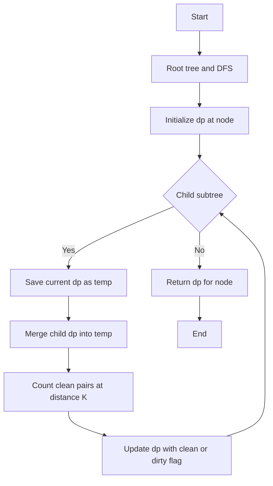

## 📝 Problem Summary

Count pairs of nodes at exactly distance K where the path doesn't pass through any node with forbidden color F. Uses DP with DFS tracking whether the path has encountered the forbidden color.

---

## 🌍 Real-World Scenario

**Network Security Path Analysis:** In a computer network represented as a tree, each router (node) has a security clearance level (color). You need to count how many pairs of endpoints can communicate over paths of exactly K hops without passing through any compromised router (forbidden color). This ensures secure communication channels are properly identified.

---

## 🔍 Approach: DFS with Color-Aware DP

### Key Insight

For each node u, we track paths ending at u with two pieces of information:

- **Distance d**: How far from some starting point
- **has_forbidden (0 or 1)**: Whether the path has passed through a forbidden-colored node

The DP state `dp[u][d][h]` = count of nodes reachable from u's subtree at distance d, where h indicates if the path contains a forbidden color.

### Visual Example

```
Tree with K=2, F=2 (forbidden color):
        1(c=1)
       / \
      2   3
     (c=2)(c=1)
     /
    4
   (c=1)

Colors: node 1→1, node 2→2(forbidden!), node 3→1, node 4→1

Valid paths of length 2:
- Path 4→2→1: passes through node 2 (color=2=F) ❌ INVALID
- Path 1→3: length 1 only
- Path 4→2→3? Not valid tree path (would need to go 4→2→1→3, length 3)

Answer: 0 (no valid pairs at distance 2 avoiding forbidden color)
```

### Algorithm Steps

1. **Root the tree** at node 1 and perform DFS
2. **Initialize** each node: `dp[u][0][has_forbidden] = 1` where has_forbidden = 1 if color[u] == F
3. **For each child subtree**, merge contributions:
   - **Count valid pairs**: When d1 + d2 + 1 = K and BOTH paths are clean (h1=0, h2=0) AND current node u is not forbidden
   - **Update DP**: Combine paths, marking as "dirty" if ANY segment has forbidden color
4. **Key Formula**: `new_has = h1 | h2 | (color[u] == F ? 1 : 0)`

<!-- mermaid -->


### Why We Need to Save `temp` Before Merging

When processing multiple children, we must avoid counting paths within the same subtree as pairs. By saving the current dp[u] before merging each child, we ensure we only pair paths from different subtrees.

```
        u
       /|\
      a b c   (children)

When processing child b:
- temp = dp[u] (contains only paths through subtree a)
- Pair temp (paths via a) with dp[b] (paths via b)
- Then update dp[u] to include paths via b

This prevents pairing two paths both from subtree b.
```

---

## 🧪 Edge Cases

| Case          | Description             | Expected Result                 |
| ------------- | ----------------------- | ------------------------------- |
| All forbidden | Every node has color F  | 0 (no valid paths)              |
| No forbidden  | No node has color F     | Standard path counting          |
| K > diameter  | K exceeds tree diameter | 0 (impossible distance)         |
| Single node   | n=1                     | 0 (need 2 nodes for pair)       |
| Linear chain  | Path graph              | At most 1 pair at distance K    |
| Star graph    | Hub with leaves         | Only leaf-to-leaf paths via hub |

---

## 💻 Implementation

### Java


### Python


### C++


### JavaScript


---

## ⏱️ Complexity Analysis

### Detailed Breakdown

| Phase             | Time             | Space      | Explanation                             |
| ----------------- | ---------------- | ---------- | --------------------------------------- |
| DFS traversal     | O(N)             | O(h)       | Visit each node once                    |
| DP state per node | O(K)             | O(K)       | K distances + clean/dirty flag          |
| Merge children    | O(K²×d) per node | O(K)       | d = degree, nested loops over distances |
| **Total Merging** | **O(N×K²)**      | **O(N×K)** | Sum over all nodes                      |
| **Overall**       | **O(N×K²)**      | **O(N×K)** | Dominated by merging phase              |

### Why O(N × K²)?

**Per-Node Processing:**

- We visit each node once: O(N)
- At each node, we merge all children's DP tables
- Merging involves iterating d1 from 0 to K and d2 from 0 to K-d1
- This gives O(K²) combinations per node
- Total: O(N × K²)

**Merging Logic:**

```
for each child c1:
    for d1 from 0 to K:         // K iterations
        for each child c2:
            for d2 from 0 to K-d1:  // ≤K iterations
                merge(d1, d2)        // O(1)
```

**Optimization Note:**

- Can be optimized to O(N×K) using convolution tricks (FFT)
- But for K ≤ 50, the naive O(N×K²) is sufficient

**For N = 200K, K = 10:**

- Current: ~200M operations (feasible)
- For K = 100: ~2B operations (slower but acceptable)
- Naive path enumeration: O(N²×K) = ~4T operations

---

## ✅ Correctness Proof

The DP correctly tracks clean vs dirty paths:

1. **Base case**: A single node is "dirty" if its color equals F, else "clean"
2. **Merge invariant**: When combining two paths through node u, the result is dirty if:
   - Either path was already dirty (h1=1 or h2=1), OR
   - The connecting node u has forbidden color
3. **Counting**: We only count pairs where BOTH contributing paths are clean AND the connecting node is not forbidden

This ensures every counted pair has a completely clean path.

---

## 🧪 Test Case Walkthrough (Dry Run)

### Input

```
5 2 3
1 2 3 2 1
1 2
1 3
2 4
2 5
```

### Visual Representation

```
Tree with colors (F=3 forbidden):
       1 (c=1✓)
      / \
   2(c=2✓) 3(c=3❌)
   / \
4(c=2✓) 5(c=1✓)
```

### All Paths of Length K=2

| Path    | Nodes        | Colors on Path | Contains F=3? | Valid? |
| ------- | ------------ | -------------- | ------------- | ------ |
| 4→2→1   | 4,2,1        | 2,2,1          | No            | ✓      |
| 4→2→5   | 4,2,5        | 2,2,1          | No            | ✓      |
| 5→2→1   | 5,2,1        | 1,2,1          | No            | ✓      |
| 1→3     | 1,3          | 1,3            | Yes (node 3)  | ❌     |
| 2→1→3   | 2,1,3        | 2,1,3          | Yes           | ❌     |
| 4→2→1→3 | length 3 > K | N/A            | N/A           | N/A    |

**Valid paths of length 2: 3**

**Output:** `3`

---

## ⚠️ Common Mistakes to Avoid

| #   | Mistake                | ❌ Wrong                     | ✅ Correct                            |
| --- | ---------------------- | ---------------------------- | ------------------------------------- |
| 1   | **Forget temp save**   | Modify dp[u] while iterating | Save `temp = dp[u].copy()` first      |
| 2   | **Wrong OR logic**     | `newHas = h1 & h2`           | `newHas = h1 \| h2 \| (color[u]==F)`  |
| 3   | **Count when invalid** | Count if h1=0 only           | Count if h1=0 AND h2=0 AND color[u]≠F |
| 4   | **Off-by-one in K**    | `d1 + d2 == K`               | `d1 + d2 + 1 == K` (include u)        |

---

## 🧪 Detailed Edge Case Analysis

### Case 1: All Nodes Have Forbidden Color

```
Input: n=3, K=2, F=1, colors=[1,1,1]
Tree: 1-2-3

Every path must pass through forbidden nodes.
Answer: 0
```

### Case 2: Linear Chain

```
Input: n=5, K=2, F=3, colors=[1,2,3,2,1]
Tree: 1-2-3-4-5

Paths of length 2:
- 1→2→3: node 3 has color 3=F ❌
- 2→3→4: node 3 has color 3=F ❌
- 3→4→5: node 3 has color 3=F ❌

Answer: 0
```

### Case 3: Star Graph

```
Input: n=5, K=2, F=99, colors=[1,2,3,4,5]
Tree: 1 connected to 2,3,4,5

All paths of length 2 go through node 1 (hub):
- 2→1→3, 2→1→4, 2→1→5, 3→1→4, 3→1→5, 4→1→5

Since F=99 (no node has this color), all are valid.
Answer: 6 (C(4,2) = 6 pairs of leaves)
```

---

## 💡 Key Takeaways

1. **State Design**: Include boolean flag to track path validity
2. **Merging Logic**: Use bitwise OR to propagate "dirty" status
3. **Avoid Double Counting**: Save temp before each child merge
4. **Valid Pair Condition**: Both subpaths clean AND connecting node clean


## Constraints

- 1 ≤ N ≤ 200,000
- 1 ≤ K ≤ 100,000
- 1 ≤ C ≤ 10
- 1 ≤ F ≤ C

---
