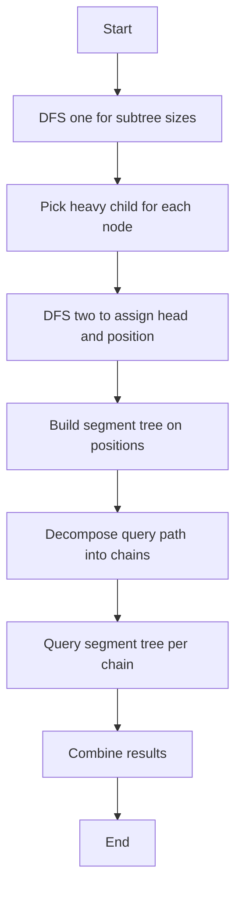

## 📝 Problem Summary

Decompose tree into heavy and light chains to answer path queries (sum/max) efficiently using segment trees. Heavy-Light Decomposition (HLD) enables O(log² N) path queries on trees.

---

## 🌍 Real-World Scenario

**Network Bandwidth Monitoring:** In a network topology (tree structure), monitor bandwidth usage along paths. HLD allows efficiently querying "total/max bandwidth on path from server A to B" and updating link capacities dynamically.

---

## 🔍 Approach: Heavy-Light Decomposition with Segment Tree

### Key Insight

Partition tree into heavy paths (each node's heavy child is the one with largest subtree) and light edges. Any root-to-node path crosses at most O(log N) light edges, allowing efficient queries by combining at most O(log N) segment tree queries.

### Visual Example

```
Tree:
        1 (val=3)
       / \
     2    3
  (val=5) (val=2)
   /|\
  4 5 6
(1)(4)(2)

Heavy children (largest subtree):
- Node 1's heavy child = 2 (subtree size 4)
- Node 2's heavy child = 5 (or any, equal sizes)

Heavy chains: [1→2→5], [3], [4], [6]

Query path(4, 3):
- Path: 4 → 2 → 1 → 3
- Chains traversed: [4], [1→2], [3]
- Sum: 1 + (3+5) + 2 = 11
```

### Algorithm

1. **DFS 1**: Compute subtree sizes, designate heavy children
2. **DFS 2**: Assign positions in chains, build chains
3. **Segment Tree**: Store chain values for range queries
4. **Path Query**: Decompose path into O(log N) chains, query each

<!-- mermaid -->


---

## 🧪 Edge Cases

| Case            | Input               | Expected            | Explanation           |
| --------------- | ------------------- | ------------------- | --------------------- |
| Single node     | n=1, query(1,1)     | val[1]              | Path is just the node |
| Linear tree     | Chain 1-2-3-...-n   | Sum of path segment | All one chain         |
| Query same node | query(v, v)         | val[v]              | LCA is v itself       |
| Leaf to leaf    | query(leaf1, leaf2) | Sum via LCA         | Crosses root possibly |

---

## 💻 Implementation

### Java


### Python


### C++


### JavaScript


---

## 🧪 Test Case Walkthrough (Dry Run)

### Input

```
5
3 5 2 4 1
1 2
1 3
2 4
2 5
2
4 5
1 3
```

### Visual Representation

```
Tree with values:
       1 (val=3)
      / \
    2(5) 3(2)
   / \
 4(4) 5(1)

Subtree sizes: 1→5, 2→3, 3→1, 4→1, 5→1
Heavy child: 1→2 (size 3), 2→4 or 5 (tie, pick first)
Heavy chains: [1,2,4], [3], [5]
```

### HLD Position Assignment

```
pos[]: 1→0, 2→1, 4→2, 3→3, 5→4
head[]: 1→1, 2→1, 4→1, 3→3, 5→5
Segment tree on: [3, 5, 4, 2, 1]
```

### Query Walkthrough

| Query | u   | v   | Chains Traversed       | Segment Queries           | Sum    |
| ----- | --- | --- | ---------------------- | ------------------------- | ------ |
| 1     | 4   | 5   | 4 in [1,2,4], 5 in [5] | [2,2]→4, [4,4]→1, [1,1]→5 | **10** |
| 2     | 1   | 3   | 1 in [1,2,4], 3 in [3] | [3,3]→2, [0,0]→3          | **5**  |

**Output:**

```
10
5
```

---

## ⚠️ Common Mistakes to Avoid

| #   | Mistake                       | ❌ Wrong                | ✅ Correct                                  |
| --- | ----------------------------- | ----------------------- | ------------------------------------------- |
| 1   | **Heavy child = first child** | Pick any child as heavy | Pick child with largest subtree             |
| 2   | **Wrong position order**      | Random DFS order        | Heavy child first in DFS2                   |
| 3   | **Head assignment**           | `head[v] = v` always    | `head[v] = head[u]` if v is heavy child     |
| 4   | **Query termination**         | Until u == v            | Until `head[u] == head[v]` then final range |

### Detailed Example:

**Mistake 3: Incorrect Head Assignment**


---

## ⏱️ Complexity Analysis

### Detailed Breakdown

| Phase                   | Time            | Space    | Explanation               |
| ----------------------- | --------------- | -------- | ------------------------- |
| **Preprocessing**       |                 |          |                           |
| DFS1 (subtree sizes)    | O(N)            | O(N)     | Compute size[] array      |
| DFS2 (decompose chains) | O(N)            | O(N)     | Assign head[], pos[]      |
| Build segment tree      | O(N)            | O(N)     | Initialize with values    |
| **Total Preprocessing** | **O(N)**        | **O(N)** | Linear setup              |
| **Per Query**           |                 |          |                           |
| Find LCA                | O(log N)        | O(1)     | Jump up light edges       |
| Chain traversals        | O(log N) chains | O(1)     | At most log N chains      |
| Segment query per chain | O(log N)        | O(1)     | Standard segment tree     |
| **Per Query Total**     | **O(log² N)**   | **O(1)** | log chains × log seg tree |
| **Q Queries**           | **O(Q log² N)** | **O(1)** | Total query time          |

### Why O(log N) Chains?

**Heavy-Light Lemma:**

- Each light edge move halves the subtree size
- From any node to root: at most log₂ N light edges
- Therefore: at most O(log N) chains on any path

**Proof:**

- When moving from child c to parent p via light edge:
- size[c] ≤ size[p] / 2 (by definition of heavy child)
- Starting from subtree size S, after k light edges: size ≤ S / 2ᵏ
- To reach root (size = N): k ≤ log₂ N

**Per-Query Breakdown:**

1. Path from u to LCA: O(log N) chains
2. Path from v to LCA: O(log N) chains
3. Each chain: one segment tree query = O(log N)
4. Total: O(log N) chains × O(log N) per query = O(log² N)

**For N = 200K, Q = 200K:**

- Preprocessing: ~200K operations
- Per query: ~(log 200K)² ≈ 18² = 324 operations
- Total: ~65M operations vs ~40B for naive

---

## 💡 Key Takeaways

1. **HLD enables efficient tree path queries** - reduces to segment tree operations
2. **Heavy child = largest subtree** - ensures O(log N) chains
3. **Segment tree per linearized tree** - not per chain (one global array)
4. **O(log² N) total**: O(log N) chains × O(log N) per query
5. **Supports both sum and max** - change segment tree merge operation


## Constraints

- 1 ≤ N ≤ 200,000
- 1 ≤ Q ≤ 200,000
- 1 ≤ values[i] ≤ 10^9

---
