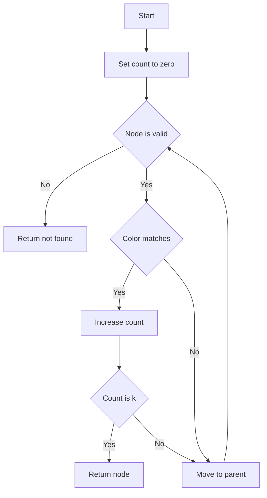

## 📝 Problem Summary

Given a rooted tree where each node has a color, answer queries: "Find the k-th ancestor of node v that has color c." If node v itself has color c, it counts as the 1st such ancestor.

---

## 🌍 Real-World Scenario

**File System Permission Inheritance:** In a hierarchical file system, directories (nodes) have different permission levels (colors). When a process at directory v requests access requiring permission level c, the system needs to find which ancestor directory grants the access.

---

## 🔍 Approach: Linear Ancestor Walk

### Key Insight

**Important**: The node v itself is considered as an "ancestor" of itself. So when asked for the k-th ancestor with color c:

- If v has color c, then v is the 1st such ancestor
- The parent is checked next, then grandparent, etc.

### Visual Example

```
Tree rooted at 1:
        1 (color=1)
       / \
      2   3
    (c=2) (c=1)
    / \
   4   5
 (c=2)(c=1)

Query: (v=4, c=2, k=1)
- Start at node 4, color=2 ✓ count=1
- k=1 reached! Return 4

Query: (v=5, c=1, k=2)
- Start at node 5, color=1 ✓ count=1
- Parent is 2, color=2 ✗
- Grandparent is 1, color=1 ✓ count=2
- k=2 reached! Return 1
```

### Algorithm

```
findKthColoredAncestor(v, c, k):
    count = 0
    while v != 0:           // 0 means past root
        if color[v] == c:
            count++
            if count == k:
                return v
        v = parent[v]
    return -1               // Not enough ancestors with color c
```

<!-- mermaid -->


---

## 🧪 Edge Cases

| Case              | Query     | Expected         | Explanation           |
| ----------------- | --------- | ---------------- | --------------------- |
| Node is root      | (1, c, k) | 1 or -1          | Only root to check    |
| Color not in path | (v, c, k) | -1               | No matching ancestors |
| k too large       | (v, c, k) | -1               | Not enough matches    |
| Single node       | (1, c, 1) | 1 if color[1]==c | Root has no parent    |

---

## 💻 Implementation

### Java


### Python


### C++


### JavaScript


---

## 🧪 Test Case Walkthrough (Dry Run)

### Input

```
5
2 1 2 1 2
1 2
1 3
2 4
2 5
3
4 2 1
5 1 2
3 2 2
```

### Visual Representation

```
Tree with colors:
       1 (c=2)
      / \
   2(c=1) 3(c=2)
   / \
4(c=1) 5(c=2)
```

### Query Walkthrough

| Query | v   | c   | k   | Path (v→root) | Colored ancestors                | k-th         | Answer |
| ----- | --- | --- | --- | ------------- | -------------------------------- | ------------ | ------ |
| 1     | 4   | 2   | 1   | 4→2→1         | c[4]=1❌, c[2]=1❌, c[1]=2✓      | 1st=1        | **1**  |
| 2     | 5   | 1   | 2   | 5→2→1         | c[5]=2❌, c[2]=1✓(1st), c[1]=2❌ | Only 1 found | **-1** |
| 3     | 3   | 2   | 2   | 3→1           | c[3]=2✓(1st), c[1]=2✓(2nd)       | 2nd=1        | **1**  |

**Output:**

```
1
-1
1
```

---

## ⚠️ Common Mistakes to Avoid

| #   | Mistake                | ❌ Wrong                   | ✅ Correct                       |
| --- | ---------------------- | -------------------------- | -------------------------------- |
| 1   | **Skip starting node** | Start from parent of v     | Start counting from v itself     |
| 2   | **Wrong termination**  | `while (v != -1)`          | `while (v != 0)` (0 is sentinel) |
| 3   | **Return wrong node**  | Return when `count == k-1` | Return when `count == k`         |
| 4   | **Forget -1 case**     | No return for not found    | `return -1` after loop           |

### Detailed Example:

**Mistake 1: Skipping the Starting Node**


---

## ⏱️ Complexity

| Metric            | Value                        |
| ----------------- | ---------------------------- |
| **Preprocessing** | O(N log N)                   |
| **Query**         | O(N) per query (linear walk) |
| **Space**         | O(N log N)                   |

### Complexity Breakdown

- **Preprocessing**: Binary lifting table with O(log N) entries per node
- **Query**: Worst case walks from leaf to root (O(N) for skewed tree)
- **Total for Q queries**: O(N log N + Q × N)

### Optimization Potential

### Complexity Analysis

| Phase                   | Time             | Space          | Explanation             |
| ----------------------- | ---------------- | -------------- | ----------------------- |
| **Preprocessing**       |                  |                |                         |
| DFS + binary lifting    | O(N log N)       | O(N log N)     | Build up[][] table      |
| Depth computation       | O(N)             | O(N)           | Traverse tree           |
| **Total Preprocessing** | **O(N log N)**   | **O(N log N)** | Standard binary lifting |
| **Per Query**           |                  |                |                         |
| Binary lifting to kth   | O(k log N) worst | O(1)           | Walk up checking colors |
| Check color             | O(1) per step    | O(1)           | Array lookup            |
| **Naive Per Query**     | **O(k)**         | **O(1)**       | Linear walk up tree     |
| **Optimized Query**     | **O(log N)**     | **O(log N)**   | Color-specific jumps    |

### Why O(k) for Naive?

**Naive Algorithm:**

```
current = v
count = 0
while current != -1:
    if color[current] == C:
        count++
        if count == k:
            return current
    current = parent[current]
```

- Must check up to k ancestors with color C
- In worst case (all nodes have color C): O(k) steps
- Total for Q queries: O(Q·k)

**Optimized with Color-Specific Jumps:**

- Precompute `colorUp[v][c]` = nearest ancestor of v with color c
- Then use binary search on depth
- Query becomes O(log N) per query
- Preprocessing: O(N·C) where C = number of colors

**For N = 200K, Q = 200K, k = 100:**

- Naive: ~20M operations per query = 4T total
- Binary lifting: ~3.6M preprocessing + ~200K×log(200K) ≈ ~4M queries

---

## 💡 Key Takeaways

1. **Node counts as ancestor**: When finding k-th colored ancestor, start counting from v itself
2. Binary lifting enables O(log N) ancestor access
3. Color filtering with linear walk is simple and sufficient for moderate Q
4. For heavy queries, precompute color-specific ancestors


## Constraints

- 1 ≤ N ≤ 200,000
- 1 ≤ Q ≤ 200,000
- 1 ≤ color[i] ≤ 10
