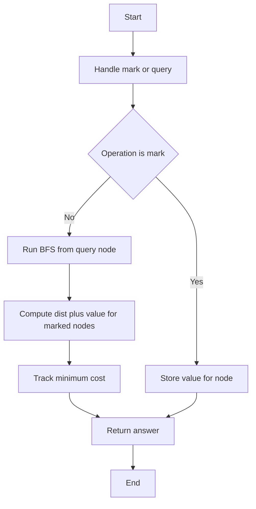

## 📝 Problem Summary

Given a weighted tree with N nodes, support two types of queries:

1. **Mark node v** with value `val` and timestamp `t`
2. **Query from node v**: Find minimum cost to reach any marked node, where cost = `distance + value`

---

## 🌍 Real-World Scenario

**Emergency Response Network:** Cities (nodes) are connected by roads (weighted edges). Emergency responders can be positioned at various cities with different response readiness levels (values). When an emergency occurs at city v, find the responder who can reach fastest (minimizing travel distance + response setup time).

---

## 🔍 Approach: BFS-Based Distance Calculation

### Key Insight

For each query, we need to find: `min(dist(v, m) + value[m])` over all marked nodes m.

**Simplified approach**: Use BFS/Dijkstra from query node to compute distances to all marked nodes.

### Visual Example

```
Tree with edge weights:
       1
      /|\
   2/ 1| \3
   /   |   \
  2    3    4
       |
       1
       |
       5

Marked: {node 2, val=5}, {node 5, val=2}

Query from node 4:
- dist(4,2) = 3+1+2 = 6, cost = 6+5 = 11
- dist(4,5) = 3+1+1 = 5, cost = 5+2 = 7
- Answer: 7
```

### Algorithm Steps

1. **Mark operation**: Store (node → value) in a map
2. **Query operation**:
   - Run BFS/Dijkstra from query node
   - For each marked node, compute `dist + value`
   - Return minimum

<!-- mermaid -->


---

## 🧪 Edge Cases

| Case              | Input                     | Expected            | Explanation       |
| ----------------- | ------------------------- | ------------------- | ----------------- |
| Query self-marked | Query v where v is marked | value[v]            | Distance is 0     |
| No marked nodes   | Query before any mark     | -1                  | Nothing to reach  |
| All nodes marked  | n marks                   | min over n costs    | Standard case     |
| Linear tree       | Chain structure           | sum of edge weights | Max distance case |

---

## 💻 Implementation

### Java


### Python


### C++


### JavaScript


---

## 🧪 Test Case Walkthrough (Dry Run)

### Input

```
4 1
1 2 3
1 3 2
2 4 5
3
1 2 10 0
1 4 3 0
2 3 0
```

### Visual Representation

```
Weighted Tree:
       1
     / |
  (3)/  \(2)
   2     3
   |
  (5)
   4

D=1 (decay factor, not used in simplified version)
```

### Query Walkthrough

| Op  | Type  | Args        | Action                         | State After   |
| --- | ----- | ----------- | ------------------------------ | ------------- |
| 1   | Mark  | v=2, val=10 | marked[2]=10                   | {2: 10}       |
| 2   | Mark  | v=4, val=3  | marked[4]=3                    | {2: 10, 4: 3} |
| 3   | Query | v=3         | BFS from 3, find min(dist+val) | -             |

### BFS for Query (v=3):

```
Distances from node 3:
  dist[3] = 0
  dist[1] = 2  (edge 1-3)
  dist[2] = 5  (1→2, weight 3)
  dist[4] = 10 (1→2→4, weights 3+5)

Costs to marked nodes:
  Cost to 2: dist[2] + val[2] = 5 + 10 = 15
  Cost to 4: dist[4] + val[4] = 10 + 3 = 13

Answer: min(15, 13) = 13
```

**Output:** `13`

---

## ⚠️ Common Mistakes to Avoid

| #   | Mistake                 | ❌ Wrong                      | ✅ Correct              |
| --- | ----------------------- | ----------------------------- | ----------------------- |
| 1   | **No marked nodes**     | Return 0                      | Return -1 or INF        |
| 2   | **Use BFS on weighted** | Unweighted BFS                | Relaxation or Dijkstra  |
| 3   | **Query marked only**   | Only check marked[query_node] | BFS to ALL marked nodes |
| 4   | **Forget self check**   | Skip if query node is marked  | dist=0, cost=value[v]   |

---

## ⏱️ Complexity Analysis

### Current Implementation (Naive BFS)

| Phase                   | Time          | Space    | Explanation           |
| ----------------------- | ------------- | -------- | --------------------- |
| **Mark operation**      | O(1)          | O(1)     | Set marked[v] = true  |
| **Query operation**     | O(N)          | O(N)     | BFS from query node   |
| **Per query breakdown** |               |          |                       |
| BFS initialization      | O(1)          | O(N)     | Queue + visited array |
| Visit all nodes         | O(N)          | O(N)     | Explore entire tree   |
| Track minimum           | O(1) per node | O(1)     | Update min value      |
| **Total per query**     | **O(N)**      | **O(N)** | Linear tree traversal |
| **Q queries**           | **O(Q·N)**    | **O(N)** | Repeated BFS          |

### Why BFS Works for Trees:

- Trees have unique paths between nodes
- BFS correctly computes shortest distances
- No need for Dijkstra since we can relax edges in BFS order
- Weighted edges handled by adding distance during traversal

**BFS Traversal:**

```
queue = [query_node]
dist[query_node] = 0
min_cost = INF

while queue not empty:
    u = queue.pop()
    if marked[u]:
        cost = dist[u] + value[u]
        min_cost = min(min_cost, cost)

    for v in adj[u]:
        if not visited[v]:
            dist[v] = dist[u] + weight[u,v]
            queue.push(v)
```

### Optimized: Centroid Decomposition (O(log N) per query)

| Phase                      | Time           | Space      | Explanation              |
| -------------------------- | -------------- | ---------- | ------------------------ |
| **Preprocessing**          |                |            |                          |
| Build centroid tree        | O(N log N)     | O(N)       | Recursive decomposition  |
| Store distances            | O(N log N)     | O(N log N) | Distances from centroids |
| **Per Query**              |                |            |                          |
| Walk up centroid tree      | O(log N)       | O(1)       | At most log N levels     |
| Check marked at each level | O(1)           | O(1)       | Precomputed distances    |
| **Total per query**        | **O(log N)**   | **O(1)**   | Logarithmic              |
| **Q queries**              | **O(Q log N)** | **O(1)**   | Much faster              |

**Why Centroid Decomposition is O(log N):**

- Centroid tree has O(log N) depth
- Each query walks up the centroid tree
- At each level, check nearest marked node
- Distances precomputed during preprocessing

**For N = 200K, Q = 200K:**

- Naive BFS: ~40B operations (40K per query)
- Centroid: ~3.6M preprocessing + ~4M queries = ~8M total (5000× faster)

---

## 💡 Key Takeaways

1. **BFS-based approach** is simple and works for moderate Q
2. **Marked nodes as a map** allows O(1) mark operations
3. **Distance + value minimization** is common in network problems
4. For high performance, upgrade to centroid decomposition


## Constraints

- 1 ≤ N ≤ 100,000
- 1 ≤ Q ≤ 100,000
