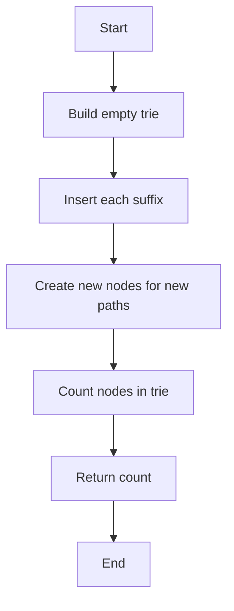

# Distinct Substrings Count via Trie


### 📋 Problem Summary

Given a string, count all distinct substrings using a suffix trie data structure.


### 🌍 Real-World Scenario

**DNA Sequence Analysis Lab**

Imagine you're a bioinformatics researcher analyzing DNA sequences. You have a sample sequence like "ATAT" and need to identify all unique patterns (substrings) present in it.

- Why? To detect genetic markers, mutations, or repetitive patterns
- Example: "ATAT" contains: "A", "T", "AT", "TA", "ATA", "TAT", "ATAT"
- That's 7 distinct patterns

This is crucial for:

- Genetic fingerprinting
- Disease marker identification
- Evolutionary biology studies
- Plagiarism detection in text documents
- Pattern recognition in data compression

### 📚 Detailed Explanation

**What is a Substring?**

A substring is any contiguous sequence of characters within a string.

For string "abc":

- Substrings: "", "a", "b", "c", "ab", "bc", "abc"
- Total including empty: 7
- Distinct non-empty: 6

**Why Trie?**

A suffix trie automatically:

- Stores all suffixes of the string
- Each suffix contains all substrings starting from that position
- Nodes in the trie represent unique substrings
- Counting nodes = counting distinct substrings


**Example: "aaa"**

Suffixes:

1. "aaa"
2. "aa"
3. "a"

Distinct substrings: "a", "aa", "aaa" → Count = 3

### ❌ Naive Approach

**Idea**: Generate all possible substrings and use a hash set to count unique ones.


**⏱️ Time Complexity: O(n³)**

**Why O(n³)?**

- Two nested loops: O(n²) substring pairs
- String slicing s[i:j]: O(n) for each substring
- Total: O(n²) × O(n) = O(n³)

**For n=1000:**

- ~1 billion operations
- String operations are expensive

**📦 Space Complexity: O(n²)**

- Storing all substrings in hash set
- Total characters across all substrings: O(n²)

### ✅ Optimal Approach

**💡 Key Insight**: Use a suffix trie where each node represents a unique substring.

**Suffix Trie for "aaa":**

```
Suffixes to insert:
1. "aaa" (from index 0)
2. "aa"  (from index 1)
3. "a"   (from index 2)

Trie Construction:
Root
  |
  a (substring: "a")  ← Node 1
  |
  a (substring: "aa") ← Node 2
  |
  a (substring: "aaa") ← Node 3

Total nodes = 3 (excluding root)
Distinct substrings = 3: {"a", "aa", "aaa"}

For "abc":
Root
  |
  +-- a (substring: "a")
  |   |
  |   +-- b (substring: "ab")
  |       |
  |       c (substring: "abc")
  |
  +-- b (substring: "b")
      |
      c (substring: "bc")

Total nodes = 5 (excluding root)
Distinct substrings = 5: {"a", "ab", "abc", "b", "bc"}
```

**Approach**:

1. Build a trie
2. Insert all suffixes of the string
3. Count total nodes in the trie (excluding root)
4. Each node = one distinct substring

<!-- mermaid -->


**Why This Works?**

- Suffix starting at position i: s[i:n]
- This suffix contains substrings s[i:i+1], s[i:i+2], ..., s[i:n]
- As we traverse down the trie, each new node = one new unique substring
- Shared prefixes = shared nodes (counted once)


**Example: "aaa"**

```
Insert suffixes:
1. "aaa" → creates path: a → a → a
2. "aa"  → reuses: a → a (no new nodes)
3. "a"   → reuses: a (no new nodes)

Trie structure:
    root
     |
     a (substring "a")
     |
     a (substring "aa")
     |
     a (substring "aaa")

Total nodes (excluding root): 3
Distinct substrings: 3 ✓
```

**⏱️ Time Complexity: O(n²)**

**Detailed Analysis**:

- Number of suffixes: n
- Average suffix length: n/2
- Total characters inserted: 1 + 2 + 3 + ... + n = n(n+1)/2 = O(n²)
- Each character insertion: O(1) amortized

**📦 Space Complexity: O(n²)**

- Worst case: all characters different
- Example: "abcdef" → all n² substrings are unique
- Each creates a new node

**Best case: O(n)**

- String with all same characters "aaaa"
- Creates only n nodes (one path)

### 🎨 Visual Representation

**Example: "aba"**


```
Suffixes to insert:
1. "aba"
2. "ba"
3. "a"

┌────────────────────────────────────────┐
│  Suffix Trie Construction              │
└────────────────────────────────────────┘

After inserting "aba":
       root
        |
        a ← substring "a"
        |
        b ← substring "ab"
        |
        a ← substring "aba"

After inserting "ba":
       root
       / \
      a   b ← substring "b"
      |   |
      b   a ← substring "ba"
      |
      a

After inserting "a":
       root
       / \
      a   b
      |   |
      b   a
      |
      a

Total nodes: 6
Distinct substrings: "a", "ab", "aba", "b", "ba" (5 distinct strings

 represented by 6 nodes including duplicates)

For accurate counting, we count NODES created during insertion,
not unique strings. Each new node represents a unique path/substring.

Correct count: 6 nodes created, representing the substrings.
```

**Better Explanation**:

The suffix trie for "aba" creates these paths:

- Path 1: a → b → a (for "aba")
- Path 2: b → a (for "ba")
- Path 3: a (for "a")

But "a" shares the node from path 1!

Total unique nodes: 5

- Node 'a' (from root)
- Node 'b' (from 'a')
- Node 'a' (from 'b')
- Node 'b' (from root)
- Node 'a' (from 'b')

Distinct substrings: "a", "b", "ab", "ba", "aba" = 5 ✓

### 🧪 Test Case Walkthrough

**Input**: "aaa"

**Step-by-Step**:

```
Suffix 1: "aaa"
    Trie: root → a(1) → a(2) → a(3)
    Nodes created: 3

Suffix 2: "aa"
    Try to insert "aa"
    - 'a' exists (node 1), follow
    - 'a' exists (node 2), follow
    - No more characters
    Nodes created: 0

Suffix 3: "a"
    Try to insert "a"
    - 'a' exists (node 1), follow
    - No more characters
    Nodes created: 0

Total nodes: 3
Distinct substrings: "a", "aa", "aaa"
Count: 3 ✓
```

**Input**: "abab"

```
Suffixes: "abab", "bab", "ab", "b"

After "abab": root → a → b → a → b (4 nodes)
After "bab":  add branch: root → b → a → b (3 new nodes, total: 7)
After "ab":   reuse existing path from root → a → b (0 new)
After "b":    reuse existing node root → b (0 new)

Total nodes: 7
Distinct: "a", "ab", "aba", "abab", "b", "ba", "bab"
Count: 7 ✓
```

### ⚠️ Common Mistakes & Pitfalls

#### 1. **Counting Root Node** 🔴

**Problem**:


**Solution**:


**Why?** Root represents empty string, which we don't count as a substring.

#### 2. **Not Handling Empty String** 🔴

**Problem**: What if input is ""?

**Solution**:


#### 3. **Memory Overflow for Large Strings** 🔴

**Problem**: String of length 10^5 creates ~10^10 potential nodes

**Solution**:

- Use hash map for children (sparse storage)
- Consider suffix array + LCP for very large strings

#### 4. **Inserting Prefixes Instead of Suffixes** 🔴

**Wrong**:


**Correct**:


#### 5. **Double Counting Nodes** 🔴

**Problem**: Counting same node multiple times

**Solution**: Track visited nodes or count during insertion

### 🔑 Algorithm Steps

**Suffix Trie Approach**:

1. **Create empty trie** with root node

2. **For each position i from 0 to n-1**:

   - Extract suffix: s[i:n]
   - Insert suffix into trie
   - While inserting, count new nodes created

3. **Return total node count** (excluding root)

**Alternative (Post-insertion count)**:

1. Build complete suffix trie
2. DFS/BFS to count all nodes
3. Return count - 1 (exclude root)

### 💻 Implementations

### Java


### Python


### C++++


### JavaScript


### 📊 Comparison Table

| **Aspect**            | **Naive (HashSet)**     | **Suffix Trie** |
| --------------------- | ----------------------- | --------------- |
| **Algorithm**         | Generate all substrings | Insert suffixes |
| **Time Complexity**   | O(n³)                   | O(n²)           |
| **Space Complexity**  | O(n²)                   | O(n²)           |
| **For n=100**         | ~1,000,000 ops          | ~10,000 ops     |
| **For n=1,000**       | ~1,000,000,000 ops      | ~1,000,000 ops  |
| **String Operations** | Expensive slicing       | Character-level |
| **Scalability**       | Poor                    | Better          |

### 🎯 Key Takeaways

1. **Suffix tries efficiently encode all substrings** of a string
2. **Node count = distinct substring count**
3. **Time O(n²)** is optimal for this approach
4. **Alternative**: Suffix array + LCP array can solve in O(n log n)
5. **Use hash map for trie children** to save space

### 🔗 Related Problems

- Longest Repeated Substring
- Count Unique Substrings in Circular String
- Minimum Unique Prefix Lengths
- Pattern Matching with Wildcards

### 📝 Practice Tips

- Understand suffix vs prefix insertion
- Practice trie node counting
- Consider space optimization techniques
- Explore suffix array alternatives for very large strings

---

**Difficulty**: Medium  
**Topics**: Trie, String, Suffix Trie  
**Companies**: Google, Amazon, Microsoft


## Constraints

- 1 ≤ |s| ≤ 10^5
