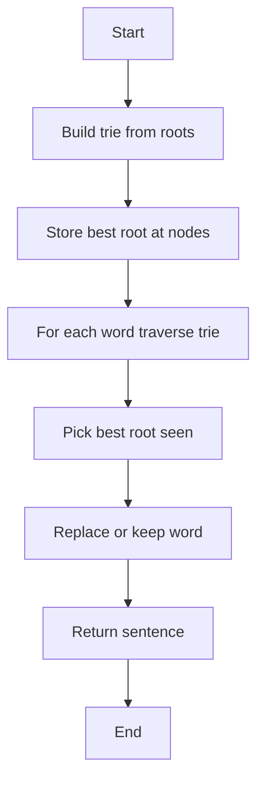

# Replace Words with Shortest Rare Prefix


### 📋 Problem Summary

Given a dictionary of root words with rarity scores and a sentence, replace each word with the prefix from the dictionary that is both a prefix of the word and has the smallest rarity score. If multiple prefixes have the same rarity, choose the shortest one.


### 🌍 Real-World Scenario

**Medical Record Compression System**

Imagine you're building a medical record system where:

- Common medical terms have standard abbreviations
- Rare, specialized terms get priority for shorter codes (lower rarity = more specialized)
- Example: "cardiologist" could be abbreviated to "card" (common) or "cardio" (rare specialty)

You have a dictionary:

- "card" (rarity: 5) - very common prefix
- "cardio" (rarity: 2) - rare, specialized

When processing "cardiologist", you choose "cardio" because:

- It has lower rarity (2 < 5)
- It's a valid prefix of "cardiologist"

This helps in:

- Efficient medical record storage
- Standardized medical coding (ICD codes)
- Insurance claim processing
- Medical research data mining

### 📚 Detailed Explanation

**Problem Components**:

1. **Dictionary**: List of root words, each with a rarity score

   - Lower rarity = more specialized/important
   - Example: {"cat": 1, "car": 2, "card": 3}

2. **Sentence**: String containing words separated by spaces

3. **Goal**: Replace each word with best matching root
   - "Best" = lowest rarity score
   - Tie-break by shortest length

**Example**:

```
Dictionary: {"cat": 1, "car": 2}
Sentence: "the cattle carried"

Processing:
- "the" → no prefix match → "the"
- "cattle" → prefix "cat" (rarity 1) → "cat"
- "carried" → prefix "car" (rarity 2) → "car"

Output: "the cat car"
```

### ❌ Naive Approach

**Idea**: For each word in sentence, check all dictionary roots linearly.


**⏱️ Time Complexity: O(N × M × L)**

Where:

- N = number of words in sentence
- M = number of dictionary roots
- L = average word length (for string prefix check)

**For realistic inputs**:

- N = 1000 words
- M = 10,000 roots
- L = 10 characters
- Total: ~100,000,000 operations

**📦 Space Complexity: O(N + M)**

### ✅ Optimal Approach

**💡 Key Insight**: Build a trie where each node stores the best (lowest rarity) root ending at that position.

**Trie with Rarity Tracking:**


```
Dictionary: {"cat": 1, "car": 2, "cattle": 5}

Trie Construction:
Root
  |
  c
  |
  a
  |
  +-- t (bestRoot="cat", rarity=1) ✓ End
  |   |
  |   t
  |   |
  |   l
  |   |
  |   e (bestRoot="cattle", rarity=5) End
  |       (but "cat" is better: rarity=1 < 5)
  |
  +-- r (bestRoot="car", rarity=2) End

Query "cattle":
  c → a → t (found "cat", rarity=1) ✓
  Continue: t → l → e (found "cattle", rarity=5)
  Best: "cat" (rarity=1 < 5)

Query "carried":
  c → a → r (found "car", rarity=2) ✓
  Continue: r → ? (no 'r' child)
  Best: "car"


Result: "the cat car"
```

**Approach**:

1. **Build trie from dictionary**:
   - Insert each root into trie
   - At each node, store the best (lowest rarity, then shortest) root seen so far
2. **Process each word in sentence**:
   - Traverse trie following word's characters
   - Track the best root encountered during traversal
   - If no root found, keep original word

<!-- mermaid -->


**Why This Works?**

- Trie allows efficient prefix matching: O(L) per word
- Storing best root at each node eliminates redundant comparisons
- Early termination possible when traversal ends

**Example Trie Construction**:

Dictionary: {"cat": 1, "car": 2, "card": 3}

```
        root
         |
         c (best: null)
         |
         a (best: null)
        / \
       t   r (best: "car" rarity=2)
(best: "cat"  |
 rarity=1)    d (best: "car" rarity=2, not "card" because "car" is shorter)
```

**⏱️ Time Complexity: O(M × K + N × L)**

**Breakdown**:

- Building trie: O(M × K) where K = avg root length
- Processing sentence: O(N × L) where L = avg word length
- Total: Linear in input sizes!

**For realistic inputs**:

- M × K = 10,000 × 10 = 100,000
- N × L = 1,000 × 10 = 10,000
- Total: ~110,000 operations (vs 100M naive!)

**📦 Space Complexity: O(M × K)**

- Trie nodes for all dictionary roots
- Typically much smaller than M × K due to shared prefixes

### 🎨 Visual Representation

**Example: Dictionary: {"cat": 1, "car": 2}, Sentence: "cattle car"**

```
┌────────────────────────────────────────┐
│  Trie Construction                     │
└────────────────────────────────────────┘

Insert "cat" (rarity=1):
    root
     |
     c
     |
     a
     |
     t (end: "cat", rarity=1) ★

Insert "car" (rarity=2):
    root
     |
     c
     |
     a (best so far: none)
    / \
   t   r (end: "car", rarity=2) ★
(cat)

┌────────────────────────────────────────┐
│  Word Processing                       │
└────────────────────────────────────────┘

Word 1: "cattle"
Traverse: c → a → t (found "cat", rarity=1)
         → continue: t (no child)
         → stop
Best match: "cat"
Output: "cat"

Word 2: "car"
Traverse: c → a → r (found "car", rarity=2)
Best match: "car"
Output: "car"

Final: "cat car"
```

### 🧪 Test Case Walkthrough

**Input**:

```
Dictionary: {"cat": 1, "car": 2}
Sentence: "the cattle carried"
```

**Step-by-Step**:


```
Build Trie:
    root
     |
     c
     |
     a
    / \
   t   r
("cat") ("car")

Process Words:

1. "the":
   - Search: 't' → not in trie (root has child 'c' only)
   - No match
   - Output: "the"

2. "cattle":
   - Search: 'c' → exists
   - Move to 'a': exists
   - Move to 't': exists, found "cat" (rarity=1) ★
   - Move to 't': no child 't' under current node
   - Best found: "cat"
   - Output: "cat"

3. "carried":
   - Search: 'c' → 'a' → 'r': found "car" (rarity=2) ★
   - Move to 'r': no child 'r'
   - Best found: "car"
   - Output: "car"

Result: ["the", "cat", "car"]


Final Output: "the cat car"
```

### ⚠️ Common Mistakes & Pitfalls

#### 1. **Not Handling Tie-Breaking Correctly** 🔴

**Problem**:


**Solution**:


#### 2. **Forgetting to Track Best During Traversal** 🔴

**Problem**: Only checking at the end of traversal

**Solution**: Update best root at every node that marks end of a dictionary word

#### 3. **Not Handling Words Without Matches** 🔴

**Problem**:


**Solution**:


#### 4. **Incorrect Trie Node Structure** 🔴

**Problem**: Not storing rarity at nodes

**Solution**:


### 🔑 Algorithm Steps

**Optimal Algorithm**:

1. **Build Trie**:

   ```
   For each (root, rarity) in dictionary:
       Insert root into trie
       At end node, store: root, rarity
   ```

2. **Process Sentence**:

   ```
   For each word in sentence.split():
       curr = trie root
       best_root = None
       best_rarity = infinity

       For each char in word:
           If char not in curr.children:
               break
           curr = curr.children[char]

           If curr has end marker:
               If curr.rarity < best_rarity OR
                  (curr.rarity == best_rarity AND len(curr.word) < len(best_root)):
                   best_root = curr.word
                   best_rarity = curr.rarity

       Append (best_root or word) to result
   ```

3. **Return** joined result

### 💻 Implementations

### Java


### Python


### C++++


### JavaScript


### 📊 Comparison Table

| **Aspect**            | **Naive**        | **Trie Optimal** |
| --------------------- | ---------------- | ---------------- |
| **Time Complexity**   | O(N × M × L)     | O(M×K + N×L)     |
| **Space**             | O(N + M)         | O(M×K)           |
| **For N=1000, M=10K** | ~100M operations | ~110K operations |
| **Prefix Matching**   | Linear scan      | Trie traversal   |
| **Scalability**       | Poor             | Excellent        |

### 🎯 Key Takeaways

1. **Tries excel at prefix matching** - O(L) vs O(M×L)
2. **Store metadata at nodes** for efficient lookups
3. **Greedy choice**: Always pick lowest rarity, then shortest
4. **Early termination** when traversal fails

---

**Difficulty**: Medium  
**Topics**: Trie, String, Greedy  
**Companies**: Google, Microsoft, Amazon


## Constraints

- 1 ≤ n ≤ 10^5
- 1 ≤ word length ≤ 30
- 1 ≤ rarity ≤ 10^9
- 1 ≤ sentence length ≤ 10^5
