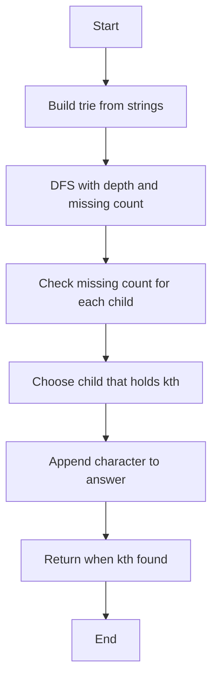

# Lexicographic k-th String Not Present


### 📋 Problem Summary

Given a trie with inserted strings, find the k-th lexicographically smallest string of length ≤ L that is NOT in the trie.


### 🌍 Real-World Scenario

**Username Generation System**

Imagine you're building a user registration system for a social media platform. Certain usernames are already taken (stored in a trie), and you need to suggest available alternatives.

- Taken: "alice", "bob", "carol"
- User wants a short username (length ≤ 5)
- System suggests: 1st available = "aa", 2nd = "ab", 3rd = "ac", etc.

This helps in:

- Auto-generating available usernames
- Domain name suggestion tools
- License plate generation systems
- Product ID creation
- Session token generation

### 📚 Detailed Explanation


**Total Possible Strings of Length ≤ L**:

For alphabet size 26 (a-z):

- Length 1: 26 strings (a, b, ..., z)
- Length 2: 26² = 676 strings (aa, ab, ..., zz)
- ...
- Length L: 26^L strings

Total = 26 + 26² + ... + 26^L = 26(26^L - 1)/(26-1)

**Example with L=2**:

- Total possible: 26 + 676 = 702 strings
- If 2 are inserted ("a", "b"), 700 are missing
- Find the k-th missing in lexicographic order

**Lexicographic Order**:

```
a, aa, ab, ac, ..., az, b, ba, bb, ..., zz
```

### ❌ Naive Approach

**Idea**: Generate all possible strings up to length L, filter out inserted ones, sort, and pick k-th.


**⏱️ Time Complexity: O(26^L × L + n × L)**

- Generating all: O(26^L)
- Checking membership: O(n × L) per string
- Sorting: O(26^L × log(26^L))

**For L=6**: 26^6 ≈ 300 million strings!

**📦 Space Complexity: O(26^L)**

### ✅ Optimal Approach


**💡 Key Insight**: Use DFS on trie to count and find missing strings without generating all possibilities.

**Trie with Missing Counts:**

```
Example: inserted = ["a", "ab"], L = 2, k = 3

Trie of inserted strings:
Root
  |
  a (marked end)  ← "a" present
  |
  b (marked end)  ← "ab" present

Missing strings analysis (lexicographical order):
Length 1: Missing = {b,c,d,...,z} = 25 strings
Length 2:
  - Starting with 'a': aa,ac,ad,...,az (missing ab) = 25 strings
  - Starting with 'b': ba,bb,bc,...,bz = 26 strings
  - Starting with 'c': ca,cb,...,cz = 26 strings
  - ...

Lexicographical order of missing strings:
1. "aa" ← k=1
2. "ac" ← k=2
3. "ad" ← k=3 ✓

DFS Traversal to find k=3:
Root
  |
  a → Has "a" and "ab"
      Count missing under 'a': aa,ac,ad,...,az (25 strings)
      k=3 ≤ 25, so answer is under 'a'
      |
      +-- a (missing) ← k=1: "aa"
      +-- b (present) → skip
      +-- c (missing) ← k=2: "ac"
      +-- d (missing) ← k=3: "ad" ✓

Result: "ad"
```

**Approach**:

1. Build trie from inserted strings
2. DFS through trie, tracking:
   - Current depth (≤ L)
   - Count of missing strings in current subtree
3. At each node, calculate missing children
4. Navigate to k-th missing string

<!-- mermaid -->


**Counting Missing Strings**:

At depth d with L remaining levels:

- If current node doesn't exist: All 26^(L-d+1) - 1 strings rooted here are missing
- If exists but not marked as end: Count this string as missing
- Recurse for each of 26 possible children

**DFS Navigation**:

1. For each child 'a' to 'z':

   - Count missing strings if we take this path
   - If count >= k, go down this path
   - Else, k -= count, try next child

2. If current depth < L and node not marked as end:
   - This position itself is a missing string

**⏱️ Time Complexity: O(26 × L × k)**

- Each DFS step: O(26) children check
- Maximum depth: L
- In worst case, traverse k nodes

**Practical**: Much better than O(26^L)

**📦 Space Complexity: O(n × avgLen)**

- Trie storage for inserted strings

### 🎨 Visual Representation

**Example: inserted=["a","b"], L=2, k=1**

```
Trie after insertion:
    root
   /    \
  a*     b*    (* = end marker)

All possible strings length ≤ 2:
Length 1: a*, b*, c, d, ..., z (24 missing)
Length 2: aa, ab, ..., zz (676 missing)

Lexicographic order:
a* (taken), aa (missing #1) ← ANSWER
```

**DFS Process**:

```
Start at root, depth=0, k=1

Try child 'a':
  - Node exists and is end (string "a")
  - Count missing in 'a' subtree:
    - 'a' itself is taken (not counted)
    - Children: aa, ab, ..., az (26 missing)
  - Total under 'a': 26 missing
  - 26 >= 1, so answer is in 'a' subtree
  - Go to 'a'

At 'a', depth=1, k=1:
  Try child 'a':
    - Node doesn't exist
    - This represents string "aa"
    - k=1, found it!

Answer: "aa"
```

### 🧪 Test Case Walkthrough


**Input**: inserted=["a","b"], L=2, k=3

**Step-by-Step**:

```
Trie:
    root
   /    \
  a*     b*

Missing strings in order:
1. aa
2. ab
3. ac ← ANSWER (k=3)
4. ad
...

DFS Process for k=3:

At root:
  Try 'a':
    - Subtree 'a': 26 missing (aa, ab, ..., az)
    - 26 >= 3, enter subtree

  At 'a', k=3:
    Try 'a':
      - "aa" missing, count=1
      - 1 < 3, skip, k=3-1=2

    Try 'b':
      - "ab" missing, count=1
      - 1 < 2, skip, k=2-1=1

    Try 'c':
      - "ac" missing, count=1
      - 1 >= 1, found!

Answer: "ad"


```

### ⚠️ Common Mistakes & Pitfalls

#### 1. **Not Marking String Endings** 🔴

**Problem**: Can't distinguish between "cat" and "catch" prefix
**Solution**: Use isEnd flag

#### 2. **Incorrect Counting** 🔴

**Problem**: Counting strings at depth > L
**Solution**: Stop recursion at depth L

#### 3. **Off-by-One in k** 🔴

**Problem**: Using 0-indexed when k is 1-indexed
**Solution**: Careful with k decrements

#### 4. **Ignoring Empty String** 🔴

**Problem**: Counting empty string as valid
**Solution**: Start from length 1

### 🔑 Algorithm Steps

**Optimal Algorithm**:

1. **Build Trie** from inserted strings

2. **DFS Function**(node, depth, k, current_string):

   ```
   If depth > L: return null

   For each char c from 'a' to 'z':
       child = node.children[c]

       If depth < L and (not child or not child.isEnd):
           If k == 1:
               return current_string + c
           k -= 1

       If child and depth < L:
           result = DFS(child, depth+1, k, current_string+c)
           If result: return result

   return null
   ```

3. **Call** DFS(root, 0, k, "")

### 💻 Implementations

### Java


### Python


### C++++


### JavaScript


### 📊 Comparison Table

| **Aspect**      | **Naive**     | **Trie DFS**   |
| --------------- | ------------- | -------------- |
| **Time**        | O(26^L × L)   | O(26×L×k)      |
| **Space**       | O(26^L)       | O(n×avgLen)    |
| **For L=6**     | ~300M strings | ~thousands ops |
| **Scalability** | Impractical   | Efficient      |

### 🎯 Key Takeaways

1. **Combinatorial counting** in tries avoids generating all possibilities
2. **DFS with pruning** efficiently navigates to k-th element
3. **L constraint** keeps problem tractable (L ≤ 6)
4. **Lexicographic order** naturally follows trie structure

### 🔗 Related Problems

- Kth Smallest in Lexicographical Order
- Missing Number
- First Missing Positive
- Shortest Unique Prefix

---

**Difficulty**: Medium  
**Topics**: Trie, String, Combinatorics, DFS  
**Companies**: Google, Facebook, Amazon


## Constraints

- 1 ≤ n ≤ 10^5
- 1 ≤ L ≤ 6
- 1 ≤ k ≤ 10^9
- All strings consist of lowercase English letters (a-z)
