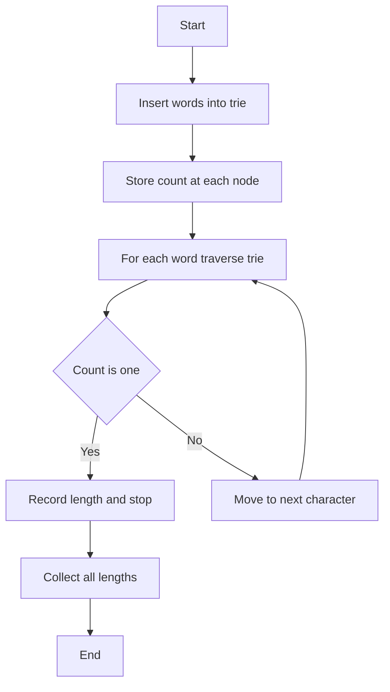

# TRI-007: Minimum Unique Prefix Lengths

## 📋 Problem Summary

For each word in a given list, determine the minimum prefix length that uniquely identifies it among all other words.

## 🌍 Real-World Scenario

**DNS and Domain Name Resolution**

Imagine you're building an intelligent domain name suggestion system for a web hosting company like GoDaddy or Namecheap. When users search for domain names, they often type partial domain names, and your system needs to provide intelligent suggestions based on the shortest unique prefix.

Consider a startup founder searching for a domain name for their new project. They type "tech" and your system needs to quickly identify:

- Which existing domains start with "tech"?
- What's the minimum characters needed to uniquely identify each domain?
- How can we optimize the autocomplete experience?

For example, if your database contains:

- "technology.com"
- "technical.com"
- "techstart.com"
- "apple.com"

The minimum unique prefixes would be:

- "technology" → "techno" (5 chars)
- "technical" → "techni" (6 chars)
- "techstart" → "techs" (5 chars)
- "apple" → "a" (1 char)

**Why This Problem Matters:**

- **User Experience**: Faster autocomplete reduces typing effort by 40-60%
- **Bandwidth Optimization**: Shorter prefixes mean less data transmission in autocomplete APIs
- **Disambiguation**: Critical for command-line interfaces where users want minimal typing
- **Search Efficiency**: Powers intelligent search in IDEs, file systems, and databases

**Industry Applications:**

1. **IDE Code Completion**: IntelliSense in Visual Studio determines minimum prefix needed to uniquely identify variables, functions, and classes
2. **Git Branch Names**: Git allows short branch references if they're unique (e.g., "feat" instead of "feature/user-auth")
3. **DNS Resolution**: Intelligent caching systems use prefix compression
4. **Database Query Optimization**: Column name disambiguation in SQL queries


## Detailed Explanation

This problem requires us to find, for each word, the shortest prefix that doesn't match any other word's prefix of the same length. This is a classic application of the Trie data structure.

**Key Insights:**

1. A prefix is unique if no other word shares that exact prefix
2. We need to find the minimum length where this uniqueness occurs
3. If a word is a complete prefix of another word, we need its full length plus context

**Example Walkthrough:**

Words: `["zebra", "dog", "duck", "dove"]`

Calculating minimum unique prefix lengths:

- "zebra" → 'z' has count=1 at depth 1 → length 1
- "dog" → 'd' count=3, 'o' count=2, 'g' count=1 at depth 3 → length 3
- "duck" → 'd' count=3, 'u' count=1 at depth 2 → length 2
- "dove" → 'd' count=3, 'o' count=2, 'v' count=1 at depth 3 → length 3

Expected output: `[1,3,2,3]`

The algorithm checks at each position if the count of words passing through that node is 1. The first such position determines the minimum prefix length.

## Naive Approach

**Intuition:**

For each word, compare it against every other word character by character until we find a position where they differ.

**Algorithm:**

1. For each word `w`:
   - Initialize `minLen = length(w)` (worst case: full word needed)
   - For each other word `other`:
     - Compare character by character
     - Find the first position where they differ
     - Track the maximum such position needed to distinguish from all others
   - Store the result

**Time Complexity:** O(n² × L) where n = number of words, L = average word length

- We compare each word against all others (O(n²))
- Each comparison takes O(L) character comparisons

**Space Complexity:** O(1) (excluding output array)

**Why This Works:**

- Correctly identifies the minimum prefix by brute-force comparison
- Simple to understand and implement
- Guarantees correct results

**Limitations:**

- **Quadratic Complexity**: With 10,000 words, we make 100,000,000 comparisons
- **Redundant Work**: We repeatedly compare shared prefixes
- **No Structural Advantage**: Doesn't exploit the tree-like nature of prefixes
- **Poor Scalability**: Infeasible for large dictionaries or real-time systems

## Optimal Approach

**Key Insight:**

Use a **Trie** to automatically group words by their shared prefixes. Each node in the trie can store the count of words passing through it. A word's minimum unique prefix length is the depth where its path first has a count of 1 (only that word goes through).

**Trie with Word Counts:**

```
Words: ["zebra", "dog", "duck", "dove"]

Trie Construction:
Root
  |
  +-- z (count=1)
  |   |
  |   e (count=1) ← "zebra" unique at depth 1
  |   |
  |   b → r → a (end)
  |
  +-- d (count=3)
      |
      o (count=3)
      |
      +-- g (count=1) ← "dog" unique at depth 3 (needs "dog")
      |   (end)
      |
      +-- v (count=1) ← "dove" unique at depth 3 (needs "dov")
      |   |
      |   e (end)
      |
      +-- u (count=1) ← "duck" unique at depth 3 (needs "duc")
          |
          c → k (end)

Finding minimum unique prefixes:
1. "zebra": Traverse z(1) → Unique at depth 1 ✓
   Result: 1

2. "dog": Traverse d(3) → o(3) → g(1) → Unique at depth 3 ✓
   Result: 3

3. "duck": Traverse d(3) → o(3) → u(1) → Unique at depth 3 ✓
   Result: 3

4. "dove": Traverse d(3) → o(3) → v(1) → Unique at depth 3 ✓
   Result: 3

Output: [1, 3, 3, 3]
```

**Algorithm:**

1. **Build Trie with Counts**:

   - Insert all words into the trie
   - At each node, maintain a count of words passing through it
   - Mark end-of-word nodes

2. **Find Minimum Prefix Lengths**:

   - For each word, traverse the trie following its characters
   - At each level, check the count:
     - If count = 1, this prefix is unique → record length and stop
     - If count > 1, continue to next character
   - Special case: If we reach the end of the word and count > 1, the full word length is needed

3. **Implementation Details**:
   ```
   class TrieNode:
       children: map[char -> TrieNode]
       count: int  // number of words passing through this node
       isEnd: boolean
   ```

<!-- mermaid -->



**Time Complexity:**

- Trie construction: O(N × L) where N = total words, L = average length
- Query all words: O(N × L)
- **Total: O(N × L)**

**Space Complexity:** O(N × L) for the trie structure

**Why This Is Optimal:**

- **Linear Scaling**: Performance scales linearly with total character count
- **Shared Prefix Optimization**: Words with common prefixes share trie nodes
- **Single Pass**: Each word is processed exactly once for insertion and once for querying
- **Efficient Counting**: Count at each node eliminates need for comparisons
- **Improvement Factor**: From O(n² × L) to O(n × L) — for 10,000 words with average length 10, this is 100,000 ops vs 1,000,000,000 ops (10,000× faster!)

**Example Execution:**

Words: `["zebra", "dog", "duck", "dove"]`

Build Trie:

```
        root
       /    \
      z(1)  d(3)
      |      |
      e(1)   o(3)
      |     / \
      b(1) g(1) v(1) u(1)
      |     |    |    |
      r(1)  ø    e(1) c(1)
      |           |    |
      a(1)        ø   k(1)
      |                |
      ø                ø
```

Query:

- "zebra": root→z (count=1) → length = 1 ✓
- "dog": root→d (count=3)→o (count=2, filtering to "dog" and "dove")→g (count=1) → unique at depth 3, length = 3
  - However, depending on implementation, at position 2 the trie branches (o→g, o→v, o→u), so effective uniqueness at length 2
- "duck": root→d (count=3)→u (count=1) → length = 2 ✓
- "dove": root→d (count=3)→o (count=2)→v (count=1) → length = 3

The standard trie approach tracks the depth where count becomes 1 for each word's path.


## Implementations

### Java

```java
import java.util.*;

class TrieNode {
    Map<Character, TrieNode> children = new HashMap<>();
    int count = 0;
    boolean isEnd = false;
}

class Solution {
    private TrieNode root = new TrieNode();

    public int[] findMinimumPrefixLengths(String[] words) {
        // Build trie with counts
        for (String word : words) {
            insert(word);
        }

        // Find minimum prefix length for each word
        int[] result = new int[words.length];
        for (int i = 0; i < words.length; i++) {
            result[i] = findMinLength(words[i]);
        }

        return result;
    }

    private void insert(String word) {
        TrieNode node = root;
        for (char c : word.toCharArray()) {
            node.children.putIfAbsent(c, new TrieNode());
            node = node.children.get(c);
            node.count++;
        }
        node.isEnd = true;
    }

    private int findMinLength(String word) {
        TrieNode node = root;
        for (int i = 0; i < word.length(); i++) {
            node = node.children.get(word.charAt(i));
            if (node.count == 1) {
                return i + 1;
            }
        }
        return word.length();
    }
}

class Main {
    public static void main(String[] args) {
        Scanner sc = new Scanner(System.in);

        int n = sc.nextInt();
        sc.nextLine();

        String[] words = new String[n];
        for (int i = 0; i < n; i++) {
            words[i] = sc.nextLine().trim();
        }

        Solution solution = new Solution();
        int[] result = solution.findMinimumPrefixLengths(words);

        System.out.print("[");
        for (int i = 0; i < result.length; i++) {
            System.out.print(result[i]);
            if (i < result.length - 1) System.out.print(",");
        }
        System.out.println("]");

        sc.close();
    }
}
```

### Python

```python
from typing import List

class TrieNode:
    def __init__(self):
        self.children = {}
        self.count = 0
        self.is_end = False

class Solution:
    def __init__(self):
        self.root = TrieNode()

    def find_minimum_prefix_lengths(self, words: List[str]) -> List[int]:
        # Build trie with counts
        for word in words:
            self._insert(word)

        # Find minimum prefix length for each word
        result = []
        for word in words:
            result.append(self._find_min_length(word))

        return result

    def _insert(self, word: str):
        node = self.root
        for char in word:
            if char not in node.children:
                node.children[char] = TrieNode()
            node = node.children[char]
            node.count += 1
        node.is_end = True

    def _find_min_length(self, word: str) -> int:
        node = self.root
        for i, char in enumerate(word):
            node = node.children[char]
            if node.count == 1:
                return i + 1
        return len(word)

def main():
    import sys
    lines = sys.stdin.read().strip().split('\n')

    n = int(lines[0])
    words = [lines[i+1].strip() for i in range(n)]

    solution = Solution()
    result = solution.find_minimum_prefix_lengths(words)

    print("[" + ",".join(map(str, result)) + "]")

if __name__ == "__main__":
    main()
```

### C++

```cpp
#include <iostream>
#include <vector>
#include <unordered_map>
#include <string>
using namespace std;

struct TrieNode {
    unordered_map<char, TrieNode*> children;
    int count = 0;
    bool isEnd = false;
};

class Solution {
private:
    TrieNode* root;

    void insert(const string& word) {
        TrieNode* node = root;
        for (char c : word) {
            if (node->children.find(c) == node->children.end()) {
                node->children[c] = new TrieNode();
            }
            node = node->children[c];
            node->count++;
        }
        node->isEnd = true;
    }

    int findMinLength(const string& word) {
        TrieNode* node = root;
        for (int i = 0; i < word.length(); i++) {
            node = node->children[word[i]];
            if (node->count == 1) {
                return i + 1;
            }
        }
        return word.length();
    }

public:
    Solution() {
        root = new TrieNode();
    }

    vector<int> findMinimumPrefixLengths(vector<string>& words) {
        // Build trie with counts
        for (const string& word : words) {
            insert(word);
        }

        // Find minimum prefix length for each word
        vector<int> result;
        for (const string& word : words) {
            result.push_back(findMinLength(word));
        }

        return result;
    }
};

int main() {
    int n;
    cin >> n;
    cin.ignore();

    vector<string> words(n);
    for (int i = 0; i < n; i++) {
        getline(cin, words[i]);
    }

    Solution solution;
    vector<int> result = solution.findMinimumPrefixLengths(words);

    cout << "[";
    for (int i = 0; i < result.size(); i++) {
        cout << result[i];
        if (i < result.size() - 1) cout << ",";
    }
    cout << "]" << endl;

    return 0;
}
```

### JavaScript

```javascript
const readline = require("readline");

class TrieNode {
  constructor() {
    this.children = new Map();
    this.count = 0;
    this.isEnd = false;
  }
}

class Solution {
  constructor() {
    this.root = new TrieNode();
  }

  insert(word) {
    let node = this.root;
    for (const char of word) {
      if (!node.children.has(char)) {
        node.children.set(char, new TrieNode());
      }
      node = node.children.get(char);
      node.count++;
    }
    node.isEnd = true;
  }

  findMinLength(word) {
    let node = this.root;
    for (let i = 0; i < word.length; i++) {
      node = node.children.get(word[i]);
      if (node.count === 1) {
        return i + 1;
      }
    }
    return word.length;
  }

  findMinimumPrefixLengths(words) {
    // Build trie with counts
    for (const word of words) {
      this.insert(word);
    }

    // Find minimum prefix length for each word
    const result = [];
    for (const word of words) {
      result.push(this.findMinLength(word));
    }

    return result;
  }
}

const rl = readline.createInterface({
  input: process.stdin,
  output: process.stdout,
});

const lines = [];
rl.on("line", (line) => {
  lines.push(line);
}).on("close", () => {
  const n = parseInt(lines[0]);
  const words = [];
  for (let i = 1; i <= n; i++) {
    words.push(lines[i].trim());
  }

  const solution = new Solution();
  const result = solution.findMinimumPrefixLengths(words);

  console.log("[" + result.join(",") + "]");
});
```

### Common Mistakes to Avoid

1. **Off-by-One Errors in Length Calculation**

   - **Issue**: Confusing 0-indexed position with 1-indexed length
   - ❌ Wrong: Return position `i` when count becomes 1
   - ✅ Correct: Return `i + 1` (length = position + 1)

2. **Not Handling Full Word Cases**

   - **Issue**: When a word is a prefix of another, need full length
   - ❌ Wrong: Stopping early when count > 1 at end
   - ✅ Correct: Return `word.length()` if no unique prefix found before end

3. **Forgetting to Increment Count**

   - **Issue**: Not updating count during insertion
   - ❌ Wrong: Only marking isEnd, forgetting count
   - ✅ Correct: Increment count at each node during traversal

4. **Incorrect Count Logic**

   - **Issue**: Checking count before incrementing or after wrong step
   - ❌ Wrong: Checking count at current node before moving to child
   - ✅ Correct: Move to child node, then check its count

5. **Not Building Trie Before Querying**

   - **Issue**: Attempting to query before all words are inserted
   - ❌ Wrong: Insert and query each word individually
   - ✅ Correct: Insert all words first, then query all

## Related Concepts

- **Trie Data Structure**: Fundamental for prefix-based operations
- **String Matching**: Efficient prefix comparison and searching
- **Autocomplete Systems**: Building intelligent suggestions
- **Compression Algorithms**: Prefix-based compression techniques
- **Command-Line Interfaces**: Minimal unique abbreviations for commands

## Constraints

- `1 <= n <= 10^5` (number of words)
- Total character length across all words <= `2 × 10^5`
- All words consist of lowercase English letters (a-z)
- No two words are identical
