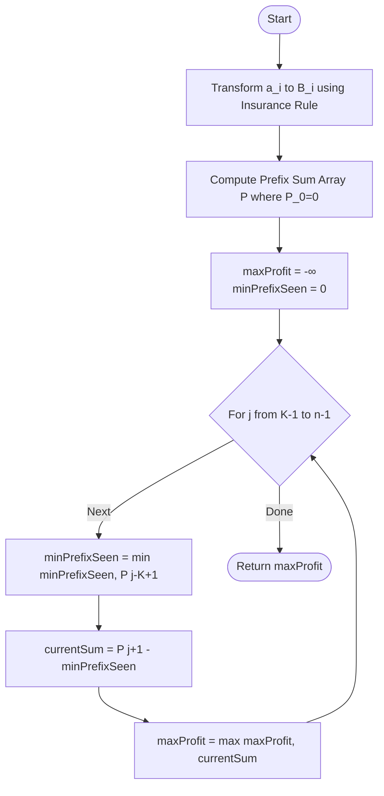

# ARR-001: Seasonal Profit Window

## 📋 Problem Summary

Given an array of daily profit values (which can be positive or negative), you need to find the maximum **Adjusted Profit Sum** for any continuous subarray of length at least $K$.

**The Adjustment Rule (Loss Mitigation):**

- **Positive Profit ($x \ge 0$):** Use the full value.
- **Negative Profit (Loss, $x < 0$):** The loss is "dampened" to $-\lceil |x| / 2 \rceil$.
  - (Essentially, an insurance policy covers roughly half of your loss).

**Goal:** Find indices $i, j$ such that the length $j - i + 1 \ge K$ and the sum of adjusted values is maximized.

## 🌍 Real-World Scenarios

**Scenario 1: 🌦️ The Solar Power Farm (Bad Weather Insurance)**
A solar farm generates revenue on sunny days. On stormy days, it incurs maintenance costs (negative profit). However, the farm has "Weather Insurance" that pays out 50% of any daily maintenance cost exceeding \$0. The manager needs to pick the most profitable $K$-day window to showcase the farm's potential to investors.

**Scenario 2: 📦 Logistics Shipping Buffer**
A shipping company tracks daily fuel costs and revenue. They have a "Fuel Hedge" agreement where the provider covers half of the cost when gas prices spike (negative daily net). To optimize their operations, the company identifies the best multi-week segment (at least $K$ days) of their historical data to use for future bidding.

**Scenario 3: 🎮 RPG Stamina Management (Rest Bonus)**
In a role-playing game, your character earns Gold ($>0$) by fighting monsters but loses Stamina ($<0$) while moving. However, a "Resilience" skill reduces all stamina losses by half (rounded up). A player wants to find the longest sequence of rooms (at least $K$) along their path that results in the highest "Net Gain."

**Scenario 4: 🏦 Flexible Mortgage Interest**
A consumer has a flexible interest account. On some days, the interest earned is positive. On "Market Dip" days, the account is charged. However, a "Safety Net" clause ensures that the bank only charges half of the market dip value. The user wants to analyze their account's performance over various $K$-day windows.

**Scenario 5: 🏥 Clinical Trial Health Index**
A patient's health is measured daily. Treatment cycles (positive) improve health, while side effects (negative) reduce it. A "Support Medication" mitigates the impact of side effects by half. Researchers look for the "High Recovery Phase"—the longest segment (at least $K$ days) with the highest total adjusted health improvement.

### Real-World Relevance

This problem addresses **Mitigated Risk Analytics**. In reality, losses are often cushioned by insurance, hedging, or structural safety nets. Solving for a "Maximum Subarray" with a "Minimum Length" allows businesses to filter out short-term noise and identify sustained periods of productivity.

## 🚀 Detailed Explanation

### 1. Step 1: Normalizing the Data

Before solving for the maximum sum, we must transform the input array into an "Adjusted Array" $B$.
$$B[i] = \begin{cases} a[i] & \text{if } a[i] \ge 0 \\ -\lceil |a[i]| / 2 \rceil & \text{if } a[i] < 0 \end{cases}$$

**Integer Calculation Tip:** $\lceil |x| / 2 \rceil$ can be calculated reliably using integer division: `(abs(x) + 1) // 2`.

### 2. Step 2: Managing the Length Constraint ($len \ge K$)

A standard Maximum Subarray problem (Kadane’s) doesn't handle length constraints easily. To manage the "At Least $K$" rule efficiently ($O(N)$), we use **Prefix Sums**.

Let $P[x]$ be the sum of elements $B[0 \dots x-1]$, with $P[0] = 0$.
The sum of a subarray $[i, j]$ is $P[j+1] - P[i]$.
To maximize this while ensuring $len \ge K$:

1. Fix the end point $j$.
2. The length condition $j - i + 1 \ge K$ means $i \le j - K + 1$.
3. We want to maximize $P[j+1] - P[i]$ for $i \in \{0, 1, \dots, j-K+1\}$.
4. This is equivalent to finding the **minimum** $P[i]$ in that valid range and subtracting it from $P[j+1]$.

### 3. Step 3: The Sliding Minimum

As we move $j$ from $K-1$ to $n-1$:

- The "valid set" of starting indices $i$ expands by one each time.
- We don't need to re-scan the prefix sums. We just keep a variable `min_p` that tracking the smallest prefix sum we've seen in the valid zone so far.

### 🔄 Algorithm Flow Diagram

## 🔍 Complexity Analysis

### Time Complexity: $O(N)$

- **Transformation:** $O(N)$ one pass.
- **Prefix Sums:** $O(N)$ one pass.
- **Optimized Scan:** $O(N)$ one pass.
- For $N=200,000$, total operations $\approx 600,000$, taking roughly $0.05$ seconds.

### Space Complexity: $O(N)$

- We need to store the prefix sum array $P$ of size $N+1$.
- No other significant memory is required.

## 🧪 Edge Cases & Testing

### 1. All Negative Adjusted Profits

- **Input:** $A = [-10, -20, -30], K=1$
- **Logic:** $B = [-5, -10, -15]$. The max subarray is just the least negative element $(-5)$.
- **Wait:** The algorithm will correctly handle this because `maxProfit` starts at $-\infty$.

### 2. $K = N$ (Fixed Length)

- **Input:** $A = [1, 2, 3], K=3$
- **Logic:** The loop for $j$ only runs once ($j=2$). It subtracts $P[0]$ (which is 0) from $P[3]$. Result is the total sum of the array.

### 3. $K = 1$ (Classic Maximum Subarray)

- **Logic:** This reduces the problem to finding the max value of $P[j+1] - \min(P[0 \dots j])$. This is the mathematical definition of standard Kadane's.

### 4. Large Positive and Negative Spikes

- **Input:** $A = [10^9, -10^9, 10^9], K=2$
- **Logic:** Summing $10^9$ values $200,000$ times can reach $2 \times 10^{14}$.
- **Warning:** Ensure you use **64-bit integers** (`long` / `int64`) for both prefix sums and the final answer.

### 5. Array of Zeros

- **Input:** `[0, 0, 0], K=2`
- **Output:** 0.

## ⚠️ Common Pitfalls & Debugging

**1. The "Off-by-One" Prefix**

- **Pitfall:** `P[j] - minPrefix`.
- **Reason:** $P[j]$ covers only up to index $j-1$. For a subarray ending at $j$, you need $P[j+1]$.
- **Correct Mapping:** End at $j$ $\implies$ Use $P[j+1]$. Start at $i$ $\implies$ Subtract $P[i]$.

**2. Ceiling Implementation**

- **Pitfall:** `Math.ceil(x / 2)` in some languages returns 0 for negative $x$ if not careful.
- **Correct Integer Logic:** For $|x|$, use `(abs(x) + 1) / 2`. The result is then made negative.

**3. Initializing `maxProfit` with 0**

- **Pitfall:** `maxProfit = 0`.
- **Consequence:** If all possible adjusted sums are negative (e.g., array `[-10, -20]`), your code will incorrectly return 0.
- **Fix:** Initialize with the smallest possible value (`-1e18` or `Long.MIN_VALUE`).

**4. Not Handling the Absolute Value first**

- **Pitfall:** `ceil(x / 2)` where $x$ is negative.
- **Formula Check:** The rule specifies $\lceil |x| / 2 \rceil$. Always take absolute value before ceiling.

## 🎯 Variations & Extensions

### Variation 1: Exactly Length $K$

Find the max sum of a subarray with length **exactly** $K$.
_Solution: Simple sliding window of size $K$._

### Variation 2: At Most Length $K$

Find the max sum of a subarray with length **at most** $K$.
_Solution: Monotonic queue optimized sliding window._

### Variation 3: Multiple Insurance Tiers

Losses between $0 \dots 100$ are half-insured; losses $> 100$ are 75% insured.

### Variation 4: Multi-Subarray Window

Find two non-overlapping windows of length $\ge K$ with max total sum.

### Variation 5: Dynamic Updates

What if daily profits change? (Requires Segment Tree).

## 🎓 Key Takeaways

1. **Normalization is Half the Battle:** Handling complex business rules (like insurance) is just a pre-processing step.
2. **Prefix Sum Subtraction:** A powerful $O(N)$ alternative to Kadane's when length constraints are present.
3. **Running Minimum:** Instead of nested loops, use a single variable to track the "best candidate" for subtraction.
4. **Integer Safety:** $10^9$ values over $200,000$ points always require 64-bit precision.

## 📚 Related Problems

- **Maximum Subarray (LeetCode 53):** The simplest version.
- **Maximum Sum of Subarray of Length K:** Fixed-length version.
- **Smallest Subarray with Sum > S:** Sliding window version.
- **Maximum Sum Rectangle:** 2D version.
- **ARR-042:** Probabilistic Weights (Another conversion + Kadane variant).
