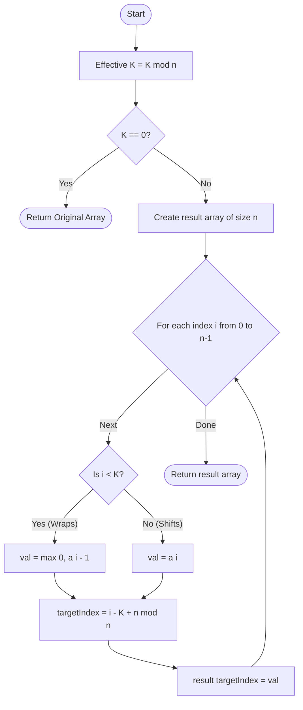

# ARR-004: Left Rotation with Loss

## 📋 Problem Summary

You are given an array of $n$ non-negative integers and a rotation factor $K$. The task is to rotate the array **left** by $K$ positions. However, this is a "leaky" rotation: any element that "wraps around" from the front of the array to the back is penalized.

**The Rules:**

1. Determine the effective rotation $K_{eff} = K \pmod n$.
2. Every element that was originally at an index $i < K_{eff}$ will eventually land at the end of the array.
3. These "wrapping" elements each lose $1$ unit of value, but their value cannot drop below $0$.
4. Elements that shift left without wrapping (original index $i \ge K_{eff}$) retain their original value.

**Example:**
Input: `n=5, K=2`, Array: `[3, 0, 2, 5, 1]`

- $K = 2$. Elements at index 0 (`3`) and 1 (`0`) will wrap.
- `3` becomes `2`.
- `0` remains `0` (floor at 0).
- Rotated Result: `[2, 5, 1, 2, 0]`

## 🌍 Real-World Scenarios

**Scenario 1: 🏭 The Circular Conveyor Belt Decay**
In a circular assembly line, items (represented by their quality score) are shifted to the left to reach a workstation. To make room for new items, the items currently in the first $K$ slots must be picked up and placed at the back of the line. The mechanical grippers are slightly rough, causing a "scuff" that reduces the quality score of these specific items by 1 for every wrap.

**Scenario 2: 📸 Digital Video Frame Buffering**
A video stream uses a circular buffer to store frames. When shifting frames to the left to make room for new data, the frames that are pushed "around the loop" undergo one extra round of compression, slightly degrading their quality (luminance value $-1$). We want to see the state of the buffer after $K$ such shifts.

**Scenario 3: 📦 Inventory Batch Hand-offs**
A warehouse has a circular sorting track. Each time a batch is rotated to a different zone, the batches that pass through the "Loading Chute" (wrap-around point) lose a unit of packaging integrity due to height drops. Tracking the "health" of each batch helps in assessing which items need repackaging.

**Scenario 4: 🔌 Power Grid Pulse Aging**
In a pulse-width modulation system, a series of electrical signals is rotated through different capacitors. Passing through the "Reset" terminal (index wrap) causes a minor voltage drop due to discharge. The system needs to predict the final voltage state after $K$ resets.

**Scenario 5: 🎮 Game Durability Mechanic**
A character has a circular "Quick Item" belt. Rotating the belt requires the item to pass through a mechanical fastener. Each pass through the fastener reduces the durability of the items by 1. A player wants to know the durability of all items after spinning the belt $K$ times.

### Real-World Relevance

This problem models **Entropy in Circular Systems**. In the real world, moving data or objects across a boundary often incurs a cost (friction, data loss, compression artifacts). Identifying which specific elements cross that boundary is fundamental to system simulation.

## 🚀 Detailed Explanation

### 1. The Math of Rotation

Left rotation shifts indices to the left. If an element is at index $i$, and we shift it by $K$, its new position is:
$$\text{new\_index} = (i - K) \pmod n$$

In most programming languages, `(i - K) % n` can result in a negative number if $i < K$. To fix this, we use the "Safe Modulo" formula:
$$\text{new\_index} = (i - K + n) \pmod n$$

### 2. Identifying the "Vulnerable" Elements

When we rotate left by $K$, which elements cross the boundary?

- The element at index 0 moves to the back.
- The element at index 1 moves to the second-to-last spot.
- ...
- The element at index $K-1$ moves to the $K$-th spot from the back.

Therefore, the **first $K$ elements** of the _original_ array are the ones that wrap around and take the penalty.

### 3. The Logic Flow

1. **Normalize $K$:** Since rotating $n$ times is equivalent to a full circle, $K = K \pmod n$.
2. **Handle $K=0$:** If $K=0$, no rotation happens, and no elements wrap. Return the original array.
3. **The Transformation:**
   - For each index $i$ in the original array:
     - Determine if $i < K$.
     - If yes, `value = max(0, original_value - 1)`.
     - If no, `value = original_value`.
     - Place this `value` at `(i - K + n) % n`.

### 🔄 Algorithm Flow Diagram

## 🔍 Complexity Analysis

### Time Complexity: $O(N)$

- **Initialization:** $O(1)$ to calculate $K \pmod n$.
- **Iteration:** A single pass of $n$ elements to calculate new values and positions.
- **Total:** $O(N)$. For $N=200,000$, this takes roughly $0.02$ seconds.

### Space Complexity: $O(N)$

- We need to create a new array of size $n$ to store the rotated result, as we cannot easily modify the array in-place without losing values we haven't processed yet.
- Internal variables take $O(1)$ space.

## 🧪 Edge Cases & Testing

### 1. $K = 0$

- **Input:** `[10, 20, 30], K=0`
- **Logic:** $K \pmod 3 = 0$. No elements satisfy $i < 0$. Result: `[10, 20, 30]`.

### 2. $K = N$

- **Input:** `[10, 20, 30], K=3`
- **Logic:** $K \pmod 3 = 0$. This reduces to the $K=0$ case. Even though "all" elements wrapped if you think about it physically, the problem says $K = K \pmod n$ applies first ($K = 0$).

### 3. $K > N$

- **Input:** `[1, 2], K=5`
- **Logic:** $5 \pmod 2 = 1$. This is equivalent to rotating left by 1.

### 4. Elements at 0 Value

- **Input:** `[0, 5], K=1`
- **Logic:** The `0` wraps. $0 - 1 = -1$, but the floor is 0. Result: `[5, 0]`.

### 5. Large Array, Large $K$

- **Input:** $N=200,000, K=10^9$.
- **Logic:** $10^9 \pmod{200,000} = 0$. No change.

### 6. Array of Size 1

- **Input:** `[5], K=1`
- **Logic:** $1 \pmod 1 = 0$. No change.

## ⚠️ Common Pitfalls & Debugging

**1. The "Multiple Wraps" Trap**

- **Pitfall:** Thinking that $K=5$ on $N=2$ means one element wraps 3 times (and loses 3 value).
- **Correction:** The problem states "Let $K = K \pmod n$. Any element originally in positions $1 \dots K$ is decreased by 1." This implies a single shift operation happens after normalizing $K$.

**2. Negative Modulo in C++/Java**

- **Pitfall:** `(-2 % 5)` might return `-2`.
- **Correction:** Always use the formula `(i - K + n) % n` to ensure the index stays positive.

**3. In-Place Modification**

- **Pitfall:** Trying to rotate use `arr[i] = arr[new_idx]`.
- **Result:** You will overwrite a value at `new_idx` before you've had a chance to move it to its own new target.
- **Fix:** Use a temporary array or the "Three Reversals" trick (though the "Three Reversals" trick needs adjustment for the loss logic).

**4. 1-Based vs 0-Based**

- The problem description uses $1 \dots K$ conceptually, but arrays are $0$-indexed. Index $1$ in 1-based is index $0$ in 0-based. Elements originally at $0, 1, \dots, K-1$ are the ones that lose value.

## 🎯 Variations & Extensions

### Variation 1: Multi-Wrap Loss

What if for every $n$ rotations, a wrap counts as another loss?
_Solution: loss = $K / n$. Then apply one more loss for $i < (K \pmod n)$._

### Variation 2: Right Rotation with Gain

Rotating right makes elements that "wrap from back to front" _gain_ 1 value.

### Variation 3: Conditional Loss

Only elements with value $> X$ lose value when wrapping.

### Variation 4: Circular Buffer Decay

Every time an element is accessed/rotated, its value decays by a percentage instead of a fixed amount.

### Variation 5: No-Floor Decay

Values can go negative when wrapping.

## 🎓 Key Takeaways

1. **Modulo Normalization:** Always simplify $K$ relative to $n$ for periodic operations.
2. **Boundary Identification:** In rotation problems, the "wrappers" are always the first $K$ or last $K$ elements.
3. **Safe Index Mapping:** Use `(i + diff + n) % n` to move around a circle safely.
4. **Constraints Matter:** The "floor at 0" rule is a simple `max(0, val)` in code but is crucial for correctness.

## 📚 Related Problems

- **Left Rotation (HackerRank/LeetCode):** The basic version without loss.
- **Rotate Image:** 2D version of array rotation.
- **Circular Array Loop:** Finding patterns in circular movement.
- **Josephus Problem:** Another classic circular elimination challenge.
- **ARR-003:** Alternating Parity (Checking properties during iteration).
