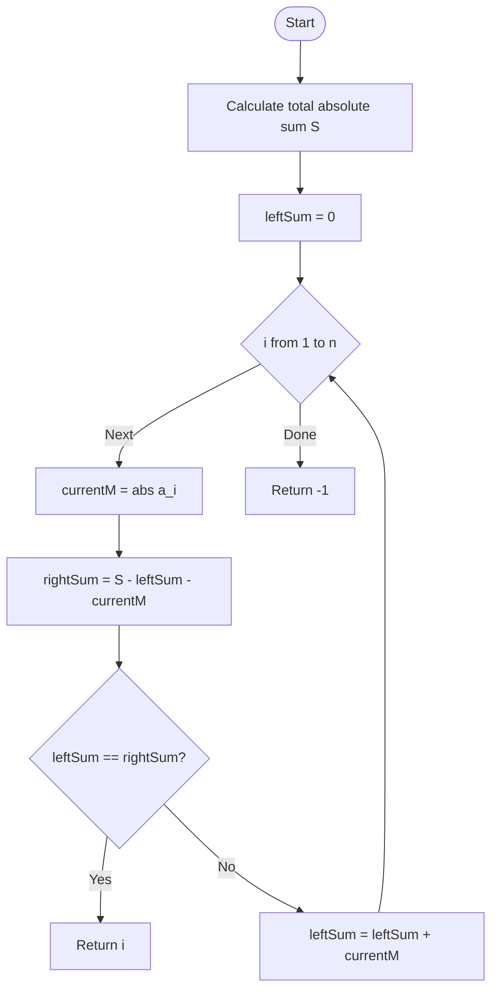

# ARR-007: Array Temperature Balance

## 📋 Problem Summary

Given an array of $n$ integers, identify the **pivot index** $i$ (1-based) such that the sum of the **absolute values** of all numbers to the left of $i$ is exactly equal to the sum of the absolute values of all numbers to the right of $i$.

**Key Rules:**

1. Transform every element $a_j$ to its absolute value $|a_j|$ (effectively treating all values as positive "mass").
2. The element at index $i$ is **excluded** from both the left and right sums.
3. If multiple such indices exist, return the smallest one.
4. If no such index exists, return $-1$.

**Example:**
Input: `[1, -1, 2, -2]`

- Absolute values: `[1, 1, 2, 2]`
- At index 3 (value 2):
  - Left Sum ($|1| + |-1| = 2$)
  - Right Sum ($|-2| = 2$)
  - $2 = 2$. Success!
    Output: 3

## 🌍 Real-World Scenarios

**Scenario 1: ⚖️ The Seesaw Fulcrum (Uniform Mass)**
Imagine a beam with weights placed at fixed intervals. In this specific physics model, the direction of a weight $(+/-)$ doesn't matter; only its mass $(\text{absolute value})$ contributes to the balance. You want to find the exact point to place a fulcrum so that the mass on the left perfectly balances the mass on the right.

**Scenario 2: 🚚 Cargo Truck Axle Loading**
A logistics manager loads $n$ crates onto a truck bed. Each crate has a weight. To prevent the truck from tipping or putting too much stress on one axle, they need to find a "neutral point" where the weight distribution of the crates ahead of that point equals the weight distribution of the crates behind it.

**Scenario 3: 🔋 Battery Bank Thermal Dissipation**
A series of $n$ battery cells generates heat (given as deviation from baseline, so $+/-$). The cooling system is most efficient if we find a "thermal center"—a cell where the total magnitude of heat generated by cells to its left equals the total magnitude to its right.

**Scenario 4: 🏢 Office Space "Commute Neutrality"**
Employees live at different coordinates along a single long road (offset by positive or negative distances from the main office). The company wants to open a satellite office at the home of one employee such that the total distance traveled by employees living "Up" the road to reach the office equals the total distance traveled by those living "Down" the road.

**Scenario 5: 🎻 String Instrument Vibration Node**
On a vibrating string with discrete weight points, a "node" is a point where the tension-mass to the left balances the tension-mass to the right. Finding the primary pivot point helps in modeling the string's harmonic frequencies.

### Real-World Relevance

This is the discrete version of finding the **Center of Mass** for a 1D object. In computer science, this "Equilibrium Point" is a standard way to partition work in parallel systems (ensuring both "halves" of a task have equal weight).

## 🚀 Detailed Explanation

### 1. The Mathematical Foundation

Let $M_j = |a_j|$ be the "mass" of each element.
We are looking for an index $i$ such that:
$$\sum_{j=1}^{i-1} M_j = \sum_{j=i+1}^{n} M_j$$

### 2. The Efficiency Problem

- **Naive approach:** For every $i$, calculate the two sums manually.
  - Time: $O(n^2)$. For $200,000$ elements, this is $40$ billion operations—impossible.
- **Optimized approach:** Notice that as we move from index $i$ to index $i+1$, the sums change in a predictable way.

### 3. The One-Pass Strategy

1. **Total Mass:** Calculate $S = \sum_{j=1}^{n} |a_j|$ in one pass.
2. **Iterate and Subtract:**
   - Keep track of `leftSum` (initially 0).
   - At each index $i$:
     - The mass at the current index is $currentMass = |a_i|$.
     - The `rightSum` is then: $S - leftSum - currentMass$.
     - If `leftSum == rightSum`, you've found the pivot!
     - If not, update `leftSum = leftSum + currentMass` and continue.

### 🔄 Algorithm Flow Diagram

## 🔍 Complexity Analysis

### Time Complexity: $O(N)$

- Pass 1: Summing absolute values takes $O(N)$.
- Pass 2: Finding the equilibrium point takes $O(N)$.
- Total: $2N$ operations, which is $O(N)$. For $200,000$, this is less than $0.05$ seconds.

### Space Complexity: $O(1)$

- We only store a few variables (`S`, `leftSum`, `rightSum`, `currentM`).
- We do not require extra arrays to store prefix sums, though you _could_ use one.

## 🧪 Edge Cases & Testing

### 1. Pivot at Index 1

- **Input:** `[10, 0, 0]`
- **Logic:** `S = 10`. At $i=1$: `leftSum=0`, `currentM=10`, `rightSum=10-0-10=0`.
- **Match:** $0 = 0$. Return 1.

### 2. Pivot at the Last Index

- **Input:** `[0, 0, 10]`
- **Logic:** $S = 10$. At $i=3$: `leftSum=0`, `currentM=10`, `rightSum=10-0-10=0`. Return 3.

### 3. Array with All Zeros

- **Input:** `[0, 0, 0]`
- **Logic:** Every index is a valid pivot. Smallest is 1.

### 4. No Valid Pivot

- **Input:** `[1, 2, 3]`
- **Logic:** $S=6$.
  - $i=1: 0 \neq 5$
  - $i=2: 1 \neq 3$
  - $i=3: 3 \neq 0$
- **Result:** -1.

### 5. Large Values

- **Input:** $a_i = 10^9$.
- **Logic:** $S$ can be $200,000 \times 10^9 = 2 \times 10^{14}$. This overflows a 32-bit integer.
- **Fix:** Use **64-bit integers** (`long` / `int64`).

### 6. Negative Peaks

- **Input:** `[5, -10, 5]`
- **Logic:** $|-10|=10$. Left=5, Right=5. Index 2 (1-based) is the pivot.

## ⚠️ Common Pitfalls & Debugging

**1. Including the Pivot in the Sum**

- **Pitfall:** `leftSum + currentM == rightSum`.
- **Reason:** The problem states "The element at index $i$ is not included in either sum."

**2. 0-based vs 1-based Indexing**

- **Pitfall:** Returning $i$ from a 0-indexed loop.
- **Correction:** The problem asks for 1-based indexing in output.

**3. Integer Overflow**

- **Pitfall:** Calculating `totalSum` using `int`.
- **Correction:** Use a `long` for the sum.

**4. Not using Absolute Values**

- **Pitfall:** Using $a_i$ directly.
- **Result:** You would be finding a standard prefix equilibrium point, which is a different problem entirely.

## 🎯 Variations & Extensions

### Variation 1: Multiple Equilibrium Points

Find ALL indices that satisfy the condition.

### Variation 2: Finding the Median Pivot

Find an index $i$ such that the element $a_i$ is _included_ in the smaller of the two sums to make them as equal as possible.

### Variation 3: 2D Center of Mass

Find a cell $(r, c)$ in a matrix such that the mass in the 4 quadrants around it is balanced.

### Variation 4: Minimum Difference Pivot

If no perfect equilibrium exists, find the index that minimizes `abs(leftSum - rightSum)`.

### Variation 5: Weight-Modified Equilibrium

Each element has a "distance" from the center as well as a mass (Torque balance).

## 🎓 Key Takeaways

1. **The Inverse Scan:** Total sum minus left sum is an $O(1)$ way to get the right sum.
2. **Symmetry:** Equilibrium problems are usually $O(N)$ because the state transition is simple.
3. **Excluded Pivot:** Pay close attention to whether the center point is part of the "Balance" or the "Fulcrum."
4. **Absolute Scaling:** Transforming input (like taking absolute values) should be done as part of the scan to keep space complexity at $O(1)$.

## 📚 Related Problems

- **Pivot Index (LeetCode 724):** The non-absolute version of this problem.
- **Find the Middle Index in Array:** Identical logic.
- **Product of Array Except Self:** Another problem using prefix/suffix concepts.
- **Trapping Rain Water:** Uses prefix/suffix maxes (similar "two-pass" scan).
- **ARR-002:** First Stable Increase (Checking window properties).
