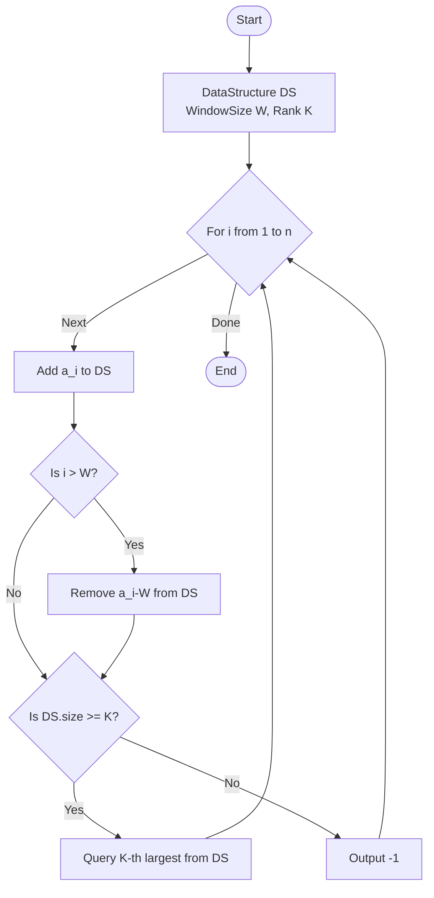

# ARR-012: K-th Largest with Time Window

## 📋 Problem Summary

Given an array of $n$ integers, you need to find the $K$-th largest value in every sliding window of size $W$ that ends at each index $i$.

**Key Rules:**

1. The window for index $i$ is defined as the slice $[L, i]$ where $L = \max(1, i - W + 1)$.
2. If the current number of elements in the window is less than $K$, output $-1$.
3. The $K$-th largest is calculated by sorting the window in descending order and picking the element at position $K$.

**The Challenge:**
A naive approach (sorting the window every time) is $O(n \cdot W \log W)$. Since $n, W \le 200,000$, this leads to $O(n^2)$, which is too slow. You need an approach close to $O(n \log W)$ or $O(n \sqrt{N})$.

## 🌍 Real-World Scenarios

**Scenario 1: 🏆 Real-Time Competitive Leaderboard**
In an online game, a "Performance Score" is calculated for every match. The game displays the $K$-th best performance of a player within their last 50 matches ($W=50, K$). This helps players understand their "Consistency Rank" rather than just their peak or average.

**Scenario 2: 🌡️ Industrial Sensor Noise Filtering**
A temperature sensor in a nuclear reactor provides a reading every second. To filter out random spikes (outliers), the system looks at the last 60 readings ($W=60$) and takes the $10$-th largest value as a "Robust High-Temperature" metric.

**Scenario 3: 📈 Stock Market "High-Water Mark" Alerts**
A trading bot monitors the price of a stock. It triggers an alert if the current price falls below the $K$-th largest price recorded in the last $W$ minutes. This helps identify when a stock is losing its recent momentum.

**Scenario 4: 🎥 Video Streaming Buffer Stability**
A video player tracks the download speed of the last $W$ chunks. To decide which resolution to stream (4K, 1080p, etc.), it uses the $K$-th largest (or $K$-th percentile) speed to ensure it doesn't pick a quality higher than the network can consistently sustain.

**Scenario 5: 🚦 Traffic Congestion Analysis**
GPS data tracks the speeds of vehicles passing a checkpoint. For Every vehicle $i$, the system calculates the $K$-th largest speed of the last 1000 cars. If this value drops significantly, it signals a transition from "Free Flow" to "Congested" traffic.

### Real-World Relevance

This problem addresses **Dynamic Rank Estimation**. Sliding windows combined with order statistics are the foundation of **Robust Signal Processing**. Unlike the mean (which is affected by outliers), rank-based metrics (like the median or $K$-th largest) provide a stable view of a moving data stream.

## 🚀 Detailed Explanation

### 1. The Sliding Window Mechanism

As we move from index $i$ to $i+1$:

- We **Add** one element: $a[i+1]$.
- If the window size is already $W$, we **Remove** one element: $a[i+1-W]$.

We need a data structure that can handle these additions and removals while always allowing us to find the $K$-th largest element quickly.

### 2. Candidate Data Structures

#### A. Balanced Binary Search Tree (BST) / Multiset

Indices are added to a BST. If the BST supports **Order Statistics** (tracking the size of subtrees), we can find the $K$-th element in $O(\log W)$.

- _Note:_ In C++, `std::multiset` does not support $O(\log N)$ rank queries. You would need a custom **Order Statistic Tree** or a indexed balanced tree.

#### B. The Dual-Heap (or Multi-Heap) Approach

Similar to finding the median using two heaps (min-heap and max-heap):

- Maintain two sets: `small` (the smallest elements) and `large` (the $K$ largest elements).
- `large` is a min-priority queue (so the $K$-th largest is on top).
- `small` is a max-priority queue.
- Rebalance after every add/remove to ensure `large` always has exactly $K$ elements.

#### C. Segment Tree on Values

If you coordinate compress the absolute values, you can use a Segment Tree where each node stores the count of numbers in its range. The $K$-th largest is found by traversing down the tree based on counts.

### 🔄 Algorithm Flow Diagram

## 🔍 Complexity Analysis

### Time Complexity: $O(N \log W)$

- Each element is Added once and Removed once.
- Using an Order Statistic Tree or balanced Multi-Heaps, both Add and Remove are $O(\log W)$.
- Finding the $K$-th largest is $O(\log W)$ or $O(1)$.
- Total: $O(N \log W)$. For $N=200,000$ and $W=200,000$, this is roughly $4 \times 10^6$ operations.

### Space Complexity: $O(W)$

- We only need to store the elements currently in the window.
- Total space: $O(W)$.

## 🧪 Edge Cases & Testing

### 1. $K = 1$

- **Scenario:** Find the maximum in the window.
- **Optimization:** Can be solved with a simple Monotonic Queue in $O(N)$.

### 2. $K = W$

- **Scenario:** Find the minimum in the window.
- **Optimization:** Can be solved with a simple Monotonic Queue in $O(N)$.

### 3. $W = n$

- **Scenario:** The window keeps growing until it covers the whole array. No elements are ever removed.

### 4. Duplicate Values

- **Input:** `[5, 5, 5], K=2, W=3`
- **Logic:** Window at 3 is `[5, 5, 5]`. 2nd largest is `5`.
- **Requirement:** Your data structure must handle duplicates (e.g., using a `multiset` or frequency map).

### 5. $K > \text{Window Size}$

- **Logic:** The problem states: "If window length is less than $K$, output -1."
- **Note:** This occurs at the very beginning of the array ($i < K$).

### 6. Negative Values

- **Handling:** Ensure comparisons work correctly for negative numbers.

## ⚠️ Common Pitfalls & Debugging

**1. Deleting the Wrong Duplicate**

- **Pitfall:** Using `multiset.erase(value)` in C++.
- **Consequence:** This removes ALL instances of `value`. You only want to remove ONE.
- **Fix:** Use `st.erase(st.find(value))`.

**2. Off-by-One Windows**

- **Pitfall:** Removing $a[i-W-1]$ or $a[i-W+1]$.
- **Check:** If $W=3$, at $i=4$ (1-based), the window is $[2, 3, 4]$. The element to remove is $a[1]$. So use $a[i-W]$.

**3. Integer Overflow**

- **Note:** Comparing $10^9$ values is safe for primitive comparisons. No summation is happening here, so $10^9$ fits in standard `int`.

**4. Performance of `priority_queue`**

- **Pitfall:** `std::priority_queue` does not support removing arbitrary elements.
- **Fix:** Use two multisets or a balanced BST that supports rank. Alternatively, use a "Lazy Removal" heap where you check if the top element is actually valid.

## 🎯 Variations & Extensions

### Variation 1: Sliding Window Median

Find the median for every window. (This is $K = W/2$ or similar).

### Variation 2: K-th Smallest

Flip the logic or sort order.

### Variation 3: Dynamic $K$ and $W$

The parameters $K$ and $W$ change for every index $i$. (Requires Persistent Segment Tree or Fenwick Tree on values).

### Variation 4: Multi-criteria Rank

Calculate the rank based on two values (e.g., Primary: Score, Secondary: Time).

### Variation 5: Rolling Percentile

Find the top 10% value in the last $W$ elements.

## 🎓 Key Takeaways

1. **Dynamic Rank Tracking:** Heaps are good for min/max, but Order Statistic Trees are better for arbitrary $K$.
2. **Maintenance Cost:** Adding/Removing from a window is as important as Querying.
3. **Identity of Window:** Use $i-W$ logic to identifying the "expired" element in the sliding stream.
4. **Duplicates:** Always assume data is not unique and use structures (Multisets) that respect multiplicity.

## 📚 Related Problems

- **Sliding Window Median (LeetCode 480):** Higher difficulty version.
- **Sliding Window Maximum:** The simplified $K=1$ case.
- **K-th Largest Element in a Stream (LeetCode 703):** Unlimited window size ($W=N$).
- **Find Median from Data Stream:** $W=N$ case.
- **ARR-020:** Sliding Window Dominance (Finding majority in window).
