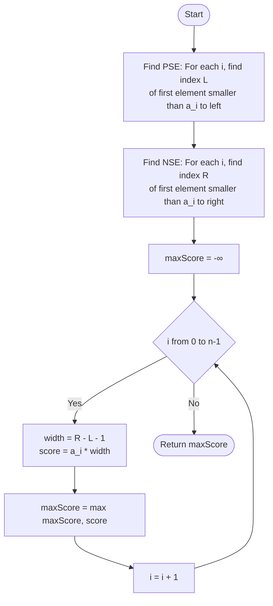

# ARR-014: Subarray Score = min x length

## 📋 Problem Summary

Given an array of integers, every contiguous subarray has a "score" defined by the formula:
$$\text{Score} = (\text{Minimum element in the subarray}) \times (\text{Length of the subarray})$$

Your goal is to find the **maximum possible score** among all possible non-empty contiguous subarrays.

**Key Challenges:**

- There are $O(N^2)$ possible subarrays. A brute-force check is impossible for $N=200,000$.
- The values can be negative. If the minimum is negative, a longer subarray actually results in a _lower_ (more negative) score.

## 🌍 Real-World Scenarios

**Scenario 1: 🏗️ Architectural Stress Resilience**
Imagine a bridge made of $N$ support segments. Each segment $i$ has a "failure load" $a_i$. A continuous section of segments can bear a total load determined by its **weakest link** (the minimum $a_i$ in that section) multiplied by its **redundancy factor** (the length). Architects use this to find the most "stable" section of a structure.

**Scenario 2: 🏢 Commercial Real Estate Value**
A developer is looking at a strip of land divided into $N$ plots. Each plot has an "amenity value" $a_i$. If they buy a contiguous block of plots, the "premium status" of the entire development is limited by the **lowest-value plot** in that block. The total market value of the development is then $(\text{Lowest Value}) \times (\text{Block Size})$.

**Scenario 3: 📊 Guaranteed Server Uptime**
A cloud provider monitors the uptime of $N$ server clusters. If they offer a Service Level Agreement (SLA) for a contiguous set of clusters, they must guarantee the **reliability of the least reliable cluster** in that group. Their total "guarantee score" is the service level multiplied by the number of clusters covered.

**Scenario 4: 🔌 Power Grid Throughput**
Electric cables are laid in a sequence. Each cable has a specific "thermal capacity" $a_i$. If current is run through a contiguous sequence of cables, the **maximum current** is limited by the cable with the lowest capacity. The "energy throughput score" of that section is $\text{Capacity} \times \text{Length}$.

**Scenario 5: 🎭 The "Ensemble" Performance**
A theatre troupe has $N$ actors with different "energy levels." During an ensemble performance, the audience's perceived energy of a contiguous group is often dictated by the **actor with the least energy** (the bottleneck). To keep the performance high, producers want to find the group whose collective "impact score" (min energy $\times$ size) is maximized.

### Real-World Relevance

This problem is the mathematical equivalent of finding the **"Largest Rectangle in a Histogram,"** where the "bottleneck" (minimum) determines the "height" and the subarray length is the "width."

## 🚀 Detailed Explanation

### 1. The Perspective Shift: Who is the Boss?

Instead of checking every subarray, let's ask: **"If element $a_i$ were to be the minimum of a subarray, what is the largest possible length that subarray could have?"**

Every element $a_i$ has a "Dominion"—a range to its left and right where it remains the smallest value.

- To the left, it's limited by the first element $a_L$ that is strictly smaller than $a_i$.
- To the right, it's limited by the first element $a_R$ that is strictly smaller than $a_i$.

The width of this dominion is $(R - L - 1)$. The score for this element's dominion is $a_i \times (R - L - 1)$.
If we calculate this for every $a_i$, the largest result will be our answer.

### 2. The Monotonic Stack Optimization

How do we find the "Next Smaller Element" (NSE) and "Previous Smaller Element" (PSE) for everyone in $O(N)$? We use a **Monotonic Stack**.

Imagine you are standing at index $i$. You want to find the first person to your left who is shorter than you.

1. You maintain a stack of people you've seen.
2. If the person at the top of the stack is taller than or equal to you, they can never be the "Previous Smaller" for anyone to your right (because you are smaller and further to the right). So, you **pop** them.
3. The person left at the top of the stack is your Previous Smaller.
4. You **push** yourself onto the stack.

Because every element is pushed once and popped at most once, this entire process takes $O(N)$.

### 3. Handling Negative Values

The problem specifies $-10^9 \le a_i \le 10^9$.

- **If $a_i$ is positive:** We want the **largest** width possible to maximize the score ($+ \times \text{large} = + \text{larger}$).
- **If $a_i$ is negative:** We want the **smallest** width possible to maximize the score ($- \times \text{small} = - \text{smaller}$). For a negative minimum, the "maximal" score usually occurs when the subarray length is just 1.

The Monotonic Stack logic naturally finds the _maximum_ possible width for each $a_i$.

- For positive $a_i$, this is exactly what we want.
- For negative $a_i$, the "maximal width" range we find will produce a very large negative number (e.g., $-10 \times 100 = -1000$). However, since we check _every_ element, we will _also_ evaluate that same negative element $a_i$ as a subarray of length 1 (score = $-10 \times 1 = -10$). Since $-10 > -1000$, the single-element subarray will correctly win the comparison for that specific element.

### 🔄 Algorithm Flow Diagram

## 🔍 Complexity Analysis

### Time Complexity: $O(N)$

- **PSE Calculation:** $O(N)$ using monotonic stack.
- **NSE Calculation:** $O(N)$ using monotonic stack.
- **Score Calculation:** $O(N)$ single loop through the array.
- For $N=200,000$, the algorithm performs roughly $600,000$ operations, which is extremely fast ($\sim 0.05$ seconds).

### Space Complexity: $O(N)$

- We store the $NSE$ and $PSE$ indices in two arrays of size $N$.
- We use a stack that can grow up to size $N$ in the worst case.

## 🧪 Edge Cases & Testing

### 1. Strictly Increasing

- **Input:** `[1, 2, 3, 4, 5]`
- **Scores:**
  - `1`: Width 5, Score 5.
  - `2`: Width 4, Score 8.
  - `3`: Width 3, Score 9.
  - `4`: Width 2, Score 8.
  - `5`: Width 1, Score 5.
- **Winner:** Subarray `[3, 4, 5]` with min 3, length 3, Score 9.

### 2. Strictly Decreasing

- **Input:** `[5, 4, 3, 2, 1]`
- **Winner:** Subarray `[5, 4, 3]` with min 3, length 3, Score 9 (Symmetric to above).

### 3. All Same Elements

- **Input:** `[5, 5, 5, 5]`
- **Winner:** `Score = 5 * 4 = 20`.

### 4. Array with Large Peak in Center

- **Input:** `[1, 1, 10, 1, 1]`
- **Winner:** `10 * 1 = 10`.

### 5. Array with Negative "Pits"

- **Input:** `[10, 10, -5, 10, 10]`
- **Winner:** `10 * 2 = 20` (either of the two `[10, 10]` blocks). The `-5` pit breaks the continuity for the high values.

### 6. Extremely Negative Values

- **Input:** `[-10, -1, -5]`
- **Winner:** `-1`. A length 1 subarray is the best we can do.

## ⚠️ Common Pitfalls & Debugging

**1. The "Sentinels" Strategy**

- **Pitfall:** Getting indices out of bounds when there is no smaller element to the left or right.
- **Fix:** Use "Sentinels." Imagine there is a value $-\infty$ at index $-1$ and index $n$.
  - If no smaller element exists to the left, $PSE[i] = -1$.
  - If no smaller element exists to the right, $NSE[i] = n$.

**2. Handling Equal Elements**

- **Pitfall:** `while (stack.top() >= a[i]) pop;`
- **Fix:** Be consistent with your strict vs non-strict inequality. If you use `>` for one side and `>=` for the other, you handle duplicate values correctly without overcounting or undercounting ranges.

**3. Integer Overflow**

- **Pitfall:** Calculating score.
- **Consequence:** $a_i = 10^9$ and $n = 200,000$. The score is $2 \times 10^{14}$. This will overflow a 32-bit integer.
- **Fix:** Ensure the score variable is a **64-bit integer** (long/long long).

**4. Not Re-initializing the Stack**

- **Pitfall:** Re-using the same stack object for $PSE$ and $NSE$ without clearing it in between.
- **Fix:** Always `stack.clear()` or create a new stack.

## 🎯 Variations & Extensions

### Variation 1: Largest Rectangle in Histogram

This is the classic version where all $a_i \ge 0$. Logic is identical.

### Variation 2: All Subarrays with Score $\ge K$

Count how many subarrays have a score at least $K$.
_Note: Much harder; usually requires a Divide and Conquer or Segment Tree approach._

### Variation 3: 2D Submatrix Maximum Score

In a 2D matrix, find a rectangle where $(\text{Min element}) \times (\text{Number of elements})$ is maximized.
_Solution: Reduce to 1D by treating each row as a histogram base (similar to ARR-044)._

### Variation 4: Max Score with Bound Length

Find the maximum score for subarrays with length at most $M$.
_Solution: Monotonic queue windowing._

### Variation 5: Maximum "Sum x Min"

Score = $(\text{Sum of elements}) \times (\text{Min element})$.
_Solution: Still uses monotonic stack to define the dominion of each minimum, but uses prefix sums to calculate the range sum._

## 🎓 Key Takeaways

1. **The "Weakest Link" Pattern:** If a score depends on the minimum of a range, the range is limited by the neighbors that are even smaller.
2. **Dominion Analysis:** Flip the problem to ask what range each element "controls."
3. **Monotonic Stack:** The most powerful $O(N)$ tool for "Next Smaller" or "Next Greater" problems.
4. **Sentinels:** Using "phantom" elements at the ends of an array simplifies boundary logic significantly.

## 📚 Related Problems

- **Largest Rectangle in Histogram:** The canonical version.
- **Maximal Rectangle:** 2D version applied to binary matrices.
- **Online Stock Span:** Calculating the "Greater To Left" distance.
- **Sliding Window Minimum:** Using a monotonic deque instead of a stack.
- **ARR-044:** Max Sum Rectangle (Another 1D reduction).
