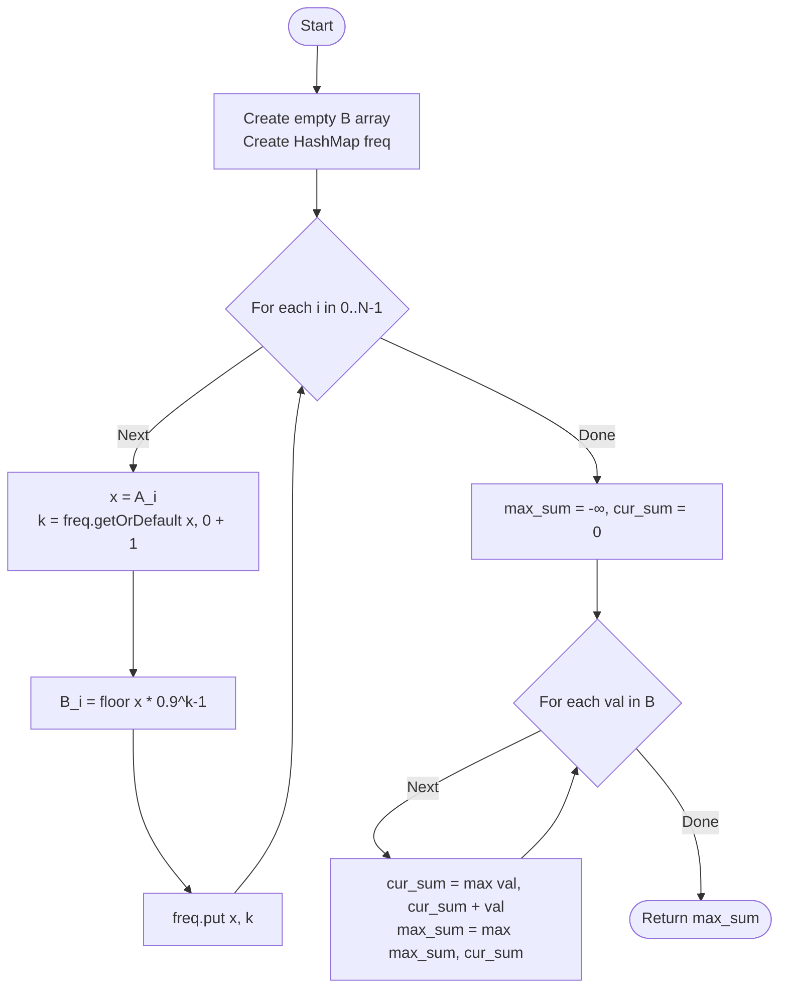

# ARR-015: Frequency Decay Array

## 📋 Problem Summary

This problem requires a two-pass mental model:

1. **Transform the Array:** As you scan $A$ from left to right, every number's "value" decays according to how many times you've already seen it.
   - A number's $k$-th occurrence contributes $v \times (0.9)^{k-1}$.
   - Formula: $\text{contribution} = \lfloor v \times \frac{90^{k-1}}{100^{k-1}} \rfloor$
2. **Find the Maximum Subarray Sum:** After transforming $A$ into $B$, find the contiguous subarray in $B$ with the largest possible sum.

**Key Challenges:**

- Tracking global frequency of every number during a single pass.
- Handling large numbers ($10^9$) that decay over many repetitions.
- Implementing an efficient $O(N)$ solution for $N=200,000$.

## 🌍 Real-World Scenarios

**Scenario 1: 🍕 The Law of Diminishing Returns (Pizza Consumption)**
The first slice of pizza gives you 100% satisfaction. The second slice is still great, but you're less hungry, so you get 90% satisfaction. By the 10th slice, the satisfaction is almost zero. If you have a sequence of different foods (numbers), you're trying to find the "happiest meal segment" by summing up your satisfaction levels.

**Scenario 2: 📢 Ad Burnout in Marketing**
A user sees a sequence of ads. If they see a "Car" ad for the first time, their interest is high ($10^9$). If they see another "Car" ad immediately or later, they start ignoring it (90% effectiveness). If they see it 50 times, the effectiveness is zero. Marketers want to find the window of time where their ad campaign had the highest total impact.

**Scenario 3: 🎮 Game Experience Points (XP) Grinding**
In an RPG, killing a certain monster for the first time gives full XP. Because of "anti-grinding" mechanics, killing the same monster repeatedly yields 10% less XP each time. A player wants to find the most efficient hunting route (subarray) through a sequence of monsters.

**Scenario 4: 🛠️ Tool Wear and Tear**
A manufacturing line uses various tools in a sequence. Every time a specific tool is used, it loses 10% of its precision/value. The plant manager wants to find the "most productive shift segment" where the total value of all tool-usages in that segment is maximized.

**Scenario 5: 📰 Social Media Feed Refresh**
A user scrolls through a feed. Seeing a "Cat" post is great. Seeing a second "Cat" post is 90% as good. Identifying which segment of the feed provides the maximum aggregate utility helps in tuning the recommendation algorithm.

### Real-World Relevance

This problem captures the **Dynamic Value** concept. Values are rarely static in the real world; they change based on state (in this case, frequency).

## 🚀 Detailed Explanation

### 1. Step 1: Mapping the Frequencies

As we iterate through the array, we need a way to instantly know how many times we've seen a value $x$ before. We use a **Hash Map** (or a Frequency Array if the values were small, but here they are up to $10^9$, so a Map is necessary).

**The Map Strategy:**
Iterate $i = 0 \rightarrow N-1$:

1. Check `freq[A[i]]`. If it doesn't exist, this is the 1st occurrence ($k=1$).
2. Calculate the decayed value $B[i]$ using the formula.
3. Update `freq[A[i]] = freq[A[i]] + 1`.

### 2. Precise Calculation: The Power Formula

The formula uses $\lfloor v \times \frac{90^{k-1}}{100^{k-1}} \rfloor$.

Because we are dealing with floating-point values ($0.9$ is $9/10$), repeated multiplication might introduce tiny precision errors.

- **Method A (Safer):** Use `pow(0.9, k-1)` or calculate the power manually using `v * (90^(k-1)) / (100^(k-1))`. Since $v \le 10^9$ and the denominator grows, using doubles is usually sufficient if rounded down.
- **Method B (Iterative):** For each value, keep its "last decayed value" in the map. Next value is `floor(last_value * 0.9)`.
  _Caution:_ Be careful with `floor` vs `float`. `floor(v * 0.9 * 0.9)` is not necessarily the same as `floor(floor(v * 0.9) * 0.9)`. The problem explicitly gives the formula for the $k$-th occurrence relative to the _original_ $v$, so `floor(v * pow(0.9, k-1))` is the intended interpretation.

### 3. Step 2: Kadane's Algorithm

Once the transformed array $B$ is built, we solve the maximum subarray sum.

**Kadane's Intuition:**
At any element $B[i]$, you have a choice:

- Extend the current subarray: `current_sum + B[i]`
- Start a new subarray: `B[i]`

You take the maximum of these two. This ensures that you don't carry over a negative sum that would drag down your future total.

### 🔄 Algorithm Flow Diagram

## 🔍 Complexity Analysis

### Time Complexity: $O(N)$

- **Transformation:** One pass through the array. HashMap insertions and lookups are $O(1)$ on average.
- **Kadane's:** One pass through the transformed array.
- Total complexity is $O(N)$, which is roughly $400,000$ basic operations—extremely fast.

### Space Complexity: $O(N)$

- **Array B:** $O(N)$ to store transformed values.
- **HashMap:** In the worst case (all elements unique), stores $N$ keys.
- Total memory for $200,000$ entries is manageable (~10-20 MB depending on the language's map implementation).

## 🧪 Edge Cases & Testing

### 1. The Value Decays to Zero

- **Input:** `[100, 100, ...]` (100 elements)
- **Result:** Eventually $100 \times (0.9)^{k-1} < 1$, so the floor becomes 0. The subarray can still include these 0s, but they don't help or hurt the sum.

### 2. All Distinct Elements

- **Input:** `[10, 20, 30, 40]`
- **Result:** $k=1$ for all. Array stays same. Kadane's runs on original values.

### 3. Negative Initial Values (Not possible here)

- **Constraint check:** $0 \le A_i \le 10^9$. Values are non-negative.
- **Note:** This means the maximum subarray sum will ALWAYS be non-negative (at least 0 for an empty or single zero subarray). However, the problem says maximum subarray must be non-empty.

### 4. Single Element Array

- **Input:** `[5]`
- **Result:** $B = [5]$, max sum = 5.

### 5. Large Original Values

- **Input:** `[10^9, 10^9]`
- **Result:** $10^9$ then $900,000,000$. Sum is $1.9 \times 10^9$.
- **Check:** Ensure your sum variables are **64-bit integers** (long/long long).

## ⚠️ Common Pitfalls & Debugging

**1. Precision with Floating Points**

- **Pitfall:** Using `(int)(v * Math.pow(0.9, k-1))` incorrectly.
- **Fix:** Due to floating-point imprecision (e.g., $0.9$ might be stored as $0.89999999$), `pow` might return $99.99999$ for a true value of $100$.
- **Advanced Tip:** Use high precision (Double/Long Double) or use the integer formula $v \times 90^{k-1} / 100^{k-1}$ if $k$ is small. Since $k$ can be large, you must handle the exponentiation carefully.

**2. 1-based vs 0-based for $k$**

- **Pitfall:** Applying decay to the first occurrence ($k=1$).
- **Requirement:** The first occurrence has $k-1 = 0$, so $(0.9)^0 = 1$. The first occurrence should be full value.

**3. Integer Overflow in Power Calculation**

- **Pitfall:** Calculating `90^(k-1)` directly.
- **Consequence:** $90^k$ grows astronomically fast and will overflow any integer type after just a few steps.
- **Fix:** Use floating point `pow(0.9, k-1)` or iterative multiplication with doubles.

**4. Initializing Kadane with 0**

- **Pitfall:** `max_sum = 0`.
- **Consequence:** If the problem allowed negative transformed values (it doesn't here, but good practice), and all elements were negative, it would return 0 instead of the maximum element.
- **Fix:** Always initialize `max_sum` with a very small number or the first element of the array.

## 🎯 Variations & Extensions

### Variation 1: Per-Subarray Frequency

What if the frequency was reset for every subarray you checked?
_Note: This makes the problem EXTREMELY hard (O(N²) or worse) because the value of an element depends on which window you pick._

### Variation 2: Different Decay Rates

Different numbers have different decay rates (e.g., $0.95, 0.8$, etc.).

### Variation 3: Additive Decay

Instead of multiplying by $0.9$, subtract a fixed value $D$ each time.
$$\text{contribution} = \max(0, v - (k-1) \times D)$$

### Variation 4: Frequency-Based Bonus

Instead of decay, numbers get a **bonus** when they repeat (e.g., "Combo" points).

### Variation 5: Decay Over Window

Frequency only counts how many times the value appeared in the last $W$ elements.

## 🎓 Key Takeaways

1. **Simulation First:** Complex transformations are often just simple simulations disguised with formulas.
2. **Deterministic Decay:** State-based values can be computed in a single pass using the right data structure (Hash Map).
3. **Kadane's:** The gold standard for subarray optimization.
4. **Precision Management:** Be wary of floating-point math when calculating exponents for large integers.

## 📚 Related Problems

- **Maximum Subarray Sum (Kadane's):** The core solvable part.
- **First Unique Character in a String:** Basic frequency tracking.
- **Top K Frequent Elements:** Advanced frequency management.
- **ARR-042:** Probabilistic Weights (Similar transformation + Kadane).
- **ARR-014:** Subarray Score (Monotonic optimization).
