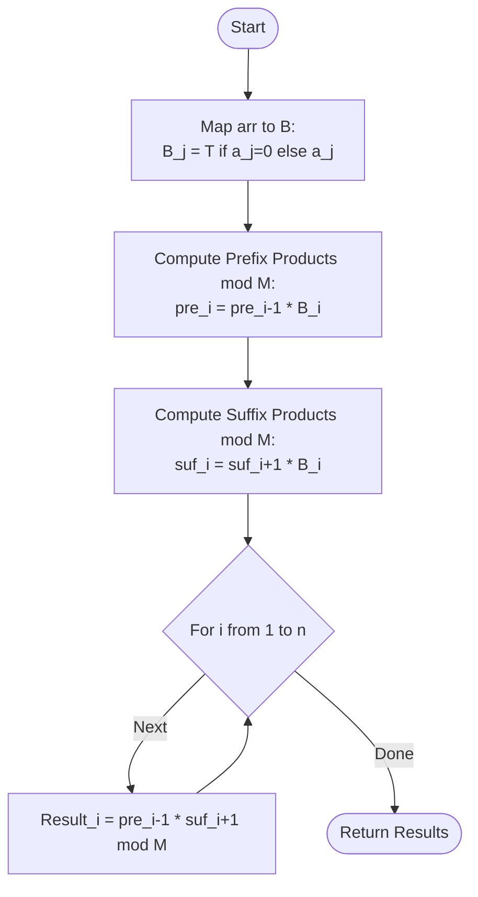

# ARR-016: Product Except Self with Zero Tax

## 📋 Problem Summary

Given an array of $n$ integers and a special value $T$ (the "Zero Tax"), you need to calculate a modified "Product Except Self" for every index $i$.

**The Rule:**
For each index $i$, the result $P_i$ is the product of all elements $a_j$ where $j \neq i$.
However, the values are modified before multiplication:

- If $a_j \neq 0$, use the original value $a_j$.
- If $a_j = 0$, use the value $T$ instead.

Finally, output all $P_i$ results modulo $1,000,000,007$.

**The Challenge:**
A naive approach (calculating the product for each $i$) would be $O(n^2)$. You must solve this in $O(n)$. Division is risky because numbers can be zero or multiples of the large prime modulus.

## 🌍 Real-World Scenarios

**Scenario 1: 📦 Inventory "Safety Stock" Valuation**
A warehouse manager calculates the total production capacity of a factory by multiplying the outputs of all machines. If a machine breaks down (output 0), it doesn't just stop the whole factory; a "Safety Stock" (the Zero Tax $T$) is used to fill the gap. The manager needs to know the total capacity if any single machine $i$ is taken offline for maintenance.

**Scenario 2: 🛡️ Financial Portfolio Loss Hedging**
An investment portfolio consists of several volatile assets. The "Expected Return" is modeled as a product of growth factors. If an asset has a bad day (0 growth), a "Hedge Fund" or insurance policy $T$ steps in to provide a minimum floor value. Investors want to see the performance of the portfolio minus any specific asset $i$ to assess individual risk.

**Scenario 3: 🧬 Parallel Genomic Sequencing Throughput**
In a massive parallel sequencing project, data is processed by $n$ nodes. The total throughput is the product of the individual node speeds. If a node fails (speed 0), a backup "Virtual Server" $T$ is spun up. Researchers calculate the "What-if" throughput for cases where any one node $i$ is purposefully removed for testing.

**Scenario 4: 🐛 Ecological Food Web Stability**
In a food web, the "Survival Probability" of an apex predator is proportional to the product of the biomass of $n$ different prey species. If one species goes extinct (0 biomass), the predator might switch to a less-optimal "Invasive Species" $T$ as a fallback. Biologists calculate the impact of losing any single species $i$ on the predator's survival.

**Scenario 5: 🚦 Intelligent Traffic Routing**
A city calculates the "Network Reliability" as the product of the throughput of $n$ major intersections. If an intersection is blocked (0 capacity), a "Detour Protocol" $T$ is activated. Traffic planners analyze the network's resilience by simulating the closure of each intersection $i$.

### Real-World Relevance

This problem mirrors **System Resilience**. Most real-world systems don't just crash when one component hits zero; they have a fallback or a "tax" that keeps the process running. Calculating the "product except self" is the standard way to measure the impact of a single point of failure.

## 🚀 Detailed Explanation

### 1. The Transformation

First, understand that the array we are dealing with is effectively $B[j]$, where:
$$B[j] = \begin{cases} a_j & \text{if } a_j \neq 0 \\ T & \text{if } a_j = 0 \end{cases}$$

The goal is to calculate:
$$P_i = \prod_{j \neq i} B[j] \pmod M$$

### 2. The Bottleneck: Why Division Fails

Usually, you might think: "Just calculate the total product of $B$, then for each $i$, divide by $B[i]$."
**This is dangerous for two reasons:**

1. **Zero Values:** If $B[i]$ ends up being $0$ (because $a_i=0$ and $T=0$), you cannot divide.
2. **Modulo Issues:** Division in modulo arithmetic requires the **Modular Multiplicative Inverse**. This only exists if $B[i]$ and $M$ are coprime (which is true if $M$ is prime and $B \not\equiv 0 \pmod M$). But $B[i]$ could easily be $1,000,000,007$ or a multiple, making division impossible.

### 3. The Prefix-Suffix Solution ($O(n)$)

We avoid division entirely by using two arrays:

1. **Prefix Products (`pre`):** `pre[i]` = the product of all $B[j]$ from index $1$ to $i$.
2. **Suffix Products (`suf`):** `suf[i]` = the product of all $B[j]$ from index $i$ to $n$.

For any index $i$:
The elements "Except Self" are exactly:

- All elements to the left: $(B[1], \dots, B[i-1])$
- All elements to the right: $(B[i+1], \dots, B[n])$

Their product is:
$$P_i = \text{pre}[i-1] \times \text{suf}[i+1] \pmod M$$

### 🔄 Algorithm Flow Diagram

_Note: Handle boundaries (i=1 and i=n) by using 1 as the default identity._

## 🔍 Complexity Analysis

### Time Complexity: $O(N)$

- **Pass 1:** Transform values and compute prefixes.
- **Pass 2:** Compute suffixes.
- **Pass 3:** Combine into final results.
- For $N=200,000$, this is roughly $600,000$ multiplications, which takes less than $0.1$ seconds.

### Space Complexity: $O(N)$

- Two auxiliary arrays (`pre` and `suf`) each of size $n+1$.
- Total space: $O(N)$.

## 🧪 Edge Cases & Testing

### 1. Multiple Zeros

- **Input:** `[2, 0, 0], T=5`
- **Logic:** $B = [2, 5, 5]$.
- **$P_1$:** $5 \times 5 = 25$.
- **$P_2$:** $2 \times 5 = 10$.
- **$P_3$:** $2 \times 5 = 10$.
- **Correctness:** The "Zero Tax" correctly fills both zeros in the original input.

### 2. $T = 0$

- **Input:** $T=0$.
- **Logic:** If the array has any zeros ($a_j=0$), the tax is $0$. This behaves like a standard "Product Except Self" where one or more zeros can zero out the whole result.

### 3. Array of Size 1

- **Problem Statement:** "Product of all $j \neq i$".
- **Result:** For a single element, the set of $j \neq i$ is empty. The product of an empty set is the **Multiplicative Identity**, which is **1**.

### 4. Negative Values and Modulo

- **Input:** $a = [-2, 3]$.
- **Modulo Logic:** $(-2 \pmod M)$ in many languages returns a negative number.
- **Requirement:** Ensure result is positive: `(a * b % M + M) % M`.

### 5. Large Values

- $a_i = 10^9$.
- $10^9 \times 10^9 = 10^{18}$, which fits in a 64-bit integer (`long long`). Modulo must be applied after every multiplication.

## ⚠️ Common Pitfalls & Debugging

**1. Using Division**

- **Pitfall:** Thinking `totalProduct / B[i]` is faster.
- **Risk:** You will get a `FloatingPointException` or incorrect results if $B[i] \pmod M = 0$.

**2. Off-by-One in Prefix/Suffix**

- **Pitfall:** $P_1 = \text{pre}[0] \times \text{suf}[2]$.
- **Correction:** Ensure your prefix array has a base index `pre[0] = 1` and `suf[n+1] = 1`.

**3. Negative Modulo**

- **Pitfall:** `(-2 % 1000000007)` returning `-2`.
- **Requirement:** The output must be the positive remainder.

**4. 1-Based indexing**

- The problem description might use $P_1$, while your code uses index 0. Be consistent with the problem's requirements.

## 🎯 Variations & Extensions

### Variation 1: Subarray Product Except One

Calculate the product of every element in the range $[L, R]$ except for the element at index $M$.

### Variation 2: Product of $K$ Largest

Instead of "All except self," find the product of the $K$ largest elements.

### Variation 3: Power Except Self

For each $i$, calculate the product of $(a_j)^2$ for $j \neq i$.

### Variation 4: Multi-Dimensional Product

Matrix $N \times M$ version.

### Variation 5: Dynamic Updates

Elements $a_i$ change over time. (Requires a Segment Tree to perform point updates and range product queries in $O(\log n)$).

## 🎓 Key Takeaways

1. **Decomposition:** "Everything except $X$" is almost always solvable by combining a "Left-of-$X$" piece and a "Right-of-$X$" piece.
2. **Modulo Safety:** Prime modulos are great, but they don't solve the "Division by multiple of M" problem. Multiplication is always safer.
3. **Identity Element:** For products, the neutral starting point is 1. For sums, it is 0.
4. **Zero Buffering:** The "Zero Tax" is a common way to handle edge cases or represent backup systems in modeling.

## 📚 Related Problems

- **Product of Array Except Self (LeetCode 238):** The base version of this problem.
- **Trapping Rain Water:** Uses prefix/suffix maxes.
- **Longest Well-Performing Interval:** Uses prefix/suffix concepts.
- **ARR-015:** Frequency Decay (Another multi-step array evolution problem).
