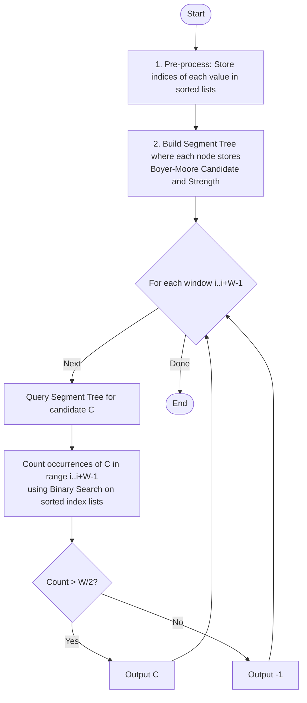

# ARR-020: Sliding Window Dominance

## 📋 Problem Summary

Given an array of $n$ integers and a window size $W$, identify the **dominant element** for every sliding window of length $W$. An element is dominant if it appears strictly more than $W/2$ times within that window.

**Key Requirements:**

- For each possible window, output the dominant element if it exists.
- If no element appears $> W/2$ times, output $-1$.
- Constraints ($n=200,000$) require an efficient $O(n \log n)$ or $O(n)$ solution.

## 🌍 Real-World Scenarios

**Scenario 1: 🗳️ Real-Time Election Monitoring**
A television network is broadcasting live election results. They show a "Rolling Majority" indicator for the last 10,000 votes counted. If a candidate secures $> 50\%$ of the votes in that specific window, they are highlighted as the current "Dominant Leader."

**Scenario 2: 🛡️ Network Security (DDoS Mitigation)**
An Intrusion Detection System (IDS) monitors packets arriving from various IPs. In a sliding window of 1,000 packets, if a single IP address accounts for more than 500 packets, the system flags it as a potential "Heavy Hitter" or DDoS source.

**Scenario 3: 🚦 Traffic Sensor Reliability**
A sensor network monitors vehicle types (car, truck, bike). In a rolling window of 50 detections, if one vehicle type makes up more than 25 readings, the system assumes a "Homogeneous Traffic Flow" state for that time segment.

**Scenario 4: 🎤 Voice Command Noise Filtering**
An AI listens to audio frames. In a window of 20 milliseconds, if a specific frequency dominant (appears in $> 50\%$ of samples), it is identified as a coherent signal rather than background white noise.

**Scenario 5: 📉 Financial Flash-Crash Detection**
A trading bot monitors order types (Buy/Sell). If "Sell" orders constitute more than 50% of orders in a 5-minute rolling window, the bot triggers a circuit breaker to prevent a rapid asset price collapse.

### Real-World Relevance

Identifying a **absolute majority** is a fundamental task in signal processing and distributed systems (e.g., reaching a consensus in Paxos or Raft algorithms). In a sliding window context, it helps in detecting transient but significant shifts in data distribution.

## 🚀 Detailed Explanation

### 1. The Challenge of Sliding Boyer-Moore

The famous Boyer-Moore Voting Algorithm finds the majority element in $O(n)$ time and $O(1)$ space for a static array. However, **Boyer-Moore is not easily reversible**.

- You can't easily "remove" the effect of the element that just left the window from the `candidate` and `count` state.
- This forces us to look for a more robust data structure that supports range queries.

### 2. The Move to Segment Trees

Boyer-Moore's core logic can be abstracted into a **merging operation**. If we have two blocks of data, each with its own "Potential Candidate" and a "Strength," we can merge them:

**Merging Rule:**

- If Block A has candidate $C_A$ with strength $S_A$ and Block B has candidate $C_B$ with strength $S_B$:
  1. If $C_A = C_B$: New candidate is $C_A$ with strength $S_A + S_B$.
  2. If $C_A \neq C_B$:
     - If $S_A > S_B$: New candidate is $C_A$ with strength $S_A - S_B$.
     - If $S_B > S_A$: New candidate is $C_B$ with strength $S_B - S_A$.
     - If $S_A = S_B$: No candidate remains (strength 0).

Because this merge is **associative**, we can build a **Segment Tree** where each node stores the Boyer-Moore candidate of its range.

### 3. The Two-Step Query Analysis

The Boyer-Moore candidate returned by a Segment Tree for a range $[L, R]$ is only a **potential** majority. It is guaranteed that if a majority exists, it _will_ be this candidate, but the candidate itself might not be a majority (e.g., in `[1, 2, 3]`, the merge might return `3`, but `3` is not a majority).

**Step 1: The Candidate Query**
Query the Segment Tree for the window $[i, i+W-1]$ to get candidate $C$.

**Step 2: The Verification**
Count how many times $C$ actually appears in $[i, i+W-1]$.

- To do this efficiently, pre-process the array: for every distinct value, store a sorted list of indices where it appears.
- Count = `BinarySearchLast(list[C], R) - BinarySearchFirst(list[C], L) + 1`.

### 🔄 Algorithm Flow Diagram

## 🔍 Complexity Analysis

### Time Complexity: $O(N \log N)$

- **Pre-processing:** $O(N)$ using a hash map or sorted grouping.
- **Segment Tree Build:** $O(N)$ with $2N$ nodes and $O(1)$ merge.
- **Queries:** $Q = (N-W+1)$ windows. Each window takes $O(\log N)$ for segment tree query and $O(\log N)$ for binary search verification.
- Total: $O(N \log N)$. This is perfectly fine for $N=200,000$.

### Space Complexity: $O(N)$

- **Index Lists:** $O(N)$ total space (sum of all list sizes is $N$).
- **Segment Tree:** $O(N)$ nodes.
- **HashMap:** $O(N)$ for distinct value mapping.

## 🧪 Edge Cases & Testing

### 1. No Majority Exists

- **Input:** `[1, 2, 3]`, $W=3$.
- **Logic:** Segment tree merge might yield `3` with strength 1. Verification shows `3` appears only once. $1 \le 1.5$ is False. Output `-1`.

### 2. Majority at the Very Edge

- **Input:** `[1, 1, 2]`, $W=3$.
- **Logic:** `1` appears twice. $2 > 1.5$. Output `1`.

### 3. $W=1$

- **Input:** `[5, 10, 15]`, $W=1$.
- **Logic:** Every element is its own majority. Output `5 10 15`.

### 4. Alternating Values

- **Input:** `[1, 2, 1, 2, 1]`, $W=2$.
- **Logic:** Windows are `[1,2], [2,1], [1,2], [2,1]`. No majority in any (count $1 \ngtr 1$). Output `-1 -1 -1 -1`.

### 5. Large Values and Duplicates

- **Input:** $a_i = 10^9$.
- **Logic:** The Boyer-Moore candidate logic shouldn't care about the size of the values, only that they are equal or not. Use `long` if comparing keys to be safe.

### 6. Small $W$ vs Large $N$

- **Input:** $N=200,000, W=2$.
- **Logic:** Windows of size 2. Majority exists only if both elements are identical.

## ⚠️ Common Pitfalls & Debugging

**1. Floating Point Half**

- **Pitfall:** `if (count > W/2)` where $W/2$ is an integer division.
- **Issue:** If $W=3$, $W/2$ is $1$. $2 > 1$ is True (Correct). But what if $W=4$, $W/2$ is $2$? $2 > 2$ is False (Correct).
- **Safe Fix:** Use `if (count * 2 > W)` to avoid all floating point or integer division issues.

**2. Complexity of Counting**

- **Pitfall:** Using a frequency map to count candidate $C$ for every window.
- **Issue:** This would lead to $O(N \cdot W)$ or $O(N^2)$ in worst cases.
- **Fix:** Use the sorted index lists + Binary Search (specifically `std::upper_bound` and `std::lower_bound` in C++ or `bisect` in Python).

**3. Null Candidate**

- **Pitfall:** Not handling the case where Segment Tree merge returns strength $0$.
- **Fix:** If strength is $0$, there is guaranteed to be no majority. Output $-1$ immediately.

**4. 0-based vs 1-based indexing**

- Ensure your segment tree range queries and binary search bounds match the array indexing (0 to $n-1$).

## 🎯 Variations & Extensions

### Variation 1: Threshold $K$ (Appearances > K)

Instead of a fixed $W/2$, the threshold is a fixed integer $K$.
_Note: Boyer-Moore merge is only optimized for $W/2$. For smaller thresholds, you'd need the Misra-Gries algorithm extended to a segment tree (each node stores $W/K$ candidates)._

### Variation 2: Most Frequent Element (Mode) in Window

Find the element that appears the most, even if it's not $> W/2$.
_Solution: Much harder ($O(N \sqrt{N})$ or complex persistent structures)._

### Variation 3: Dynamic Updates

What if the array elements themselves change between window queries?
_Solution: The Segment Tree already supports updates in $O(\log N)$._

### Variation 4: Multi-Dimensional Window

2D matrix, majority in every $W \times H$ window.

### Variation 5: Almost-Dominance

Count elements that appear $> W/3$ times.

## 🎓 Key Takeaways

1. **Mergeable Statistics:** Boyer-Moore can be treated as an associative operation, allowing it to work in Segment Trees.
2. **Candidate + Verify:** A common pattern for complex queries—extract a "probable" answer quickly, then verify it precisely.
3. **Index Sorting:** Pre-storing positions of values is a standard trick to accelerate range-frequency queries.
4. **Binary Search for Count:** For any value $V$, the number of occurrences in $[L, R]$ is the difference between rank($R$) and rank($L-1$).

## 📚 Related Problems

- **Majority Element (Boyer-Moore):** The original $O(N)$ challenge.
- **Heavy Hitters in Stream:** Real-time versions of this problem.
- **Range Frequency Query:** Building blocks for the verification step.
- **Static Range K-th Smallest:** Segment tree/Persistence overlap.
- **ARR-043:** Offline Queries (Mo's algorithm approach).
