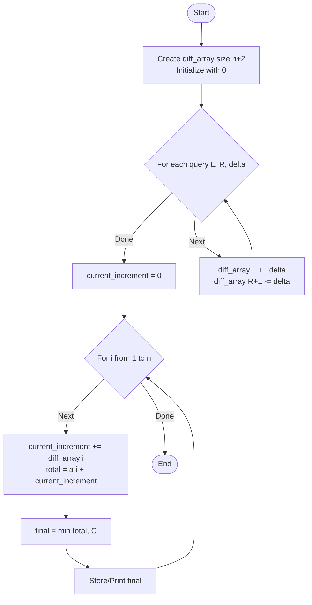

# ARR-021: Range Update with Saturation

## 📋 Problem Summary

You're given an initial array of $n$ elements and a "saturation cap" $C$. You must process $q$ offline queries, where each query adds a value $\Delta$ (delta) to a specific range $[L, R]$. After all updates are applied, every element is subject to "saturation"—its value cannot exceed the cap $C$.

**Operations:**

1. Range Add: $a[i] = a[i] + \Delta$ for all $i \in [L, R]$.
2. Saturation: $a[i] = \min(a[i], C)$ for all $i \in [1, n]$.

**Requirement:** Process $n, q = 200,000$ efficiently.

## 🌍 Real-World Scenarios

**Scenario 1: 🔊 Audio Signal Limiting (The Hard Limit)**
In music production, an "Audio Limiter" prevents digital clipping. You might apply several gain boosts (range updates) to different parts of a track. However, the hardware or file format has a maximum voltage/amplitude it can represent ($C$). If your boosts push the signal above this level, it is "clamped" or "saturated" at the limit.

**Scenario 2: 📸 Photo Exposure Adjustment**
A digital image processor adjusts the brightness of a series of pixels (a scanline). Multiple light-correction filters might overlap on certain pixels. But a pixel's brightness cannot exceed the value of white (typically 255 in 8-bit color or higher for HDR). The final image is capped at this maximum intensity.

**Scenario 3: 🔋 Battery Bank Charging**
A series of battery cells are being charged. Charging controllers apply current in pulses (range updates) to groups of cells. Each cell has a maximum safe charge capacity $C$. Regardless of how much total energy was pushed toward a cell, it can only store up to its saturation point.

**Scenario 4: 🏬 Warehouse Shelf Capacity**
A shelf has spaces for $n$ distinct item types. You receive $q$ shipments of items, each adding a quantity to a range of shelf slots. However, each slot has a physical structural limit $C$. Any excess items from a shipment that push the slot over $C$ must be sent to overflow storage.

**Scenario 5: 🌡️ Heater Control with Safety Cutoff**
Industrial heaters along a pipeline are boosted in sections during cold weather. If the combined heating power for a section exceeds a safety threshold $C$, the local regulator caps the power to prevent thermal damage to the pipe.

### Real-World Relevance

This problem models any system that is **Additive at the Input** but **Constrained at the Output**. It highlights the difference between processing individual events (the updates) and the final state of the environment (the saturated array).

## 🚀 Detailed Explanation

### 1. Why the Naive Approach Fails

If you process each of the $q$ queries by iterating from $L$ to $R$, you are doing $O(L_{\text{avg}})$ work per query. In the worst case, every query covers the entire array ($L=n$).

- Work: $200,000 \times 200,000 = 40,000,000,000$ operations.
- Time: Roughly 40 seconds (standard limits are 1–2 seconds).
  We need a way to perform a range update in $O(1)$ time.

### 2. The Difference Array "Lightbulb"

The core idea is: **Don't update the whole range; just mark where the change starts and where it ends.**

Imagine a flat field. You want to raise a section from index $5$ to $10$ by $1$ unit.

- At index $5$, you put a step **up** (+1).
- At index $11$ (just after the range), you put a step **down** (-1).

Now, if you walk across the field from left to right, maintaining a "running total" of all the steps you've encountered:

- Before index 5: total is 0.
- At index 5: you encounter the +1 step. Running total becomes 1.
- Indices 6 to 10: no new steps. Running total stays 1.
- At index 11: you encounter the -1 step. Running total becomes $1 - 1 = 0$.

By marking just two points, you've effectively defined a range of values without touching every element in between!

### 3. The Two-Step Algorithm

**Step 1: Record Deltas**
Create a `diff` array of size $n+2$ initialized to zero. For each query $(L, R, \Delta)$:

- `diff[L] += Δ`
- `diff[R+1] -= Δ`
  This takes $O(Q)$ time.

**Step 2: Reconstruct and Cap**

1. Initialize a `current_sum = 0`.
2. For $i$ from 1 to $n$:
   - `current_sum += diff[i]`
   - `final_value = initial_a[i] + current_sum`
   - `actual_final_value = min(final_value, C)`
   - Output/Store `actual_final_value`.
     This takes $O(N)$ time.

### 🔄 Algorithm Flow Diagram

## 🔍 Complexity Analysis

### Time Complexity: $O(N + Q)$

- Processing queries: $O(Q)$ (constant time per query).
- Building final array: $O(N)$ (one pass).
- For $N, Q = 200,000$, total operations $\approx 400,000$. This is well under 0.1 seconds.

### Space Complexity: $O(N)$

- `diff_array`: $O(N)$ space.
- Original `a` array: $O(N)$ space.
- Output array: $O(N)$ space.
- Total memory for $200,000$ 64-bit integers is roughly 4.8 MB, which is very light.

## 🧪 Edge Cases & Testing

### 1. Overlapping Ranges

- **Input:** $[1, 3, +10]$, $[2, 4, +5]$
- **Logic:** Index 1 gets +10, index 2 & 3 get +15, index 4 gets +5. The prefix sum logic handles this overlap perfectly by accumulating steps.

### 2. $C$ is Smaller than Initial Values

- **Input:** $a[i] = 100, C = 50$, no updates.
- **Expectation:** The final value will be $\min(100, 50) = 50$. The cap applies regardless of whether updates occurred.

### 3. Negative Deltas

- **Input:** $\Delta = -50$.
- **Logic:** The "steps" can go down. If the total increment is negative enough, the value will decrease. Saturation $min(\text{value}, C)$ only triggers if the value is high.

### 4. Large $C$ (No Effect)

- **Input:** $C = 10^{18}$.
- **Expectation:** The cap is effectively infinite, and the problem reduces to a pure Range Add / Point Query problem.

### 5. Queries at Boundaries

- **Input:** $L=1, R=n$.
- **Logic:** `diff[1] += Δ`, `diff[n+1] -= Δ`. The range covers the entire array.

### 6. Single Element Queries

- **Input:** $L=i, R=i$.
- **Logic:** `diff[i] += Δ`, `diff[i+1] -= Δ`. Only index $i$ is boosted.

## ⚠️ Common Pitfalls & Debugging

**1. Integer Overflow**

- **Pitfall:** Using 32-bit `int` for the `diff` array or the running sum.
- **Consequence:** $Q \times \Delta = 200,000 \times 10^9 = 2 \times 10^{14}$. This is too big for a 32-bit signed integer ($\max \approx 2 \times 10^9$).
- **Fix:** Use **64-bit integers** (`long` / `long long`).

**2. Off-by-One in `R+1`**

- **Pitfall:** `diff[R] -= Δ`.
- **Consequence:** The boost is removed at index $R$, so index $R$ itself doesn't get the boost.
- **Fix:** Always use `diff[R+1] -= Δ`. This ensures the inclusive range $[L, R]$ is updated.

**3. Initializing the Wrong Size**

- **Pitfall:** `diff` array size $n$.
- **Consequence:** When $R=n$, `diff[R+1]` accesses index $n+1$, causing a crash.
- **Fix:** Size your `diff` array as **$n+2$**.

**4. Misinterpreting Saturation**

- **Pitfall:** Applying `min(C, a[i] + delta)` for _each_ query.
- **Fix:** The problem states "saturation is applied only after all updates are combined." Applying it per-query would result in a different value (this is known as "clamping at every step").

## 🎯 Variations & Extensions

### Variation 1: Range Add + Range Minimum Saturation

Instead of just a max cap $C$, there is also a minimum floor $F$.
_Solution: `final = max(F, min(C, value))`._

### Variation 2: Range Update with Online Queries

If queries and updates were mixed (add to range, then ask for $a[i]$ immediately), the difference array would be too slow.
_Solution: Use a **Fenwick Tree** or **Segment Tree** ($O(\log N)$ per operation)._

### Variation 3: Final Range Sum with Saturation

Find the sum of all elements after saturation.

### Variation 4: Multi-Cap

Different segments of the array have different caps $C_i$.

### Variation 5: Image Slicing

Applying range updates to a 2D matrix (bounding box updates) and then capping.
_Solution: 2D Difference Array (mark 4 corners)._

## 🎓 Key Takeaways

1. **Offline is easier:** If all updates happen before all queries, $O(1)$ range updates are possible.
2. **Difference Array:** The standard $O(1)$ trick for range additions.
3. **Prefix Sums:** The "integration" step that converts differences back into absolute values.
4. **Saturation:** A simple post-processing pass.

## 📚 Related Problems

- **Range Sum Query:** The inverse problem (Point update, range query).
- **Corporate Flight Bookings:** (LeetCode 1109) Classic difference array problem.
- **Car Pooling:** (LeetCode 1094) Using difference arrays for capacity management.
- **Check If All Integers in a Range Are Covered:** Boolean difference array.
- **ARR-043:** Offline Queries with Mo's Algorithm (More complex offline handling).
