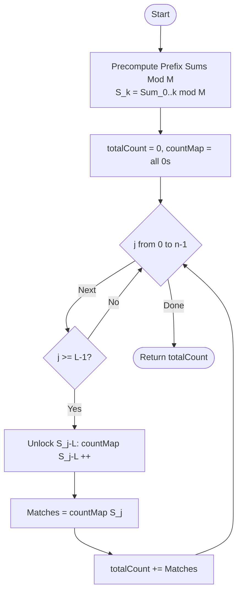

# ARR-022: Subarray Sum Modulo M (Strict)

## 📋 Problem Summary

Given an array of $n$ integers, a divisor $M$, and a minimum length $L$, you need to count how many contiguous subarrays satisfy two conditions:

1. The length of the subarray is at least $L$.
   (i.e., $j - i + 1 \ge L$)
2. The sum of the elements in the subarray is exactly divisible by $M$.
   (i.e., $\text{Sum}(i, j) \pmod M = 0$)

**Key Constraints:**

- $n, M \le 200,000$.
- Elements can be negative.
- Output the total count of such valid subarrays.

## 🌍 Real-World Scenarios

**Scenario 1: 🍫 Periodic Batch Processing**
A factory produces items in a sequence. Each item has a "weight" $a_i$. A batch of items is valid for shipping if:

- It meets a minimum weight-count threshold ($L$).
- The total weight can be perfectly divided into $M$ shipping crates.
  You need to find out how many different batches can be formed from the current production line.

**Scenario 2: 🗓️ Seasonal Sales Analysis**
A retailer analyzes daily sales. They want to find periods of at least $L$ days where the total sales volume is exactly a multiple of the bulk-order unit $M$. This helps identify "Ideal Bulk Cycles."

**Scenario 3: 🚦 Traffic Light Pattern Sync**
Traffic flow data is gathered in 1-minute intervals. Engineers look for sustained periods (length $\ge L$) where the total vehicle count across those intervals perfectly fits a 3-phase signal pattern ($M=3$).

**Scenario 4: 🔌 Power Grid Harmonic Resonance**
Sensors measure voltage fluctuations. Resonant periods are identified when a sequence of at least $L$ readings has a total cumulative variance that is a multiple of the base frequency $M$.

**Scenario 5: 🎤 Rhythm Game Combo Verification**
In a rhythm game, a player hits notes with various "perfect scores." A special "Bonus Stage" is triggered if a streak of at least $L$ notes results in a total score that is divisible by $M$.

### Real-World Relevance

Divisibility in arrays often represents **Cycle Synchronization**. When the sum is $0 \pmod M$, it means the items in that window "cancel out" relative to the modulus $M$, suggesting a completed cycle or a perfect fit for multi-unit resources.

## 🚀 Detailed Explanation

### 1. The Prefix Sum Identity

The most important property for subarray sums is:
$$\text{Sum}(i, j) = \text{PrefixSum}(j) - \text{PrefixSum}(i-1)$$

For the sum to be divisible by $M$:
$$(\text{PrefixSum}(j) - \text{PrefixSum}(i-1)) \pmod M = 0$$
$$\Downarrow$$
$$\text{PrefixSum}(j) \pmod M = \text{PrefixSum}(i-1) \pmod M$$

This transforms a subarray problem into a **matching problem**. We just need to find two prefix sums that have the same remainder when divided by $M$.

### 2. Handling the Length Constraint ($L$)

The condition length $\ge L$ translates to:
$$j - i + 1 \ge L \implies i - 1 \le j - L$$

Let $S[k] = \text{PrefixSum}(k) \pmod M$.
For a fixed endpoint $j$, we are looking for values of $k \in \{0, 1, \dots, j-L\}$ such that:
$$S[k] = S[j]$$

### 3. The "Lagging Pointer" Technique

As we iterate $j$ from $0 \rightarrow n-1$, the set of available "matching" indices $k$ grows.

1. When $j=0, 1, \dots, L-1$, the set of valid $k$ indices is empty (length too short).
2. When $j=L$, the only valid index is $k=0$ (subarray $[1, L]$).
3. When $j=L+1$, valid indices are $k=0, 1$.

**The Strategy:**

- Maintain a **Frequency Array** `count[0...M-1]` that stores how many times each remainder has been seen in a _valid_ prefix.
- As $j$ moves forward, "unlock" new prefix remainders and add them to the frequency array.
- The value to unlock at step $j$ is $S[j-L]$.

### 🔄 Algorithm Flow Diagram

_Note: Handle the special case where a subarray starts at the beginning ($i=1, k=0, \text{PrefixSum}=0$)._

## 🔍 Complexity Analysis

### Time Complexity: $O(N)$

- Computing Prefix Sums: $O(N)$.
- Single pass through the array to check and count: $O(N)$.
- Standard hash maps or fixed arrays provide $O(1)$ lookup/update.
- Total Complexity: $O(N)$.

### Space Complexity: $O(N + M)$

- Storing Prefix Sums: $O(N)$.
- Frequency Table: $O(M)$ (up to 200,000).
- For $N, M = 200,000$, this fits comfortably in 10–20 MB of RAM.

## 🧪 Edge Cases & Testing

### 1. $L = 1$ (The Standard Case)

- **Input:** $M=3, L=1, A=[1, 2, 3]$
- **Logic:** $S=[0, 1, 0, 0]$ (including phantom 0). Length $\ge 1$ works for everything. The problem reduces to standard "Subarray Sum Divisible by M."

### 2. Negative Elements

- **Input:** $A = [2, -2], M=2, L=1$
- **Critical Step:** Normalized Modulo.
  - `-2 % 2 = 0` (Safe).
  - But what if $A = [1, -5], M=3$? $1 + (-5) = -4$. $-4 \pmod 3$ should be $2$.
  - **Normalization:** `rem = ((sum % M) + M) % M`.

### 3. $L = n$ (Only the Whole Array)

- **Input:** $A=[1, 2, 3], L=3, M=2$
- **Check:** Entire sum is 6. $6 \pmod 2 = 0$. Return 1.

### 4. $M = 1$ (Everything is Divisible)

- **Input:** $M=1$
- **Logic:** Every subarray of length $\ge L$ is valid. Total count is the number of pairs $(i, j)$ where $j-i+1 \ge L$.

### 5. No Valid Subarrays

- **Input:** $A=[1, 1], M=5, L=1$.
- **Logic:** Max sum is 2. No multiple of 5 exists. Output 0.

## ⚠️ Common Pitfalls & Debugging

**1. The Negative Modulo Trap**

- **Pitfall:** `if (sum % M == 0)`.
- **Reason:** In Java/C++, `-1 % 2` is `-1`. If your map only handles $0 \dots M-1$, you'll miss this.
- **Fix:** Always wrap the modulo: `res = ((val % M) + M) % M`.

**2. Off-by-One in Pointer Lag**

- **Pitfall:** Adding $S[j-L]$ too early or too late.
- **Rule:** If $L=2$, when $j=1$ (the 2nd element), the index $i-1=0$ (the 0th prefix) is a valid start. So $S[0]$ should be added to the map when $j=L-1$.

**3. Integer Overflow**

- **Pitfall:** Storing prefix sums in `int`.
- **Reason:** $N=200,000, A_i=10^9 \implies$ total sum can be $10^{14}$!
- **Fix:** Use 64-bit integers (`long` / `long long`) for the raw prefix sum, or apply the modulo at every step of the summation.

**4. Initializing the Phantom Zero**

- **Pitfall:** Forgetting that an empty prefix has sum 0.
- **Requirement:** The prefix of length 0 (no elements) has a sum of 0. This must be a candidate for $i-1$. Ensure $S[0] = 0$ is included in your "unlocked" counts at the right time.

## 🎯 Variations & Extensions

### Variation 1: Largest Subarray Sum Modulo $M$

Instead of counting, find the maximum possible remainder.
_Solution: Requires a balanced BST or Segment Tree to find the "closest" previous remainder ($O(N \log M)$)._

### Variation 2: Subarray Sum $\text{Mod } M = K$

Count subarrays where the remainder is $K$ instead of 0.
_Solution: $S[j] - S[i-1] = K \pmod M \implies S[i-1] = (S[j] - K) \pmod M$._

### Variation 3: At Most $L$ Length

Find subarrays with length $\le L$ and divisible by $M$.
_Solution: Use a "Sliding Frequency Count" where you remove $S[j-L-1]$ as the window gets too large._

### Variation 4: Multi-Divisor Check

Subarray sum must be divisible by $M_1$ **and** $M_2$.
_Solution: Subarray sum must be divisible by $\text{LCM}(M_1, M_2)$._

### Variation 5: 2D Subarray Sum Divisible by $M$

Matrix version.

## 🎓 Key Takeaways

1. **The Core Identity:** Subarray sums are just differences between two prefix sums.
2. **Lagging Pointer:** A standard way to enforce "distance $\ge L$" constraints in matching problems.
3. **Remainder Matching:** Grouping by remainder reduces $O(N^2)$ pairs to $O(N)$ lookups.
4. **Modulus Safety:** Always normalize negative results when dealing with remainders.

## 📚 Related Problems

- **Subarray Sum Equals K:** Original version with absolute sums.
- **Subarray Sum Divisible by K:** Standard $L=1$ version.
- **Maximum Length Subarray with Sum 0:** Finding the furthest matching remainders.
- **Continuous Subarray Sum:** (LeetCode 523) Using remainders for sum logic.
- **ARR-043:** Mo's Algorithm (For non-prefix based queries).
