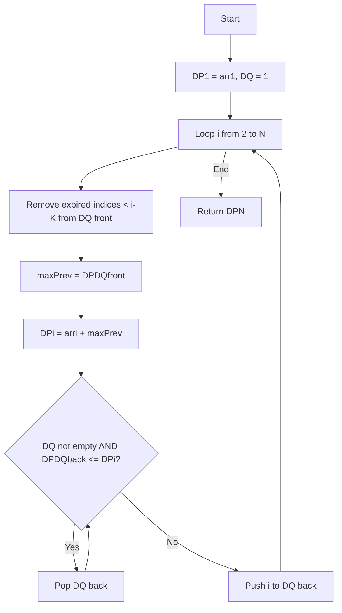

# Array Game with Penalties - Enhanced Editorial

## 📋 Problem Summary

You're given an array of length `N` and a maximum jump distance `K`. Starting at position 1, you must reach position `N` by making forward jumps. From position `i`, you can jump to any position `j` where `1 <= j - i <= K`.

**Objective:** Maximize the sum of values at all visited positions.

**Key Points:**

- Must start at index 1 and end at index N
- Can only move forward
- Jump range: 1 to K positions ahead
- Values can be positive (rewards) or negative (penalties)
- Find the path that maximizes total score

**Example:**

```
arr = [1, -5, 4, -2, 3], K = 2
Path: 1 → 4 → 3  (jump 2, then jump 1)
Score: 1 + 4 + 3 = 8
```

## 🌍 Real-World Scenarios

**Scenario 1:** 🏃 **Platform Jumping with Obstacles**

Mario-style platformer where blocks have coins (positive) or spikes (negative). You must reach the flag at the end while maximizing coin collection minus damage taken. Jump distance is limited by Mario's jump ability.

**Scenario 2:** 🚗 **Road Trip Cost Optimization**

Planning a road trip with mandatory stops at cities 1 and N. Each intermediate city has a cost/benefit (hotel costs are negative, tourist attractions are positive). Your car's fuel range limits how far ahead you can travel without refueling. Find the route maximizing net benefit.

**Scenario 3:** 📈 **Stock Trading with Cooldowns**

Making stock trades where each trade has a profit/loss. After selling, you must wait at least 1 day but no more than K days before the next purchase. Maximize total profit from first trade to final exit.

**Scenario 4:** 🎮 **Game Level Progression**

In a game, you must complete level 1 and reach level N. Each level gives XP (positive) or costs resources (negative). You can skip up to K-1 levels at a time. Find the path maximizing net XP.

**Scenario 5:** 💰 **Investment Sequence**

Sequential investments where each has a return (positive) or fee (negative). You must make the first and last investment, but can skip intermediate ones with constraints on how many you skip. Maximize total return.

### Real-World Relevance

- **Path optimization:** Finding optimal routes with cost/benefit tradeoffs
- **Resource management:** Balancing gains and penalties in sequential decisions
- **Game AI:** Computing optimal strategies for reaching goals
- **Financial planning:** Sequencing investments/expenses optimally

## 🚀 Detailed Explanation

### 1. Problem Structure - Dynamic Programming

This is a classic **Maximum Weight Path** problem solvable with DP.

**State Definition:**

```
DP[i] = Maximum score achievable reaching position i
```

**Recurrence Relation:**

```
DP[i] = arr[i] + max(DP[i-K], DP[i-K+1], ..., DP[i-1])
       = arr[i] + max{DP[j] : i-K <= j < i}
```

**Base Case:**

```
DP[1] = arr[1]  (must start here)
```

**Answer:**

```
DP[N]  (score at final position)
```

### 2. Naive O(N×K) Approach

**Algorithm:**

```
1. DP[1] = arr[1]
2. For i from 2 to N:
   a. best = -infinity
   b. For j from max(1, i-K) to i-1:
      best = max(best, DP[j])
   c. DP[i] = arr[i] + best
3. Return DP[N]
```

**Complexity:** O(N×K) - for each position, scan K previous positions

### 3. Optimized O(N) Approach - Monotonic Deque

**Key Insight:** We need the **maximum** of a **sliding window** of DP values.

**Monotonic Deque (Max-Queue):**

- Maintains indices in decreasing order of DP values
- Front always has the index with maximum DP value in current window
- Efficiently updates as window slides

**Detailed Algorithm:**

```
1. DP[1] = arr[1]
2. Initialize deque DQ = [1]
3. For i from 2 to N:

   a. Remove expired indices from front:
      while DQ.front < i - K:
          DQ.pop_front()

   b. Get max from valid window:
      maxPrev = DP[DQ.front]

   c. Calculate DP[i]:
      DP[i] = arr[i] + maxPrev

   d. Maintain monotonic property:
      while DQ.back exists and DP[DQ.back] <= DP[i]:
          DQ.pop_back()

   e. Add current index:
      DQ.push_back(i)

4. Return DP[N]
```

**Why Monotonic Deque Works:**

- Each index added/removed at most once → Amortized O(1) per position
- Always maintains the maximum in O(1) time
- Total complexity: O(N)

### 🔄 Algorithm Flow Diagram



## 📊 Complexity Analysis

### Naive Approach

**Time:** O(N × K)

- N positions to calculate
- Each requires checking K previous positions
- For N=200,000 and K=200,000: ~40 billion operations (TLE)

**Space:** O(N) for DP array

### Optimized Deque Approach

**Time:** O(N)

- Each of N indices:
  - Added to deque once: O(1) amortized
  - Removed from deque once: O(1) amortized
- **Total: O(N)** ✓

**Space:** O(N)

- DP array: O(N)
- Deque: O(K) worst case, but K ≤ N
- **Total: O(N)**

### Why Amortized O(1)?

Each index is processed exactly:

- Pushed to deque: 1 time
- Popped from front: ≤ 1 time
- Popped from back: ≤ 1 time

Total operations across all N indices: ≤ 3N → O(N)

## 🧪 Edge Cases & Testing

### Edge Case 1: All Negative Values

```
arr = [-5, -3, -7, -2, -9], K = 2
Even maximizing means minimizing damage
DP approach finds least painful path
Example best path: -5 → -2 (score = -7)
```

### Edge Case 2: K = 1 (Must Visit Every Position)

```
arr = [10, -2, 5, -1, 3], K = 1
Must visit all: 10 → -2 → 5 → -1 → 3
DP[i] = arr[i] + DP[i-1] (simple accumulation)
Score = sum of all = 15
```

### Edge Case 3: K >= N (Can Jump Directly to End)

```
arr = [10, -100, -100, 50], N = 4, K = 5
Best path: 10 → 50 (skip all negatives)
DP[4] = arr[4] + DP[1] = 50 + 10 = 60
```

### Edge Case 4: Large Positive Then Large Negative

```
arr = [100, -1000, 50], K = 2
Path options:
- 100 → -1000 → 50 = -850
- 100 → 50 = 150 ✓ (skip the trap)
```

### Edge Case 5: Single Jump vs Multiple Jumps

```
arr = [10, 20, 15, 30], K = 3
Options from position 1:
- 10 → 20 → 30 = 60
- 10 → 15 → 30 = 55
- 10 → 30 = 40
Best needs intermediate stops
```

## ⚠️ Common Pitfalls & Debugging

### Pitfall 1: Off-by-One in Window Bounds

```
❌ Wrong: for j in range(i-K, i):
   # When i=2, K=2: range(0,2) checks indices 0,1
   # But index 0 doesn't exist (1-indexed)!

✓ Correct: for j in range(max(1, i-K), i):
   # Ensures j >= 1
```

### Pitfall 2: Not Handling K >= N

```
❌ Wrong: Assumes K < N always
   # When K >= N, can jump from 1 directly to N
   # Window includes index 1 for all positions

✓ Correct: Window is max(1, i-K) to i-1
   # Naturally handles K >= N case
```

### Pitfall 3: Deque Maintains Indices, Not Values

```
❌ Wrong: Store DP values in deque
   while DQ and DQ.back <= DP[i]:  # Can't map back to index!

✓ Correct: Store indices, compare DP values
   while DQ and DP[DQ.back] <= DP[i]:
        DQ.pop_back()
```

### Pitfall 4: <= vs < in Monotonic Maintenance

```
❌ Wrong: while DP[DQ.back] < DP[i]:
   # Keeps equal values, breaks monotonic strictly decreasing

✓ Correct: while DP[DQ.back] <= DP[i]:
   # Removes equal or smaller, maintains strict decrease
```

### Pitfall 5: Integer Overflow

```
⚠️  Watch out: N=200,000, values up to 10^9
    Maximum sum could exceed 2×10^14

✓ Solution: Use long/int64 for DP array
```

## 🎯 Variations & Extensions

### Variation 1: Exact Jump Distance

Instead of "up to K", must jump exactly K positions:

```
DP[i] = arr[i] + DP[i-K]  (if i-K >= 1)
No deque needed - O(N) simple iteration
```

### Variation 2: Minimum Score Path

Find path with minimum score (avoid rewards, seek penalties?):

```
DP[i] = arr[i] + min(DP[i-K], ..., DP[i-1])
Use min-deque instead of max-deque
```

### Variation 3: Count Paths with Score >= T

How many paths achieve score >= threshold T?

```
Count[i][score] = number of ways to reach i with given score
Exponential states - need optimization or approximation
```

### Variation 4: Return Actual Path

Track which previous index was chosen:

```
Parent[i] = index j that maximized DP[i]
Reconstruct: N ← Parent[N] ← Parent[Parent[N]] ← ... ← 1
```

### Variation 5: Circular Array

Start at any position, return after visiting N positions:

```
Try each starting position, run DP
O(N²) with deque optimization
```

### Variation 6: Bidirectional Jumps

Can jump backward within limits:

```
DP[i] depends on i-K to i+K (excluding i)
Still O(N) with two deques or segment tree
```

## 🎓 Key Takeaways

1. **Sliding window maximum** is a classic deque application
2. **Monotonic deque** reduces O(NK) to O(N) for range queries
3. **Amortized analysis** shows each element processed constant times
4. **DP with optimization** - recognize when recurrence has overlapping structure
5. **Index vs value** - store indices in deque, compare by values

## 📚 Related Problems

- **ARR-001:** Seasonal Profit Window (similar DP with constraints)
- **Sliding Window Maximum:** Classic deque problem
- **Jump Game series:** Reachability with jump constraints
- **Minimum Cost Path:** Grid version of similar problem
- **Stock Trading with Cooldown:** Similar state transition structure

## 🔗 Additional Resources

- **Monotonic Deque Pattern:** Sliding window extrema problems
- **Dynamic Programming Optimization:** Reducing DP complexity
- **Amortized Analysis:** Understanding why deque is O(N)
- **Path Reconstruction:** Backtracking optimal decisions
