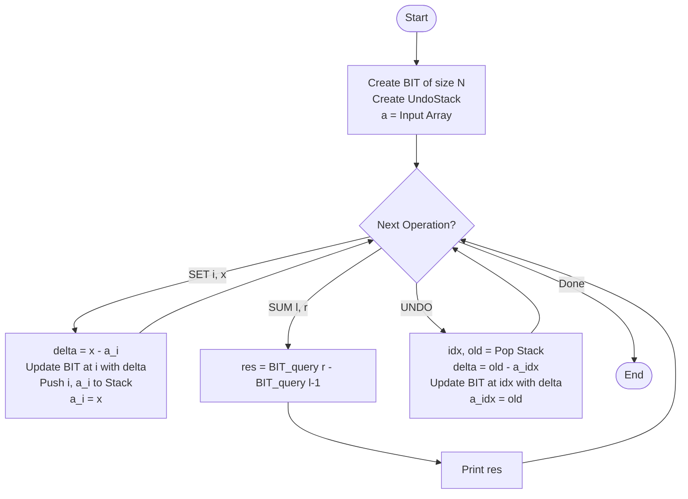

# ARR-031: Online Array with Rollbacks

## 📋 Problem Summary

You are maintaining an array $a_1 \dots a_n$ and must support three dynamic operations:

1. **SET $i \ x$:** Update the element at index $i$ to value $x$.
2. **SUM $l \ r$:** Calculate the sum of elements from index $l$ to index $r$.
3. **UNDO:** Revert the most recent **SET** operation.

**Key Requirement:** The solution must be "Online" and efficient ($O(\log n)$ per operation) to handle 200,000 queries.

## 🌍 Real-World Scenarios

**Scenario 1: 📝 Collaborative Text Editor History**
In a text editor, each line has a specific length or word count. A "SET" operation represents changing a line. The "UNDO" operation is the standard `Ctrl+Z` that reverts a line to its previous state. The "SUM" operation is used to calculate the total word count of a specific chapter (range of lines) after various edits and reverts.

**Scenario 2: 📊 Dynamic Spreadsheet Audit Trail**
A financial analyst enters quarterly revenue figures into a sequence of cells. Sometimes they make a mistake and use the "Undo" button to roll back the last entry. At any time, they need to query the "Sub-Total" (SUM) of revenue for specific departments or periods.

**Scenario 3: 💸 Reversible Financial Bookkeeping**
A ledger records daily balances. A "SET" operation represents a corrective manual entry. If an error is found in the correction process, the auditor must "undo" the most recent adjustment. "SUM" queries are used to verify the total liquidity across specific accounts.

**Scenario 4: 🏁 Game World Parameter Testing**
A level designer modifies the "Stability Score" of various regions in a game level to test player balance. They frequently undo changes that feel "wrong." They query the "Average Stability" of a region (SUM / length) to ensure it stays within a safe margin.

**Scenario 5: 🛠️ Resource Allocation Rollbacks**
A server farm allocates memory chunks to $n$ different tasks. If a task starts failing after a configuration change (SET), the admin "undos" the change. The "SUM" query monitors the total memory usage across a block of tasks to prevent system crashes.

### Real-World Relevance

This problem introduces the concept of **Reversible State Management**. In modern software, "Undo" is a non-negotiable feature. Managing it efficiently without storing the entire $N$-size array for every version is the core technical challenge.

## 🚀 Detailed Explanation

### 1. The Challenge of "Undo"

Handling `SET` and `SUM` is straightforward using a **Fenwick Tree (BIT)** or **Segment Tree** in $O(\log n)$. The difficulty lies in `UNDO`.

- **The Wrong Way:** Copying the entire array for every set. This would take $O(n)$ space and time per operation, which is $200,000^2$ — way too slow.
- **The Right Way:** Only store the **metadata** of the change.

### 2. The Undo Stack

Every time you perform `SET i x`, you should store the following information on a **Stack**:

- The index $i$ that was changed.
- The **Previous Value** that was at that index.
- (Optional) The New Value.

When an `UNDO` command arrives:

1. Pop the top of the stack.
2. Let the metadata be (index=$i$, oldVal=$v_{old}$).
3. Perform a **SET** on index $i$ back to $v_{old}$.
4. Update your sum-tracking data structure (BIT/SegTree) accordingly to reflect the reversal.

### 3. Binary Indexed Tree (BIT) Integration

Since we need range sums and point updates, a BIT is ideal because it has lower constants and is easier to implement.

**SET operation ($i, x$):**

- Current value $curr = a[i]$.
- Difference $\delta = x - curr$.
- Update BIT at index $i$ with $\delta$.
- Update $a[i] = x$.
- **Push $(i, curr)$ onto the Stack.**

**UNDO operation:**

- Pop $(i, oldVal)$ from the Stack.
- Current value $curr = a[i]$.
- Difference $\delta = oldVal - curr$.
- Update BIT at index $i$ with $\delta$.
- Update $a[i] = oldVal$.

### 🔄 Algorithm Flow Diagram

## 🔍 Complexity Analysis

### Time Complexity: $O(Q \log N)$

- **SET:** One BIT update $O(\log N)$ and one stack push $O(1)$.
- **SUM:** Two BIT queries $O(\log N)$.
- **UNDO:** One BIT update $O(\log N)$ and one stack pop $O(1)$.
- Total for $Q$ operations is $O(Q \log N)$. This handles 200,000 queries in about 0.1-0.2 seconds.

### Space Complexity: $O(N + Q)$

- **BIT Array:** $O(N)$ elements.
- **Original Array $a$:** $O(N)$ elements.
- **Undo Stack:** In the worst case, we might have $Q$ set operations to undo.
- Total space: $O(N + Q)$. For 200,000 constraints, this fits comfortably in 10-20 MB.

## 🧪 Edge Cases & Testing

### 1. UNDO on the original state

- The problem states "Undo most recent... not already undone." Ensure your code doesn't crash if an UNDO is requested when the stack is empty (though usually constraints prevent this).

### 2. $K$ SETs followed by $K$ UNDOs

- The array should return exactly to its initial state. This is a crucial test for the BIT difference calculation.

### 3. Large Value Updates ($10^9$)

- Values of $10^9$ summed over $200,000$ elements require 64-bit integers.
- **Warning:** Use `long long` for the BIT storage and sum results.

### 4. Overlapping SUM and SET

- Changing index 5 and then querying `SUM 1 10` must reflect the change immediately.

### 5. Full Array SUM

- `SUM 1 n` after multiple sets and undos.

## ⚠️ Common Pitfalls & Debugging

**1. Forgot to store the "Old Value"**

- **Pitfall:** Storing the "New Value" on the stack.
- **Problem:** When you undo, you won't know what to change the array _back_ to! You must store the state _before_ the change.

**2. BIT Offset**

- **Pitfall:** BITs are typically 1-indexed. If your input is 0-indexed, be careful with $+1$ offsets.
- **Note:** The problem says $a_1 \dots a_n$, so using 1-indexed BIT matches the problem perfectly.

**3. Memory Management (Stack)**

- For large $Q$, ensure your stack doesn't result in a `StackOverflowError` if using recursion (though a simple iterative `List` or `Stack` class is fine).

**4. Wrong Update Delta**

- **Pitfall:** Updating BIT with $x$ instead of $(x - a[i])$.
- **Consequence:** Your sum will be wildly incorrect.

## 🎯 Variations & Extensions

### Variation 1: Redo Functionality

Store "undone" operations in a second stack to allow users to "Redo" their changes.

### Variation 2: Multi-Rollback

An operation `ROLLBACK K` that reverts the last $K$ set operations at once.

### Variation 3: Transaction-Based Undo

A `START_TRANSACTION` and `COMMIT` block. If `ABORT` is called, everything since the last `START` is undone.

### Variation 4: Range Set with Undo

What if `SET l r x` was a range update?
_Solution: Requires a more complex Segment Tree or Difference Array BIT._

### Variation 5: Persistent SegTree for History

Use a Persistent Segment Tree to support `SUM l r version_id`. This allows querying _any_ past state, not just current state with undos.

## 🎓 Key Takeaways

1. **The Inverse Operation:** UNDO is just an update using the previous state.
2. **Metadata Efficiency:** Storing "What changed" is vastly superior to storing "the whole state."
3. **Difference Array Thinking:** BITs work on deltas ($\delta$). Always calculate how much a value _changed_ before updating the tree.
4. **Stack Logic:** LIFO (Last-In, First-Out) is the natural structure for undo history.

## 📚 Related Problems

- **Fenwick Tree / Segment Tree Basic:** Range sum foundation.
- **Persistent Segment Tree:** Versioned queries.
- **Undo-Redo Queue:** Classic data structure implementation.
- **Dijkstra with Rollbacks:** Advanced graph algorithm technique.
- **ARR-041:** Persistent Prefix Max (A more complex version of history tracking).
