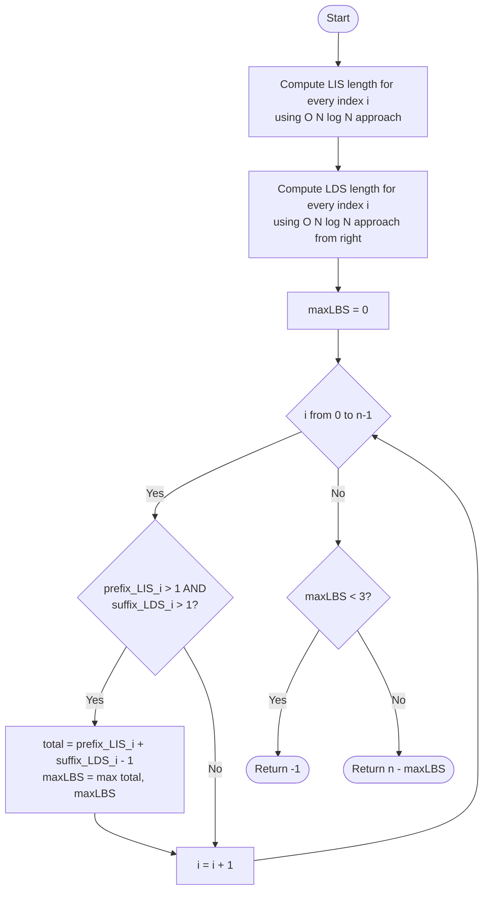

# ARR-032: Minimum Deletions to Make Bitonic

## 📋 Problem Summary

Given an array of $n$ integers, you need to find the minimum number of elements to delete such that the remaining elements form a **strictly bitonic sequence**.

A sequence is **strictly bitonic** if:

1. It strictly increases to some peak element.
2. It strictly decreases after that peak element.
3. The peak element must have **at least one** element to its left and **at least one** element to its right (ensuring the sequence is not purely increasing or purely decreasing).
4. All increases and decreases must be **strict** (no equal adjacent elements).

If no such sequence of length at least 3 can be formed, return $-1$.

## 🌍 Real-World Scenarios

**Scenario 1: 🏔️ Mountain Trail Outlier Removal**
A surveyor is mapping the elevation of a mountain path. Due to GPS glitches, some readings are spikes or "pits" that don't match the general topography. To get a clean "Up-then-Down" profile of the mountain, the surveyor wants to delete the minimum number of outlier readings to restore a smooth bitonic shape.

**Scenario 2: 📈 Economic Cycle Modeling (Boom and Bust)**
Economists model certain market phases as a "Boom" followed by a "Bust." They have raw daily data that is noisy. To find the longest period that fits this theoretical model exactly, they find the Longest Bitonic Subsequence. Deleting the remaining points gives the "noise" in the market.

**Scenario 3: 🔋 Battery Discharge Cycle Analysis**
A battery is charged to 100% and then used until it dies. A sensor records capacity. Because of temperature fluctuations, the capacity might jitter up and down. To find the "ideal" single-cycle performance curve, the researcher deletes the jittery points to maintain a strictly rising (charging) and falling (discharging) curve.

**Scenario 4: 🔊 Audio Waveform Cleaning**
An audio signal represents a single pulse that rises and falls. In the presence of high-frequency noise, the signal isn't smooth. Identifying the maximum number of original samples that form a single pulse involves finding the longest bitonic subsequence.

### Real-World Relevance

Bitonic sequences are the fundamental mathematical model for "Single-Peakedness." They are used in voting theory, electronics, and economics to represent processes that have a single growth phase followed by a single decline phase.

## 🚀 Detailed Explanation

### 1. The Strategy: Maximize the Remaining

The "Minimum Deletions" problem is effectively a "Maximum Subsequence" problem. If we can find the **Longest Bitonic Subsequence (LBS)**, the minimum deletions will simply be $n - \text{Length}(LBS)$.

### 2. Building the Bitonic Subsequence

A bitonic subsequence is formed by joining two other subsequences at a single "peak" element $a[i]$:

1. A **Longest Increasing Subsequence (LIS)** ending at $a[i]$.
2. A **Longest Decreasing Subsequence (LDS)** starting at $a[i]$.

If we know the length of the LIS ending at every index $i$ and the LDS starting at every index $i$, we can check every possible index as a potential "peak."

### 3. The Peak Constraint

The problem adds a crucial constraint: the peak must have elements on both sides.

- This means $LIS[i]$ must be $> 1$ (there is something to the left of $i$).
- This means $LDS[i]$ must be $> 1$ (there is something to the right of $i$).

If $LIS[i] + LDS[i] - 1$ is calculated for every index $i$ that meets the above criteria, the maximum of these values is the length of our LBS.

### 4. Complexity Optimization for $N = 200,000$

A standard $O(N^2)$ DP approach for LIS will be far too slow ($200,000^2 = 4 \times 10^{10}$ operations). We must use the **$O(N \log N)$ LIS algorithm** (often called the "Patience Sorting" or "Tail Array" approach).

1. Generate an array `prefix_LIS[]` where `prefix_LIS[i]` is the LIS ending at $i$.
2. Generate an array `suffix_LDS[]` where `suffix_LDS[i]` is the LDS starting at $i$. This is done by running the LIS algorithm on the array from right to left.
3. Iterate through $i=0$ to $n-1$, and if `prefix_LIS[i] > 1` and `suffix_LDS[i] > 1`, update `max_len`.

### 🔄 Algorithm Flow Diagram

## 🔍 Complexity Analysis

### Time Complexity: $O(N \log N)$

- **LIS Construction:** $O(N \log N)$ using binary search to maintain the smallest "tails" of increasing subsequences.
- **LDS Construction:** $O(N \log N)$ using the same logic in reverse.
- **Final Scan:** $O(N)$ to check each peak.
- With $N = 200,000$, the $\log N$ factor is $\sim 18$, leading to roughly $3.6 \times 10^6$ operations—perfect for 1 second.

### Space Complexity: $O(N)$

- We need two arrays of size $N$ to store the `prefix_LIS` and `suffix_LDS` results.
- We also need a temporary array for the binary search part of the LIS algorithm.

## 🧪 Edge Cases & Testing

### 1. Purely Increasing

- **Input:** `[1, 2, 3, 4]`
- **Expectation:** Return `-1`. Every index has $LDS[i] = 1$. No valid peak exists.

### 2. Purely Decreasing

- **Input:** `[4, 3, 2, 1]`
- **Expectation:** Return `-1`. Every index has $LIS[i] = 1$.

### 3. V-Shape (Valley)

- **Input:** `[5, 4, 1, 4, 5]`
- **Check at index 2 (value 1):** $LIS[2]=1$ (nothing smaller to the left).
- **Expectation:** Return `-1`. A valley is the opposite of a bitonic sequence.

### 4. Minimum Valid Sequence

- **Input:** `[1, 10, 1]`
- **Expectation:** Return `0`. $LIS[1]=2, LDS[1]=2 \rightarrow 2+2-1=3$.

### 5. Plateaus

- **Input:** `[1, 2, 2, 3, 2, 1]`
- **Expectation:** The LIS algorithm must be **strictly** increasing. It will only pick one of the `2`s.
- $LIS = [1, 2, 2, 3]$ $\rightarrow$ length is 3.
- $LDS = [3, 2, 2, 1]$ $\rightarrow$ length is 3.
- $LBS = 3+3-1=5$. Total elements kept: `[1, 2, 3, 2, 1]`.

### 6. Constant Array

- **Input:** `[5, 5, 5, 5]`
- **Expectation:** Return `-1`.

## ⚠️ Common Pitfalls & Debugging

**1. The "Off-by-One" Peak**

- **Pitfall:** Calculating $LIS[i] + LDS[i]$.
- **Fix:** The peak element $a[i]$ is included in both counts. You must subtract 1 so that the peak is only counted once in the result.

**2. Strictly vs Non-Strictly**

- **Pitfall:** Allowing equal adjacent elements.
- **Fix:** Ensure your binary search for LIS uses `lower_bound` vs `upper_bound` logic correctly to maintain **strict** increasing property. In `std::lower_bound`, you find the first element $\ge$ target. This correctly enforces strictness by replacing values.

**3. Ignoring the "One Element on Both Sides" Rule**

- **Pitfall:** `maxLen = max(LIS[i] + LDS[i] - 1)`.
- **Fix:** If you don't check `LIS[i] > 1` and `LDS[i] > 1`, you might mistakenly return $n$ deletions for an array like `[1, 2, 3]`, which is purely increasing.

**4. Memory Limits**

- Storing multiple $200,000$-element arrays can take several megabytes. Ensure you're not creating excessive copies of the array.

## 🎯 Variations & Extensions

### Variation 1: Longest Bitonic Subsequence (LBS)

The goal is simply to find the length of the subsequence rather than the number of deletions.

### Variation 2: Non-Strict Bitonic

Allow plateaus (non-decreasing then non-increasing).
_Solution: Change strict `<` to $\le$ in the LIS logic._

### Variation 3: Circular Bitonic

The peak could "wrap around" the array.
_Solution: Requires doubling the array or more complex logic._

### Variation 4: Multi-Peak Sequence

Find the longest subsequence with at most $M$ peaks.
_Solution: Complex Dynamic Programming ($O(N^2 \cdot M)$)._

### Variation 5: Bitonic with Minimum Peak Value

The peak element must be at least some value $V$.

## 🎓 Key Takeaways

1. **Minimize Deletions = Maximize Subsequence.** This is a frequent substitution in array problems.
2. **Combine Results:** Bitonic is just Increasing + Decreasing. Solving two simpler problems and combining them often works for complex patterns.
3. **Efficiency:** For $N=10^5$, $O(N^2)$ is the enemy. Always look for $O(N \log N)$ or $O(N)$ optimizations.
4. **Constraints Matter:** The "neighbors on both sides" rule changes the feasibility of many potential peaks.

## 📚 Related Problems

- **Longest Increasing Subsequence (LIS):** The fundamental building block.
- **Mountain Array (LeetCode 941):** Determining if an array is already bitonic.
- **Longest Mountain in Array (LeetCode 845):** A contiguous version of this problem.
- **Russian Doll Envelopes:** A 2D extension of LIS.
- **Wiggle Subsequence:** Alternating increases and decreases.
