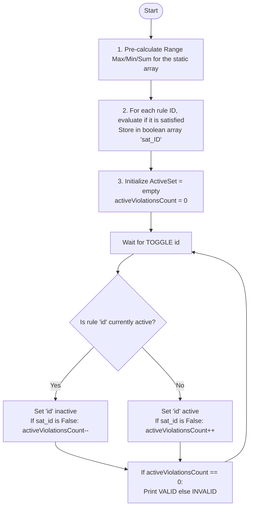

# ARR-040: Array Validity Under Multiple Rulesets

## 📋 Problem Summary

You are given a static array and a collection of $r$ potential rules. Each rule defines a constraint over a specific range $[l, r]$ based on either the **Maximum**, **Minimum**, or **Sum** of elements in that range.

**Toggling Mechanism:**
You must process $q$ operations where individual rules are toggled (Active $\leftrightarrow$ Inactive). After every toggle, you must determine if the array is currently "Valid"—meaning **all currently active rules** are satisfied simultaneously.

**Efficiency Requirement:**
With $n, r, q = 200,000$, checking every active rule after every toggle ($O(r)$ per query) is impossible. You need a way to track "global validity" in $O(\log N)$ or $O(1)$ per toggle.

## 🌍 Real-World Scenarios

**Scenario 1: ✈️ Flight Safety Pre-Check Dashboard**
A pre-flight system monitors various aircraft sensors (vibration, temperature, pressure). Engineers have defined hundreds of safety rules (e.g., "Max vibration in engine 1 should not exceed 50"). During testing, they toggle different systems on and off. The dashboard must instantly show if the current active configuration of the plane is "Safe" (Valid) or "Risk" (Invalid).

**Scenario 2: ⚡ Smart Grid Load Management**
A power grid operator has a timeline of predicted energy usage. They can activate various "Grid Constraints" (e.g., "Max usage in Zone A between 5 PM and 8 PM must be $\le 100MW$"). As they activate/deactivate different transmission lines or rules, they need to know if the baseline energy plan remains feasible.

**Scenario 3: 🧪 Chemical Reactor Multi-Staged Monitoring**
In a chemical plant, a batch follows $N$ timed steps. Sensors record metrics. Different chemical recipes have different "Rule Sets" (Active Rules). As recipes change (toggling rules), the system warns operators if any active safety constraint for the current batch is breached.

**Scenario 4: 📊 Automated Financial Audit Toggles**
An auditor looks at a sequence of expenses. They have 200,000 potential fraud detection rules (e.g., "Sum of expenses in Week 3 must be $\le \$5000$"). They toggle specific sets of rules based on the legal jurisdiction being checked. The system identifies if the company's books are "Clean" for the current jurisdiction's laws.

**Scenario 5: 🎮 Game Level Design constraints**
A level designer creates a map (array of height values). They toggle "Design Rules" (e.g., "No drop in the first 50 tiles can be $> 5$ units"). As they tweak the engine’s rules, the editor tells them if the level is still playable for the chosen character's abilities.

### Real-World Relevance

This problem addresses **State-Driven Validation**. In many systems, "Rules" are pre-defined but only applicable in certain modes. The core technical challenge is efficiently updating a "Global Status" when a dependency changes, rather than re-calculating everything from scratch.

## 🚀 Detailed Explanation

### 1. Pre-Processing: The Static Advantage

Since the array values **never change**, we can calculate whether each rule is satisfied _once_ at the beginning.

- **MAX / MIN Rules:** Use a **Segment Tree** or **Sparse Table** to perform $r$ Range Max/Min Queries in $O(r \log n)$ or $O(r)$.
- **SUM Rules:** Use a **Prefix Sum Array** to perform $r$ Range Sum Queries in $O(r)$.

For each rule $ID$, we store a boolean: `isSatisfied[ID]`.

### 2. The "Violation Accounting" Trick

The key insight for getting $O(1)$ per query is to track a single integer: **`activeViolations`**.

`activeViolations` = The count of rules that are **both** currently Active and currently Unsatisfied.

**When a rule $ID$ is toggled:**

1. If rule $ID$ is **Satisfied** (based on our pre-check):
   - Toggling it has **zero effect** on the validity. It's safe whether it's active or not.
2. If rule $ID$ is **Unsatisfied**:
   - **Activating it:** `activeViolations = activeViolations + 1`.
   - **Deactivating it:** `activeViolations = activeViolations - 1`.

**The Global Check:**
At any moment, if `activeViolations == 0`, the array is **VALID**. Otherwise, it is **INVALID**.

### 🔄 Algorithm Flow Diagram

## 🔍 Complexity Analysis

### Time Complexity: $O(N + R \log N + Q)$

- **Building Segment Tree/Sparse Table:** $O(N \log N)$ or $O(N)$.
- **Rule Pre-checking:** $r$ queries $\times O(\log N)$ (for Max/Min) or $O(1)$ (for Sum). Total $O(R \log N)$.
- **Toggle Operations:** Each toggle is $O(1)$ because we just update the counter. Total $O(Q)$.
- Overall: $O(200,000 \cdot \log 200,000) \approx 3.6 \times 10^6$. Very fast.

### Space Complexity: $O(N + R)$

- **Segment Tree:** $O(N)$.
- **Rule Status Storage:** $O(R)$.
- **Constraint Meta-data:** $O(R)$.

## 🧪 Edge Cases & Testing

### 1. No Active Rules

- **Scenario:** $Q$ toggles deactivate everything or the problem starts with no rules.
- **Logic:** `activeViolations` will be 0. Output is `VALID`.

### 2. Rule satisfied by "luck"

- **Input:** $A = [1, 2, 3]$, `MAX 1 3 4`.
- **Logic:** Max is 3. $3 \le 4$. The rule is satisfied. Toggling this rule never changes the output from `VALID` to `INVALID`.

### 3. Rule exactly at the boundary

- **Input:** $A = [10]$, `MIN 1 1 10`.
- **Logic:** $10 \ge 10$. Satisfied.

### 4. Zero length or Negative Numbers

- Constraints say $1 \le l \le r$, but $x$ can be negative.
- Sum of negative numbers can exceed negative thresholds.
- **Handling:** Ensure prefix sum and comparison logic correctly handle negative integers.

### 5. Huge Sums

- $200,000$ elements of $10^9$ can reach $2 \times 10^{14}$.
- **Warning:** Use **64-bit integers** (`long long`) for sum-rule calculations.

## ⚠️ Common Pitfalls & Debugging

**1. Re-checking All Rules per Toggle**

- **Pitfall:** Iterating through all active rules after a toggle.
- **Result:** $O(Q \cdot R) \approx 4 \times 10^{10}$, which will timeout.
- **Fix:** Use the `activeViolations` counter.

**2. 1-Based Rule Indices**

- **Pitfall:** `TOGGLE 1` refers to the rule at index 0 in your list.
- **Correction:** Subtract 1 from the ID before looking it up in your rule-status array.

**3. Integer Overflow**

- **Pitfall:** Comparing sums using `int`.
- **Correction:** Intermediate prefix sum and threshold $x$ for sum rules must be 64-bit.

**4. Wrong Segment Tree Type**

- Ensure you have both a Min-Segment Tree and a Max-Segment Tree (or a combined one) to handle different rule types. Using a Max-Tree for a `MIN` rule will lead to incorrect satisfaction flags.

## 🎯 Variations & Extensions

### Variation 1: Value Updates

What if the array elements $a_i$ could also change?
_Solution: This is much harder. Each toggle/update requires updating the `activeViolations` counter by re-checking all rules that cover the changed index. For efficiency, you'd need a "Tree of Rules" or a 2D data structure ($O(Q \log^2 N)$)._

### Variation 2: Rule Groups

Toggling a "Category ID" activates a whole group of rules.

### Variation 3: Priority Rules

If Rule 1 is violated, the whole thing is INVALID regardless of Rule 2.

### Variation 4: Multi-Array

Check rules across multiple related arrays.

### Variation 5: Rule dependencies

Rule A can only be active if Rule B is satisfied.

## 🎓 Key Takeaways

1. **Incremental Updates:** When a system changes slightly (one toggle), try to update the "Global State" in $O(1)$ instead of re-evaluating everything.
2. **Pre-processing Static Data:** If data doesn't change, move as much computation as possible to the beginning of the program.
3. **Counter Pattern:** Tracking the number of "Bad" items is a standard competitive programming trick to answer "Is everything good?" in $O(1)$.

## 📚 Related Problems

- **Range Max/Min Query:** The building block for this problem.
- **Dynamic Array Range Sum:** Handling both toggles and updates.
- **Constraint Satisfaction Problems (CSP):** The theoretical background for rule-based systems.
- **ARR-041:** Persistent Prefix Max (Another way to handle complex versioned state).
