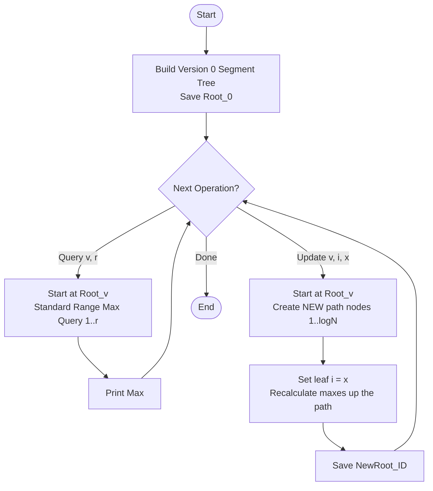

# ARR-041: Persistent Prefix Maximum Queries

## 📋 Problem Summary

You are tasked with maintaining a system that supports **versioned updates** and queries on an array.

**Core Operations:**

1. **Update ($U \ v \ i \ x$):** Create a _new_ version of the array based on version $v$, where the element at index $i$ is changed to $x$. This does not modify version $v$.
2. **Query ($Q \ v \ r$):** Find the maximum value in the prefix $[1, r]$ for a specific version $v$.

**Requirement:** Access any past version instantly. $N, Q = 200,000$ requires an extremely optimized approach that doesn't copy the whole array for every update.

## 🌍 Real-World Scenarios

**Scenario 1: 💾 Git-style Version Control for Data**
In software development, `git` allows you to jump between commits. If your "code" was just an array of values, this problem models exactly how you'd Efficiently store every commit (version) and query the state of the code at that specific time without taking up gigabytes of space for every single file change.

**Scenario 2: 🏦 Retroactive Financial Auditing**
A bank records transactions. Sometimes, an error is found in a transaction from 3 weeks ago (Version 0). Auditors want to create a "Corrected Branch" (Version 1) based on that old state to see how current balances _would_ have looked if the error hadn't happened. They need to query "Maximum Balance in the first 100 days" for both the original and the corrected timelines.

**Scenario 3: 🎮 Game Save State Management**
In a strategy game, the player can save at any time. If they make a move (Update), it creates a new "future." If they don't like it, they "Undo" (Load Version $v$). Persistent structures allow the game to store hundreds of "Undo" states with minimal memory overhead.

**Scenario 4: 📈 Multi-Scenario Forecasting**
Economists have a baseline model of $N$ indicators. They want to test 50 different "What-if" scenarios (e.g., "What if oil prices hit $100 in Month 5?"). Each scenario is a fork from the baseline. They need to query statistics like "Max inflation" across different model versions.

**Scenario 5: 🧪 Scientific Data Provenance**
Research data is often cleaned in stages. Version 0 is raw data. Version 1 is after outlier removal. Version 2 is after normalization. Researchers need to compare the "Maximum reading in the first 100 sensors" across all these processing stages to validate their pipeline.

### Real-World Relevance

Persistence is the heart of **Functional Programming** and **Immutable Data Architectures**. It allows for "Pure" operations where data is never mutated, only transformed into new versions, ensuring safety and thread-concurrency.

## 🚀 Detailed Explanation

### 1. The Bottleneck: The Copy-on-Write Trap

If we copy the entire array for every update:

- **Memory:** $200,000 \text{ elements} \times 200,000 \text{ updates} = 40 \text{ Billion integers}$.
- **Time:** $O(N)$ per update $\approx 40 \text{ Billion operations}$.
  This crashes both memory and time limits.

### 2. The Solution: Persistent Segment Tree

A Segment Tree is a binary tree where each node stores the maximum of its range. When one element changes, only the nodes on the **direct path from that leaf to the root** are affected.

- In a tree of size $N$, the path length is $\log_2(N)$.
- For $N=200,000$, $\log_2(N) \approx 18$.

**The Path-Copying Trick:**
Instead of modifying the 18 nodes in place:

1. Create 18 **new** nodes.
2. These new nodes copy the values and pointers from the old nodes.
3. Update the value in the new nodes.
4. Point the "unchanged" child of a new node to the **existing** child of the old node.
5. Save the new Root.

### 3. Visual Representation

Imagine updating index 3 in a tree of size 4:

```text
Version 0:                Version 1 (Update index 3):
      [1-4]                      [1-4]* (New Root)
     /     \                    /     \
  [1-2]   [3-4]              [1-2]   [3-4]* (New Path Node)
 /   \    /   \             /   \    /   \
(1) (2) (3)  (4)           (1) (2) (3)*  (4)
```

Notice that Version 1 **shares** the entire `[1-2]` subtree and the `(4)` leaf with Version 0. It only allocates a new Root, a new `[3-4]` node, and a new `(3)` leaf.

### 4. Memory Management

Because Persistent Segment Trees create so many nodes, developers often use a pre-allocated "Node Pool" (a large array of Node objects) to avoid the overhead of constant `allocate` / `new` calls.

### 🔄 Algorithm Flow Diagram



## 🔍 Complexity Analysis

### Time Complexity: $O(Q \log N)$

- **Building Version 0:** $O(N)$.
- **Update:** $O(\log N)$ to traverse and copy the path.
- **Query:** $O(\log N)$ standard segment tree traversal.
- Total complexity is dominated by $Q \log N$, which is roughly $200,000 \times 18 = 3.6 \times 10^6$ operations.

### Space Complexity: $O(N + Q \log N)$

- **Version 0:** $2N - 1$ nodes.
- **Each Update:** $\sim \log N$ new nodes.
- Total nodes: $(2 \times 200,000) + (200,000 \times 18) \approx 4 \times 10^6$ nodes.
- Each node stores: `maxVal`, `leftNodePointer`, `rightNodePointer`.
- **Total Memory:** Approx 48–64 MB.

## 🧪 Edge Cases & Testing

### 1. Branching from Non-Latest Version

- **Scenario:** $V0 \rightarrow V1 \rightarrow V2$, but then $U \ 1 \ i \ x$ (Updating $V1$ to create $V3$).
- **Logic:** The tree should correctly branch from $V1$'s nodes, ignoring $V2$'s changes.

### 2. Updating the Same Index Multiple Times

- **Scenario:** $V0 \rightarrow V1 \rightarrow V2$ all update index 5.
- **Logic:** Every version is distinct. $V2$ should have the most recent change, but $V0$ and $V1$ must remain intact.

### 3. Querying Large Prefix ($r = n$)

- **Scenario:** $Q \ v \ n$.
- **Logic:** The query should return the maximum of the entire array version.

### 4. Updating a Large Value

- **Scenario:** $x = 2^{31} - 1$.
- **Logic:** Maximum calculations should handle large integers (use `long` / `int64` if values can sum or exceed $2 \times 10^9$).

### 5. Queries with No Updates

- Performance should be identical to a standard segment tree.

## ⚠️ Common Pitfalls & Debugging

**1. Mutating Nodes Instead of Copying**

- **Pitfall:** `node.maxVal = x`.
- **Consequence:** You just broke all previous versions that shared this node!
- **Fix:** Always create a **clone** first: `newNode = new Node(oldNode); newNode.maxVal = x;`.

**2. Incorrect Base Version**

- **Pitfall:** Updates always using the "latest" version.
- **Requirement:** The problem specifically provides a version $v$ to branch from.

**3. Pointer Management**

- If using `C++`, be careful with pointers and memory. Many competitive programmers use a pool array `struct Node pool[MAXN]` and use `int` indices as "pointers" to avoid memory leaks and fragmentation.

**4. Recalculating Max**

- **Pitfall:** Updating the leaf but forgetting to update the `maxVal` in the newly created parent nodes.
- **Requirement:** The `update` function must be recursive and set the `maxVal` of a new node based on its children after the child's own update is complete.

## 🎯 Variations & Extensions

### Variation 1: Persistent Segment Tree with Sum

Instead of Prefix Max, support Range Sum queries.
_Logic: Same path-copying, just store sums instead of max._

### Variation 2: Finding K-th Smallest (Offline)

Persistent segment trees are commonly used to solve the "Static Range K-th Smallest" problem by building a tree for each prefix frequency.

### Variation 3: Lazy Propagation in Persistent Trees

Extremely difficult. Traditional lazy propagation requires modifying nodes during queries.
_Solution: Use "Persistent Lazy Propagation" where queries also create new nodes, or "Permanent Tagging" where tags are never pushed._

### Variation 4: Multiple Forks

Merging two different versions together (Melding).

### Variation 5: Fractional Cascading

Using persistence to optimize 2D range searches.

## 🎓 Key Takeaways

1. **Path-Copying:** The core optimization that makes persistence efficient ($O(\log N)$ space/time).
2. **Immutability:** Persistence ensures that once a version is created, it is "Read-Only" and permanent.
3. **Sharing Infrastructure:** Versions share as much of the tree as possible, only diverging where they absolutely must.
4. **Offline Versioning:** Any point in the past is just a pointer to a root node away.

## 📚 Related Problems

- **Static Range K-th Smallest:** The most famous application of persistent segment trees.
- **Versioned Stack/Queue:** Simpler forms of persistence.
- **Range Xor Query with Updates:** Standard segment tree foundation.
- **ARR-043:** Mo's Algorithm (Another way to handle range queries offline).
