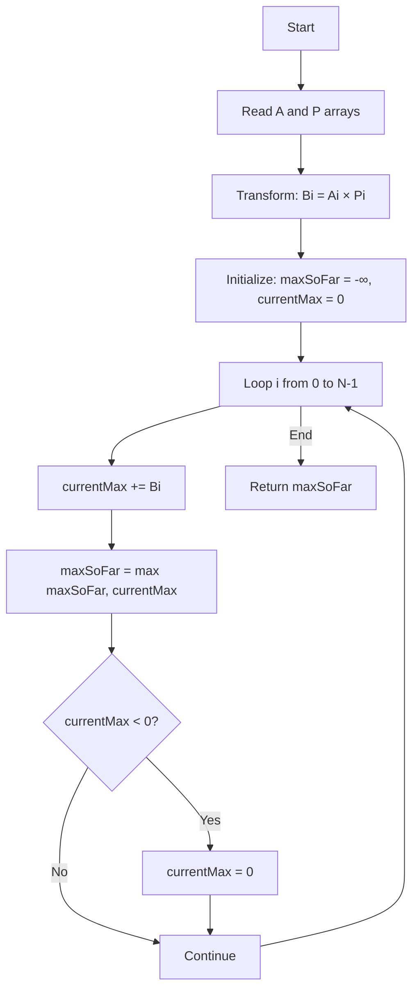

# Array with Probabilistic Weights - Enhanced Editorial

## 📋 Problem Summary

Given an array of **values** `A[i]` and **probabilities** `P[i]` (in per-mille, 0-1000), calculate the maximum **expected sum** over all possible subarrays.

**Key Concept:** Each element contributes `A[i]` with probability `P[i]/1000`, otherwise contributes 0.

**Mathematical Definition:**

```
For subarray [L, R]:
Expected Sum = Σ(A[i] × P[i]/1000) for i in [L, R]
            = (1/1000) × Σ(A[i] × P[i])
```

**Output:** Maximum expected sum × 1000 (as integer)

## 🌍 Real-World Scenarios

**Scenario 1:** 🎲 **Risky Investment Portfolio**

You're evaluating investment opportunities. Each investment has:

- **Potential return** A[i] (could be profit or loss)
- **Success probability** P[i]/1000

You want to select a contiguous sequence of related investments (e.g., same market sector) that maximizes expected total return.

**Scenario 2:** 🎮 **Game Loot Optimization**

In a dungeon crawler, sequential rooms contain loot chests. Each chest has:

- **Loot value** A[i] (gold, could be negative for traps)
- **Drop rate** P[i]/1000

Find the optimal sequence of rooms to explore for maximum expected loot.

**Scenario 3:** 📡 **Unreliable Sensor Array**

Multiple sensors measure environmental data. Each sensor reading has:

- **Measurement value** A[i]
- **Reliability** P[i]/1000 (probability reading is accurate, else noise)

Find the contiguous sensor range with maximum expected accurate total signal.

**Scenario 4:** 🏥 **Clinical Trial Success Prediction**

Sequential treatments in a protocol have:

- **Health impact** A[i] (positive for improvement, negative for side effects)
- **Efficacy rate** P[i]/1000

Determine which treatment subsequence has highest expected patient benefit.

**Scenario 5:** 🌾 **Agricultural Yield Planning**

Sequential crop plots have:

- **Expected yield value** A[i] per plot
- **Weather-adjusted success rate** P[i]/1000

Find which contiguous farming region maximizes expected revenue.

### Real-World Relevance

- **Financial modeling:** Portfolio optimization with risk
- **Machine learning:** Feature selection with confidence scores
- **Operations research:** Resource allocation under uncertainty
- **Queuing theory:** Service optimization with probabilistic demand

## 🚀 Detailed Explanation

### 1. The Power of Linearity of Expectation

**Fundamental Theorem:**

For any random variables X₁, X₂, ..., Xₙ (even dependent ones):

```
E[X₁ + X₂ + ... + Xₙ] = E[X₁] + E[X₂] + ... + E[Xₙ]
```

**Applied to Our Problem:**

For subarray [L, R]:

```
E[Sum] = E[Σ Xᵢ]           where Xᵢ = A[i] w/ prob P[i]/1000, else 0
       = Σ E[Xᵢ]            by linearity
       = Σ (A[i] × P[i]/1000)
```

**Key Insight:** Expected sum of subarray = sum of individual expected values!

### 2. Transformation to Standard Problem

Define transformed array:

```
B[i] = A[i] × P[i]
```

Then:

```
Expected Sum of subarray [L,R] = (Σ B[i]) / 1000 for i in [L,R]
```

**Problem Reduction:**

```
Maximize: (Σ B[i]) / 1000
↓
Maximize: Σ B[i]          (dividing by constant doesn't change which subarray is max)
↓
This is exactly: Maximum Subarray Sum Problem!
```

### 3. Kadane's Algorithm Application

**Classic Kadane for Maximum Subarray:**

```
maxSoFar = -∞
currentMax = 0

for each element:
    currentMax = max(element, currentMax + element)
    maxSoFar = max(maxSoFar, currentMax)

return maxSoFar
```

**For Our Problem:**

```
Transform: B[i] = A[i] × P[i]
Apply Kadane on B
Result is already scaled by 1000 (since P[i] is 0-1000)
```

### 4. Detailed Example Walkthrough

**Input:**

```
A = [5, -2, 3, 1]
P = [1000, 500, 1000, 250]  (probabilities in per-mille)
```

**Step 1: Transform**

```
B[0] = 5 × 1000 = 5000
B[1] = -2 × 500 = -1000
B[2] = 3 × 1000 = 3000
B[3] = 1 × 250 = 250
```

**Step 2: Apply Kadane**

```
i=0: currentMax = max(5000, 0+5000) = 5000, maxSoFar = 5000
i=1: currentMax = max(-1000, 5000-1000) = 4000, maxSoFar = 5000
i=2: currentMax = max(3000, 4000+3000) = 7000, maxSoFar = 7000
i=3: currentMax = max(250, 7000+250) = 7250, maxSoFar = 7250
```

**Result:** 7250 (entire array gives max expected sum)

**Interpretation:**

```
Expected sum = 7250/1000 = 7.25
Subarray: [5, -2, 3, 1]
E[Sum] = 5×1.0 + (-2)×0.5 + 3×1.0 + 1×0.25 = 5 - 1 + 3 + 0.25 = 7.25 ✓
```

### 🔄 Algorithm Flow Diagram



## 📊 Complexity Analysis

### Time Complexity: O(N)

- Transformation: O(N) to compute B[i]
- Kadane's algorithm: O(N) single pass
- **Total: O(N)** ✓

### Space Complexity: O(N) or O(1)

**Option 1 - Explicit Array:** O(N)

- Store transformed array B
- Then run Kadane

**Option 2 - On-the-fly:** O(1)

- Compute B[i] = A[i] × P[i] during Kadane iteration
- No extra array needed
- **Optimal: O(1)** auxiliary space

### Why Kadane Works

Kadane is optimal for maximum subarray because:

1. At each position, either extend previous subarray or start fresh
2. If current sum becomes negative, reset (starting fresh is better)
3. Guarantees finding global maximum in O(N)

## 🧪 Edge Cases & Testing

### Edge Case 1: All Zero Probabilities

```
A = [100, 200, 300]
P = [0, 0, 0]
B = [0, 0, 0]
Maximum expected sum = 0
```

### Edge Case 2: Negative Values with High Probability

```
A = [-10, -5, -20]
P = [1000, 1000, 1000]
B = [-10000, -5000, -20000]
Kadane returns max single element: -5000
Expected sum = -5 (least negative)
```

### Edge Case 3: Positive Values with Zero Probability

```
A = [1000, 2000]
P = [0, 0]
B = [0, 0]
Expected sum = 0 (nothing contributes)
```

### Edge Case 4: Mixed Signs and Probabilities

```
A = [10, -20, 30]
P = [1000, 500, 1000]
B = [10000, -10000, 30000]

Kadane trace:
i=0: cur=10000, max=10000
i=1: cur=0 (reset), max=10000
i=2: cur=30000, max=30000

Best: [30] with expected sum = 30
```

### Edge Case 5: Single Element

```
A = [42]
P = [750]
B = [31500]
Expected sum = 31.5
```

### Edge Case 6: All Elements with 100% Probability

```
A = [1, -2, 3, -1, 5]
P = [1000, 1000, 1000, 1000, 1000]
Reduces to standard maximum subarray
```

## ⚠️ Common Pitfalls & Debugging

### Pitfall 1: Forgetting Probability is Per-Mille

```
❌ Wrong: B[i] = A[i] × (P[i]/1000)  # Float division!
   Result won't be integer, loses precision

✓ Correct: B[i] = A[i] × P[i]
   Keep everything as integers
```

### Pitfall 2: Integer Overflow

```
⚠️  A[i] can be ±10^9, P[i] up to 1000
    B[i] = A[i] × P[i] could be ±10^12

✓ Solution: Use long/int64 for B and sums
```

### Pitfall 3: Returning Empty Subarray

```
❌ Wrong: If all negative, return 0 (empty subarray)
   Problem requires non-empty subarray!

✓ Correct: Kadane modification
   Initialize maxSoFar = B[0] (or -∞, then ensure ≥ one element)
```

### Pitfall 4: Not Handling Negative Probabilities

```
⚠️  Problem states 0 ≤ P[i] ≤ 1000
    But validate inputs in production code
```

### Pitfall 5: Resetting Current Sum Incorrectly

```
❌ Wrong: if currentMax < 0: currentMax = B[i]  # Skip reset
   Doesn't actually reset to 0 first

✓ Correct:
   currentMax += B[i]
   if currentMax < 0: currentMax = 0
```

## 🎯 Variations & Extensions

### Variation 1: Find the Actual Subarray

Return indices [L, R] of maximum expected sum:

```
Track start and end indices during Kadane:
- When resetting, update start = i+1
- When updating maxSoFar, save current [start, i] as best range
```

### Variation 2: K Maximum Expected Sums

Find K non-overlapping subarrays with top K expected sums:

```
More complex - requires DP or greedy with interval selection
O(N log N) with priority queue
```

### Variation 3: Constrained Length

Maximum expected sum for subarrays of length exactly K:

```
Use sliding window:
windowSum = sum of first K elements of B
maxSum = windowSum
for i from K to N-1:
    windowSum = windowSum - B[i-K] + B[i]
    maxSum = max(maxSum, windowSum)
```

### Variation 4: Conditional Probabilities

Probabilities depend on previous selections (dependencies):

```
No longer independent - linearity still holds for expectation
But computing probabilities requires product rule
Transforms into more complex DP
```

### Variation 5: Minimize Expected Sum

Find subarray with minimum expected sum:

```
Apply Kadane for minimum:
- Track minimum instead of maximum
- Reset when sum becomes positive
```

### Variation 6: 2D Version

Matrix where each cell has value and probability:

```
Extend to maximum expected sum rectangle
Use 2D Kadane with probability transformation
O(N² × M) complexity
```

## 🎓 Key Takeaways

1. **Linearity of expectation** is powerful - works even for dependent variables
2. **Problem transformation** reduces complex probability to standard algorithm
3. **Kadane's algorithm** is O(N) optimal for maximum subarray
4. **Integer arithmetic** - keep everything as integers by scaling
5. **Classic DP pattern** - many problems reduce to known solutions

## 📚 Related Problems

- **Maximum Subarray (Kadane):** Base algorithm used here
- **Stock Trading Problems:** Similar expected value calculations
- **Weighted Interval Scheduling:** Optimization under uncertainty
- **Portfolio Optimization:** Real-world application
- **ARR-044:** 2D version of maximum subarray

## 🔗 Additional Resources

- **Linearity of Expectation:** Probability theory fundamentals
- **Kadane's Algorithm:** Dynamic programming classic
- **Expected Value:** Statistics and decision theory
- **Dynamic Programming:** Optimal substructure recognition
