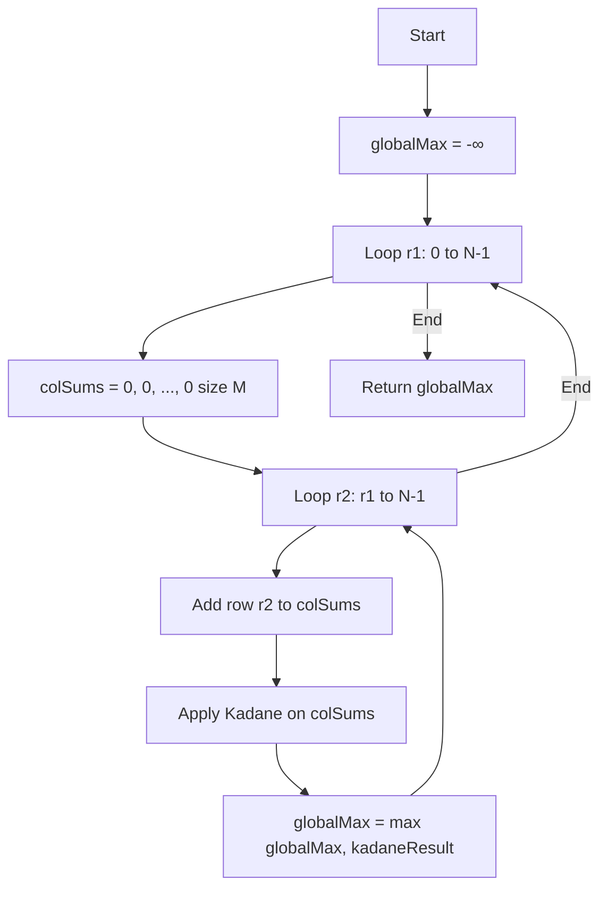

# Max Sum Rectangle - 2D Kadane Reduction

## 📋 Problem Summary

Find the rectangular submatrix with the maximum sum in a 2D matrix.

**Given:** `N × M` matrix (up to 400×400)  
**Find:** Rectangle [r1, c1] to [r2, c2] with maximum sum of all elements

**Key Challenge:** Efficiently search among O(N²M²) possible rectangles

## 🌍 Real-World Scenarios

**Scenario 1:** 🖼️ **Astronomical Image Analysis**

Telescope captures image of night sky as brightness matrix. Some regions have stars/nebulae (positive intensity), others have dark voids or noise (negative). Find the rectangular region containing maximum total light intensity for detailed study.

**Scenario 2:** 🌡️ **Climate Heatmap Optimization**

Temperature grid across geographic region. Positive values indicate heat gain, negative indicate

cooling. Find optimal rectangular zone for solar panel installation (maximum accumulated heat).

**Scenario 3:** 📊 **Financial Trading Floor Analysis**

Matrix of trading desk profitability (rows=time periods, cols=traders). Positive=profit, negative=loss. Identify rectangular time-trader block with maximum total profit for bonus allocation.

**Scenario 4:** 🎮 **Game Map Resource Distribution**

2D game map where cells contain resources (positive) or hazards (negative). Find optimal rectangular territory to claim for maximum net resource value.

**Scenario 5:** 🏥 **Medical Imaging**

MRI scan as intensity matrix. Abnormalities show as intensity changes (positive or negative). Find rectangular region with highest abnormality score for focused analysis.

### Real-World Relevance

- **Computer vision:** Object detection in images
- **Data mining:** Pattern recognition in 2D datasets
- **Operations research:** Facility location optimization
- **Scientific computing:** Finding density clusters

## 🚀 Detailed Explanation

### 1. The Dimension Reduction Technique

**Key Insight:** Fix top and bottom rows → problem becomes 1D!

**Visual Example:**

```
Matrix:
  1  -2   3
 -1   4  -2
  2  -1   2

Fix rows 0-1 (top two rows):
Column sums: [1-1=0, -2+4=2, 3-2=1]
Now: Find max subarray of [0, 2, 1]
     → Subarray [2, 1] = 3
     → Rectangle from (r=0, c=1) to (r=1, c=2)
```

**Mathematical Formulation:**

For fixed row pair (r1, r2):

```
ColSum[j] = Σ matrix[i][j] for i in [r1, r2]
```

This transforms 2D problem → 1D maximum subarray → Use Kadane!

### 2. Complete Algorithm Breakdown

**Step-by-Step:**

```
1. Initialize globalMax = -∞

2. For each starting row r1 from 0 to N-1:

   a. Initialize columnSums[] = all zeros (size M)

   b. For each ending row r2 from r1 to N-1:

      i. Update columnSums:
         columnSums[j] += matrix[r2][j] for all j

      ii. Apply Kadane's algorithm on columnSums

      iii. currentMax = kadane(columnSums)

      iv. globalMax = max(globalMax, currentMax)

3. Return globalMax
```

**Why This Works:**

- Iterating (r1, r2) pairs: covers all possible row ranges
- Column sums accumulate rows incrementally (efficient!)
- Kadane finds best column range for current row range
- Together: finds optimal rectangle

### 3. Kadane's Algorithm Refresher

**For 1D array, find maximum subarray sum:**

```
maxEndingHere = 0
maxSoFar = -∞

for each element x:
    maxEndingHere = max(x, maxEndingHere + x)
    maxSoFar = max(maxSoFar, maxEndingHere)

return maxSoFar
```

**Or simpler variant:**

```
currentSum = 0
maxSum = first element

for each element:
    currentSum += element
    maxSum = max(maxSum, currentSum)
    if currentSum < 0:
        currentSum = 0
```

### 4. Detailed Example Walkthrough

**Matrix:**

```
  1  -2   3
 -1   4  -2
  2  -1   2
```

**Iteration:**

```
r1=0:
  colSums = [0,0,0]

  r2=0: colSums = [1,-2,3]
        Kadane([1,-2,3]) = 3 (subarray [3])
        globalMax = 3

  r2=1: colSums = [1-1=0, -2+4=2, 3-2=1]
        Kadane([0,2,1]) = 3 (subarray [2,1])
        globalMax = 3

  r2=2: colSums = [0+2=2, 2-1=1, 1+2=3]
        Kadane([2,1,3]) = 6 (entire array)
        globalMax = 6 ✓

r1=1:
  colSums = [0,0,0]

  r2=1: colSums = [-1,4,-2]
        Kadane([-1,4,-2]) = 4
        globalMax = 6

  r2=2: colSums = [-1+2=1, 4-1=3, -2+2=0]
        Kadane([1,3,0]) = 4
        globalMax = 6

r1=2:
  colSums = [0,0,0]

  r2=2: colSums = [2,-1,2]
        Kadane([2,-1,2]) = 3
        globalMax = 6

Result: 6 (rectangle covering all 3 rows, columns 0-2)
```

### 🔄 Algorithm Flow Diagram



## 📊 Complexity Analysis

### Time Complexity: O(N² × M)

- Outer loop (r1): N iterations
- Inner loop (r2): N iterations → N² row pairs total
- For each pair:
  - Update colSums: O(M)
  - Kadane: O(M)
  - Total per pair: O(M)
- **Overall: O(N² × M)**

**For N=M=400:** 400² × 400 = 64,000,000 operations (fast!)

### Space Complexity: O(M)

- Column sums array: O(M)
- Kadane uses O(1)
- **Total: O(M)** auxiliary space

### Optimality

**Cannot do better than O(N² × M):**

- Must consider all (r1,r2) row pairs: Ω(N²)
- Each pair requires examining all M columns: Ω(M)
- Lower bound: Ω(N² × M)

**Alternative:** If N > M, swap roles (iterate column pairs, sum rows)

- Complexity becomes O(M² × N)
- Choose min(N²M, M²N)

## 🧪 Edge Cases & Testing

### Edge Case 1: All Negative

```
Matrix:
 -5  -2
 -3  -7

Kadane returns least negative single element
Result: -2
```

### Edge Case 2: Single Cell (1×1)

```
Matrix: [42]
Result: 42
```

### Edge Case 3: Single Row

```
Matrix: [1, -2, 3, -1, 5]
Reduces to 1D Kadane
Result: 7 (subarray [3,-1,5])
```

### Edge Case 4: Single Column

```
Matrix:
  2
 -1
  3
 -2

Result: 4 (rows 0-2: 2-1+3)
```

### Edge Case 5: Checkerboard Pattern

```
Matrix:
  1  -1   1
 -1   1  -1
  1  -1   1

Best might be single cell: 1
```

### Edge Case 6: Large Positive Center

```
Matrix:
 -50  -50  -50
 -50  200  -50
 -50  -50  -50

Result: 200 (single central cell)
```

## ⚠️ Common Pitfalls & Debugging

### Pitfall 1: Not Resetting Column Sums

```
❌ Wrong: Reuse colSums across different r1 values
   // Accumulation from previous r1!

✓ Correct: Reset colSums = [0,0,...,0] for each new r1
```

### Pitfall 2: Integer Overflow

```
⚠️  Matrix values up to ±10^9
    Rectangle could be 400×400 = 160,000 cells
    Max sum: 160,000 × 10^9 = 1.6×10^14

✓ Solution: Use long/int64 for sums
```

### Pitfall 3: Off-by-One in Loops

```
❌ Wrong: for r2 in range(r1+1, N):
   // Skips single-row rectangles!

✓ Correct: for r2 in range(r1, N):
   // Includes r1==r2 (single row)
```

### Pitfall 4: Forgetting Kadane Edge Case

```
❌ Wrong: Kadane allows empty subarray (returns 0)
   // Problem requires non-empty rectangle

✓ Correct: Modified Kadane that ensures ≥1 element
   Or initialize globalMax with first single cell
```

### Pitfall 5: Not Handling N≠M

```
⚠️  Assuming square matrix
    Algorithm works for any N×M

✓ Note: Can optimize by choosing min(N,M) for outer loop
```

## 🎯 Variations & Extensions

### Variation 1: Return Rectangle Coordinates

Track indices during Kadane:

```
When updating globalMax, also save:
- Top row: r1
- Bottom row: r2
- Left column: kadane's start index
- Right column: kadane's end index
```

### Variation 2: K Largest Rectangles

Find K non-overlapping rectangles with top K sums:

```
After finding each max, mark cells as "used"
Repeat K times, skipping overlapping regions
More complex - needs interval scheduling
```

### Variation 3: Fixed Size Rectangle

Find max sum rectangle of exactly size h×w:

```
Use 2D sliding window instead of Kadane
Simpler: O(N×M) complexity
```

### Variation 4: Minimum Sum Rectangle

Find rectangle with minimum sum:

```
Apply same algorithm but:
- Track minimum instead of maximum
- Modified Kadane for minimum
```

### Variation 5: Rectangle with Constraint

Max sum rectangle where sum ≤ threshold T:

```
For each (r1,r2), use modified Kadane:
- Track best sum that's ≤ T
- More complex - may need binary search
```

### Variation 6: 3D Extension

Find maximum sum cuboid in 3D matrix:

```
Fix two dimensions, reduce to 1D
O(N² × M² × P) for N×M×P matrix
```

## 🎓 Key Takeaways

1. **Dimension reduction** transforms 2D → 1D problems
2. **Incremental updates** (column sums) avoid redundant computation
3. **Kadane's algorithm** is the workhorse for 1D max subarray
4. **Nested iteration** of row pairs covers all rectangles efficiently
5. **Choose wisely:** Iterate over min(N,M) for optimization

## 📚 Related Problems

- **Maximum Subarray (Kadane):** Foundation algorithm
- **ARR-042:** Similar transformation technique
- **Largest Rectangle in Histogram:** Related 2D optimization
- **Maximal Square:** Constrained rectangle problem
- **Range Sum Query 2D:** Precomputation vs. dynamic approach

## 🔗 Additional Resources

- **Kadane's Algorithm:** Dynamic programming classic
- **Dimension Reduction:** Problem-solving technique
- **2D Prefix Sums:** Alternative approach (O(N²M²) naive)
- **Dynamic Programming:** Optimal substructure recognition
