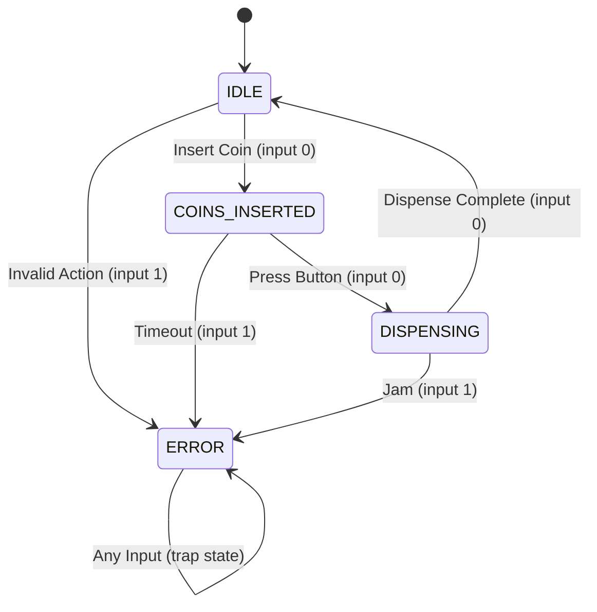

# ARR-045: Array State Machine Simulation

## 📋 Problem Summary

Simulate a **deterministic finite automaton (DFA)** on an array of input values. Given:

- An array `A` of `N` integers (can be negative)
- A transition table `T[S][B]` where `S` is number of states, `B` is alphabet size
- Initial state = 0

For each element `a_i` in the array:

1. Normalize input: `input = ((a_i % B) + B) % B` (handle negative modulo)
2. Transition: `state = T[state][input]`
3. Count visits to each state

Return an array of size `S` showing how many times each state was visited.

**Key Concepts:**

- **Finite State Machine (FSM):** A computational model with fixed number of states
- **Deterministic:** Given a state and input, next state is uniquely determined
- **Transition Table:** Encodes state machine behavior as a 2D array

## 🌍 Real-World Scenarios

**Scenario 1:** 📟 **Vending Machine Controller**

A vending machine has states: `IDLE`, `COINS_INSERTED`, `DISPENSING`, `ERROR`. Sensor inputs (coin inserted, button pressed, dispense complete) cause state transitions defined in ROM. During QA testing, simulate transactions and count: "How many times did the machine enter ERROR state?"

**Scenario 2:** 🎮 **Game Character AI**

An NPC has states: `PATROL`, `CHASE`, `ATTACK`, `RETREAT`. Game events (player spotted, health low, player escaped) trigger transitions. Track state distribution over 1000 game ticks to balance AI behavior.

**Scenario 3:** 🚦 **Traffic Light Controller**

States: `NS_GREEN`, `NS_YELLOW`, `NS_RED_EW_GREEN`, `EW_YELLOW`. Inputs from vehicle sensors determine timing. Simulate a day's traffic pattern and analyze state distribution for optimization.

**Scenario 4:** 🔐 **Protocol State Validator**

Network protocols (TCP, TLS) are state machines. Given a sequence of packet types, simulate the protocol and verify:

- Did we reach the `ESTABLISHED` state?
- How many times did we enter `ERROR`?

**Scenario 5:** 🧬 **DNA Sequence Pattern Matcher**

Build a DFA that recognizes specific DNA patterns. States represent partial pattern matches. Input nucleotides (A/C/G/T mapped to 0-3) drive transitions. Count final state visits to identify pattern occurrences.

### Real-World Relevance

- **Embedded Systems:** Firmware for devices with limited states
- **Lexical Analysis:** Tokenizers in compilers use DFAs
- **Regular Expressions:** Under the hood, regex engines are state machines
- **Digital Circuit Design:** Sequential logic circuits are FSMs
- **Protocol Verification:** Formal methods for network protocol correctness

## 🚀 Detailed Explanation

### 1. Understanding State Machines

A **Deterministic Finite Automaton (DFA)** consists of:

- **States:** Finite set {0, 1, 2, ..., S-1}
- **Alphabet:** Finite set of inputs {0, 1, 2, ..., B-1}
- **Transition Function:** δ(state, input) → next_state
- **Initial State:** State 0
- **(Optional) Accept States:** For pattern matching (not needed here)

**Example FSM:**

```
States = 3 (S=3): {IDLE=0, ACTIVE=1, ERROR=2}
Alphabet = 2 (B=2): {CONTINUE=0, FAIL=1}

Transition Table T[3][2]:
        Input 0    Input 1
State 0:  1          2       (IDLE: continue→ACTIVE, fail→ERROR)
State 1:  1          2       (ACTIVE: continue→ACTIVE, fail→ERROR)
State 2:  2          2       (ERROR: always stay in ERROR - trap state)
```

### 2. Modulo Arithmetic for Negative Inputs ⚠️

**Problem:** Array values can be negative. Standard modulo in most languages handles negatives poorly.

**Examples:**

```
C++/Java/JavaScript:  -5 % 3 = -2  ❌ (want 1)
Python:               -5 % 3 = 1   ✓

Mathematical modulo should always return [0, B-1]
```

**Solution:**

```
normalized_input = ((value % B) + B) % B
```

**Why this works:**

```
value = -5, B = 3

Step 1: -5 % 3 = -2 (language-dependent)
Step 2: -2 + 3 = 1
Step 3: 1 % 3 = 1 ✓

value = 7, B = 3
Step 1: 7 % 3 = 1
Step 2: 1 + 3 = 4
Step 3: 4 % 3 = 1 ✓
```

### 3. Simulation Algorithm

**Step-by-Step Process:**

```
1. Initialize:
   - current_state = 0
   - counts = [0, 0, ..., 0] (size S)
   - counts[0]++ (we start in state 0)

2. For each element a_i in array A:
   - Normalize: input = ((a_i % B) + B) % B
   - Transition: current_state = T[current_state][input]
   - Record visit: counts[current_state]++

3. Return counts
```

**Detailed Example:**

```
Input: A = [5, -2, 3], B = 3
Transition Table T[2][3]:
        0   1   2
State 0: 1   0   1
State 1: 0   1   1

Simulation:
Initial: state = 0, counts = [1, 0]

Step 1: Process 5
  - input = ((5 % 3) + 3) % 3 = (2 + 3) % 3 = 2
  - state = T[0][2] = 1
  - counts = [1, 1]

Step 2: Process -2
  - input = ((-2 % 3) + 3) % 3
          = (-2 + 3) % 3  (in C++: -2 % 3 = -2)
          = 1 % 3 = 1
  - state = T[1][1] = 1
  - counts = [1, 2]

Step 3: Process 3
  - input = ((3 % 3) + 3) % 3 = (0 + 3) % 3 = 0
  - state = T[1][0] = 0
  - counts = [2, 2]

Result: [2, 2]
```

### 4. Visual State Diagram Example

For the simple vending machine example:



**Corresponding Transition Table:**

```
States: IDLE=0, COINS=1, DISPENSE=2, ERROR=3
Inputs: SUCCESS=0, FAIL=1

        0    1
State 0: 1    3
State 1: 2    3
State 2: 0    3
State 3: 3    3
```

### 🔄 Algorithm Flow Diagram

```mermaid
flowchart TD
    A[Start] --> B[Initialize state = 0]
    B --> C[Initialize counts array size S, all zeros]
    C --> D[counts[0]++ starting state]
    D --> E[Loop: for each a_i in array A]
    E --> F[Normalize: input = a_i % B + B   % B]
    F --> G[Transition: state = T[state][input]]
    G --> H[Record: counts[state]++]
    H --> E
    E -- End Loop --> I[Return counts]
```

## 🔍 Complexity Analysis

### Time Complexity

- **Initialization:** O(S) to create counts array
- **Simulation Loop:** O(N) iterations
  - Each iteration: O(1) operations (modulo, array access, increment)
- **Total: O(N + S) = O(N)** when S << N

In most cases, S is small (fixed number of states like 5-10), so effectively **O(N)**.

### Space Complexity

- **Counts Array:** O(S)
- **Auxiliary Variables:** O(1)
- **Total: O(S)**

Since S is typically bounded by a constant (e.g., S ≤ 100), this is effectively **O(1)** space.

### Performance Notes

This is an **optimal** algorithm:

- Cannot do better than O(N) since we must process every input
- Space is minimal (just state counts)
- No complex data structures needed

## 🧪 Edge Cases & Testing

### Edge Case 1: B = 1 (Single Input Symbol)

```
Input:  A = [5, -3, 7], B = 1
All inputs normalize to 0
State machine follows column 0 of transition table

Example T[3][1]:
        0
State 0: 1
State 1: 2
State 2: 0

Execution: 0 → 1 → 2 → 0
Counts: [2, 1, 1]
```

### Edge Case 2: Single State Machine

```
S = 1 (only state 0)
T[1][B] = all entries are 0 (self-loop)

Result: counts = [N + 1] (all inputs stay in state 0)
```

### Edge Case 3: Cycle Detection

```
States: 0 → 1 → 2 → 0 → 1 → 2 ...
If N = 100, cycle length = 3
Counts: [34, 33, 33] (approximately uniform distribution)
```

### Edge Case 4: Trap State

```
T[3][2]:
        0   1
State 0: 1   2
State 1: 1   2
State 2: 2   2  ← Trap state (all paths lead back to 2)

Once entered, state 2 is never left.
```

### Edge Case 5: All Negative Inputs

```
Input: A = [-5, -10, -3], B = 4
Without proper normalization: crashes or wrong results
With normalization: works correctly

-5: ((-5 % 4) + 4) % 4 = (-1 + 4) % 4 = 3
-10: ((-10 % 4) + 4) % 4 = (-2 + 4) % 4 = 2
-3: ((-3 % 4) + 4) % 4 = (-3 + 4) % 4 = 1
```

### Edge Case 6: Empty Input Array

```
Input: A = [], B = 3, T[2][3]
Initial state 0 is visited once
Counts: [1, 0]
```

> [!TIP]
> Always test with negative inputs, zero, and maximum values to ensure modulo arithmetic works correctly.

## ⚠️ Common Pitfalls & Debugging

### Pitfall 1: Forgetting to Count Initial State

```cpp
// ❌ Wrong: Missing initial state count
int currentState = 0;
for (int value : A) {
    // ...
}

// ✓ Correct: Count initial state
int currentState = 0;
counts[0]++;
for (int value : A) {
    // ...
}
```

### Pitfall 2: Incorrect Negative Modulo

```java
// ❌ Wrong: Negative results possible
int input = value % B;

// ✓ Correct: Always positive [0, B-1]
int input = ((value % B) + B) % B;
```

**Test Case:**

```
value = -7, B = 5
Wrong: -7 % 5 = -2 → crashes (negative index)
Correct: ((-7 % 5) + 5) % 5 = (-2 + 5) % 5 = 3 ✓
```

### Pitfall 3: Off-by-One in Array Sizes

```python
# ❌ Wrong: Counts array too small
counts = [0] * (S - 1)

# ✓ Correct: Exactly S states
counts = [0] * S
```

### Pitfall 4: Mutating Transition Table

```javascript
// ❌ Wrong: Accidentally modifying T
currentState = T[currentState][input]++;

// ✓ Correct: Only read from T
currentState = T[currentState][input];
```

### Pitfall 5: Integer Overflow in Modulo

For very large negative numbers:

```cpp
int value = INT_MIN;  // -2147483648
value % B might still overflow in edge cases

// Safer: Use long long for intermediate calculation
long long safe_value = value;
int input = ((safe_value % B) + B) % B;
```

## 🎯 Variations & Extensions

### Variation 1: Count Transitions

Instead of state visits, count transition types:

```
transition_counts[from_state][to_state][input]++
```

**Use case:** Analyze which transitions occur most frequently.

### Variation 2: Accept/Reject States

Add accepting states. Return true/false if final state is accepting:

```
bool accepts = is_accepting[currentState];
```

**Use case:** Pattern matching, string validation.

### Variation 3: Non-Deterministic FSM (NFA)

Allow multiple possible next states. Track all possible states simultaneously:

```
current_states = {0}
for input in A:
    next_states = {}
    for state in current_states:
        next_states.union(T[state][input])  // T returns a set
    current_states = next_states
```

### Variation 4: Moore Machine (Output per State)

Each state produces an output:

```
output_sequence = []
for input in A:
    state = transition(state, input)
    output_sequence.append(output_of[state])
```

### Variation 5: Mealy Machine (Output per Transition)

Each transition produces an output:

```
output_sequence = []
for input in A:
    output_sequence.append(T_output[state][input])
    state = T_state[state][input]
```

### Variation 6: Longest Path Before Cycle

Detect when state machine enters a cycle and report cycle length:

```
visited = {}
for each transition:
    if state in visited:
        cycle_length = current_step - visited[state]
        break
    visited[state] = current_step
```

## 📊 Applications in Theory of Computation

### Regular Languages

**Theorem:** A language is **regular** if and only if some DFA recognizes it.

**Example:** "Strings containing an even number of 1s"

```
States: EVEN=0, ODD=1
        0(0)  1(1)
State 0:  0     1
State 1:  1     0
Accept state: {0}
```

### Lexical Analysis

Tokenizers in compilers use DFAs to recognize:

- Keywords: `if`, `while`, `return`
- Identifiers: `[a-zA-Z][a-zA-Z0-9]*`
- Numbers: `[0-9]+`

Each token type is a DFA.

### Protocol State Machines

TCP connection states:

```
CLOSED → LISTEN → SYN_RECEIVED → ESTABLISHED → FIN_WAIT → CLOSED
```

Simulating packet sequences verifies protocol correctness.

## 🎓 Key Takeaways

1. **State machines** are fundamental to computer science (compilers, protocols, games)
2. **Modulo arithmetic** must handle negative inputs correctly: `((x % m) + m) % m`
3. **Simulation** is straightforward: initialize, loop, count
4. **Space efficiency:** Only need to track current state and counts
5. **Determinism:** Makes the problem tractable (O(N) vs exponential for NFAs)

## 📚 Related Problems

- **Pattern Matching with DFA:** Build DFA for string pattern, count occurrences
- **Regex Simulation:** Implement simple regex matcher using DFA
- **Game State Tracking:** Track NPC behavior in game simulations
- **Protocol Verification:** Formal verification of communication protocols
- **Lexer Implementation:** Tokenize source code using DFAs

## 🔗 Additional Resources

- **Automata Theory:** Foundation of theoretical computer science
- **Compiler Design:** Lexical analysis using finite automata
- **Regular Expressions:** Under the hood implementation with DFAs/NFAs
- **Formal Methods:** State machine verification for safety-critical systems
- **Digital Logic Design:** Sequential circuits as state machines
